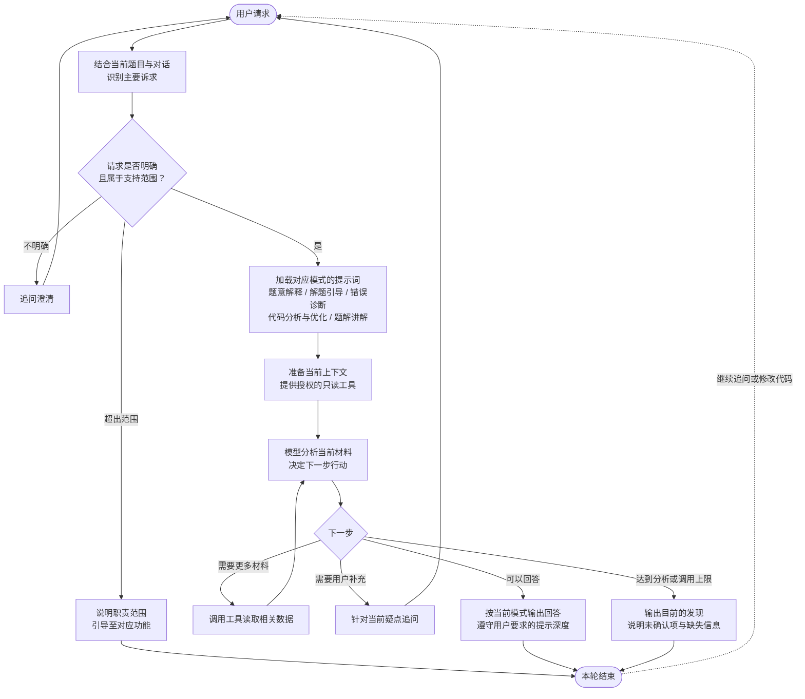

先保留已经确定的诊断助手设计：**一个 Agent，根据用户诉求切换提示词模式，共用工具和执行循环。** 这套结构只用于当前助手，其他三个后续分别设计。

## 诊断助手的支持范围

定位：围绕当前编程题，帮助学生理解题目、形成思路、分析代码及理解题解。

| 处理模式 | 支持的功能 | 用户提问示例 |
|---|---|---|
| **题意解释** | 解释题目目标、输入输出、约束条件和公开样例 | “这个题到底要我求什么？” |
| **解题引导** | 提供切入点、分层提示，讨论学生提出的思路 | “先别给答案，提示一下从哪里开始。” |
| **错误诊断** | 结合代码与已有判题反馈，分析错误原因、边界遗漏和修改方向 | “为什么这份代码一直答案错误？” |
| **代码分析与优化** | 分析时间与空间复杂度、性能瓶颈，提出优化建议 | “这段代码为什么可能超时？怎么优化？” |
| **题解讲解** | 解释算法原理、关键步骤、正确性依据，比较不同解法 | “为什么这里可以用贪心？” |

## 处理流程

## 工具与处理边界

| 项目 | 约定 |
|---|---|
| 默认上下文 | 当前题目、用户提问、当前代码及对话记录；没有代码也可以解释题意或引导思路 |
| 按需读取 | 公开样例、对应代码版本的已有判题反馈、授权题解、历史提交 |
| 执行限制 | 不执行代码，不自动提交判题 |
| 回答依据 | 区分已有判题事实、静态分析和手工推演，不宣称“已复现”或“保证通过” |
| 提示深度 | 遵守“只给提示”“详细解释”等要求，避免主动给出超出请求的答案 |
| 对话延续 | 用户切换诉求时重新选择模式，保留相关上下文；代码修改后区分新旧版本 |

这里由程序确定 **支持范围、提示词模式、工具权限和调用上限**；模型负责在当前任务内判断 **查什么、怎么分析、是否追问、何时回答**。