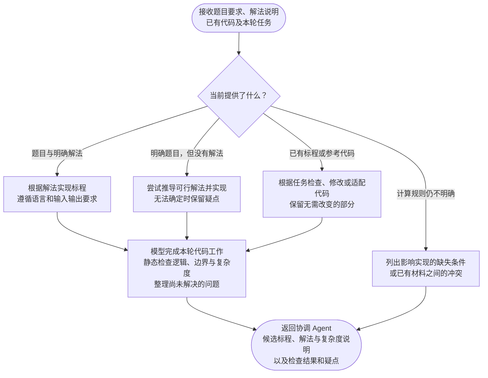

对。**标程 Agent 也只处理本轮分配的代码任务，完成后把结果或困难返回协调 Agent。** 是否采用、继续修改或请教师补充，由协调 Agent 决定。

它主要需要区分：已有代码、已有解法、需要尝试求解，以及条件还不够明确。

## 标程 Agent 流程

### 这个 Agent 的几个约定

- **不必每次重新写代码。** 已有标程时，根据任务决定检查、局部适配或修改。
- **允许无法完成。** 难题可能只能返回部分思路、具体困难和所需补充信息，不强行交付一份标程。
- **代码是候选结果。** 当前只做静态分析，不执行代码，也不宣称保证通过。
- **不自行改变题目。** 如果只有修改数据范围或计算规则才能实现，应把建议返回协调 Agent。

和题面 Agent 相比，它更强调 **实现是否有依据、哪些问题尚未解决**。最终仍然是“完成本轮任务并返回”，不负责决定整个出题流程怎么继续。