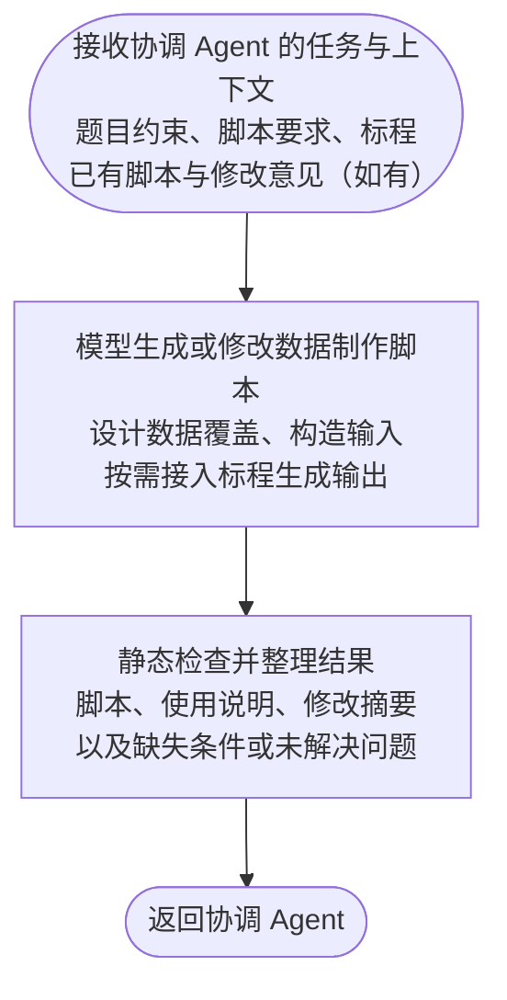

对。**首次生成还是修改已有脚本，可以让模型根据本轮任务、已有脚本和修改意见自行判断，不必画成分支。**

数据 Agent 的流程可以简化为：

```mermaid
flowchart TD
    A([接收协调 Agent 的任务与上下文<br/>题目约束、脚本要求、标程<br/>已有脚本与修改意见（如有）])

    A --> B[模型生成或修改数据制作脚本<br/>设计数据覆盖、构造输入<br/>按需接入标程生成输出]

    B --> C[静态检查并整理结果<br/>脚本、使用说明、修改摘要<br/>以及缺失条件或未解决问题]

    C --> D([返回协调 Agent])
```

提示词里说明职责即可：

- 根据已有材料完成本轮生成或修改。
- 缺少必要依据时，返回具体问题，不自行编造条件。
- 只生成和静态检查代码，不执行脚本。

是否继续完善、补充材料或请教师确认，统一交给协调 Agent。