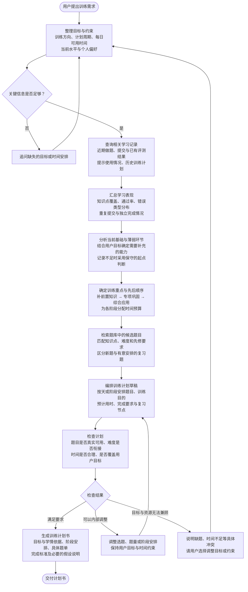

这个助手可以采用 **预先确定的生成流程**：先明确目标，再分析历史表现、确定训练重点、选择题目，最后编排并检查计划。模型负责各节点中的分析与生成。

这里几个节点的职责需要分清：

| 节点 | 具体负责什么 |
|---|---|
| **汇总学习表现** | 由程序统计事实，例如某知识点做过几题、错误类型如何分布 |
| **分析薄弱环节** | 由模型结合事实判断训练重点；不能把“多次失败”直接等同于“不懂该知识点” |
| **确定训练顺序** | 先确定练什么、按什么顺序练，再去找题 |
| **检索与编排** | 从真实题库选题，并在时间预算内组织成可执行计划 |
| **检查计划** | 程序检查题目有效性、重复和时间合计；模型检查教学顺序与目标匹配 |

**历史记录不足也可以生成计划**，但应在前期安排少量摸底练习，并说明起点判断依据有限。当前流程先做到计划书交付，后续执行跟踪和动态调整可以另行设计。