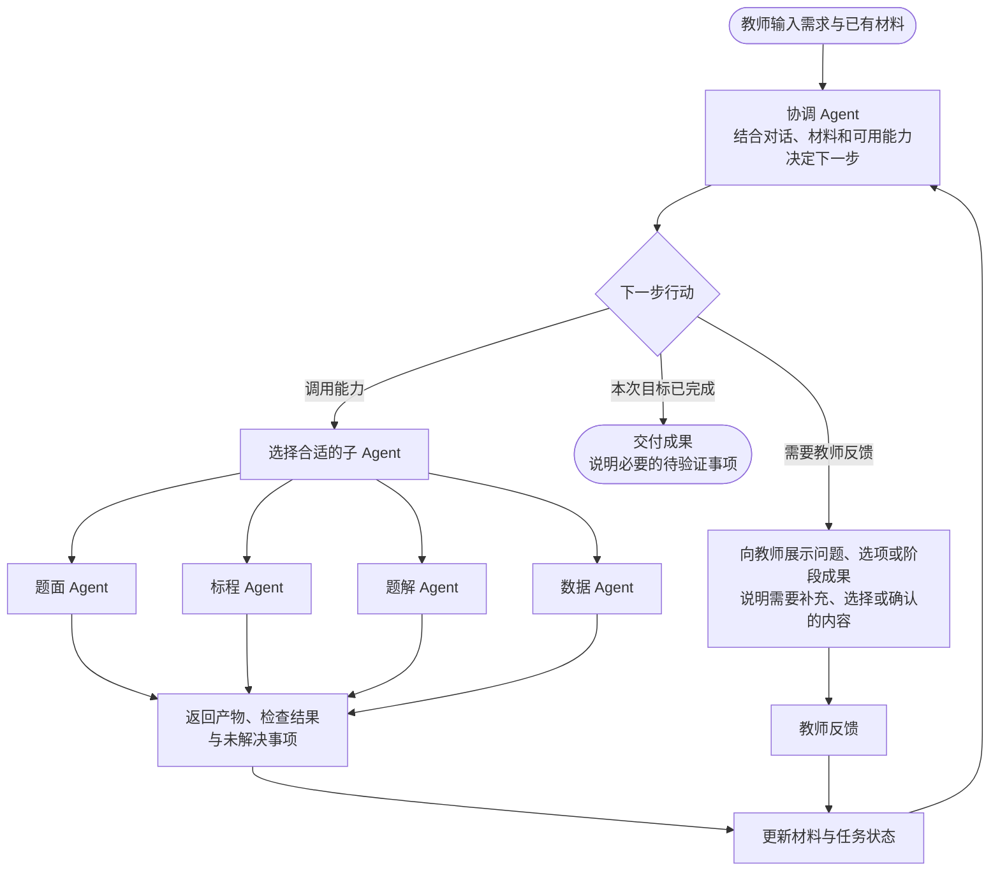

对，这三个分支都可以合并成 **“返回教师，等待反馈”**。澄清、选择、审核或说明困难，只是返回内容不同。

协调 Agent 只需要三种行动：**调用能力、与教师交互、完成交付。**

```mermaid
flowchart TD
    A([教师输入需求与已有材料]) --> B[协调 Agent<br/>结合对话、材料和可用能力<br/>决定下一步]

    B --> C{下一步行动}

    C -->|调用能力| D[选择合适的子 Agent]
    D --> E[题面 Agent]
    D --> F[标程 Agent]
    D --> G[题解 Agent]
    D --> H[数据 Agent]

    E --> I[返回产物、检查结果<br/>与未解决事项]
    F --> I
    G --> I
    H --> I

    I --> J[更新材料与任务状态]
    J --> B

    C -->|需要教师反馈| K[向教师展示问题、选项或阶段成果<br/>说明需要补充、选择或确认的内容]
    K --> L[教师反馈]
    L --> J

    C -->|本次目标已完成| M([交付成果<br/>说明必要的待验证事项])
```

四个子 Agent 是 **可选能力**，图中的分叉不表示必须全部调用，也不规定执行顺序。协调 Agent 根据每轮结果和教师反馈，继续安排下一步。