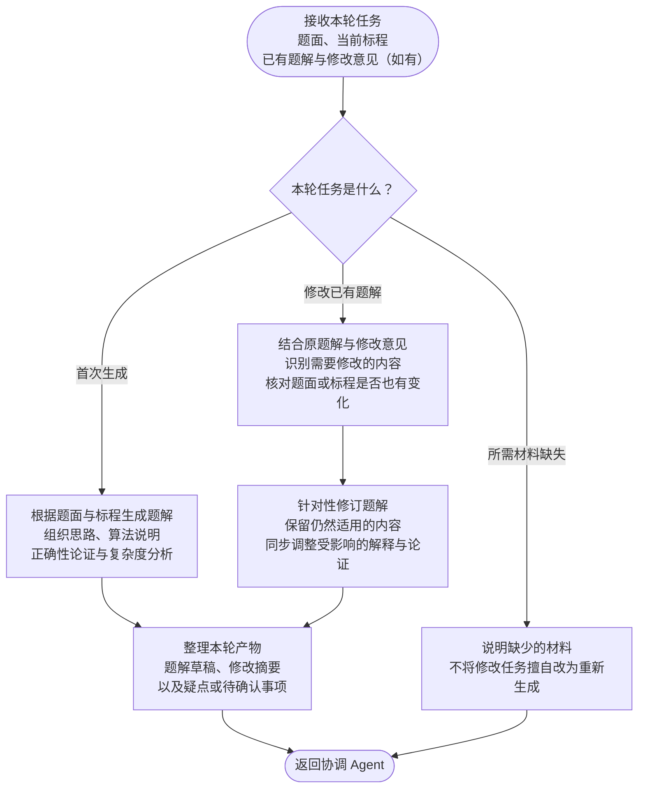

对，需要区分 **首次生成** 和 **基于已有版本修改**。协调 Agent 再次调用时，应提供当前题解和修改意见，不能只把题面、标程重新发一遍。

## 题解 Agent 流程

两种任务的输入可以这样约定：

| 任务 | 需要提供 |
|---|---|
| **首次生成** | 题面、当前标程、写作要求 |
| **后续修改** | 当前题面、当前标程、要修改的题解版本、本轮修改意见；若题面或标程变化，附变化说明 |

**以本轮任务明确区分生成和修改。** 即使是再次调用，也可能是在补充材料后继续首次生成；不能简单按调用次数判断。

这个约定也适用于题面、标程和数据 Agent：修改时携带原产物与意见，由对应 Agent 修订，再把新版本返回协调 Agent。