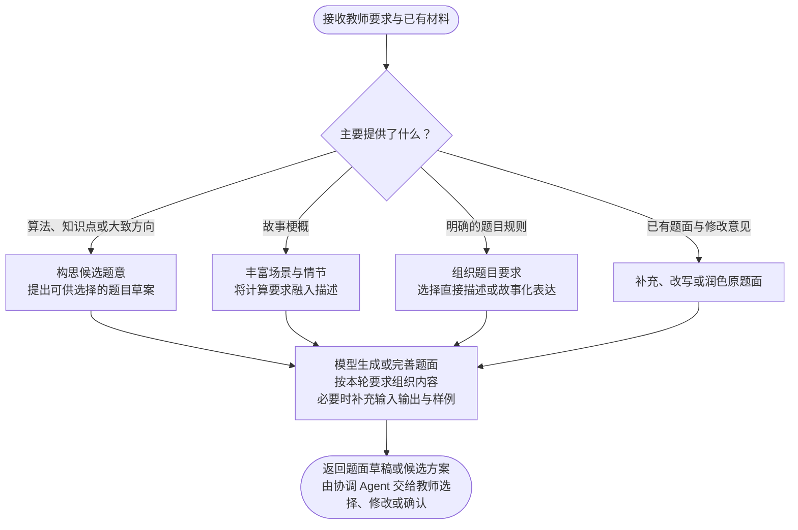

对，题面 Agent 的核心就是：**根据教师已有的材料，生成或丰富题目描述。** 主要区分输入是什么，具体写作细节交给模型完成。

## 题面 Agent 流程

这几种输入可以组合使用。例如，同时提供知识点和故事梗概，就结合两者生成。

- **要求比较粗略：**先交付候选草案，新增的计算规则作为建议供教师选择。
- **要求已经明确：**直接生成或完善题面，保留既定规则。
- **收到修改意见：**带着当前题面再次进入这个流程。

故事只是可选的表达方式；没有故事需求时，把题目要求描述清楚即可。