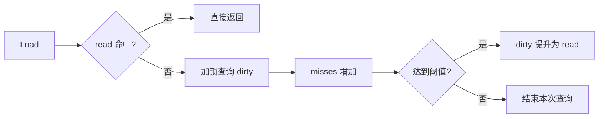

## 1. 原生 map 是否并发安全

Go 原生 `map` **不是并发安全容器**。准确地说：

| 并发访问方式 | 是否安全 |
| --- | --- |
| 只读 + 只读 | 安全，前提是没有任何 goroutine 同时修改 |
| 读 + 写 | 不安全 |
| 写 + 写 | 不安全 |

并发写期间无同步地访问 `map` 会产生数据竞争，并可能触发运行时错误。

## 2. 为什么默认不保证并发安全

大多数 `map` 并不需要被多个 goroutine 同时访问。如果每次操作都默认加锁，会让普通场景承担不必要的同步开销；而且 `map` 往往只是更大数据结构的一部分，业务通常还需要保护多个字段之间的不变量。因此，Go 把同步策略交给使用者选择。

## 3. 常规方案：map + sync.RWMutex

这是最通用、最容易维护的方案。读操作使用读锁，写操作使用写锁：

```go
type SafeMap struct {
	mu sync.RWMutex
	m  map[string]string
}

func (s *SafeMap) Get(key string) (string, bool) {
	s.mu.RLock()
	defer s.mu.RUnlock()
	v, ok := s.m[key]
	return v, ok
}

func (s *SafeMap) Set(key, value string) {
	s.mu.Lock()
	defer s.mu.Unlock()
	s.m[key] = value
}
```

锁必须覆盖一次完整的逻辑操作。例如“读取后再更新”通常应放在同一个写锁临界区内，而不是分别调用 `Get` 和 `Set`。

## 4. sync.Map

`sync.Map` 可以被多个 goroutine 并发调用，不需要调用方额外加锁，但它不是普通 `map` 的通用替代品。它主要适合：

- 同一个键通常只写一次、读取很多次，例如只增不改的缓存；
- 多个 goroutine 主要操作互不重叠的键集合。

普通业务对象需要类型安全，或需要维护多个字段之间的一致性时，通常优先选择 `map` + `sync.RWMutex`。

### 经典实现：read/dirty 双表

旧版 `sync.Map` 使用只读的 `read` 表和需要加锁访问的 `dirty` 表：读取先查 `read`；未命中时加锁查询 `dirty`，并累计 `misses`；当未命中次数达到阈值后，将 `dirty` 提升为新的 `read`。



> 版本提示：以上是经典旧实现，适合作为历史设计思路理解。自 Go 1.24 起，`sync.Map` 已改用并发 Hash Trie；当前源码中的操作委托给 `internal/sync.HashTrieMap`，不应再把双表机制描述为新版源码实现。

## 5. 不显式加锁怎么办

“不显式加锁”不等于“不需要同步”，而是把同步交给其他机制：

- `sync.Map`：直接使用标准库提供的并发容器，适合它所优化的访问模式。
- 单 goroutine + channel：只有一个 goroutine 持有并修改 `map`，其他 goroutine 通过 channel 发送读写请求；适合状态机或事件循环，但所有访问会串行化。
- Copy-On-Write + `atomic`：写入时复制完整 `map`、修改副本，再通过 `atomic.Value` 或 `atomic.Pointer` 发布不可变快照；读取无锁，适合读极多、写极少且数据量可控的场景。不要在发布后继续修改快照。

## 6. 方案对比

| 方案 | 适用场景 | 主要特点 |
| --- | --- | --- |
| `map` + `sync.RWMutex` | 通用场景、需要复合操作 | 类型安全，逻辑清晰，可保护业务不变量 |
| `sync.Map` | 写一次读多次、键集合相对独立 | 调用方无需显式加锁，但 API 基于 `any`，适用面较专门 |
| 单 goroutine + channel | 状态机、事件循环 | 通过所有权避免共享写，访问串行化 |
| Copy-On-Write + `atomic` | 读极多、写极少 | 读取成本低，写入需要复制整张表 |

## 7. 面试总结

> Go 原生 `map` 允许在没有写操作时并发读取，但只要存在并发写，就必须同步。Go 没有让普通 `map` 默认加锁，是为了避免所有使用场景都承担同步成本。通用方案是 `map` 配合 `sync.RWMutex`；特定读写模式可使用 `sync.Map`。如果不想显式加锁，还可以让单个 goroutine 通过 channel 管理状态，或在读多写少时使用 Copy-On-Write 配合原子发布。经典 `sync.Map` 的 `read/dirty + misses` 晋升机制属于旧实现，Go 1.24 起已改为并发 Hash Trie。

## 参考资料

- [Go FAQ：为什么 map 操作不定义为原子操作](https://go.dev/doc/faq#atomic_maps)
- [Go 1.24 Release Notes：`sync.Map` 实现变更](https://go.dev/doc/go1.24#sync)
- [当前 `sync.Map` 源码](https://go.dev/src/sync/map.go)
