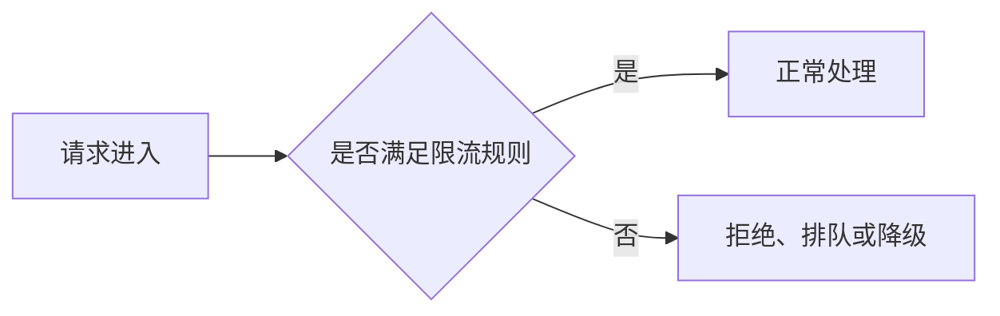
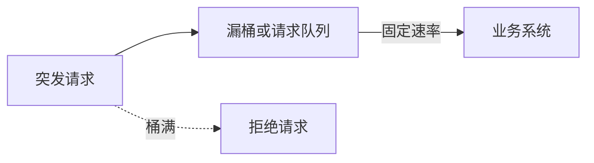

## 一、什么是限流

限流（Rate Limiting）是一种过载保护机制，用于限制单位时间内进入系统、接口或资源的请求数量，避免流量超过系统的处理能力。

例如，某个接口最多只能稳定处理 `1000 QPS`。如果流量突然增长到 `5000 QPS`，请求可能迅速耗尽 CPU、线程池、数据库连接等资源，最终造成响应变慢、请求超时，甚至引发系统雪崩。

因此，系统通常会在入口处增加限流保护：



限流并不是为了让系统处理更多请求，而是在系统容量有限的情况下，保证核心服务仍然可用。

## 二、常见限流算法

常见的限流算法主要有：

1. 固定窗口计数器
2. 滑动窗口
3. 漏桶算法
4. 令牌桶算法

它们解决的核心问题都是：

> 当前请求是否可以继续放行？

不同算法的主要区别在于如何统计流量，以及如何处理突发请求。

## 三、固定窗口计数器

### 3.1 基本原理

固定窗口计数器会将时间划分为连续且互不重叠的窗口，并在每个窗口内维护一个请求计数器。

例如，限流规则为每秒最多处理 100 个请求，可以划分为：

```text
10:00:00 ～ 10:00:01    最多 100 个请求
10:00:01 ～ 10:00:02    最多 100 个请求
10:00:02 ～ 10:00:03    最多 100 个请求
```

请求到达时，系统先判断当前窗口中的请求数是否已经达到阈值：

```text
如果进入了新窗口：
    将计数器重置为 0

如果当前计数小于阈值：
    计数器加 1
    放行请求
否则：
    拒绝请求
```

### 3.2 优点

- 实现简单，容易理解
- 判断过程快，性能开销小
- 每条限流规则只需维护少量状态

### 3.3 缺点

固定窗口的主要问题是 **窗口边界突刺**。

假设限流规则为每秒最多 100 个请求：

```text
第 1 秒的最后 100 ms：进入 100 个请求
第 2 秒的最前 100 ms：进入 100 个请求
```

两个窗口都没有超过阈值，但系统实际上在 200 ms 内接收了 200 个请求，瞬时流量远高于预期。

因此，固定窗口适合实现成本优先、对瞬时流量不太敏感的场景。

## 四、滑动窗口

### 4.1 基本原理

滑动窗口统计的是当前时刻之前一段时间内的请求数量，而不是按照固定边界划分时间。

例如，限流规则为任意 1 秒内最多处理 100 个请求。当前时间为 `10:00:01.500` 时，系统统计的时间范围是：

```text
10:00:00.500 ～ 10:00:01.500
```

随着当前时间向前推进，统计窗口也会不断滑动，因此可以更准确地反映最近一段时间内的真实流量。

### 4.2 常见实现

#### 滑动日志

滑动日志会记录每个请求的时间戳。新请求到达时：

1. 删除窗口范围之外的请求记录。
2. 统计窗口内的请求数量。
3. 如果数量未达到阈值，则记录当前时间并放行请求。
4. 如果数量已经达到阈值，则拒绝请求。

这种方式精度高，但高流量场景需要保存大量时间戳，存储和计算成本较高。

#### 滑动窗口计数器

工程中更常见的做法是将一个大窗口拆分成多个小窗口。

例如，将 1 秒拆分为 10 个 100 ms 的小窗口：

```text
| 10 | 8 | 12 | 9 | 11 | 7 | 10 | 13 | 8 | 9 |
                  ← 最近 1 秒 →
```

系统分别记录每个小窗口的请求数量，再汇总最近 1 秒覆盖的小窗口。

小窗口划分得越细，统计结果越准确，但需要维护的数据也越多。

### 4.3 优点

- 能够明显缓解固定窗口的边界突刺
- 统计结果更接近真实流量
- 可以在精度和资源消耗之间进行调整

### 4.4 缺点

- 实现复杂度高于固定窗口
- 需要维护更多时间状态
- 滑动日志在高并发场景下可能占用较多内存
- 滑动窗口计数器仍然存在一定的统计误差

## 五、漏桶算法

### 5.1 基本原理

漏桶算法可以将请求队列想象成一个有容量限制的桶：

```text
突发请求
   ↓
┌───────────┐
│           │
│ 请求队列  │
│           │
└─────┬─────┘
      ↓
  固定速率流出
      ↓
   业务系统
```

请求先进入桶中，系统再按照固定速率从桶中取出请求进行处理。

假设：

```text
桶容量：100 个请求
流出速率：20 个请求 / 秒
```

当请求持续积压时，无论外部请求到达速度有多快，进入后端系统的流量都会被控制在每秒 20 个请求左右。桶满以后，新请求通常会被拒绝或丢弃。

### 5.2 核心特点

漏桶算法的核心作用是 **削峰填谷**：将不稳定的输入流量整形成相对稳定的输出流量。



漏桶保护的是下游系统的处理速率。只要桶中存在积压，请求就会按照预设速度流出。

### 5.3 优点

- 输出流量稳定
- 能够有效保护处理能力固定的下游系统
- 适合消息消费、任务处理等需要平滑流量的场景

### 5.4 缺点

- 不擅长利用系统的短期空闲能力处理突发流量
- 请求可能在桶中排队，从而增加响应延迟
- 桶容量过小容易拒绝请求，容量过大又可能造成长时间排队

## 六、令牌桶算法

### 6.1 基本原理

令牌桶存放的不是请求，而是令牌（Token）。

系统按照固定速率生成令牌，并将令牌放入一个容量有限的桶中。当桶已满时，新生成的令牌会被丢弃。

```text
固定速率生成令牌
        ↓
┌─────────────┐
│ Token Token │
│ Token Token │
│   令牌桶    │
└──────┬──────┘
       ↓
  请求消费令牌
```

每个请求进入系统前都需要消费一个或多个令牌：

```text
如果桶中有足够的令牌：
    扣除令牌
    放行请求
否则：
    拒绝请求或等待令牌
```

实际实现通常不需要持续启动任务生成令牌，而是根据距离上次请求经过的时间，计算当前应当补充的令牌数量：

```text
当前令牌数 = min(
    桶容量,
    原有令牌数 + 经过时间 × 令牌生成速率
)
```

### 6.2 为什么能够处理突发流量

假设令牌桶的参数为：

```text
令牌生成速率：100 Token / 秒
桶容量：500 Token
```

系统空闲一段时间后，桶中最多可以积累 500 个令牌。此时如果突然到达 500 个请求，它们可以立即消费已经积累的令牌并通过。

因此，令牌桶同时限制了两个维度：

- 令牌生成速率决定长期平均流量。
- 令牌桶容量决定允许通过的最大突发流量。

### 6.3 优点

- 可以限制长期平均请求速率
- 允许一定程度的短时突发流量
- 能够利用系统空闲期间积累的处理能力
- 适合接口、网关等既要限速又要容忍突发流量的场景

### 6.4 缺点

- 实现复杂度高于固定窗口
- 需要合理设置生成速率和桶容量
- 桶容量过大时，可能放行超过下游瞬时承载能力的流量
- 分布式场景需要保证令牌计算和扣减的原子性

## 七、漏桶与令牌桶的区别

漏桶和令牌桶都使用了“桶”的概念，但它们限制的对象不同。

### 7.1 漏桶限制输出速率

漏桶控制请求离开队列的速度：

```text
请求 → 漏桶 → 固定速率流出 → 业务系统
```

即使输入流量存在明显波动，只要桶中有请求积压，输出流量仍然保持相对稳定。

### 7.2 令牌桶限制平均速率

令牌桶控制令牌的生成速度：

```text
生成令牌 → 令牌桶 → 请求消费令牌 → 业务系统
```

桶中存在积累的令牌时，多个请求可以在短时间内同时通过。

两者最核心的区别是：

> 漏桶强调平滑输出流量；令牌桶强调控制长期平均速率，同时允许有限的突发流量。

## 八、四种算法对比

| 算法 | 核心思想 | 突发流量处理 | 实现复杂度 | 主要特点 |
| --- | --- | --- | --- | --- |
| 固定窗口 | 在固定时间窗口内计数 | 窗口边界可能出现突刺 | 低 | 实现简单，但精度较低 |
| 滑动窗口 | 统计最近一段时间内的请求 | 能够较准确地限制突发请求 | 中 | 精度较高，但维护成本更高 |
| 漏桶 | 请求进入队列后按固定速率流出 | 将突发流量转化为排队或拒绝 | 中 | 输出稳定，适合保护下游 |
| 令牌桶 | 固定速率生成令牌，请求消费令牌 | 允许桶容量范围内的突发请求 | 中 | 限制平均速率，同时保留弹性 |

实际选型时，可以根据业务目标进行判断：

- 只需要一种简单、低成本的限流方式，可以选择固定窗口。
- 对任意时间段内的流量精度要求较高，可以选择滑动窗口。
- 下游只能按照固定速度处理任务，可以选择漏桶。
- 既要控制平均速率，又要允许合理的突发流量，可以选择令牌桶。

无论使用哪种算法，还需要确定限流范围。单机限流只保护一个服务实例；如果需要限制整个集群的总流量，则必须使用共享存储或集中式限流组件，并保证计数、检查和扣减操作的原子性。

## 九、面试总结

如果面试中被问到“常见的限流算法有哪些”，可以这样回答：

常见的限流算法有固定窗口、滑动窗口、漏桶和令牌桶。

固定窗口按照固定时间段统计请求数量，实现简单，但存在窗口边界突刺。滑动窗口统计最近一段时间内的请求数量，限流更加精确，但实现和维护成本更高。漏桶让请求按照固定速率流出，主要用于削峰填谷和平滑流量。令牌桶按照固定速率生成令牌，请求获得令牌后才能通过，因此既能限制长期平均速率，又能允许一定程度的短时突发流量。

实际系统中，滑动窗口和令牌桶是两种常见思路。具体选择哪一种，需要结合系统承载能力、突发流量特征、延迟要求以及限流范围进行判断。