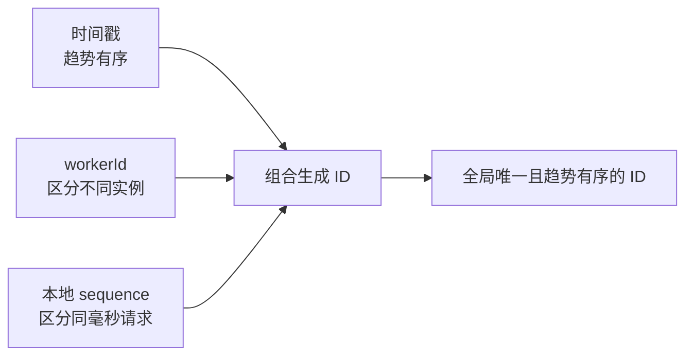
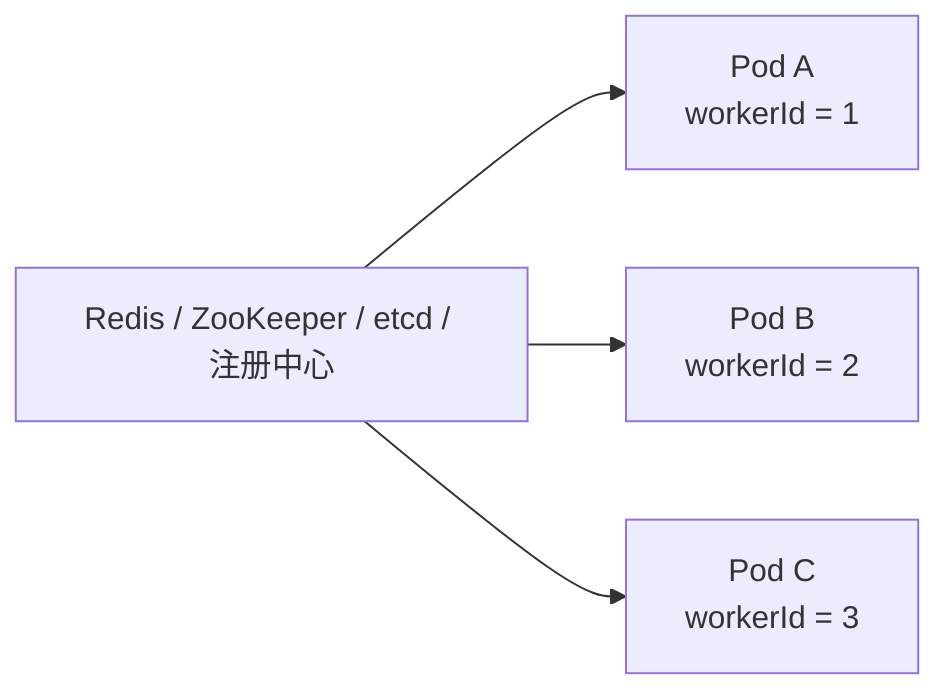
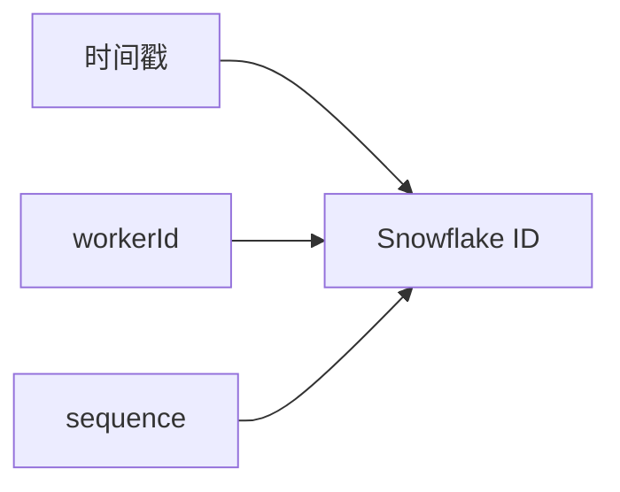
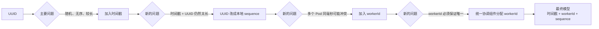

## 整体演进思路


这道题的主线不是直接背 Snowflake，而是不断回答一个问题：

> 当前方案最明显的问题是什么，下一步为什么要引入新的设计？

## 最简单模型

如果让我设计一个分布式 ID 生成器，我不会一开始就直接上 Snowflake。

我会先想这个系统最基本要解决什么问题。

最核心的其实就两个：

- 生成出来的 ID 必须全局唯一；
- 生成 ID 的性能和吞吐量要足够高。

> 如果只是为了最简单地满足“全局唯一”，那最直接的方案就是使用 UUID。

每个 Pod、每个服务实例都可以在本地直接生成 UUID，不需要访问数据库，也不需要访问一个中心化的 ID 服务，因此它天然适合分布式环境，而且生成性能也比较高。

所以第一版模型非常简单：


这个方案已经可以工作。

但是继续往下看，会发现它有一个比较明显的问题：

> UUID 基本是随机的，而且长度比较大。

如果把这种完全随机的 ID 直接作为数据库主键，那么新数据会不断插入到索引的不同位置，而不是比较顺序地往后追加。

对于 B+Tree 这类索引结构来说，这种随机写入通常不如趋势递增的主键友好。

所以接下来我们需要解决的问题变成了：

> 能不能让 ID 在保证唯一的同时，尽量具备一定的有序性？

## 第二阶段：引入时间戳，让 ID 趋势有序

既然希望 ID 有序，一个很自然的想法就是把时间放进去。

例如可以先设计成：

```text
时间戳 + UUID
```

时间戳可以精确到毫秒。

这样一来，先生成的 ID 前缀通常更小，后生成的 ID 前缀通常更大，因此整个 ID 开始具备一定的趋势有序性。

UUID 仍然负责保证全局唯一。

相比纯 UUID，这种方案对于数据库索引会更加友好一些。

但是这个方案又暴露出一个新的问题：

> 我们已经有了毫秒级时间戳，再拼接一个完整 UUID，其实有些浪费，整个 ID 仍然非常长。

既然时间戳已经帮我们划分出了非常细的时间窗口，我们真正需要解决的其实只是：

> 在同一毫秒内，怎么区分不同请求生成的 ID？

所以没必要继续使用完整 UUID。

## 第三阶段：使用本地序列号

对于同一个服务实例来说，一毫秒内虽然可能产生多个 ID，但数量通常是有限的。

因此可以在本地维护一个自增序列号。

例如：

```text
时间戳 + 毫秒内序列号
```

假设当前时间戳是某一毫秒：

```text
第一个请求 -> sequence = 0
第二个请求 -> sequence = 1
第三个请求 -> sequence = 2
```

进入下一毫秒以后，序列号重新从 0 开始。

这样，同一个实例在同一毫秒内生成的多个 ID 就能够区分开。

而且整个过程完全可以在本地完成，不需要每生成一个 ID 都访问 Redis、数据库或者其他远程服务，因此吞吐量非常高。

但到这里还有一个明显问题。

如果多个 Pod 同时使用：

```text
时间戳 + 本地序列号
```

那么两个 Pod 完全可能在同一毫秒同时生成 `sequence = 0`。

这样 ID 就冲突了。

所以我们还需要区分：

> 这个 ID 到底是由哪个服务实例生成的？

## 第四阶段：加入 workerId

因此可以再增加一个机器或者实例编号，也就是 `workerId`。

最终 ID 可以设计成：

```text
时间戳 + workerId + 毫秒内序列号
```

三个部分分别解决三个问题：

- 时间戳：提供趋势有序性；
- workerId：区分不同 Pod 或机器；
- sequence：区分同一个 Pod 在同一毫秒内产生的多个请求。

这时候整个模型就变成了：



这样设计以后，正常生成 ID 的过程完全发生在本地。

不同 Pod 依靠不同的 `workerId` 避免冲突，同一个 Pod 内部再使用自增序列号避免同一毫秒内的冲突。

因此它同时具备：

- 全局唯一；
- 趋势递增；
- 本地生成；
- 高吞吐；
- ID 长度可控。

这个模型实际上已经非常接近 Snowflake 的核心思想。

## 第五阶段：workerId 怎么保证唯一

有了 `workerId` 以后，下一个问题就很自然：

> 每个 Pod 的 workerId 从哪里来？

如果直接让每个 Pod 随机生成一个 workerId，那么只能降低冲突概率，不能真正保证不冲突。

如果手工在配置文件里给每台机器写死 workerId，规模很小时可以使用，但 Pod 扩缩容、重启以后维护成本会越来越高。

因此更可靠的做法是依赖一个统一的协调组件分配 workerId。

例如可以使用：

- Redis；
- ZooKeeper；
- etcd；
- 已有的服务注册中心。

Pod 启动的时候先去申请一个当前没有被占用的 workerId。

例如：



这里不需要自己重新设计一个复杂的注册中心。

这道题的核心是分布式 ID 生成器，所以只需要说明：

> 利用成熟的中心化协调能力，保证同一时刻不同实例拿到不同的 workerId。

真正的 ID 生成仍然在本地完成。

也就是说，中心化组件只参与实例启动和 workerId 管理，而不会进入每一次 ID 生成的请求链路。

这样既能保证 workerId 不冲突，又不会影响正常的 ID 生成性能。

## 第六阶段：workerId 是否需要回收

继续往下看，还会出现一个比较实际的问题：

> Pod 会不断重启，如果 workerId 永远不回收，会不会越来越大？

如果给 workerId 预留的空间是有限的，那么永久不回收最终一定会耗尽。

因此 workerId 通常需要复用。

例如系统允许的 workerId 范围是：

```text
0 ~ 1023
```

一个 Pod 下线以后，它使用的 workerId 最终可以重新分配给其他 Pod。

这里真正需要保证的并不是：

> 一个 workerId 历史上永远只能被一个 Pod 使用。

而是：

> 同一个时刻，不能有两个仍然在工作的 Pod 使用同一个 workerId。

因此可以结合注册中心或者协调组件的租约、心跳机制来管理 workerId。

实例存活期间持续持有自己的 workerId；实例失联并确认租约失效以后，这个 workerId 才允许重新分配。

到这里就可以适当停止继续向下展开。

因为再继续讨论网络分区、旧实例失联以后是否仍然生成 ID、fencing token 等问题，就已经开始进入分布式租约本身的实现细节。

对于“设计一个分布式 ID 生成器”这道面试题来说，这些内容可以作为工业级增强，而不应该抢占主线。

## Snowflake 的核心结构

走到这里以后，其实 Snowflake 就不是一个突然出现的“标准答案”了，而是前面的需求一步一步推导出来的。

它的核心思想就是把一个整数划分成几个部分：



时间戳负责趋势有序。

workerId 负责区分不同机器或者服务实例。

sequence 负责区分同一个实例在同一时间窗口内生成的多个 ID。

具体给三个部分分别分配多少 bit，要根据业务容量来决定，例如：

- 系统预计运行多少年；
- 最多同时存在多少生成节点；
- 单个节点每毫秒最大需要生成多少个 ID。

这里重点不是死记某一种 bit 分配，而是理解：

> 固定长度的 ID 空间，需要在“可使用时间、机器数量、单机吞吐量”之间做容量规划。

## 工业级扩展

如果面试官继续追问，还可以再补充几个工业级问题，但不需要一开始就展开。

首先是时钟回拨。

因为 ID 中使用了时间戳，如果机器时间由于 NTP 校时等原因突然倒退，就可能破坏原来的时间顺序，严重情况下甚至存在重复风险。

常见处理思路包括检测当前时间是否小于上一次生成 ID 的时间，小幅回拨时等待时间追上，较大回拨时停止当前 worker 继续生成 ID，或者采用额外的逻辑时钟策略。

其次是 workerId 的租约安全。

如果某个实例和协调中心失联，但实例本身仍然存活，而它的 workerId 又被分配给了新的实例，就可能出现两个实例同时持有同一个 workerId。

工业级实现中可以进一步通过更严格的租约机制、实例自我停止生成，甚至 fencing token 等方式增强安全性。

但这些属于系统可靠性的进一步增强。

对于面试主线来说，只要能够说明：

> workerId 必须由统一机制保证同一时刻唯一，并通过租约或心跳管理它的生命周期。

通常已经足够。

## 总结

如果让我从头设计一个分布式 ID 生成器，我会先从最简单的 UUID 开始。

UUID 能非常简单地解决全局唯一问题，而且每个 Pod 都可以本地生成，吞吐量也很高。但 UUID 随机且长度较大，如果作为数据库主键，对索引并不友好。

因此我会引入时间戳，让 ID 具备趋势有序性。一开始可以简单设计成 `时间戳 + UUID`，但很快会发现完整 UUID 已经没有必要，因为时间戳已经划分出了毫秒级的时间窗口。

于是可以把 UUID 替换成本地自增序列号，用 `时间戳 + sequence` 区分同一个实例在同一毫秒内产生的多个请求。

但分布式环境下有多个 Pod，不同 Pod 可能在同一毫秒生成相同的 sequence，因此继续加入 `workerId`，最终形成：

```text
时间戳 + workerId + sequence
```

这样时间戳保证趋势有序，workerId 区分不同实例，sequence 区分同一个实例在同一毫秒内的多个请求，而且整个 ID 的正常生成过程完全在本地完成，因此能够获得很高的吞吐量。

随后只需要解决 workerId 的唯一分配问题。可以利用 Redis、ZooKeeper、etcd 或服务注册中心等成熟的协调能力，在实例启动时申请 workerId，并通过租约或心跳管理它的生命周期和复用。

因此整个方案不是因为“Snowflake 是标准答案”才选择 Snowflake，而是从：



一步一步推导出来的。

这也是这道题真正需要表达的核心：在保证全局唯一的前提下，通过时间戳、workerId 和本地序列号，把每次生成 ID 的操作尽量留在本地，从而同时兼顾趋势有序和高吞吐。
