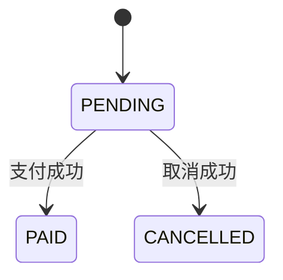

## 一、面试口述回答

对于订单状态的修改，我首先会维护一个严格的状态机。比如，待支付订单可以变成支付成功或者已取消，但支付成功之后不能直接变成已取消，已取消之后也不能再直接变成支付成功。

在更新数据库时，我会使用条件更新，也就是类似 CAS 或乐观锁的思想来控制状态迁移。例如，支付回调只能把 `PENDING` 更新为 `PAID`，取消任务只能把 `PENDING` 更新为 `CANCELLED`。这样支付和取消同时发生时，本质上是在竞争 `PENDING` 状态，数据库的原子条件更新可以保证最终只有一方成功。

如果支付回调先成功把订单从 `PENDING` 改成 `PAID`，取消任务再执行时，条件更新会失败。此时发现订单已经支付，就不再取消。

反过来，如果取消任务先把订单从 `PENDING` 改成 `CANCELLED`，支付成功回调到达后就不能再把订单改成 `PAID`。但是支付渠道可能已经实际扣款，因此不能忽略这次回调，而是要记录实际支付结果，并让这笔交易进入退款补偿流程。

所以，这个问题的核心是：通过严格的订单状态机和数据库原子条件更新解决支付与取消的并发竞争，再通过退款补偿处理“订单已经取消，但渠道实际支付成功”的情况。

## 二、思考过程与关键点

### 1. 先明确状态机，而不是先讨论并发工具

这道题的第一步，是定义订单允许发生哪些状态迁移：



关键约束是：

- `PENDING` 可以进入 `PAID` 或 `CANCELLED`。
- `PAID` 不能被取消任务直接改成 `CANCELLED`。
- `CANCELLED` 不能被支付回调直接改成 `PAID`。

状态机先定义业务上的合法路径，数据库并发控制再保证这些路径不会被破坏。如果没有这个前提，即使使用了锁，也可能只是把错误的状态覆盖操作串行执行。

### 2. 为什么不能直接无条件更新

如果支付回调和取消任务都只根据订单编号更新状态：

```sql
UPDATE orders
SET status = 'PAID'
WHERE id = ?;
```

```sql
UPDATE orders
SET status = 'CANCELLED'
WHERE id = ?;
```

那么后执行的 SQL 会覆盖先执行的结果，可能出现订单已经支付却又被改成取消，或者订单已经取消又被改成支付成功的问题。最终状态取决于写入覆盖顺序，而不是业务状态机。

因此，更新条件必须包含当前状态：

```sql
UPDATE orders
SET status = 'PAID'
WHERE id = ?
  AND status = 'PENDING';
```

```sql
UPDATE orders
SET status = 'CANCELLED'
WHERE id = ?
  AND status = 'PENDING';
```

这种做法可以称为 **条件更新**，也体现了 CAS 或乐观锁的思想。它不一定需要额外的 `version` 字段，因为当前订单状态本身就可以作为竞争条件。

### 3. 数据库如何裁决并发

支付回调和取消任务都试图把同一个订单从 `PENDING` 迁移到不同的目标状态。数据库执行条件更新时，会原子地判断条件并完成写入，因此只有一个操作能更新成功：

- 影响行数为 `1`，说明当前操作成功完成了合法状态迁移。
- 影响行数为 `0`，说明 `PENDING` 已经被另一方抢先迁移，需要重新查询当前状态并按业务规则处理。

支付更新成功后，取消更新会因状态不再是 `PENDING` 而失败；取消更新成功后，支付回调也不能再覆盖订单状态，但要根据渠道的真实支付结果触发退款补偿。

因此，“谁先到数据库谁成功”是一种便于理解但不够准确的说法。更严谨的表述是：

> 支付和取消竞争 `PENDING` 状态，谁先成功完成合法的状态迁移，谁获得这次并发竞争的处理权；失败的一方根据最终状态继续处理或执行补偿。

这里关注的是 **合法状态迁移是否成功**，而不是应用层观察到的请求到达时间，也不是支付动作在物理时间上早了几毫秒。

### 4. 为什么取消先成功后仍要处理支付回调

本地订单已经取消，不代表支付渠道一定没有扣款。支付可能已在渠道侧成功，只是回调较晚到达；也可能支付与关单操作同时发生，产生了时间窗口。

因此，支付回调发现订单已经是 `CANCELLED` 时，不能简单丢弃。系统仍要确认和记录渠道交易结果，并创建可重试、可追踪的退款补偿任务，最终把实际资金状态和订单业务结果对齐。

### 5. 关闭支付单的作用与边界

订单超时取消时，可以同时向支付渠道发起关单，阻止用户继续支付。这能够缩小竞态窗口，减少“本地已取消、渠道却支付成功”的情况。

但关单请求存在网络延迟、失败重试，以及关单与扣款同时发生等可能，因此它只能降低竞态概率，不能替代本地状态机、原子条件更新和退款补偿。

## 三、回答这道题时的主线

回答时抓住下面这条主线即可：

1. 先用严格状态机定义合法迁移。
2. 再用条件更新让支付和取消原子地竞争 `PENDING`。
3. 根据 SQL 影响行数判断谁完成了合法迁移。
4. 支付先成功，则取消失败；取消先成功但渠道已扣款，则进入退款补偿。
5. 关单是降低竞态的辅助措施，不是最终兜底方案。
