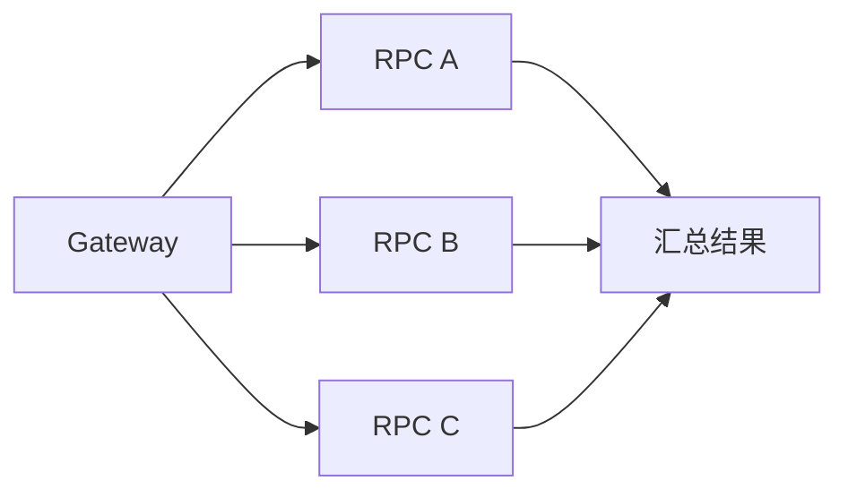

## 一、面试口述答案

如果要从网关给多个后端 RPC 分配 timeout，我会先把整条请求允许的总 deadline 当作前置条件，再根据这些 RPC 是串行还是并行调用来分配。

以串行调用为例，我不会把总时间平均分给每个 RPC，也不会先拍脑袋固定预留 200ms。因为串行链路的耗时会累加，所以我会先根据监控或压测数据，从总 deadline 中扣除网关处理、业务逻辑、序列化和网络返回等非 RPC 开销，得到真正可以分给 RPC 的总预算。

然后，我会统计 A、B、C 在正常生产高峰下的 P99，并按照各自 P99 在所有串行 RPC 的 P99 总和中的占比分配预算：

```text
RPC_i timeout = 可分配总预算 × RPC_i P99 / 所有串行 RPC P99 之和
```

这样不是简单平均，而是让原本耗时较长的 RPC 获得更多时间；从比例上看，每个 RPC 获得的 timeout 相对于自身 P99 大致相同，因此余量比例也比较一致。

如果所有串行 RPC 的 P99 之和已经超过可分配总预算，说明当前链路的性能能力无法满足整体目标。这时应该考虑优化慢接口、把可并行的调用改为并行、做降级，或者重新评估整体目标，而不是继续硬切 timeout。

如果是并行调用，整体耗时更接近最慢分支，而不是各分支耗时相加，所以不能直接沿用串行场景的分配方法。

## 二、这道题到底在问什么

这道题容易和“单个 RPC timeout 怎么设置”混在一起，但两者关注的层次不同。

| 问题 | 关注点 | 核心思路 |
| --- | --- | --- |
| 单个 RPC timeout 怎么设置 | 确定一个 RPC 自己的超时时间 | 参考该 RPC 在正常生产高峰下的延迟分布，例如 P99，再结合合理余量和上游剩余时间确定 |
| 多个后端 RPC timeout 怎么分配 | 把整条链路的总时间预算分给多个 RPC | 先判断调用关系，再让各 RPC 的预算之和或并行等待时间满足整体 deadline |

可以把两道题分别理解为：

```text
单个 RPC：这个调用本身应该等多久？

多个 RPC：整条链路只有这么多时间，应该怎么分？
```

因此，这道题的重点不是重新讨论每个 RPC 的 timeout 从零到一如何制定，而是研究在一个已经确定的整体约束下，多个调用如何共同使用这份时间预算。

## 三、把总 deadline 当作前置条件

假设整条请求的最大允许时间是：

```text
总 deadline = 1000ms
```

这个数通常会参考业务体验要求、上游调用方的超时约束，以及接口过去的响应情况来确定。不过，这不是本题的重点。在回答时，把总 deadline 作为已知条件即可，不需要主动展开 SLA、SLO 等概念。

这道题真正需要继续回答的是：


下面重点讨论串行场景。

## 四、串行场景：先明确总约束

假设调用链为：


由于 A、B、C 依次执行，整条链路的耗时近似为：

```text
非 RPC 开销 + A 耗时 + B 耗时 + C 耗时
```

因此，timeout 的分配必须满足一个基本约束：

```text
A timeout + B timeout + C timeout
≤ 总 deadline - 非 RPC 时间预算
```

这里不能把 1000ms 全部分给 A、B、C。网关解析请求、业务代码执行、序列化与反序列化、框架调度以及最终返回响应都需要时间。

## 五、先扣除可观测到的非 RPC 开销

非 RPC 开销不应该靠拍脑袋估算。比如，不能因为总预算是 1000ms，就习惯性地说“先预留 200ms”。200ms 可能过多，也可能根本不够。

更合理的做法是通过链路追踪、线上监控或压测，观察正常生产高峰下非 RPC 部分的实际耗时。假设观测结果表明，这部分需要预留 100ms，那么：

```text
总 deadline = 1000ms
非 RPC 时间预算 = 100ms
可分配给 RPC 的总预算 = 1000ms - 100ms = 900ms
```

这里的重点不在于一定要预留 100ms，而在于这个值应该有数据依据，并且需要随着线上表现持续校准。

## 六、为什么不能平均分

如果直接把 900ms 平均分给 A、B、C，会得到：

```text
A timeout = 300ms
B timeout = 300ms
C timeout = 300ms
```

但不同 RPC 的正常耗时可能差别很大。假设生产高峰下：

```text
A P99 = 100ms
B P99 = 200ms
C P99 = 300ms
```

平均分配意味着 A 获得自身 P99 的 3 倍时间，B 获得 1.5 倍，而 C 完全没有额外余量。它看起来公平，实际上忽略了每个 RPC 的性能特征。

## 七、按照 P99 占比分配剩余预算

先计算所有串行 RPC 的 P99 之和：

```text
P99 总和 = 100ms + 200ms + 300ms = 600ms
```

再按照占比分配 900ms：

```text
A timeout = 900ms × 100 / 600 = 150ms
B timeout = 900ms × 200 / 600 = 300ms
C timeout = 900ms × 300 / 600 = 450ms
```

一般公式为：

```text
RPC_i timeout = 可分配总预算 × RPC_i P99 / 所有串行 RPC P99 之和
```

分配结果如下：

| RPC | 高峰 P99 | 分配后的 timeout | timeout / P99 |
| --- | ---: | ---: | ---: |
| A | 100ms | 150ms | 1.5 |
| B | 200ms | 300ms | 1.5 |
| C | 300ms | 450ms | 1.5 |

这也解释了为什么这种分法合理：

```text
RPC_i timeout / RPC_i P99
= 可分配总预算 / 所有串行 RPC P99 之和
```

右侧对每个 RPC 都相同。因此，这种分配等价于给每个 RPC 大致一致比例的余量，而不是给每个 RPC 增加相同的毫秒数。

需要注意，P99 是制定初始预算的重要依据，不代表配置一次后就永远不变。上线后仍应根据超时率、链路延迟和业务高峰的变化继续校准。

## 八、预算不够时，不要继续硬切 timeout

假设可分配给 RPC 的总预算只有 500ms，但：

```text
A P99 + B P99 + C P99 = 600ms
```

这意味着在正常生产高峰下，仅三个串行 RPC 的 P99 之和就已经超过可用预算。此时无论怎么分，都会有一部分正常请求频繁超时。

问题已经不是“比例怎么调得更漂亮”，而是当前系统能力和性能目标之间存在矛盾。可选方向包括：

- 优化耗时较高的 RPC；
- 把没有依赖关系的调用改为并行；
- 对非核心数据做缓存、异步化或降级；
- 减少不必要的下游调用；
- 如果业务允许，重新评估整体 deadline。

timeout 是失败边界，不是性能优化手段。继续压缩 timeout 只会让请求更早失败，并不会让下游真正执行得更快。

## 九、并行场景为什么不同

如果 A、B、C 是并行发出的：



并行阶段的总耗时更接近：

```text
max(A 耗时, B 耗时, C 耗时)
```

而不是：

```text
A 耗时 + B 耗时 + C 耗时
```

所以，并行场景不需要把同一段墙钟时间像串行预算那样切成三份。各分支可以共享同一个剩余 deadline，再结合各自的延迟特征、重要性和是否允许降级设置 timeout。面试回答到这里作为引出即可；除非面试官追问，不必在本题中继续展开。

## 十、完整思路如何形成

这道题可以沿着下面的顺序思考：

1. 先把整条请求的总 deadline 当作已知条件。
2. 判断多个 RPC 是串行、并行，还是存在混合依赖。
3. 对串行链路，从总 deadline 中扣除有观测依据的非 RPC 开销。
4. 统计各串行 RPC 在正常生产高峰下的 P99。
5. 按 P99 占比分配可用预算，使各 RPC 获得大致一致比例的余量。
6. 检查 P99 总和是否已经超过可用预算；如果超过，就转向性能与架构治理。
7. 上线后通过监控持续校准，而不是把第一次计算结果当作永久配置。

可以压缩成一条主线：

```text
总 deadline
    ↓
判断串行或并行
    ↓
扣除可观测的非 RPC 开销
    ↓
串行 RPC 按高峰 P99 占比分配
    ↓
检查目标是否可满足
    ↓
通过线上数据持续校准
```

## 十一、延伸问题

### 1. 整体请求的总 deadline 怎么确定？

通常综合业务体验要求、上游调用方的超时约束和历史接口响应情况确定。本题把它作为前置条件即可。

### 2. 并行 fan-out 怎么分 timeout？

并行耗时主要取决于最慢分支。各分支可以共享剩余 deadline，再根据分支的 P99、重要性和是否允许降级分别设置，而不是把时间简单相加或平均切分。

### 3. 前置 RPC 消耗过多后，后续预算是否要动态缩减？

要。后续调用应基于当前剩余 deadline 设置 timeout，避免局部 timeout 超过整条请求实际剩余的时间；如果剩余时间已经不足，应尽早降级或失败。

## 十二、一句话总结

多个 RPC 的 timeout 分配，本质上是在整体 deadline 约束下管理整条调用链：串行场景先扣除可观测的非 RPC 开销，再按各 RPC 的高峰 P99 占比分配；如果 P99 总和已经超出预算，就应该改变系统能力或整体目标，而不是继续硬切 timeout。
