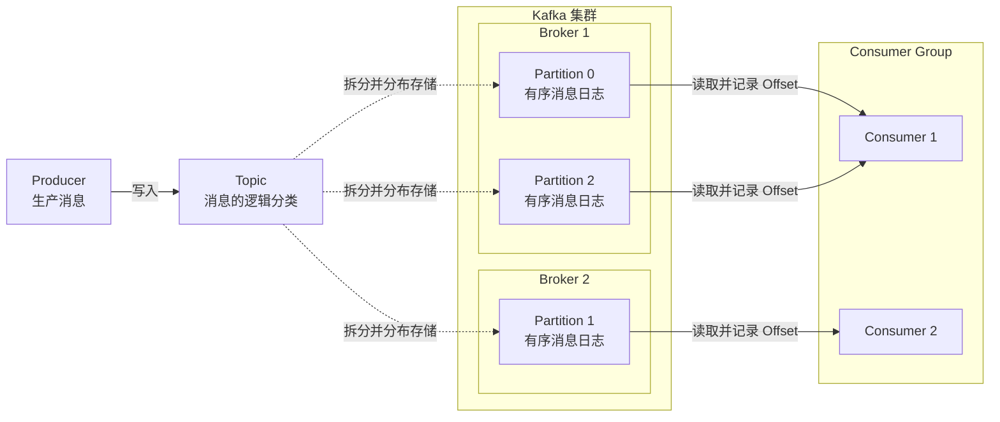
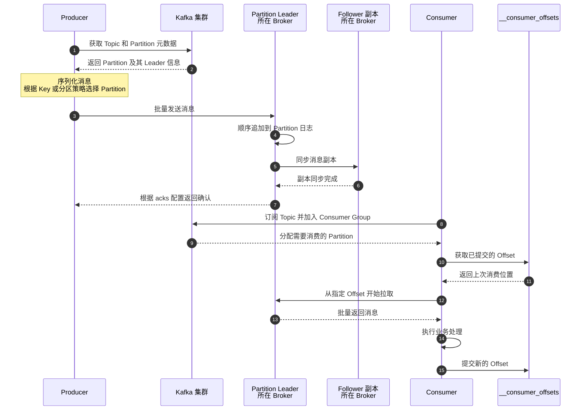

## Kafka 是什么？它主要解决后端系统中的哪些问题？

Kafka 是一个**分布式事件流平台**，可以把它理解为高吞吐、可持久化、可扩展的消息系统。生产者把消息写入 Topic，Kafka 将消息按 Partition 顺序持久化并通过副本保证可靠性，消费者再按自己的进度读取。

它主要解决后端系统中的几个问题：通过异步消息实现**服务解耦和流量削峰**；通过磁盘持久化和消费位点支持消息重放、故障恢复；通过分区和消费者组实现高吞吐与水平扩展；同时还能承接日志采集、数据同步和实时计算等事件流场景。Kafka 负责可靠地存储和传递事件，但业务幂等、端到端一致性以及消息处理失败后的补偿，通常仍需要应用系统配合完成。

> Kafka 更接近消息队列、事件流平台还是分布式日志系统？

三个说法对应不同层次：**分布式提交日志**是底层数据模型，**消息队列**是常见使用方式，**事件流平台**是完整产品定位。面试时可以说：Kafka 本质上基于分布式日志实现，既能承担消息队列，也能支持事件存储、回放和流式处理。

> 哪些业务场景更适合 Kafka？

Kafka 适合**吞吐量高、事件需要持久化或回放、消费者较多、允许一定处理延迟**的场景，例如日志采集、用户行为埋点、服务间异步事件、数据同步和实时计算。它尤其适合作为多个系统之间的事件总线。

> 哪些场景其实没有必要引入 Kafka？

业务规模较小、消息量低、系统之间可以直接同步调用，或者只需要简单异步任务时，数据库任务表、进程内队列或更轻量的消息中间件可能已经足够。对单条消息延迟极其敏感、需要复杂路由或大量消息级优先级的场景，Kafka 也不一定是最佳选择。

> Kafka 和传统消息队列最核心的区别是什么？

传统消息队列通常强调把消息投递给消费者，消息确认后即可删除；Kafka 更像一份可保留的事件日志，消费者通过 **Offset** 管理自己的读取进度。多个消费者可以按照各自的进度读取同一份数据，也可以重新消费历史事件。

> 引入 Kafka 会带来哪些额外成本？

Kafka 会增加集群部署、容量规划、分区设计、消息积压监控和故障处理等运维成本。应用还要处理重复消费、消费失败、顺序性和幂等问题，因此不能因为需要“异步”就默认引入 Kafka。

## Kafka 与传统消息队列相比，最核心的特点是什么？

Kafka 相比传统消息队列，最核心的特点是采用了持久化日志加 Offset 的消费模型。消息被消费后通常不会立即删除，而是按照保留策略保存；消费者自己维护读取进度，因此支持多个下游独立消费和历史消息回放。在此基础上，Kafka 通过分区、顺序追加和批量处理实现了较高吞吐。

> Kafka 为什么适合处理大规模、高吞吐的数据流？

Kafka 高吞吐主要依靠两点：第一，通过 Partition 将数据分散到多个 Broker，使读写可以并行处理并支持水平扩展；第二，消息采用日志型的顺序追加写，减少随机磁盘 I/O。再配合批量发送和批量消费，进一步降低网络与磁盘操作的开销。

> Kafka 中的消息消费后为什么通常不会立即删除？

Kafka 把消息设计成一份可保留的事件日志，消费进度和消息生命周期是分离的。不同消费者组通过各自的 Offset 独立记录读取位置，因此可以重复消费、回溯历史消息，也可以让多个下游读取同一份数据。消息是否删除通常由保留策略决定，而不是由消费者是否完成消费决定。

> Kafka 的设计目标与 RabbitMQ 这类消息队列有什么不同？

Kafka 更强调**高吞吐、事件持久化、历史回放和流式数据处理**，适合大规模事件流和数据管道。RabbitMQ 更强调消息的及时投递、消费确认和灵活路由，适合业务指令、任务分发以及复杂路由场景；两者能力有重叠，选型需要结合吞吐、延迟、路由和回放需求。

## Kafka 中 Topic、Partition、Broker、Producer、Consumer 分别是什么，它们之间是什么关系？

**Producer 把消息写入 Topic，Topic 被拆成多个 Partition 并分布在 Broker 上，Consumer 再从 Partition 中读取消息。**

- **Topic**：消息的逻辑分类，例如订单事件可以放在 `order-events` Topic 中。
- **Partition**：Topic 的物理分片。消息真正存储在 Partition 中，每个分区内部有序；多个分区可以并行读写，实现水平扩展。
- **Broker**：Kafka 集群中的服务节点，负责存储 Partition，并处理生产和消费请求。
- **Producer**：消息生产者，负责把消息发送到某个 Topic，并通过分区策略决定写入哪个 Partition。
- **Consumer**：消息消费者，订阅 Topic，从分配给自己的 Partition 中读取消息，并通过 Offset 记录消费进度。

一个 Topic 可以有多个 Partition，这些 Partition 分布在多个 Broker 上，并通常通过副本提高可靠性。Consumer 通常以消费者组的形式工作，同一组内的消费者分工消费各个 Partition，不同消费者组可以独立消费同一个 Topic。Kafka 只保证**单个 Partition 内有序**，不保证整个 Topic 全局有序。

> 一个 Topic 为什么需要划分多个 Partition？

Partition 主要用于**水平扩展和并行处理**。一个 Topic 的数据可以分散到多个 Broker，生产者和消费者也能并行读写；代价是 Kafka 只能保证单个 Partition 内有序，无法直接保证整个 Topic 全局有序。

> 一个 Partition 可以分布到多个 Broker 上吗？

一个 Partition 可以通过**副本**存在于多个 Broker 上，其中一个是 Leader，其余是 Follower；正常读写主要由 Leader 处理，Follower 负责同步和故障接管。但单个 Partition 副本是一个整体，不会再拆分到多个 Broker 上。

> Producer 和 Consumer 实际读写的最小单位是什么？

从 API 使用层面看，Producer 通常向 Topic 发送消息，Consumer 通常订阅 Topic；从 Kafka 内部执行层面看，消息最终存储在具体 Partition 中，Consumer 也实际从分配到的 Partition 读取。因此，Topic 是用户订阅和发送的逻辑对象，Partition 是实际读写、顺序保证和消费分配的基本单位，Record 是具体的数据单位。

## Kafka 中 Offset 是什么，它解决了什么问题？

Offset 可以从两个角度理解：

- 对消息来说，它是消息在某个 Partition 内的位置编号；
- 对消费者来说，它代表消费进度，消费者可以根据 Offset 从指定位置继续读取。Kafka 通常按照“消费者组 + Topic + Partition”保存已提交的 Offset，从而支持故障恢复、消费者切换和历史消息回放。

Offset 解决的核心问题就是消费进度管理。

> Offset 是全局唯一的，还是只在某个 Partition 内有意义？

Offset 只在**某个 Partition 内**有意义，不是全局唯一编号。定位一条消息通常需要同时知道 Topic、Partition 和 Offset，例如 `orders-2@100`。

> Consumer 的消费进度保存在哪里？

消费者运行时会在本地维护当前读取位置；需要持久化的已提交 Offset，通常以“**Consumer Group + Topic + Partition**”为维度保存在 Kafka 的内部 Topic `__consumer_offsets` 中。消费者重启或发生重平衡后，可以根据已提交位置恢复消费。

> 如果修改或重置 Offset，会产生什么效果？

把 Offset 向前重置会重新读取历史消息，可能产生**重复消费**；向后跳到更大的 Offset 会跳过中间消息，业务上可能表现为消息遗漏。如果目标消息已经被 Kafka 的保留策略清理，就无法仅靠重置 Offset 恢复。

## Kafka 的 Consumer Group 是什么？为什么需要消费者组？

Consumer Group 是对多个消费者的逻辑分组。同一组内的消费者通过分工消费不同 Partition，实现并行处理和负载均衡；不同消费者组之间相互独立，各自维护消费进度，因此可以重复消费同一个 Topic 中的消息。

> 同一个 Consumer Group 中，多个 Consumer 如何分配 Partition？

当组内消费者加入、退出或 Topic 的 Partition 数量变化时，会触发 **Rebalance**。Kafka 根据分区分配策略，把每个 Partition 分配给组内某一个 Consumer；例如 6 个 Partition、3 个 Consumer，均衡情况下每个 Consumer 负责 2 个。如果 Consumer 数量超过 Partition 数量，多出的 Consumer 会空闲。

常见分配策略包括：

- **Range**：按 Topic 分别处理，把连续的 Partition 分段分配，多个 Topic 时可能不够均衡。
- **RoundRobin**：把 Partition 轮询分给各个 Consumer，通常更均衡。
- **Sticky**：在尽量均衡的同时，尽可能保留原来的分配，减少 Rebalance 时的迁移。
- **Cooperative Sticky**：采用渐进式调整，尽量避免一次性撤销全部 Partition。

具体采用哪种策略取决于客户端配置、Kafka 版本和消费者组协议。最重要的约束是：**同一个 Partition 在同一 Consumer Group 内，同一时刻通常只分配给一个 Consumer。**

## 一条消息从 Producer 发送到 Kafka，再被 Consumer 消费，完整的数据流转过程是什么？

1. Producer 创建消息，指定 Topic，并对 Key 和 Value 进行序列化。
2. Producer 获取 Topic 的元数据，根据指定 Partition、Key 或分区策略，确定消息要写入哪个 Partition。
3. Producer 将消息批量发送到该 Partition 的 Leader Broker；Leader 按顺序追加到日志中，并将数据同步给副本。
4. Broker 根据 `acks` 配置，在满足确认条件后向 Producer 返回发送结果；失败时 Producer 可以进行重试。
5. Consumer 订阅 Topic，消费者组为它分配 Partition；Consumer 根据当前 Offset，通常从对应 Partition 的 Leader Broker 拉取消息。
6. Consumer 处理消息，并在合适的时机提交 Offset，下一次再从新的位置继续消费。

整体链路可以记成：**Producer 选择 Partition → 写入 Leader Broker → 副本同步并返回确认 → Consumer 按分区和 Offset 拉取 → 处理消息并提交 Offset**。

> Producer 如何确定消息应该发送到哪个 Partition？

Producer 会在**客户端本地**通过分区器决定目标 Partition：

1. 如果消息明确指定了 Partition，就直接使用。
2. 没有指定 Partition，但有 Key，通常对 Key 计算哈希并映射到某个 Partition，使相同 Key 的消息尽量进入同一 Partition。
3. 既没有指定 Partition，也没有 Key，通常采用粘性或轮询策略选择 Partition，以兼顾负载均衡和批量发送效率。
4. 业务也可以实现自定义分区策略。

确定 Partition 后，Producer 会根据集群元数据找到该 Partition 的 Leader Broker，并把消息发送过去。具体默认分区策略可能因客户端和版本不同而变化；Topic 扩容后，相同 Key 的映射结果也可能改变。

> Broker 收到消息后如何进行存储和复制？

Broker 收到消息后，Partition 的 Leader 会先校验请求，为消息分配 Offset，并顺序追加到本地日志。Follower 不需要 Leader 主动推送，而是持续从 Leader 拉取新数据，并追加到自己的副本日志中。

Broker 何时回复 Producer 取决于 `acks`：
- `acks=1` 时，Leader 本地追加成功就可以回复；
- `acks=all` 时，需要等待同步副本满足确认条件后才能回复。

Kafka 通常依靠操作系统页缓存和多副本保证性能与可靠性，并不会在每条消息返回成功前都强制完成物理落盘。因此，可靠性主要取决于 **acks、副本数量和 `min.insync.replicas`** 的组合配置。

> Consumer 如何找到自己应该读取的位置并持续拉取消息？

Consumer 加入消费者组后，会先获得分配给自己的 Partition，再读取该消费者组已提交的 Offset；如果没有历史 Offset，则根据配置从最早或最新位置开始。随后 Consumer 通过持续调用 `poll` 批量拉取消息、更新当前读取位置，并在合适时机提交 Offset。

## Kafka 为什么能够实现很高的吞吐量？

Kafka 高吞吐主要依靠四点：第一，通过 Partition 将数据分散到多个 Broker，实现并行读写和水平扩展；第二，采用日志顺序追加，减少随机磁盘 I/O；第三，通过批量发送、批量存储、批量拉取和压缩降低单条消息的处理开销；第四，利用操作系统页缓存和零拷贝减少磁盘访问及内存复制。

> Kafka 的顺序写磁盘设计为什么性能高效？

Kafka 把消息顺序追加到日志末尾，减少磁盘寻道和随机 I/O，同时更容易被操作系统进行预读、合并写入等优化；这不代表完全没有随机访问，而是核心消息读写路径以顺序访问为主。

> 批量发送、批量消费对吞吐和延迟分别有什么影响？

批量处理把多条消息合并到一次网络请求和磁盘操作中，能够摊薄请求、序列化和 I/O 开销，因此提高吞吐并方便批量压缩。代价是消息可能需要等待批次凑齐，批次越大或等待时间越长，单条消息的延迟通常也会增加，所以本质上是**吞吐和延迟之间的权衡**。

> Page Cache、零拷贝等机制分别在 Kafka 性能中发挥什么作用？

**Page Cache** 让 Kafka 先把数据写入操作系统页缓存，再由操作系统异步刷盘；读取热点数据时也可以直接从内存返回，减少实际磁盘访问。

**零拷贝** 则是在适用的传输路径中，把页缓存中的数据直接发送到网络，减少数据复制、上下文切换和 CPU 消耗；它主要减少的是内核态与用户态之间的复制，并不是简单地“减少一次磁盘复制”。

## Kafka 的副本机制是如何保证高可用和数据可靠性的？

Kafka 会为每个 Partition 在不同 Broker 上保存多个副本，其中 Leader 通常负责客户端读写，Follower 持续从 Leader 拉取并复制数据。当 Leader 故障时，Kafka 会优先从 ISR 中选出新的 Leader，继续提供服务。因此，副本机制通过冗余存储和故障转移提高了系统可用性，也降低了数据丢失的风险。需要配合 `acks=all` 和合适的最小同步副本数，才能获得更强的数据可靠性。

> Leader Replica 和 Follower Replica 分别承担什么职责？

一个 Partition 会在不同 Broker 上保存多份数据，每一份都叫 **Replica**。其中一份被选为 Leader，所以叫 **Leader Replica**；它不是“Leader 的副本”，而是多个副本中承担主节点职责的那一份。其余副本称为 **Follower Replica**。

一个 Partition 同一时刻通常只有一个 Leader Replica，负责接收 Producer 写入、分配 Offset，并响应 Consumer 读取。Follower Replica 持续从 Leader 拉取并复制数据，平时主要用于数据冗余；Leader 故障时，符合条件的 Follower 可以被提升为新的 Leader。

> ISR 是什么？副本为什么会进入或退出 ISR？

ISR 是 **In-Sync Replicas，同步副本集合**，其中包含 Leader 和当前能够跟上 Leader 的 Follower，并不只是 Follower。Follower 因 Broker 宕机、网络异常、磁盘性能不足或长时间复制落后而退出 ISR；故障恢复并追平 Leader 数据后，可以重新加入 ISR。

> Partition Leader 所在的 Broker 宕机会发生什么？

Kafka 检测到 Broker 宕机后，会优先从该 Partition 的 ISR 中选举一个 Follower 成为新 Leader，然后更新集群元数据；Producer 和 Consumer 刷新元数据后连接新 Leader，期间可能出现短暂不可用。如果 ISR 中没有可选副本，Partition 通常会暂时不可用；如果允许从不同步副本中强制选主，可以更快恢复服务，但可能丢失数据。

## Kafka 在什么情况下可能发生消息丢失？如何从 Producer、Broker、Consumer 三个环节分析？

Producer 端主要看是否等待确认和副本同步，以及发送失败后是否重试；Broker 端主要看副本数量和同步副本是否足够；Consumer 端主要防止 Offset 提交过早，如果 Offset 已经提交但业务还没处理成功，消费者故障后就可能跳过这条消息。

简单记成：**发送要确认、存储要有同步副本、处理成功后再提交 Offset。**

> `acks` 配置会如何影响可靠性和性能？

- `acks=0` 不等待 Broker 确认，延迟最低但最容易丢消息；
- `acks=1` 等待 Leader 写入成功，性能和可靠性居中；
- `acks=all` 等待 ISR 中的同步副本满足确认条件，可靠性最高，但延迟更大、可用性要求也更严格。

它本质上是在**吞吐、延迟和可靠性**之间做权衡。

> 副本数量和 `min.insync.replicas` 如何共同影响数据安全？

副本数量决定一份数据最多保存多少份，`min.insync.replicas` 决定使用 `acks=all` 时至少要有多少个同步副本才能接受写入。例如副本数为 3、`min.insync.replicas=2`，允许一个副本故障后继续写入；如果同步副本少于 2，Kafka 会拒绝写入，以牺牲部分可用性来避免数据只保存在单个副本上。

> Consumer 提交 Offset 的时机为什么可能导致数据丢失？

如果 Consumer **先提交 Offset，再处理业务**，业务处理过程中发生故障，重启后会从已提交的新位置继续消费，从而跳过尚未处理成功的消息，表现为业务丢失。通常应在业务处理成功后提交 Offset，但如果处理成功后、提交前发生故障，则可能重复消费，因此还要保证业务幂等。

## Kafka 为什么可能出现重复消费？如何理解 At Most Once、At Least Once 和 Exactly Once？

Kafka 出现重复消费，最常见的原因是：Consumer 已经处理完消息，但还没来得及提交 Offset 就发生宕机、超时或 Rebalance；重启后会从旧 Offset 再次读取。Producer 发送超时后重试、手动重置 Offset，也可能造成重复消息。

| 语义 | 处理与提交顺序 | 结果 |
|---|---|---|
| **At most once** | 先提交 Offset，再处理消息 | 最多处理一次，不会重复，但可能丢失 |
| **At least once** | 先处理消息，再提交 Offset | 至少处理一次，不容易丢失，但可能重复 |
| **Exactly once** | 让消息处理结果和消费进度原子提交 | 恰好处理一次，既不丢失也不重复生效 |

实际业务中最常见的是 **At least once + 业务幂等**。Kafka 的幂等 Producer 和事务可以在 Kafka 内部实现 Exactly Once，例如“消费一个 Topic、处理、写入另一个 Topic”；如果还涉及数据库或外部接口，就需要数据库唯一键、状态判断、Outbox 或分布式事务等机制配合，Kafka 本身不能自动保证外部业务结果恰好生效一次。

> Producer 重试为什么可能产生重复消息？

Producer 发送消息后，Broker 可能已经写入成功，但确认响应因网络异常或超时没有到达 Producer；Producer 无法判断是否成功，重试后 Broker 可能再次写入同一条消息。开启幂等 Producer 后，Broker 可以根据生产者标识和序列号识别并过滤这类重复写入。

> 业务系统通常如何实现消费端幂等？

通常给消息设置唯一的业务 ID，并通过数据库唯一索引、消费记录表或有条件的状态更新，保证同一消息重复到达时只生效一次。消费记录与业务更新最好放在同一个本地事务中；调用外部接口时，则需要传递幂等键，并由对方支持幂等处理。

## Kafka 能保证消息顺序吗？它的顺序性边界是什么？

Kafka 能保证同一个 Partition 内的消息按照 Offset 有序存储和读取，但不同 Partition 之间没有全局顺序。需要保证同一业务对象的消息有序时，可以使用相同 Key，让它们进入同一个 Partition，并在消费端按顺序处理。

> Kafka 能保证整个 Topic 的全局顺序吗？

不能，Kafka 只保证单个 Partition 内按照 Offset 有序。要实现整个 Topic 全局有序，可以只使用一个 Partition，或者由应用层排序，但会牺牲并行消费能力和吞吐量。

> 如何保证同一个订单或同一个用户的消息按顺序处理？

使用订单 ID 或用户 ID 作为相同的消息 Key，使相关消息进入同一个 Partition，再由 Consumer 按顺序处理。仅保证进入同一个 Partition 还不够，如果消费端并行处理消息，业务完成顺序仍可能被打乱。

> Partition 数量变化为什么可能影响相同 Key 消息的顺序？

常见分区策略会根据 Key 的哈希值和 Partition 数量计算目标 Partition；Partition 数量改变后，相同 Key 的映射结果可能发生变化。此前的消息还在旧 Partition，新消息却进入另一个 Partition，两边被独立消费，就无法保证它们之间的先后顺序。

## Consumer Rebalance 是什么？为什么它可能导致消费暂停、重复消费或延迟抖动？

Consumer Rebalance 是消费者组对 Partition 进行重新分配的过程。当消费者加入、退出、故障，或者 Partition 数量变化时，Kafka 会重新决定每个 Consumer 负责哪些 Partition。重新分配期间可能暂停消费；未及时提交的消息可能被新 Consumer 重复读取；频繁 Rebalance 还会造成消费延迟抖动。它调整的是 Consumer 与 Partition 的关系，不是 Key 与 Partition 的关系。

> 哪些情况会触发 Consumer Group Rebalance？

Rebalance 通常由三类变化触发：Consumer 加入、退出或故障；订阅的 Topic 发生变化；Topic 的 Partition 数量发生变化。本质上，只要消费者和 Partition 之间原有的分配关系需要调整，就可能触发 Rebalance。

> Consumer 数量大于 Partition 数量时会发生什么？

同一消费者组内，一个 Partition 同一时刻通常只分配给一个 Consumer，因此多出来的 Consumer 会处于空闲状态，继续增加 Consumer 也无法提高并行度。

> Cooperative Rebalance 和传统 Rebalance 的思路有什么区别？

传统的 **Eager Rebalance** 通常先让所有 Consumer 撤销全部 Partition，再统一重新分配，容易造成整个消费组暂时停顿。**Cooperative Rebalance** 采用渐进式调整，只迁移确实需要重新分配的 Partition，其他 Consumer 可以继续消费，从而减小暂停范围和延迟抖动，但可能需要多轮才能完成调整。

## Kafka 如何进行扩容？增加 Broker、Partition 和 Consumer 分别解决什么问题？

Kafka 扩容要先判断瓶颈在**集群容量、Topic 并行度还是消费能力**，增加 Broker、Partition 和 Consumer 解决的问题不同。

| 扩容方式 | 主要解决的问题 | 关键限制与代价 |
|---|---|---|
| 增加 **Broker** | 增加集群的存储、网络和磁盘吞吐能力，提高故障承载能力 | 新 Broker 加入后，通常还要把已有 Partition 副本重新分配过去，否则不能立即分担原有负载 |
| 增加 **Partition** | 提高某个 Topic 的生产和消费并行度，使数据可以分布到更多 Broker | Partition 过多会增加元数据、文件和 Rebalance 开销；扩容后 Key 的分区映射可能变化，影响顺序性 |
| 增加 **Consumer** | 提高 Consumer Group 的业务处理并行度，缓解消费积压 | 有效并行度不能超过 Partition 数量；Consumer 比 Partition 多时，多出的 Consumer 会空闲 |

**Broker 扩资源，Partition 扩通道，Consumer 扩处理能力**。实际扩容通常是增加 Broker 后迁移副本，必要时再增加 Partition，最后根据 Partition 数量扩充 Consumer。

> 为什么单纯增加 Consumer 不一定能够提升消费能力？

单纯增加 Consumer 不一定能提高消费能力，要从两个角度判断。第一，Kafka 层面的并行度受 Partition 数量限制，同一消费者组内，Consumer 数量超过 Partition 数量后，多出的 Consumer 无法分配到 Partition，只能空闲。第二，即使 Partition 数量足够，真正的瓶颈也可能在业务处理、数据库、下游接口、CPU、线程池或锁竞争上，这时继续水平扩容 Consumer 可能没有效果，甚至会加重下游压力。

> 增加 Partition 会带来哪些性能收益和额外成本？

增加 Partition 可以提高 Topic 的生产和消费并行度，把负载分散到更多 Broker，从而提升吞吐上限。代价是 Kafka 需要维护更多日志、索引、元数据和副本，副本同步、故障恢复以及 Consumer Rebalance 的成本都会增加；如果是已有 Topic 扩容，还要注意 Key 映射变化带来的顺序性问题。Partition 不是越多越好，需要根据吞吐需求和集群容量合理设置。

> 已有 Topic 扩大 Partition 数量时需要注意哪些问题？

新增 Partition 主要承接后续消息，不会自动重新分布已有数据；同时，基于 `hash(Key) % Partition数量` 的映射结果可能改变，使相同 Key 的新旧消息进入不同 Partition，影响顺序性。还要评估 Broker 容量、Consumer 数量、数据倾斜和副本分布，并注意 Partition 数量通常不能直接缩减。

如果 Topic 扩容时必须保证严格顺序，可以新建一个 Partition 数量更多的 Topic，并建立明确的切换点。先停止旧 Topic 写入，让 Producer 切换到新 Topic；Consumer 把旧 Topic 消费完后，再开始消费新 Topic。这样以 Topic 切换作为顺序边界，但需要处理切换期间的暂停、缓存、重复写入和漏写风险。

## 线上出现 Kafka 消息积压时，你会如何定位问题？

Kafka 出现消息积压时，我会先确认影响范围、开始时间和最近变更，然后沿着“Producer → Broker → Consumer”排查。Producer 端看是否流量激增、重试或数据倾斜；Broker 端看磁盘、网络、请求延迟和副本状态；Consumer 端看实例故障、频繁 Rebalance、处理性能以及下游依赖。

临时可以对上游限流、回滚异常变更、修复故障或扩容 Consumer，但 Consumer 扩容不能超过 Partition 提供的有效并行度；恢复后再补充 Lag 告警、容量规划和压测。

> 如何判断问题出现在 Producer、Broker 还是 Consumer？

生产环境通常使用 JMX Exporter + Prometheus + Grafana 采集和展示这些指标；应用还要自行监控业务处理耗时、成功率以及数据库、接口等下游状态。

生产流量突增看 Producer，多个生产者和消费者同时异常看 Broker，只有某个消费者组 Lag 增长看 Consumer 和下游业务。

> Consumer Lag 表示什么？Lag 持续增长通常意味着什么问题？

Consumer Lag 表示 Kafka 中最新消息位置与消费者组已提交消费位置之间的差值，也就是当前积压了多少条消息。如果 Lag 持续增长，说明生产速度超过了消费或提交速度；可能是生产流量激增，也可能是 Consumer 或下游处理能力下降。单次 Lag 较大不一定代表异常，还要结合它的变化趋势和业务允许的延迟判断。

> CPU、磁盘、网络、GC、Partition 分布和消费速度中，哪些指标值得检查？

Consumer 侧关注 CPU、内存、GC 暂停、消费速率、处理耗时、Rebalance 次数和 Lag 增长速度；

Broker 侧关注磁盘使用率与 I/O 延迟、网络吞吐、请求延迟、ISR 缩减和未充分复制的 Partition。还要检查 Partition 和 Leader 是否均匀分布、是否只有少数 Partition 积压：如果只有个别 Partition 的 Lag 高，通常更像数据倾斜或热点问题。

## Kafka 集群出现 Broker 宕机、磁盘故障或副本不同步时，系统会如何恢复？

Broker 宕机后，Kafka 会找到所有 Leader 位于该 Broker 的 Partition，并优先从这些 Partition 的 ISR 副本中选出新的 Leader。被选中的 Follower Replica 原本就存储在其他 Broker 上，现在只是升级为 Leader，由它所在的 Broker 接管后续读写。如果没有可用的 ISR 副本，该 Partition 通常会暂时不可用；强制选择落后副本虽然能恢复服务，但可能丢失数据。

> Leader Election 是什么？过程中可能出现哪些风险？

Leader Election 就是某个 Partition 的 Leader 故障后，从它的副本中选出一个新的 Leader。

选举期间该 Partition 可能短暂不可用，客户端会出现超时和重试；如果没有同步副本却允许从落后副本中强制选主，还可能丢失数据。

> Under-replicated Partition 代表什么问题？

Under-replicated Partition 表示某个 Partition 当前保持同步的副本数少于配置的副本总数，也就是有 Follower 宕机或没有跟上 Leader。它意味着副本冗余和容错能力下降，持续出现时应检查 Broker 故障、磁盘性能、网络和副本同步状态。

> 为什么大量 Partition 或 Leader 切换可能影响集群稳定性？

Partition 数量越多，集群需要维护的日志文件、索引、副本连接和元数据就越多，会增加 Broker 和控制器的负担。大量 Leader 同时切换还会触发选举、元数据更新、客户端重连和请求重试，容易造成延迟升高、流量冲击甚至连锁故障。

## Kafka 中的消息是如何进行存储和清理的？

Kafka 中每个 Partition 都是一份顺序追加的日志，消息写入时不断追加到末尾。为了避免单个文件无限增大，Kafka 会把日志切分成多个 Segment，当前 Segment 写满或达到滚动条件后，再创建新的 Segment。

消息清理通常由后台任务根据保留时间或日志总大小，从最旧的 Segment 开始删除，而不是等磁盘快满时才清理，也与消息是否已经消费无关。此外，Kafka 还支持按照 Key 保留较新数据的日志压缩策略。

简单记成：Partition 是完整日志，Segment 是日志文件分段；写入追加到最新段，清理删除旧段。

> 基于时间或大小的 Retention，分别如何控制数据保留？

基于时间的 Retention 会删除超过指定保留时间的旧日志；

基于大小的 Retention 会在 Partition 日志超过容量限制后，从最旧的数据开始删除。

两种条件可以同时配置，满足任一清理条件的数据段就可能被删除，而且清理是后台异步执行的，不保证在阈值到达时立即发生。

> Log Compaction 适用于什么类型的数据？

Log Compaction 适合**以 Key 标识业务对象，并且主要关注最新状态**的数据，例如用户配置、账户状态、商品信息、缓存更新和数据库变更日志。

Kafka 会针对相同 Key 清理较旧的记录，至少保留较新的值，使消费者可以通过读取日志重建各个对象的当前状态。它不适合交易流水、操作审计等必须完整保留每一次历史变化的数据；没有 Key 的消息也无法实现按 Key 压缩。

> Kafka 为什么不是传统意义上的永久数据库？

Kafka 的核心定位是事件存储和流转，消息可能根据保留策略被删除，并且它不擅长按照复杂条件随机查询、更新单条数据或建立多种索引。即使将保留时间设置得很长，Kafka 通常也不应替代业务数据库成为唯一的数据权威来源；永久存档和复杂查询一般仍由数据库、数据仓库或对象存储承担。

## Kafka、RabbitMQ、RocketMQ 等消息中间件应该如何进行技术选型？

如果系统强调海量吞吐、事件保留和历史回放，我倾向选择 Kafka；如果消息量相对可控，但需要灵活路由和典型任务队列语义，可以选择 RabbitMQ；如果是订单、电商等业务消息，并且强依赖顺序、延迟和事务消息，可以重点考虑 RocketMQ。最终还要结合团队经验、现有基础设施和压测结果；业务规模较小时，更简单的方案通常已经足够。

| 中间件 | 更适合的场景 | 主要权衡 |
|---|---|---|
| **Kafka** | 日志采集、埋点、CDC、实时计算、事件总线等高吞吐数据流；需要长期保留和重复消费 | 分区设计、消费幂等和集群运维相对复杂；复杂消息路由不是主要优势 |
| **RabbitMQ** | 业务任务分发、异步调用，需要灵活路由、优先级、确认和死信处理 | 传统队列不适合超大规模积压和历史回放；不过 RabbitMQ Streams 已补充日志流能力 |
| **RocketMQ** | 电商、订单等业务消息，需要顺序消息、延迟消息、消费重试或事务消息 | 需要评估客户端生态、团队经验和运维成本 |

> Kafka 的优势在哪些业务中会变得很明显？

当业务具有**持续高吞吐、数据量大、需要水平扩展、消息需要保留和回放、多个下游独立消费**等特点时，Kafka 的优势会很明显，例如日志采集、用户行为埋点、CDC 数据同步、实时计算和事件总线。它尤其适合把事件作为长期数据流，而不只是一次性任务进行传递。

> 哪些业务要求可能让你放弃 Kafka，而选择其他消息队列？

如果业务更看重复杂路由、消息优先级、灵活的消息级确认、延迟任务或开箱即用的事务消息，而吞吐和历史回放不是重点，可以考虑 RabbitMQ 或 RocketMQ。业务规模较小、团队缺乏 Kafka 运维能力，或者只需要简单异步任务时，也没有必要承担 Kafka 的分区设计和集群运维成本。

## 如果让你设计一个基于 Kafka 的订单事件或日志处理系统，你会如何设计 Topic、Partition、Key、Consumer Group 和可靠性策略？

设计 Kafka 日志系统时，我会先按照业务类型、数据格式、保留时间和重要程度对日志分类，再为不同类别建立 Topic。根据是否需要局部顺序、稳定分区或日志压缩决定 Key，根据每个 Topic 的流量和消费并行度设置 Partition 数量。不同的日志处理任务，例如搜索入库、告警和离线分析，分别使用独立的 Consumer Group。最后根据日志的重要程度设置副本数、Producer 的 acks、保留时间和消费失败策略，在可靠性、吞吐和存储成本之间做权衡。

> 如何根据吞吐量、顺序性和消费并发度确定 Partition 设计？

Partition 数量应该根据峰值生产吞吐和目标消费并发度来设计。

先通过压测确定单个 Partition 的读写能力以及单个 Consumer 的处理能力，再计算满足峰值流量所需的 Partition 数量，并预留一定增长空间。同时要考虑 Key 分布和顺序要求，避免热点 Partition。因为 Partition 一般只能增加、不能直接减少，而且扩容可能触发 Rebalance 并影响 Key 的顺序，所以数量应尽量提前规划稳定，但也不能盲目设置过多。

> 如何处理消息重复、消费失败重试和死信问题？

为消息设置唯一事件 ID，通过数据库唯一索引或消费记录表实现幂等，并在业务处理成功后提交 Offset。处理失败时不要无限立即重试，可以使用重试 Topic 进行有限次数、带退避的重试；超过次数后进入死信 Topic，并配合告警、人工处理和重新投递机制。

> 如何避免下游服务故障导致 Kafka 长时间积压？

应设置调用超时、熔断和有限重试，避免 Consumer 长时间阻塞，并通过 Lag 告警及时发现问题；必要时对上游限流或降级，下游恢复后再扩容 Consumer 加速追赶。如果消息不能丢且下游持续不可用，积压无法完全避免，因此还要提前规划 Kafka 保留时间、磁盘容量和峰值恢复能力。