## 最简单模型

如果让我设计一个秒杀系统，我不会一开始就考虑 Redis、消息队列、限流这些东西，而是先把“秒杀”这个特殊场景拿掉，看它最本质是什么。

> 本质上，秒杀首先还是一个普通的电商下单流程。

最简单的流程就是：

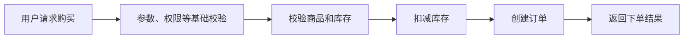

如果暂时完全不考虑高并发、高可用和扩展性，这套方案使用普通的业务服务和数据库就可以跑起来。

所以接下来真正需要思考的是：

> 当这个普通下单流程被放到“秒杀”场景中以后，会发生什么变化？

秒杀和普通下单最大的区别，是大量用户会在极短时间内同时请求购买少量商品，也就是出现非常明显的 **瞬时高并发和库存竞争**。

后面的设计都应该围绕这个特点逐步展开。

## 第二阶段：先控制进入核心链路的流量

第一个问题出现在整个请求链路的最前面。

普通电商的请求通常比较平稳，但是秒杀开始的一瞬间，可能同时出现几十万甚至更多请求。

而任何一个服务集群都有自己的容量上限。如果完全不加控制，即使后面的库存逻辑设计得再好，入口服务本身也可能先被瞬时流量打垮。

所以最前面首先需要一层**低成本的粗粒度限流**。

例如可以在网关或者秒杀服务入口设置整体 QPS 上限，先保证进入系统的请求量不会超过系统能够承受的容量。

这一层限流的核心目标不是业务公平，而是：

> **先保护系统本身，避免瞬时流量直接把服务打垮。**

请求通过这一层之后，再进行一些前置过滤和资格校验，例如：

- 参数是否合法；
- 活动是否开始；
- 用户是否登录；
- 用户是否具备秒杀资格；
- 用户是否已经购买过；
- 必要时进行验证码、人机校验或者简单风控。

这些校验的目的，是尽量提前过滤机器人、重复请求以及其他明显无效的流量。

这里不能简单理解成“所有请求先限流，再过滤”。

因为如果存在大量机器请求，它们可能会占用统一的限流额度，反而挤压正常用户。

因此在过滤掉明显非法请求以后，还可以进一步按照用户、账号等维度进行**更细粒度的限流**，控制真正进入秒杀核心链路的有效请求。

所以这一阶段更合理的流程是：

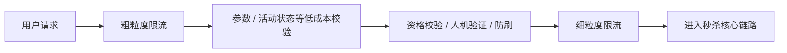

因此这一阶段的核心目标可以概括为：

> **先用低成本限流保护系统，再尽量过滤无效流量，最后控制真正进入核心秒杀链路的有效请求数量。**

## 第三阶段：不能让所有请求直接访问数据库库存

经过入口限流以后，流量虽然已经减少，但是仍然可能存在大量用户同时竞争同一个商品库存的问题。

如果按照最开始的方案，每个请求都直接查询数据库库存，再修改数据库库存，那么数据库很快就会成为瓶颈。

例如只有 1000 件库存，却可能有几十万个用户同时请求购买。

实际上只有前面很少一部分请求有继续执行的意义，剩下的大多数请求最终都会因为没有库存而失败。

因此，没有必要让几十万个请求全部访问数据库。

这时候可以把秒杀库存提前加载到 **Redis** 中。

请求经过前面的校验以后，先在 Redis 中尝试扣减库存：

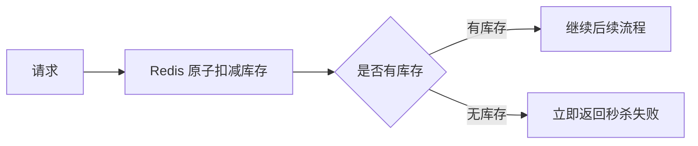

这里必须保证库存扣减是原子的。

原因很简单：如果先查询库存，再单独执行扣减，在高并发情况下，多个请求可能同时看到“还有最后一件库存”，最终导致超卖。

因此可以使用 Redis 本身提供的原子操作，或者使用 Lua 脚本，把库存判断和库存扣减放在一次原子操作中完成。

这里选择 Redis，主要不是为了单纯提高查询速度，而是为了两个目的：

> 第一，用内存操作承接高并发库存竞争；  
> 第二，在请求进入数据库之前，把绝大多数没有库存的请求直接挡掉。

另外，“同一个用户只能购买一次”这样的规则，也可以在这一层结合 Redis 原子判断完成，避免同一个用户通过并发请求重复抢购。

做到这里以后，大量秒杀请求其实已经不会再进入数据库。

## 第四阶段：Redis 挡住大多数请求，但数据库仍然可能出现瞬时洪峰

假设活动库存并不是几十件，而是几万甚至几十万件。

即使 Redis 已经过滤掉没有库存的请求，成功抢到库存的这些请求仍然可能在非常短的时间内同时进入数据库。

如果我们继续采用：

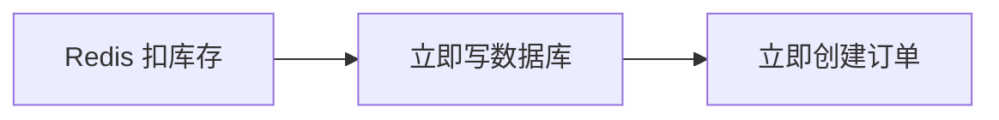

那么数据库还是可能瞬间承受非常大的写压力。

这时候问题就从“过滤无效请求”变成了：

> 怎么把短时间内大量有效请求慢慢处理掉？

因此这里才需要引入**消息队列进行削峰**。

流程变成：

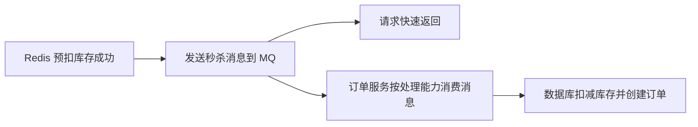

消息队列相当于在 Redis 和数据库之间增加了一个缓冲区。

例如瞬间产生 10 万个有效请求，数据库每秒只能稳定处理 1 万个，那么没有必要要求数据库一秒钟完成全部 10 万次写入。

可以先把请求放进 MQ，然后订单服务按照数据库能够承受的速度逐步消费。

因此这里需要区分两个概念：

- **入口限流**解决的是系统最多允许多少请求进来；
- **MQ 削峰**解决的是已经进入系统的瞬时请求如何摊平处理。

到这里，秒杀系统最主要的高并发链路基本形成：

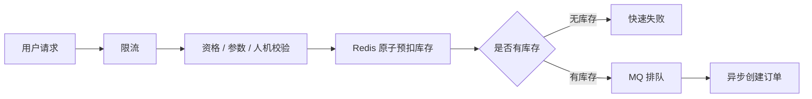

## 第五阶段：引入 MQ 之后，要处理消息可靠性和幂等

引入消息队列之后，数据库的瞬时压力降低了，但系统也因此增加了新的状态和新的故障点。

例如可能出现：

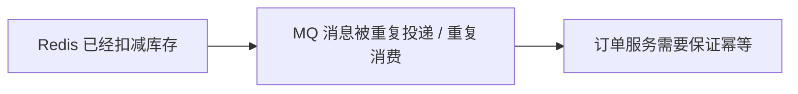

也可能出现：

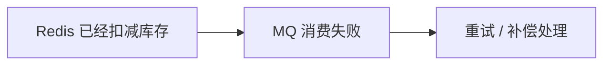

因此引入 MQ 以后，需要补上几个基本机制。

首先是**可靠投递**。

应该使用成熟的消息队列，例如 RocketMQ、Kafka 等，并开启合理的消息持久化、确认和重试机制。

这里没有必要自己设计消息存储和复制机制，这属于成熟 MQ 应该提供的基础能力。

其次是**重复消费问题**。

在分布式消息系统中，工程上通常很难简单假设“消息永远只消费一次”。

因此更常见的设计是：

> **至少消费一次 + 业务幂等。**

例如每个秒杀请求都有一个唯一业务 ID，订单服务处理消息时先判断这个请求是否已经创建过订单。

即使同一条消息被重复投递，也只能产生一笔订单。

因此：

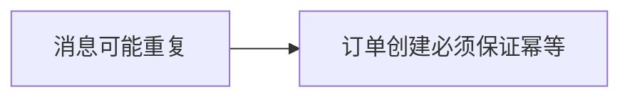

## 第六阶段：处理 Redis、MQ 和订单之间的一致性

到这里会出现秒杀系统里面比较重要的另一个问题：**库存一致性**。

这时候 Redis 已经认为库存被占用了，但数据库中却没有真正生成订单。

如果不处理，就会导致库存越卖越少，最终出现“库存还有，但用户已经抢不到”的情况。

因此需要增加 **失败重试和补偿机制**。

最简单的思路是：

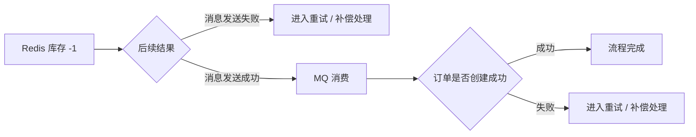

这里有一个需要特别注意的地方：

> MQ 发送超时，不一定代表消息一定没有发送成功。

有可能 Broker 已经收到消息，只是确认响应没有及时返回。

因此不能简单看到“发送超时”就直接把库存补回去，否则可能出现：

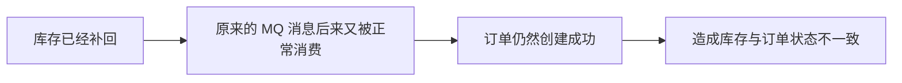

这样反而会造成库存错误。

所以工程上需要结合：

- 消息唯一 ID；
- 业务幂等；
- 消息重试；
- 消息最终状态确认；
- 必要时事务消息；
- 定时对账和补偿；

来保证系统最终能够收敛到正确状态。

这里没有必要追求 Redis、MQ、数据库之间每一步都做到严格的分布式强事务。

秒杀系统更常见的思路是：

> 核心扣减操作保证原子性，跨组件之间通过可靠消息、幂等、重试和补偿保证最终一致性。

## 第七阶段：订单创建成功，也不代表库存生命周期已经结束

即使订单已经成功创建，还有一种情况：

> 用户抢到了商品，但是一直没有支付。

如果这部分库存永久占用，就会出现大量库存被无效订单锁死的问题。

因此订单通常需要设置支付超时时间。

流程可以理解为：

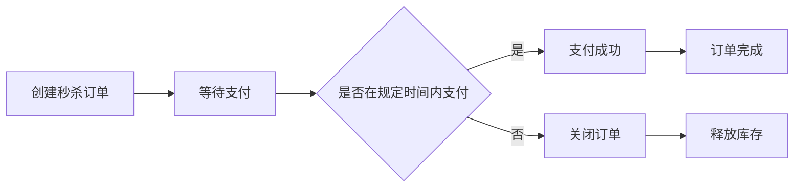

所以库存实际上有几个不同的状态：

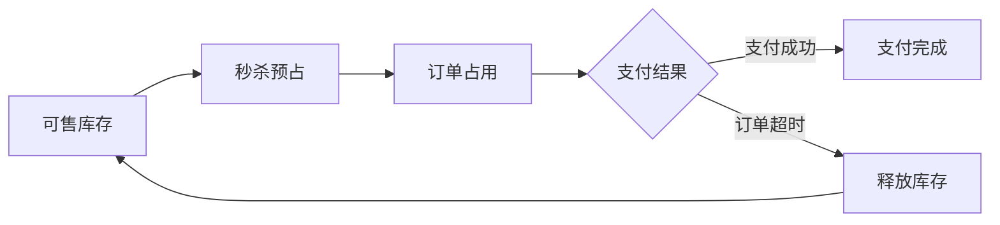

这里仍然要保证释放库存操作是幂等的，避免重复关闭订单导致库存重复增加。

## 第八阶段：秒杀系统不能影响正常电商业务

前面的设计主要解决的是：

> 秒杀系统自己怎么扛住高并发。

但对于真实电商平台来说还有一个非常重要的问题：

> 即使秒杀系统出现流量洪峰甚至发生故障，也不能把普通商品浏览、普通下单、购物车、支付等正常业务一起拖垮。

因为秒杀天然属于一种非常极端的流量场景，所以必须考虑**业务隔离和资源隔离**。

最直接的方式是让秒杀链路尽量独立。

例如：

- 秒杀服务使用独立实例；
- 秒杀请求使用独立线程池；
- 数据库连接池设置独立配额；
- MQ 使用独立 Topic 和消费组；
- 秒杀流量设置独立限流阈值；
- 大型活动下 Redis、MQ 等核心资源也可以进一步物理隔离。

它背后的原则其实非常简单：

> 秒杀业务即使降级甚至暂时不可用，也不能无限制地侵占整个电商系统的公共资源。

因此一旦秒杀系统的 Redis、MQ、数据库或者订单服务达到容量上限，可以直接降级或者快速失败，而不是继续积压请求，最终造成级联故障。

这也是秒杀系统和普通业务系统相比很重要的设计点。

## 工业级扩展

到目前为止，秒杀系统的核心设计已经完整。

真实线上系统还会增加一些工程增强能力，但这些并不是这道题最开始需要展开的主线。

例如：

**热点保护**

秒杀商品本身就是天然热点，可能产生 Redis 热 Key、热点商品数据等问题。极端规模下可以进一步考虑本地缓存、热点 Key 拆分等优化。

**防刷和风控**

除了验证码，还可以结合用户行为、IP、设备、账号风险等进行判断，防止脚本和恶意抢购。

**高可用**

Redis、MQ、应用服务本身都应该采用成熟的高可用部署方式。但这里通常没有必要重新设计 Redis 或 MQ 自身的复制协议，只需要说明依赖成熟集群能力即可。

**降级和熔断**

当系统压力超过预期时，可以关闭部分非核心功能，或者直接告诉用户“活动火爆”，优先保证核心系统稳定。

**监控和对账**

需要重点监控：

- 实际库存；
- Redis 库存；
- 成功订单数；
- MQ 堆积；
- 下单成功率；
- 支付成功率；
- 补偿任务状态。

同时可以通过定时对账发现 Redis、数据库和订单数据之间的异常，再通过补偿任务修复。

这些属于把秒杀系统从“核心逻辑正确”进一步提升到“工业级稳定运行”的能力。

## 总结

如果让我在面试中设计一个秒杀系统，我会先把它还原成一个普通的电商下单流程：

```text
请求购买
→ 校验库存
→ 扣减库存
→ 创建订单
```

然后把秒杀这个场景逐步带进来。

首先，因为秒杀会产生非常大的瞬时并发，所以不能让所有请求无限制进入系统，因此先通过**限流和前置校验**过滤流量。

接着发现，即使请求进入系统，也不能让几十万个用户同时访问数据库库存，所以把秒杀库存提前放到 **Redis**，通过原子操作完成库存预扣。没有库存的请求直接快速失败，这样绝大多数请求都会在数据库之前被挡掉。

但如果有效库存本身也比较大，抢到库存的用户仍然可能瞬间同时写数据库，因此继续在 Redis 和数据库之间加入 **MQ**，把瞬时请求转化成订单服务可以稳定处理的队列，实现削峰。

引入 MQ 以后，又会产生消息重复、消息失败等问题，所以订单消费需要做**幂等、重试和可靠投递**。

再往后，由于 Redis、MQ 和数据库之间已经形成跨组件链路，就可能出现库存已经预扣但订单没有成功创建的情况，因此需要通过**失败补偿、状态确认和对账机制**保证最终一致性；用户下单以后如果一直没有支付，还需要在订单超时后释放库存。

最后，秒杀本身属于极端流量场景，因此还必须考虑**业务和资源隔离**。秒杀系统即使压力过大或者发生故障，也应该优先限流、降级和快速失败，而不能影响普通商品、正常下单和支付等核心电商业务。

所以整条设计演进实际上就是：

```mermaid
flowchart LR
    A[普通下单] --> B[出现瞬时高并发]
    B --> C[限流 + 前置过滤]
    C --> D[数据库库存扛不住高并发竞争]
    D --> E[Redis 原子预扣库存 + 快速失败]
    E --> F[有效请求仍可能形成数据库写入洪峰]
    F --> G[MQ 削峰 + 异步下单]
    G --> H[引入 MQ 后出现重复、失败问题]
    H --> I[幂等 + 重试]
    I --> J[Redis / MQ / 数据库产生一致性问题]
    J --> K[补偿 + 对账 + 最终一致性]
    K --> L[秒杀可能影响正常业务]
    L --> M[资源隔离 + 限流 + 降级]
```

整个设计的重点并不是一开始就说“Redis、MQ、限流”，而是能够解释清楚：**当前模型遇到了什么问题，因此为什么需要在这个位置引入这个机制。**
