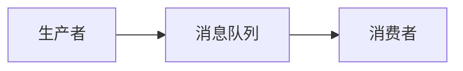
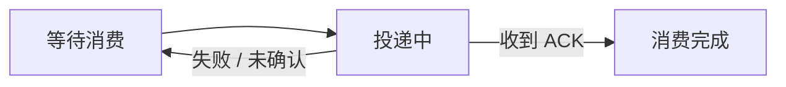

## 最简单模型

如果让我设计一个消息队列，我会先从一个最简单的模型开始，而不是直接照着 Kafka 或 RabbitMQ 罗列功能。

消息队列最基本的定位，是放在生产者和消费者之间，接收生产者发送的消息，暂时缓冲，再把消息交给消费者。

如果暂时不考虑宕机、性能和扩展性，可以先在一个进程中维护一个内存 FIFO 队列。生产者把消息放到队尾，消费者从队头获取消息。

这个模型已经实现了消息队列最基础的价值：生产者不需要直接调用消费者，两边在时间上得到解耦；当生产速度短时间高于消费速度时，中间的队列也能起到缓冲作用。

网络通信、序列化、磁盘文件和线程调度可以依赖成熟的网络库、Protobuf 和操作系统文件能力。除非题目专门考察这些内容，否则没有必要从 Socket、二进制编码或者文件系统开始重新设计。

在这个最简单模型上，再按照消息经过系统的顺序逐步提出问题。

## 第二阶段：消息模型是点对点还是发布订阅

第一个问题是消息应该发给谁：一条消息只需要交给一个消费者处理，还是需要同时通知多个独立下游？

一种方案是**点对点模式**。生产者把消息发送到一个 Queue，即使有多个消费者监听这个 Queue，一条消息最终也只交给其中一个消费者。这种模式适合任务分发和多个实例共同分担工作，模型比较简单，但不能直接满足多个独立业务方都要收到同一个事件的需求。

另一种方案是**发布订阅模式**。生产者只向 Topic 发布消息，每个 Subscription 都维护自己的消费关系和消费进度，同一条消息可以分别交给多个订阅方。这种模式适合业务事件广播，但消息队列需要维护更多订阅状态。

发布订阅也可以表达类似点对点的效果：如果一个 Topic 只有一个 Subscription，而这个 Subscription 内部只有一个消费者组，那么一条消息在这个组内仍然只会交给一个消费者实例。不过两种抽象并不完全相同：点对点天然表达竞争消费，发布订阅还需要考虑不同订阅之间的独立进度和后续扩展。

因此系统可以只支持其中一种，也可以同时提供 Queue、Topic、Subscription 和 Consumer Group 等抽象。是否需要两种都支持，取决于它只面向任务队列，还是还要承担事件广播。

## 第三阶段：消息应该 Push 还是 Pull

确定消息发给谁以后，下一个问题是消息队列如何把消息交给消费者：由消息队列主动 Push，还是由消费者主动 Pull？

Push 模式由消息队列主动向消费者交付消息，不需要等待消费者下一次轮询，使用方式也比较直接。但消息队列需要了解每个消费者还能承受多少消息；如果消费者突然变慢，持续推送可能造成消费者本地积压。为了解决这个问题，Push 通常还要配合 Prefetch、Credit 或最大在途消息数等流控机制。

Pull 模式由消费者根据自身处理能力主动获取消息。消费者可以控制拉取频率、批量大小和并发数量，也更容易暂停消费或者重新读取历史数据。但普通短轮询可能产生大量空请求，并在两次轮询之间增加消息延迟。

为了改善 Pull 的空轮询和延迟问题，可以使用长轮询。消费者发起 Fetch 请求后，如果暂时没有消息，消息队列先挂起请求；等消息到达或者等待超时后，再返回一批消息。也可以采用“通知 + 拉取”的组合方式，由消息队列提示有新消息，再由消费者决定拉取多少。

所以 Push 和 Pull 都有各自的使用场景。Push 更偏向主动交付和简单的消费体验，Pull 更偏向消费者自主控制、批量处理和回放；长轮询能够让 Pull 获得接近 Push 的消息到达延迟，带 Credit 的推送则可以补充消费者流控。

## 第四阶段：生产者什么时候认为发送成功

消息从生产者发出以后，需要先定义什么叫“发送成功”。这个确认边界越靠后，通常可靠性越高，但生产者等待的时间也越长。

最宽松的方案是 Fire-and-forget。生产者把请求发出后不等待 Broker 返回，适合允许少量丢失、更加关注吞吐量和延迟的日志或埋点数据，但生产者无法确定消息队列是否真正收到消息。

稍严格一些，可以等待 Broker 返回接收确认。这个确认可以代表消息已经进入进程内存，也可以代表已经写入操作系统 Page Cache。它能够确认消息已经到达 Broker，但 Broker 或机器随后故障时，消息是否能恢复取决于后面的存储策略。

如果需要更强的保证，可以把成功条件继续后移：等待消息在本地完成 `fsync`，等待若干或法定数量副本收到消息，或者等待当前同步副本全部确认。确认条件越强，能够覆盖的故障通常越多，但写入延迟和网络开销也越大；当健康副本不足时，系统还可能选择拒绝写入，用可用性换取可靠性。

这里还存在请求超时的不确定性。Broker 可能已经保存消息，只是确认响应没有返回，生产者如果直接重试，就可能产生重复消息。可以接受至少一次发送，再由业务去重；也可以让同一次逻辑发送携带相同 Message ID，由 Broker 在一定范围内去重；还可以通过 Producer ID 和递增序号实现幂等生产者。

因此，生产者是否等待确认、等待到哪一步，以及超时重试如何去重，都应该根据消息能否丢失、能否重复、延迟要求和故障时的可用性要求决定。这里的发送确认属于生产者到 Broker 的可靠性，不能和后面的消费者 ACK 混为一谈。

## 第五阶段：什么时候认为消费成功

消息已经交给消费者，并不代表业务处理已经成功。消费者可能刚收到消息就宕机，也可能在更新数据库时失败。因此还要单独定义消费确认语义。

一种方案是在消息交付后立即确认，并且不再重新投递。它的状态管理简单、额外交互少，但是消费者在真正处理之前宕机时，消息可能丢失。这更接近 **At-most-once，最多投递一次**。

另一种方案是手动 ACK。消息交给消费者以后先标记为“投递中”，消费者完成业务处理后再发送确认。如果消费者返回 NACK、连接断开、可见性超时，或者消费进度没有提交，消息可以重新进入可消费状态。

这种方式可以实现 **At-least-once，至少投递一次**，但允许重复。例如消费者已经完成数据库操作，却在发送 ACK 前宕机，消息仍然可能被再次投递。

消息队列无法看到消费者内部的业务事务，因此只能保证投递，不能单独保证业务结果恰好发生一次。消息中可以携带稳定的 Message ID 或业务唯一键，消费者通过唯一约束、去重记录或者业务状态判断实现幂等。Exactly-once 如果要覆盖外部数据库等业务结果，通常还需要事务或者上下游共同配合。

消费成功以后是否删除消息，又是另一个可以配置的问题。传统任务队列可以在 ACK 后把消息标记为可删除；日志模型则只提交消费 Offset，消息仍然按照时间、容量或者压缩策略保留，从而支持其他订阅者继续消费或者回退重放。

在发布订阅场景中，一个 Subscription 的 ACK 也不能直接代表其他 Subscription 已经消费完成。可以为不同订阅维护独立的逻辑队列，也可以共享同一份日志、分别维护 Offset。

所以这一阶段需要分别确定确认时机、投递语义、消费者幂等和消息保留方式，而不是简单地把“已经投递”“已经处理”和“可以物理删除”视为同一个状态。

## 第六阶段：消费失败后如何重试

有了失败重新投递以后，又会出现新的问题：如果一条消息本身有问题，或者它依赖的下游长时间不可用，就不能一直立即重投，否则会反复占用消费者资源，甚至阻塞后面的正常消息。

首先可以区分错误类型。参数非法、消息格式错误等通常属于不可重试错误，可以直接进入异常处理流程；网络超时、下游临时不可用等错误则可以进行重试。

重试间隔可以选择立即重试、固定间隔，或者逐渐增长的退避策略。指数退避能够减少下游故障期间的持续冲击，增加少量随机抖动还可以避免大量失败消息在同一时间集中重试。

重试还需要设置最大投递次数或者总时间预算。达到上限以后，可以把消息放入**死信队列 Dead Letter Queue**，保留原始消息、失败原因和投递次数，后续进行告警、人工检查、自动补偿或者修复后重新投递。对于允许丢弃的非关键消息，也可以记录失败后终止处理。

实现上可以由 Broker 记录下一次可投递时间，也可以把消息转移到不同延迟级别的 Retry Queue，还可以由消费者侧的调度系统负责。Broker 统一管理更容易形成一致策略，消费者侧处理则更灵活，但会把更多可靠性责任交给业务应用。

重试还会影响顺序。如果失败消息进入延迟重试，而后续消息继续消费，吞吐量更好，但可能打破严格顺序；如果必须维持顺序，就可能暂停对应 Key 或 Partition，代价是后续消息也会被阻塞。

因此失败处理应该是一组策略：哪些错误允许重试、采用什么间隔、最多尝试多少次、超限以后进入死信还是丢弃，以及是否需要为顺序牺牲吞吐量。

## 第七阶段：Broker 宕机后如何保证消息可靠

前面定义了多种生产者确认级别，现在需要继续回答这些确认背后的实现：如果 Broker 进程、机器或者磁盘故障，已经接收的消息如何恢复？

一种方案是**本地持久化**。消息可以顺序追加到日志文件，进程重启后通过日志恢复。只保存在进程内存中延迟最低，但进程退出就会丢失；写入 Page Cache 后，消息队列进程重启时通常还可以恢复，但机器掉电时尚未刷盘的数据仍有风险；每条消息等待 `fsync` 后再确认，单机持久性更强，但写入延迟更高。批量刷盘或者周期刷盘则是在性能和持久性之间折中。

另一种方案是**多副本复制**。可以为当前的逻辑存储单元保存多个 Replica，由 Leader 接收写入，Follower 主动拉取或者由 Leader 推送同步数据。如果 Leader 所在机器故障，只要其他副本仍然保留消息，就可以切换到新的副本继续服务。

多副本是否能够保护一条已经确认成功的消息，还取决于确认时已经同步了多少副本。只配置三个副本，但生产者只等待 Leader 接收，最新消息仍然可能在复制完成前丢失；等待更多副本确认能够覆盖更多单节点故障，但会增加写入延迟，并可能受到慢副本影响。

本地持久化和多副本不是简单的二选一，它们覆盖的故障范围不同，也经常组合使用：每个副本都维护自己的追加日志，同时通过副本复制应对机器和磁盘故障。类似 Kafka 的设计不要求每条消息都立即 `fsync`，而是通过文件系统 Page Cache、多个同步副本和生产者确认级别共同提供可靠性；其他系统也可以选择更严格的刷盘策略。

如果所有副本都只保存尚未落盘的内存数据，并且同时掉电，消息仍然可能丢失；如果只有单机持久化，磁盘永久损坏时也无法恢复。因此需要根据要容忍的是进程崩溃、单机故障、磁盘损坏还是整个故障域失效，组合选择刷盘策略、副本数量、副本放置位置和确认级别。

多副本还会继续引出副本一致性、Leader 选举和故障切换等问题。面试中说明会通过同步副本集合、法定确认或成熟一致性机制完成即可；除非题目专门考察分布式复制，否则没有必要继续展开具体协议。

## 第八阶段：单个节点放不下或者处理不过来怎么办

解决可靠性以后，单个节点的 CPU、磁盘容量、磁盘吞吐和网络带宽仍然有上限。当一个逻辑队列无法再由单个节点承载时，就需要考虑水平扩展。

常见方案是把一个 Topic 或 Queue 拆成多个 Partition，不同 Partition 分布到不同节点上并行读写。前面讨论的 Leader 和 Replica，此时都以 Partition 作为复制和故障切换的单位。

消息如何进入 Partition 也有多种方案。轮询或者随机分配更容易均衡流量，但无法自然保证同一业务对象的消息顺序；按照 Message Key 做 Hash 路由，可以让同一个订单或用户的消息稳定进入同一个 Partition，从而在生产者按顺序发送的前提下保证局部有序，但热点 Key 可能造成分区倾斜；复杂业务也可以提供自定义路由规则。

顺序保证本身也需要取舍。只使用一个 Partition 更容易实现全局有序，但会失去并行扩展能力；按 Key 分区可以实现相同 Key 范围内有序；完全不要求顺序则更容易获得高吞吐量。

消费者侧可以由 Consumer Group 把不同 Partition 分给不同实例，实现并行处理。消费者数量发生变化时需要重新分配 Partition，具体 Rebalance 算法可以依赖成熟实现，只需要说明它解决消费者扩缩容后的重新分工问题。

这里要区分 Partition 和 Replica 的作用：Partition 主要解决容量与吞吐量扩展，Replica 主要解决节点故障和数据冗余。副本本身通常不会提高单条写入链路的容量，反而会带来额外复制开销。

## 第九阶段：消息积压和系统过载怎么办

消息队列能够缓冲生产者和消费者之间短时间的速度差异，但缓冲能力不是无限的。如果生产速度长期高于消费速度，最终会出现消息积压、磁盘占满和端到端延迟持续增长。

一种方向是提高消费能力，例如增加消费者实例、增加 Partition、批量拉取和批量处理。但扩容会受到 Partition 数量、下游数据库容量以及消息顺序要求的限制。

另一种方向是限制生产速度，例如对生产者设置配额、限流或者背压；当磁盘达到高水位时，可以拒绝新的低优先级消息，或者要求生产者降速。这能够保护 Broker，但压力会传递回生产端。

对于允许丢失或者只在短时间内有效的消息，还可以设置 TTL、最大积压量、按优先级淘汰或者删除较早消息。对于关键业务消息，则不能简单依靠删除掩盖容量问题，需要继续扩容、延长存储能力、降低生产速度或者把流量迁移到其他节点。

因此积压问题需要先区分短时间流量尖峰和长期产消能力不匹配，再结合消费者扩容、Broker 扩容、背压限流、消息重要性和存储水位选择方案。

## 工业级扩展

走到这里，消息队列的主要设计问题已经形成完整主线。继续做成工业级产品时，还可以考虑延迟消息、优先级消息、消息查询和重放、事务消息、跨机房复制、Schema 管理、压缩和批量发送等能力。

运维方面需要关注生产和消费吞吐量、生产发送失败率、端到端延迟、消息积压量、Consumer Lag、重试次数、死信数量、副本同步延迟和磁盘水位，并提供告警、追踪和管理工具。

平台层面还可以补充身份认证、Topic 权限、传输加密、多租户隔离和资源配额。这些能力很重要，但不是解释消息队列核心模型所必需的内容，在面试主线中点到为止即可。

## 总结

整个设计从一个只负责接收、缓冲和转发消息的内存队列开始。首先要确定消息模型，因此引出点对点和发布订阅；随后要确定如何把消息交给消费者，因此比较 Push、Pull、长轮询和带流控的推送。

消息进入 Broker 以后，需要先定义生产者什么时候认为发送成功，可以不等待确认、等待 Broker 接收、等待本地刷盘或者等待多个副本。不同确认级别在延迟、可靠性和故障时可用性之间做取舍，发送超时还会进一步引出生产者重试与去重问题。

生产端确认之后，再定义什么时候认为消费成功。消息交付后立即确认更简单，但可能丢失；业务处理后手动 ACK 可以实现至少一次投递，但会产生重复，因此消费者需要幂等。消息持续失败时，再继续引出有限重试、固定或指数退避、最大投递次数和死信队列。

随后解决 Broker 自身故障：本地追加日志、Page Cache 和刷盘策略提供不同程度的单机恢复能力，多副本则应对节点和磁盘故障，两者可以组合。单节点容量不足时，再通过 Partition、路由策略和 Consumer Group 水平扩展；生产长期快于消费时，则通过消费扩容、背压、限流、TTL、淘汰和存储保护处理积压。

所以这道题不需要提前认定要实现一个 Kafka 或 RabbitMQ，也不需要对每个问题强行选择唯一答案。更重要的是按照消息经过系统的顺序不断提出：

> **当前模型还缺少什么保证？有哪些可选方案？每种方案解决什么问题，又会付出什么代价？**

只有当面试官进一步给出消息类型、可靠性、吞吐量、顺序、保留、延迟和成本等约束以后，才需要继续收敛最终方案。
