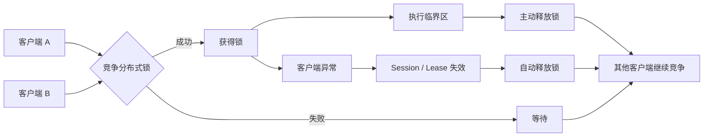
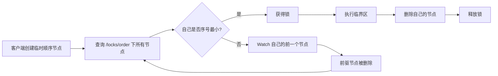
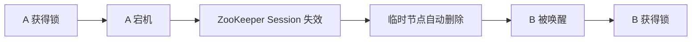
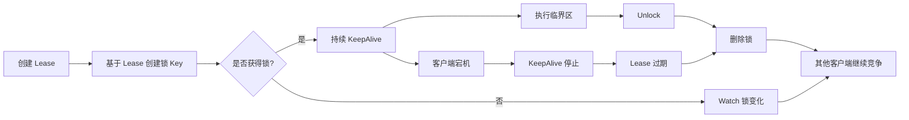
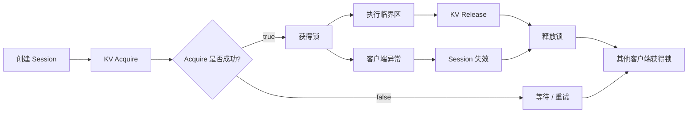
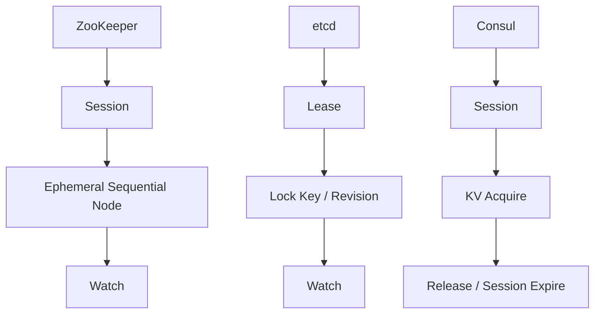
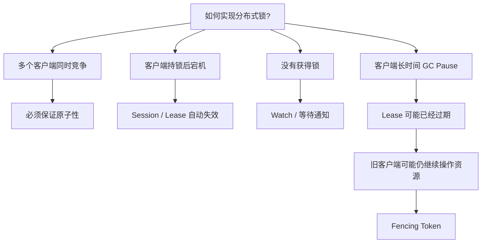

图方便用数据库，图性能用 Redis，图强一致协调用 ZooKeeper/etcd；涉及核心数据时，无论用什么锁，都要靠数据库约束和幂等兜底。

| 方案 | 基本实现 | 优点 | 主要问题 | 典型场景 |
|---|---|---|---|---|
| 数据库唯一约束 | 插入带唯一键的锁记录 | 简单、可靠、容易理解 | 竞争激烈时数据库压力大；需要处理过期锁 | 低并发、已有数据库 |
| 数据库行锁 | `SELECT ... FOR UPDATE` | 与数据库事务天然结合 | 必须保持事务和连接；吞吐有限 | 锁保护的就是数据库数据 |
| 数据库 Advisory Lock | MySQL `GET_LOCK`、PostgreSQL advisory lock | 不需要单独的锁表 | 通常与连接绑定，连接断开语义需注意 | 内部系统、低到中并发 |
| Redis 单节点锁 | `SET key value NX PX ttl` | 快、实现简单、吞吐高 | Redis 故障切换可能导致锁丢失；依赖 TTL | 允许极低概率重复执行的业务 |
| Redis + 看门狗 | 获取锁后定时续期 | 可以支持执行时间不确定的任务 | 进程长暂停、续期失败、网络分区仍需处理 | Java 服务中很常见，如 Redisson |
| Redis Redlock | 多个独立 Redis 节点多数派加锁 | 尝试降低单节点故障影响 | 复杂、有争议；不能代替 fencing token | 明确理解故障模型后采用 |
| ZooKeeper | 临时顺序节点 + Watch | 强一致、公平锁容易实现；会话断开自动释放 | 运维和客户端逻辑较复杂 | 已有 ZooKeeper、强一致协调 |
| etcd | 事务 + Lease + Revision | 强一致、租约完善，可生成 fencing token | 性能通常低于 Redis；需要维护集群 | Kubernetes/云原生、强一致场景 |
| Consul | Session + KV CAS | 服务发现和锁可以整合 | 一致性和使用模式需要仔细配置 | 已经使用 Consul 的系统 |
| 任务队列/单线程消费 | 将同一资源的任务路由到同一分区 | 从结构上避免并发，不必显式加锁 | 改变系统架构；受队列吞吐和延迟影响 | 订单串行处理、定时任务 |
| 业务幂等/乐观锁 | 唯一请求号、版本号、CAS | 不依赖锁，通常更健壮 | 业务设计成本更高 | 支付、订单、库存等关键业务 |

## 一、整体对比

| 组件 | 核心机制 | 锁自动释放依赖 | 常用客户端 |
|---|---|---|---|
| ZooKeeper | 临时顺序节点 + Watch | Session | Java Curator |
| etcd | Lease + Revision + Watch | Lease | Go `concurrency.Mutex` |
| Consul | Session + KV Acquire | Session | Go Consul API |

整体可以抽象为：



### ZooKeeper 分布式锁

ZooKeeper 最经典的实现方式是：

> **临时节点 + 顺序节点 + Watch。**

假设锁目录为：

```text
/locks/order
```

多个客户端分别创建临时顺序节点：

```text
/locks/order/lock-00000001
/locks/order/lock-00000002
/locks/order/lock-00000003
```

序号最小的客户端获得锁。



例如：

```text
lock-00000001   ← A 持锁
lock-00000002   ← B 监听 00000001
lock-00000003   ← C 监听 00000002
```

这里通常让客户端监听自己的**前驱节点**，而不是所有客户端都监听持锁节点，从而避免锁释放时产生大量客户端同时被唤醒。

如果持锁客户端直接宕机：



```java {11, 16}
CuratorFramework client = CuratorFrameworkFactory.builder()
                            .connectString("127.0.0.1:2181")
                            .sessionTimeoutMs(15_000) // Session 超时时间
                            .retryPolicy(new ExponentialBackoffRetry(1000, 3))
                            .build();

client.start(); // Curator 后台自动发送心跳，维持 Session

InterProcessMutex lock = new InterProcessMutex(client, "/locks/order");

if (lock.acquire(5, TimeUnit.SECONDS)) { // 最多等 5 秒拿锁
    try {
        createOrder(); // Session 正常时，锁可持续持有
    } finally {
        lock.release(); // 主动释放
    }
}
```

可以简单记成：

> ZooKeeper 通过临时顺序节点竞争锁，最小节点获得锁，其他节点监听前驱节点；客户端 Session 失效后临时节点自动删除。

### etcd 分布式锁

etcd 的核心机制可以理解为：

> **Lease + Key + Revision + Watch。**

客户端首先建立 Lease，然后锁对应的 Key 会和 Lease 绑定。



因此，如果客户端宕机：

```text
KeepAlive 停止
        ↓
Lease 过期
        ↓
锁 Key 删除
        ↓
其他客户端获得锁
```

etcd 官方 Go Client 已经封装了 Mutex：

```go
// 创建一个 TTL = 10 秒的 Lease
lease, _ := cli.Grant(context.Background(), 10)

// 持续续租
keepAliveCh, _ := cli.KeepAlive(context.Background(), lease.ID)

// 创建锁 Key，并绑定 Lease
cli.Put(
    context.Background(),
    "/locks/order",
    "server-A",
    clientv3.WithLease(lease.ID),
)

// 只要 KeepAlive 正常，Lease 就不会过期
go func() {
    for resp := range keepAliveCh {
        fmt.Println("续租成功，TTL:", resp.TTL)
    }
}()

createOrder()
```

可以简单记成：

> etcd 使用 Lease 管理锁生命周期，通过 Revision、事务和 Watch 保证锁竞争与等待；Lease 失效后锁自动释放。

### Consul 分布式锁

Consul 使用的是：

> **Session + KV Acquire / Release。**

客户端首先创建一个 Session，然后使用这个 Session 去占用某个 KV。

例如：

```text
locks/order
```

流程：



```go
sessionID, _, _ := client.Session().Create(
                        &api.SessionEntry{
                            TTL:      "10s",
                            Behavior: api.SessionBehaviorRelease,
                        },
                        nil,
                    )

// 使用 Session 获取锁
pair := &api.KVPair{
    Key:     "locks/order",
    Session: sessionID,
}

acquired, _, _ := client.KV().Acquire(pair, nil)

// 定期续租 Session
go func() {
    ticker := time.NewTicker(5 * time.Second)

    for range ticker.C {
        client.Session().Renew(sessionID, nil)
    }
}()

if acquired {
    createOrder()

    client.KV().Release(pair, nil)
}
```

可以简单记成：

> Consul 创建 Session 后，通过 Session 去 Acquire 某个 KV；Session 失效或者主动 Release 后，锁被释放。

### 三种锁放在一起理解

三者虽然名称不同，但整体模型几乎一致：



可以对应理解：

| 目的 | ZooKeeper | etcd | Consul |
|---|---|---|---|
| 锁对象 | 临时顺序节点 | Lock Key | KV |
| 生命周期 | Session | Lease | Session |
| 等待通知 | Watch | Watch | Blocking Query / 重试 |
| 主动释放 | 删除节点 | Unlock | Release |
| 异常释放 | Session 失效 | Lease 过期 | Session 失效 |

### 真正需要理解的问题

如果是面试，除了会使用 API，更重要的是理解下面几个问题：



尤其需要注意：Fencing Token

假设客户端 A：

```text
A 获得锁
    ↓
发生长时间 GC
    ↓
Lease 已过期
    ↓
B 获得新的锁
    ↓
A GC 恢复
```

此时 A **可能还以为自己拥有锁**。

于是出现：

```text
A ──► 修改数据库
B ──► 修改数据库
```

仅仅依靠分布式锁本身，并不能阻止已经失去锁的旧客户端继续操作真正的业务资源。

因此更加严格的系统会引入一个单调递增的：

```text
Fencing Token
```

例如：

```text
A 获得锁 → token = 10

A 锁失效

B 获得锁 → token = 11
```

下游资源只接受比历史版本更大的 token：

```text
A 请求 token = 10  → 拒绝
B 请求 token = 11  → 接受
```

而三者共同的本质是：

> **利用一个具有一致性保证的分布式协调系统，让多个客户端竞争唯一资源，同时通过 Session 或 Lease 解决客户端故障后的锁自动释放问题。**

再往下一层，则需要考虑：

> **Lease 失效并不意味着旧客户端一定停止运行，因此更加严格的分布式锁系统还需要考虑 Fencing Token。**