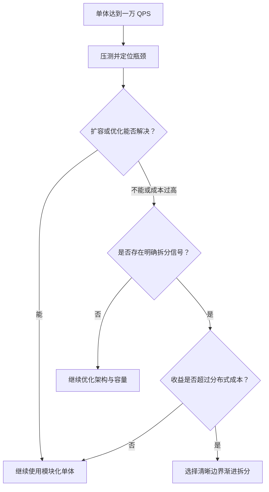

## 一、面试口述回答

我认为不能因为单体系统的 QPS 达到一万，就直接判断应该拆分微服务。**QPS 首先反映的是容量问题，而微服务拆分解决的是业务边界、研发协作和故障隔离问题。**

面对一万 QPS，我会先做压测和监控分析，确认瓶颈在应用、数据库、缓存还是下游系统。如果只是应用实例容量不足，且系统能够无状态水平扩容，那么增加 Pod、优化热点接口或提升存储层能力，通常比拆服务更直接。

真正需要考虑拆分，是当系统内部出现了明确的业务边界，而且不同模块在扩容需求、发布节奏、团队归属或稳定性等级上已经明显分化。例如商品查询需要独立扩容，营销故障不能影响订单支付，或者多个团队频繁互相阻塞，这时拆分才能带来独立扩缩容、独立发布和故障隔离的收益。

但微服务也会引入远程调用、超时重试、服务治理、分布式事务和数据一致性等复杂度。因此我的最终判断标准不是某个固定 QPS，而是：**拆分带来的业务与工程收益，是否已经超过分布式系统增加的成本。** 如果收益还不明显，我会优先优化单体，并保持清晰的模块边界，为以后渐进式拆分做准备。

## 二、为什么 QPS 不是拆分阈值

同样是一万 QPS，不同系统的承载难度可能完全不同：简单缓存查询和复杂交易写入无法直接比较。是否扛得住，还取决于单实例吞吐、接口耗时、读写比例、数据库和下游容量等因素。

因此，QPS 主要回答的是“系统需要多少资源、瓶颈在哪里”；微服务拆分回答的则是“哪些能力应该独立开发、部署、扩容和承担故障”。二者有关联，但不存在固定的换算关系。

## 三、判断是否值得拆分

| 判断维度 | 值得拆分的信号 |
| --- | --- |
| 业务边界 | 模块职责清晰，能够形成相对独立的业务能力和数据边界 |
| 独立扩容 | 流量集中在少数模块，整体扩容造成明显资源浪费 |
| 团队与发布 | 多团队相互阻塞，模块需要不同的发布频率和演进节奏 |
| 故障隔离 | 非核心模块的资源耗尽或故障会拖垮订单、支付等核心链路 |
| 复杂度成本 | 团队已有能力承担调用治理、可观测性和数据一致性问题 |

这些信号应结合判断。单一信号通常不足以支持大规模拆分，更合适的方式往往是从收益最明确、边界最清晰的模块开始渐进式拆分。

## 四、推荐的决策顺序

核心思路是：**先解决容量问题，再识别架构问题；先证明拆分收益，再承担分布式复杂度。**
