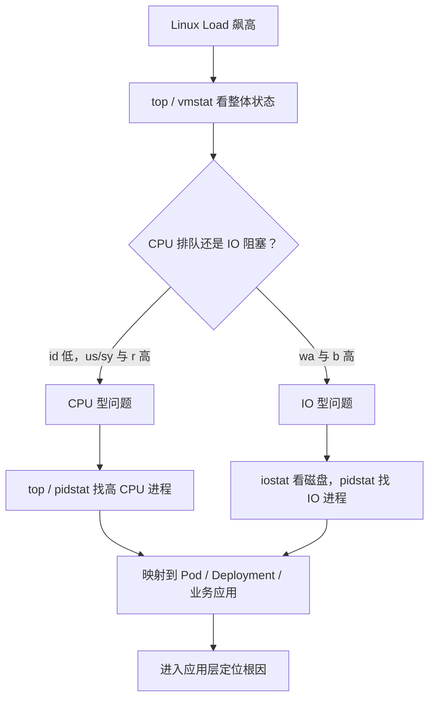

## 一、面试口述版

Linux 机器 Load 飙高时，我不会直接认定是 CPU 被打满，因为 Load 高表示系统中处于可运行状态或不可中断睡眠状态的任务很多：它既可能是大量任务在排队等待 CPU，也可能是任务阻塞在磁盘等 IO 上。

我会先用 `top` 和 `vmstat` 看整体状态，判断问题属于 CPU 型还是 IO 型。如果 `id` 很低、`us` 或 `sy` 很高，同时 `vmstat` 的 `r` 持续偏高，说明 CPU 确实繁忙，并且有较多任务在运行队列中等待。这时我会用 `top`、`pidstat` 找到高 CPU 进程；如果机器是 Kubernetes Node，再把进程映射到具体 Pod 和业务应用，最后进入应用层，用 Go pprof、Java profiler 或线程栈等工具定位热点代码。

如果 CPU 仍有明显空闲，但 `wa` 和 `vmstat` 的 `b` 较高，就更像是 IO 阻塞。我会用 `iostat` 判断具体磁盘的延迟、队列和繁忙程度，再用 `pidstat` 找到读写异常或被 IO 拖慢的进程，然后映射到 Pod 和业务服务，继续分析是流量突增、异常读写、慢盘，还是下游存储变慢。

因此，整条主线是：**先判断 Load 高来自 CPU 排队还是 IO 阻塞，再定位到进程和业务服务，最后进入应用层查根因。**

## 二、整体排查链路



这张图中最关键的分叉不是“哪个命令报红”，而是先回答：任务是在 **等 CPU**，还是在 **等 IO**。瞬时采样可能有波动，应结合连续几次观察和业务时间线判断。

## 三、关键指标怎么理解

### 1. Load

`Load Average` 通常显示过去 1、5、15 分钟的平均负载。它统计的主要是：

- 正在运行或等待 CPU 的任务；
- 处于不可中断睡眠状态的任务，常见原因是等待 IO。

所以 Load 高不等于 CPU 使用率一定高。判断是否“过高”还要结合 CPU 核数：例如在 8 核机器上，Load 长期明显高于 8，说明可运行或阻塞任务已经形成积压，但仍需继续区分 CPU 与 IO 原因。

### 2. CPU 指标

| 指标 | 含义与观察重点 |
| --- | --- |
| `us` | 用户态 CPU 时间。持续很高时，常见于业务计算、循环、序列化或压缩等代码热点。 |
| `sy` | 内核态 CPU 时间。持续很高时，可关注系统调用、网络、锁竞争或频繁上下文切换等方向。 |
| `id` | CPU 空闲时间。持续很低，说明 CPU 资源已经比较紧张。 |
| `wa` | CPU 等待 IO 完成的时间。持续偏高通常提示 IO 延迟，但应结合 `b` 和 `iostat` 验证，不能单独下结论。 |

### 3. vmstat 的 r 与 b

| 指标 | 含义与观察重点 |
| --- | --- |
| `r` | 可运行任务数，包括正在运行和等待 CPU 的任务。若持续明显高于 CPU 核数，通常说明 CPU 运行队列拥堵。 |
| `b` | 处于不可中断睡眠状态的任务数，常见于等待磁盘等 IO。持续升高时，应转向 IO 排查。 |

## 四、几个工具分别解决什么问题

这些工具不是固定顺序的“命令套餐”，而是分别回答不同层次的问题。

| 工具 | 主要回答的问题 | 重点看什么 |
| --- | --- | --- |
| `top` | 整台机器是否忙，哪个进程最可疑？ | Load、`us/sy/id/wa`、进程 CPU 排名；适合快速建立全局判断。 |
| `vmstat` | 压力来自运行队列、阻塞，还是其他系统活动？ | 连续观察 `r`、`b`、`us`、`sy`、`id`、`wa`，避免只看一次快照。 |
| `pidstat` | 哪个进程在持续消耗 CPU 或制造 IO？ | `pidstat -u` 看进程 CPU，`pidstat -d` 看进程读写；适合按时间采样确认持续性。 |
| `iostat` | 是否有磁盘出现高延迟、长队列或繁忙？ | 扩展视图中的 `await`、队列和 `%util` 等；需要结合磁盘类型、业务基线共同判断。 |

常见的最小观察方式如下：

```bash
top
vmstat 1
pidstat -u 1
pidstat -d 1
iostat -xz 1
```

重点不是记住所有列，而是让每个命令回答一个问题：**机器为什么忙、哪个资源在排队、哪个进程制造了压力。**

## 五、CPU 型与 IO 型问题如何继续定位

### CPU 型

当 `id` 很低，`us` 或 `sy` 较高，并且 `r` 持续偏高时：

1. 用 `top` 或 `pidstat -u 1` 确认持续占用 CPU 的 PID。
2. 判断它是节点系统进程，还是容器内的业务进程。
3. 映射到 Pod、Deployment 和业务应用。
4. 进入应用层定位热点：例如 Go 使用 pprof，Java 查看 profiler、线程栈和 GC 情况。

### IO 型

当 `wa`、`b` 持续偏高，而 CPU 并未真正打满时：

1. 用 `iostat -xz 1` 确认是否存在高延迟、排队或持续繁忙的磁盘。
2. 用 `pidstat -d 1` 找到读写量异常的进程；必要时结合进程状态判断谁正在等待 IO。
3. 映射到 Pod 和业务应用。
4. 进入应用层分析异常读写、日志暴增、数据扫描、缓存失效、存储限流或磁盘故障等原因。

## 六、Linux PID 如何映射到 Kubernetes Pod 和业务服务

真正需要的映射通常是：

```text
Linux PID → Container → Pod → Deployment / 业务应用
```

Kubernetes 的 `Service` 对象并不是必经目标：有些 Pod 不被 Service 选中，一个 Service 也可能对应多个 Pod。排障时更重要的是确认进程属于哪个 Pod、哪个工作负载以及哪个业务应用。

### 路径一：优先从 Kubernetes 监控反查

如果已经知道某个 Node CPU 或 IO 异常，优先使用 Prometheus、Grafana、云监控或 Kubernetes Metrics 查看该 Node 上各 Pod、Container 的资源使用。这条路径通常最快，也能看到变化趋势，而不是只有当前瞬时值。

没有完整监控时，可以先列出该 Node 上的 Pod，再结合资源指标进行比对：

```bash
kubectl get pod -A -o wide --field-selector spec.nodeName=<node-name>
kubectl top pod -A --containers
```

找到异常 Pod 后，再查看它的命名空间、镜像、标签和 Owner，即可确认所属工作负载和业务应用。

### 路径二：已经拿到高 CPU PID 时反查

第一步，查看进程所属的 cgroup：

```bash
cat /proc/<PID>/cgroup
```

在 Kubernetes 容器进程的 cgroup 路径中，通常能找到 Pod UID 和 Container ID 的线索。具体格式会因 cgroup v1/v2、containerd 或其他运行时而不同，因此重点是识别容器标识，而不是死记路径格式。

第二步，通过节点上的 CRI 或容器运行时查询 Container：

```bash
crictl ps
crictl inspect <container-id>
crictl pods
```

这些信息可将 Container ID 关联到 Container 名称、Pod、Namespace 和 Pod UID。如果 cgroup 中没有容器信息，则该 PID 可能属于节点系统进程，需要按主机进程继续排查。

第三步，通过 Pod 的 Owner 找到业务工作负载：

```bash
kubectl get pod <pod-name> -n <namespace> -o yaml
kubectl describe pod <pod-name> -n <namespace>
```

重点查看 `ownerReferences`、标签、镜像和 Container 名称。常见归属链路是：

```text
Pod → ReplicaSet → Deployment → 业务应用
```

StatefulSet、DaemonSet、Job 等工作负载也可能直接成为 Pod 的 Owner。最终目标是回答：**哪个业务应用在什么时间、因为什么行为制造了这次资源压力。**

## 七、复习时只记住这条主线

> Load 高不等于 CPU 一定打满。先用 `top`、`vmstat` 区分 CPU 排队和 IO 阻塞；再用 `top`、`pidstat` 或 `iostat` 找到异常进程与资源；随后映射到 Pod、Deployment 和业务应用；最后进入应用层定位代码或依赖层面的根因。
