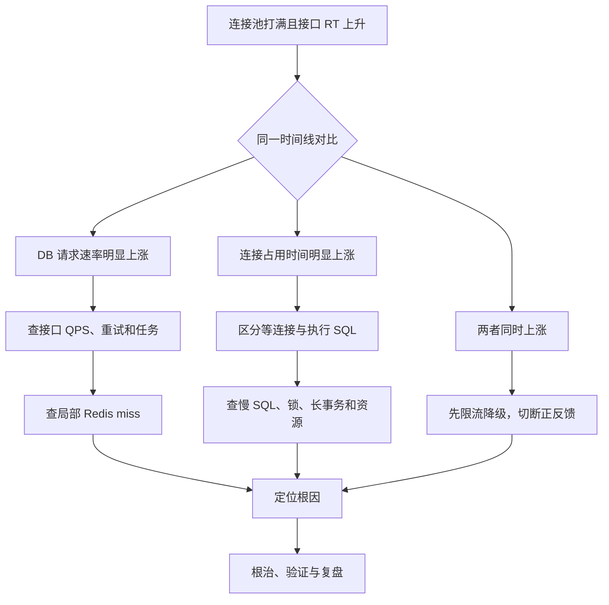

## 问题背景

典型题设是：业务流量开始上涨后，数据库连接池很快被打满，接口响应时间（RT）明显升高。系统使用 MySQL，前面可能还有 Redis；题目也可能补充“Redis 整体命中率看起来正常”。

这类问题的重点不是罗列工具，而是建立一条能够验证的因果链：

1. 先理解题目已经确认了什么。
2. 再提出少量、互斥度较高的根因假设。
3. 用同一故障时间线上的指标验证假设。
4. 定位后先止血，再根治。
5. 最后补齐监控与容量治理，避免复发。

本文默认题目已经明确：**数据库连接池打满，并且接口 RT 上升**。因此不再花大量时间重复证明连接池确实已满，而是直接回答它为什么会满、如何定位和处理。

---

## 可直接口述的完整回答

如果已经明确数据库连接池打满，同时接口 RT 飙升，我会直接追查为什么连接供不应求。我的核心判断是两类原因：

> 一类是 **申请连接的数据库请求变多了**，另一类是 **单个连接被占用的时间变长了**。

如果有监控，我会先锁定故障开始时间，把连接池、应用、MySQL 和 Redis 的指标放在同一时间线上看。连接池侧重点看正在使用的连接数、空闲连接数、最大连接数、等待连接的请求数、等待时长和获取连接超时；应用侧看各接口的 QPS、P95/P99 RT、错误率，并尽量把数据库调用拆成获取连接耗时和 SQL 执行耗时；MySQL 侧看 QPS、SQL 延迟、活跃线程、慢查询、锁等待、事务时长、CPU 和磁盘 IO；Redis 不能只看全局命中率，还要按接口、业务或 Key 类型看 miss 的绝对数量。

如果故障时 DB QPS 和某个接口 QPS 明显上涨，而 SQL 延迟基本稳定，我会优先判断为“请求进得太快”。然后沿着异常接口继续查：是不是突发真实流量、重试放大、定时任务或批处理同时启动，或者缓存未命中、热点 Key 失效、缓存穿透导致请求落到 MySQL。全局 Redis 命中率高不能排除缓存问题，因为一个高 QPS 接口即使只有少量比例的 miss，其绝对 miss 数也可能足以压垮数据库。

如果 DB QPS 没有明显增加，甚至下降，但 SQL RT、锁等待、事务时间或数据库 CPU/IO 明显上升，我会优先判断为“连接回得太慢”。这时检查当前执行语句、慢查询、执行计划、锁等待和长事务；同时检查应用有没有在持有事务或连接期间调用 RPC、HTTP，或者是否存在连接未关闭。这里还要区分数据库调用慢究竟是等连接慢，还是拿到连接后执行 SQL 慢，因为两者的处理方向完全不同。

如果监控不完善，我会手工拼证据。MySQL 可以通过两次采样 `Questions` 的差值估算请求速率，用 `SHOW FULL PROCESSLIST` 看当前语句的执行时间和状态，用 `Threads_running` 看正在执行的语句数，通过慢查询日志和 `performance_schema.data_lock_waits` 检查慢 SQL 与锁等待。应用流量可以从网关或 Nginx access log 按接口统计。Go 服务如果没有 pprof，还可以谨慎获取 goroutine dump，检查是否大量 goroutine 堵在 `database/sql` 的获取连接或查询路径上。

处理上我会坚持先止血、再根治。如果是请求量过大，先对异常入口限流、降级非核心功能、暂停异常任务、控制重试并提高有效缓存命中，尽快减少进入数据库的请求；如果是热点 Key 击穿，可用互斥重建或 `singleflight`，缓存穿透可用参数校验、空值缓存或 Bloom Filter，大量 Key 同时过期则给 TTL 加随机抖动。如果是慢 SQL、锁或长事务，就降级相关接口，给数据库操作设置合理超时，并在确认业务影响后处理异常语句或事务；长期再通过索引、SQL 改写、缩小扫描和锁定范围、缩短事务，以及资源扩容来解决。

我不会一看到连接池满就直接调大连接池。如果数据库 CPU、IO 和 SQL RT 已经恶化，扩大连接池只会让更多 SQL 同时进入数据库，进一步增加排队和资源争用，可能加速雪崩。只有确认数据库仍有余量、SQL 延迟稳定、连接池等待是主要瓶颈，并结合数据库最大连接数和所有应用实例的连接预算后，才会小步调整连接池并持续观察。

最后，故障恢复不代表结束。我会复盘故障时间线和变更，补齐连接池等待、获取连接耗时、SQL 延迟、锁等待，以及按接口拆分的缓存 miss 告警；再用压测和容量模型验证连接池、数据库及限流阈值。整条思路可以概括为：**先判断是请求进得太快，还是连接回得太慢；用监控或现场命令形成证据链；先降低数据库压力止血，再针对流量、缓存、SQL、事务或容量问题根治。**

---

## 思考与分析过程

### 1. 先尊重题设，避免重复证明

题目已经说连接池打满，就不应该把主要篇幅放在“如何确认连接池满”。面试官更关心的是：

- 为什么会满？
- 如何区分不同原因？
- 到哪里获取证据？
- 找到原因后如何处置？

但在真实线上，如果只知道“接口变慢或大量超时”，连接池只是候选原因之一。此时需要先拆开数据库调用的耗时：

```text
数据库调用总耗时 = 获取连接等待时间 + SQL 执行时间 + 结果读取与连接归还前的时间
```

例如：

```text
获取连接 1900ms + 执行 SQL 20ms  → 重点查连接池排队
获取连接 2ms    + 执行 SQL 1900ms → 重点查慢 SQL、锁和数据库资源
```

所以，“数据库调用慢”不等于“SQL 执行慢”。

### 2. 从连接池工作方式推导根因

连接池饱和可以用 Little's Law 的直觉关系理解：

```text
平均并发连接需求 ≈ DB 请求速率 × 平均连接占用时间
```

假设每秒有 1,000 次数据库操作，每次平均占用连接 20ms：

```text
1000 × 0.02s ≈ 20 个并发连接
```

若请求速率增加到 5,000 次/s，而占用时间不变：

```text
5000 × 0.02s ≈ 100 个并发连接
```

若请求速率仍为 1,000 次/s，但占用时间增加到 200ms：

```text
1000 × 0.2s ≈ 200 个并发连接
```

因此可以建立两个主假设：

- **请求进得太快**：业务流量、重试、任务或缓存 miss 使 DB 请求速率上涨。
- **连接回得太慢**：慢 SQL、锁、长事务、资源瓶颈、持有连接做外部调用或连接泄漏，使占用时间上涨。

这两类原因可能同时出现。例如流量上涨先推高数据库 CPU，SQL 随后变慢，又进一步拉长连接占用时间，形成正反馈。

### 3. 用指标组合验证，不看单个数字

单个指标通常不能完成归因。更可靠的方法是比较故障前后，并把多个信号放在同一时间线上。

| 观察到的组合 | 更可能的方向 | 下一步 |
| --- | --- | --- |
| DB QPS 明显上涨，SQL RT 稳定 | 请求进得太快 | 查接口 QPS、重试、任务、缓存 miss |
| DB QPS 稳定或下降，SQL RT 上涨 | 连接回得太慢 | 查慢 SQL、锁、事务、CPU/IO |
| 获取连接等待上涨，SQL RT 稳定 | 连接池容量不足或连接长期被占用 | 查池状态、事务范围、泄漏和容量预算 |
| 锁等待和事务时长上涨 | 长事务或锁竞争 | 找阻塞者、缩短事务、统一更新顺序 |
| DB CPU/IO 接近瓶颈，SQL RT 上涨 | 数据库资源饱和 | 先减压，再优化或扩容 |
| Redis 全局命中率稳定，但 DB QPS 上涨 | 仍可能是局部缓存问题 | 按接口、业务、Key 类型拆分 miss |
| 应用 QPS 未涨，但 DB QPS 上涨 | 单请求查询数增加或重试放大 | 查发布变更、N+1 查询、重试策略 |
| 连接池使用数持续不降，DB 活跃语句不多 | 事务持有过久或连接泄漏 | 查代码路径、事务、goroutine/线程栈 |

### 4. 为什么 Redis 全局命中率会误导

命中率是比例，但数据库承受的是 miss 的绝对数量。

```text
Redis 命中率 = hits / (hits + misses)
```

假设全局每秒 100,000 次缓存读取，命中率为 99%，仍然有 1,000 次 miss/s。如果这些 miss 都落到同一张热点表，就可能把数据库打满。因此要同时观察：

- miss/s 的绝对值；
- 按接口、业务和 Key 前缀拆分的命中率；
- miss 后是否一定访问数据库；
- 热点 Key 是否刚好失效；
- 是否发生大量 Key 同时过期。

### 5. 排查顺序由信息价值和止血速度决定

推荐先看全局时间线，快速判断主方向；再沿异常链路逐层缩小范围，而不是先钻进某条 SQL。



---

## 有监控时的排查路径

### 第一步：锁定故障时间线

先确认以下事件的先后顺序：

- 业务 QPS 何时变化；
- 连接池使用数和等待何时上升；
- SQL RT、锁等待、CPU/IO 何时变化；
- 是否与发布、配置变更、缓存过期或任务启动重合。

“谁先变化”常常比“谁的值最高”更有信息量。

### 第二步：看连接池

不同语言和连接池命名不同，但核心指标一致：

| 指标 | 含义 | 异常信号 |
| --- | --- | --- |
| In use / Active | 正在借出的连接 | 长期贴近最大值 |
| Idle | 空闲连接 | 长期为 0 |
| Max | 池上限 | 用于判断是否达到配置上限 |
| Wait count / Pending | 等待获取连接的请求 | 持续增加 |
| Wait duration | 获取连接累计或分位耗时 | 故障时明显上升 |
| Acquire timeout | 获取连接超时 | 与接口错误率同步上升 |

如果可以埋点，最好分别记录获取连接耗时、SQL 执行耗时和事务总耗时。

### 第三步：看应用与网关

至少按接口观察：

- QPS；
- P50、P95、P99 RT；
- 错误率与超时率；
- 单请求执行的 SQL 次数；
- 重试次数；
- 入站 QPS 与实际 DB QPS 的比例。

如果应用 QPS 没变，但 DB QPS 大幅上涨，要重点检查新发布是否引入 N+1 查询、重复查询或重试风暴。

### 第四步：看 MySQL

重点观察：

- Queries/s 或 Questions/s；
- SQL RT 和慢查询数量；
- `Threads_running` 与 `Threads_connected`；
- 行锁等待、死锁和长事务；
- CPU、磁盘延迟、IOPS、缓存命中和临时表；
- 主从延迟、连接数上限等环境约束。

### 第五步：看 Redis

不要停在全局 hit rate，要继续拆分：

- 哪个接口的 miss/s 上涨；
- 哪类 Key 的 miss/s 上涨；
- 是否有热点 Key 刚好过期；
- 是否有批量 Key 同时过期；
- 是否因 Redis 超时而回源数据库；
- 回源失败后是否发生无上限重试。

---

## 没有完善监控时的现场命令

以下命令用于快速收集证据。生产环境执行前应确认权限和影响，输出中也可能包含 SQL 参数或业务数据，需要按安全规范处理。

### 1. 估算 MySQL 请求速率

`Questions` 是累计计数，需要间隔采样，再用差值除以时间：

```sql
SHOW GLOBAL STATUS LIKE 'Questions';
-- 间隔 10 秒后再次执行
SHOW GLOBAL STATUS LIKE 'Questions';
```

计算方法：

```text
Questions/s = (第二次值 - 第一次值) / 采样间隔秒数
```

`Questions` 主要统计客户端发给服务器的语句；`Queries` 的口径更宽，还包括存储程序内部执行的语句。比较故障前后时必须使用同一口径。

也可以观察各类语句的累计计数：

```sql
SHOW GLOBAL STATUS LIKE 'Com_select';
SHOW GLOBAL STATUS LIKE 'Com_insert';
SHOW GLOBAL STATUS LIKE 'Com_update';
SHOW GLOBAL STATUS LIKE 'Com_delete';
```

### 2. 查看当前连接和活跃语句

```sql
SHOW GLOBAL STATUS WHERE Variable_name IN (
  'Threads_connected',
  'Threads_running',
  'Threads_created',
  'Aborted_connects'
);

SHOW FULL PROCESSLIST;
```

看 `SHOW FULL PROCESSLIST` 时重点关注：

- `Time`：当前状态持续了多久；
- `State`：正在执行、等待锁，还是其他状态；
- `Info`：正在执行的 SQL；
- 是否有大量相似 SQL；
- 是否有连接长时间处于事务相关状态。

需要注意，`Sleep` 连接不一定是故障，它可能只是连接池中的空闲连接；应结合连接池指标、事务状态和持续时间判断。

### 3. 检查慢查询配置与日志位置

```sql
SHOW VARIABLES WHERE Variable_name IN (
  'slow_query_log',
  'slow_query_log_file',
  'long_query_time'
);
```

如果慢查询日志已经开启，再按返回路径查看。不要为了现场排障直接在高负载数据库上贸然开启高开销的全量日志。

对已定位的 SQL，可在测试环境或谨慎评估后查看执行计划：

```sql
EXPLAIN FORMAT=TREE
SELECT ...;
```

重点关注访问类型、实际可用索引、估算扫描行数、排序、临时表，以及过滤条件是否有效。若要使用 `EXPLAIN ANALYZE`，需注意它会实际执行语句，不应对高风险写操作或重查询随意使用。

### 4. 检查锁等待和长事务

MySQL 8.0 可先查看锁等待关系：

```sql
SELECT *
FROM performance_schema.data_lock_waits;
```

查看当前 InnoDB 事务：

```sql
SELECT
  trx_id,
  trx_state,
  trx_started,
  trx_wait_started,
  trx_mysql_thread_id,
  trx_query
FROM information_schema.innodb_trx
ORDER BY trx_started;
```

还可以查看 InnoDB 状态中的最新死锁和事务信息：

```sql
SHOW ENGINE INNODB STATUS;
```

终止会话或事务属于有业务风险的操作。必须先识别阻塞者与受害者、评估回滚成本，并确认业务影响，不能只因为执行时间长就直接处理。

### 5. 从 Nginx access log 找异常接口

以下示例假设 URI 位于日志第 7 列，并去掉查询参数。实际字段位置取决于 `log_format`：

```bash
awk '{uri=$7; sub(/\?.*/, "", uri); count[uri]++} END {
  for (uri in count) print count[uri], uri
}' /var/log/nginx/access.log | sort -nr | head -20
```

如果要分析某个故障时间窗口，应先按日志时间筛选，否则全量历史统计可能掩盖瞬时峰值。还要分别统计状态码、上游耗时和来源，判断是否存在客户端重试或单一流量源。

### 6. Go 服务的应用侧证据

如果代码已经暴露 `database/sql` 的统计信息，可以周期性采集：

```go
stats := db.Stats()

log.Printf(
	"db_pool open=%d in_use=%d idle=%d wait_count=%d wait_duration=%s max_open=%d max_idle_closed=%d max_lifetime_closed=%d",
	stats.OpenConnections,
	stats.InUse,
	stats.Idle,
	stats.WaitCount,
	stats.WaitDuration,
	stats.MaxOpenConnections,
	stats.MaxIdleClosed,
	stats.MaxLifetimeClosed,
)
```

其中 `WaitCount` 和 `WaitDuration` 是进程生命周期累计值，监控中更应观察单位时间增量和获取连接耗时分布，而不是只看累计总数。

连接池配置示例：

```go
db.SetMaxOpenConns(50)
db.SetMaxIdleConns(20)
db.SetConnMaxLifetime(30 * time.Minute)
db.SetConnMaxIdleTime(5 * time.Minute)
```

这些数字只是示例，不能直接照抄。配置时要考虑数据库容量、应用实例数、后台任务和管理连接，例如：

```text
所有应用实例的 MaxOpenConns 总和
+ 后台任务连接
+ 运维与迁移预留
<= 数据库可安全承载的连接预算
```

如果没有监控和 pprof，可以谨慎获取 Go 进程的 goroutine dump：

```bash
kill -QUIT <pid>
```

随后在进程标准错误或容器日志中搜索：

```text
database/sql
(*DB).conn
QueryContext
ExecContext
```

`SIGQUIT` 会产生大量堆栈日志，具体运行方式还可能影响进程行为。应先确认容器编排、日志容量和线上操作规范，不要重复执行。堆栈只能提供“很多 goroutine 正在等待哪里”的现场快照，最好与 MySQL 和日志证据交叉验证。

---

## 定位后的处理方法

### 场景一：请求进得太快

#### 应急止血

- 对异常接口或租户限流，优先保护核心链路。
- 降级非核心功能，返回缓存数据、静态数据或明确的稍后重试响应。
- 暂停异常定时任务、批处理或数据回填。
- 设置有限次数、带指数退避和随机抖动的重试，避免重试风暴。
- 对热点读取进行请求合并，减少相同数据的并发回源。
- 必要时按用户、设备、IP 或业务维度阻断异常流量。

#### 长期根治

| 根因 | 处理方向 |
| --- | --- |
| 缓存穿透 | 参数校验、空值缓存、Bloom Filter、防恶意枚举 |
| 热点 Key 击穿 | 互斥重建、`singleflight`、逻辑过期、热点预热 |
| 大量 Key 同时过期 | TTL 随机抖动、分批预热、分散刷新 |
| N+1 查询 | 批量查询、预加载、重构数据访问层 |
| 重试放大 | 限制次数、退避与抖动、熔断、全链路重试预算 |
| 合法业务增长 | 缓存、读写分离、分片或扩容，并重新做容量规划 |

### 场景二：连接回得太慢

#### 应急止血

- 对依赖异常 SQL 的接口限流或降级。
- 给获取连接、SQL 和事务设置分层超时，避免无限等待。
- 在确认安全后处理异常阻塞事务或语句。
- 暂停制造锁竞争或大查询的后台任务。
- 数据库资源饱和时先减少流量，避免通过扩大连接池继续加压。

#### 长期根治

- 用执行计划和真实数据分布优化索引及 SQL。
- 减少全表扫描、无界查询、过大结果集和不必要排序。
- 缩短事务范围，不在事务中调用 RPC、HTTP 或执行长时间业务计算。
- 统一多表或多行更新顺序，减少死锁。
- 确保 `rows.Close()`、事务提交或回滚等资源释放路径完整。
- 用代码审查、泄漏测试和连接池指标发现连接未归还。
- 根据瓶颈选择纵向扩容、只读副本、分库分表或数据模型调整。

### 什么时候可以调大连接池

调大连接池应同时满足大部分条件：

- 数据库 CPU、IO 和内存仍有稳定余量；
- SQL RT 和锁等待没有明显恶化；
- 数据库可承受更多并发，而不是已经排队；
- 应用确实大量等待连接；
- 已排除慢 SQL、长事务和连接泄漏；
- 所有应用实例的连接总预算不会突破数据库安全上限；
- 有压测结果，并能小步调整、观察和回滚。

反例是：数据库 CPU 已达 95%，SQL RT 已从 20ms 上升到 1s，此时把每个实例的连接池从 50 调到 200，可能让更多查询同时竞争 CPU、IO 和锁，使 SQL 更慢、连接占用更久，最终加剧雪崩。

---

## 容易遗漏的检查项

### 连接泄漏

如果连接池长期满，但数据库活跃查询并不多，需要检查是否存在资源未释放：

- 查询结果集未关闭；
- 事务既未提交也未回滚；
- 异常分支提前返回，漏掉清理逻辑；
- 流式读取结果过慢，长时间占用连接；
- 连接池指标统计的是“借出”，但业务代码迟迟不归还。

### 事务中包含外部调用

下面的调用链会无谓延长连接或事务占用：

```text
开启事务 → 更新数据库 → 调用外部 RPC 2 秒 → 提交事务
```

即使 SQL 只执行 20ms，连接和锁也可能被持有 2 秒以上。应尽量调整边界，用本地事务完成必要的数据库操作，再通过 Outbox、消息或补偿机制协调外部系统。

### 超时设置不合理

只设置接口总超时不够。应让下游超时逐层收紧，并确保数据库操作收到请求取消信号：

```text
接口总超时 > 获取连接超时 + SQL 超时 + 必要的业务处理时间
```

超时只能阻止无限堆积，不能替代容量治理；过度重试还会把超时演变成流量放大。

### 变更与周期性事件

一定要对齐故障时间，检查：

- 新版本、SQL 或配置是否刚发布；
- 索引或统计信息是否变化；
- 定时任务、报表、备份或数据迁移是否启动；
- 热点缓存是否在同一时间过期；
- 上游是否调整了超时和重试；
- 数据量是否越过执行计划或索引效率的拐点。

---

## 故障恢复后的验证与复盘

### 恢复验证

不能只看连接池不满了，还应确认：

- 接口 P95/P99 RT 和错误率恢复；
- 获取连接等待与超时恢复；
- DB QPS 回到预期范围；
- SQL RT、锁等待和长事务恢复；
- CPU、IO 和复制延迟稳定；
- 限流或降级没有造成不可接受的业务损失；
- 没有因集中重试或流量回放出现二次峰值。

### 复盘产出

- 一条精确到分钟或秒的故障时间线；
- 根因、诱因和放大因素的区分；
- 止血动作的效果与副作用；
- 连接池、数据库、缓存和接口的容量基线；
- 需要补齐的指标、日志、链路追踪和告警；
- 可演练、可回滚的应急预案。

建议至少补齐以下告警：

- 连接池使用率持续超过阈值；
- 获取连接等待速率或 P99 明显上涨；
- 获取连接超时；
- SQL P99、慢查询和锁等待上涨；
- 长事务超过阈值；
- 按接口拆分的 DB 调用次数和缓存 miss/s 异常；
- 数据库 CPU、磁盘延迟与复制延迟异常。

---

## 面试中的追问与简答

### 为什么不先证明连接池满了？

因为题目已经把它作为已知条件。此时应该直接追问为什么满；只有真实线上尚未确认根因时，才先用连接池指标、获取连接耗时和线程栈确认。

### 为什么不能只看 Redis 全局命中率？

因为全局比例会掩盖局部异常，而且数据库压力取决于 miss 的绝对数量。需要按接口、业务、Key 类型看 miss/s，并确认 miss 是否回源数据库。

### DB QPS 上涨就一定是流量上涨吗？

不一定。也可能是一次请求执行更多 SQL、N+1 查询、重试放大或后台任务启动，所以还要对比应用 QPS 与单请求 DB 调用次数。

### DB QPS 没上涨就一定是慢 SQL 吗？

不一定。可能是锁等待、长事务、数据库资源瓶颈、网络异常、连接泄漏，或者连接池容量本身配置过小。需要继续拆分获取连接耗时和 SQL 执行耗时。

### 为什么扩大连接池可能更糟？

连接池是并发闸门，不是数据库算力。数据库已经饱和时，放入更多并发只会加剧 CPU、IO、锁和调度竞争，让每条 SQL 更慢。

### 一句话怎么总结？

连接池打满后，先判断是数据库请求进得太快，还是连接回得太慢；前者沿 DB QPS、接口 QPS、重试与缓存排查，后者沿获取连接耗时、SQL RT、锁、长事务和数据库资源排查；处理时先限流降级止血，再针对流量、缓存、SQL、事务或容量根治，不能把调大连接池当作默认答案。

