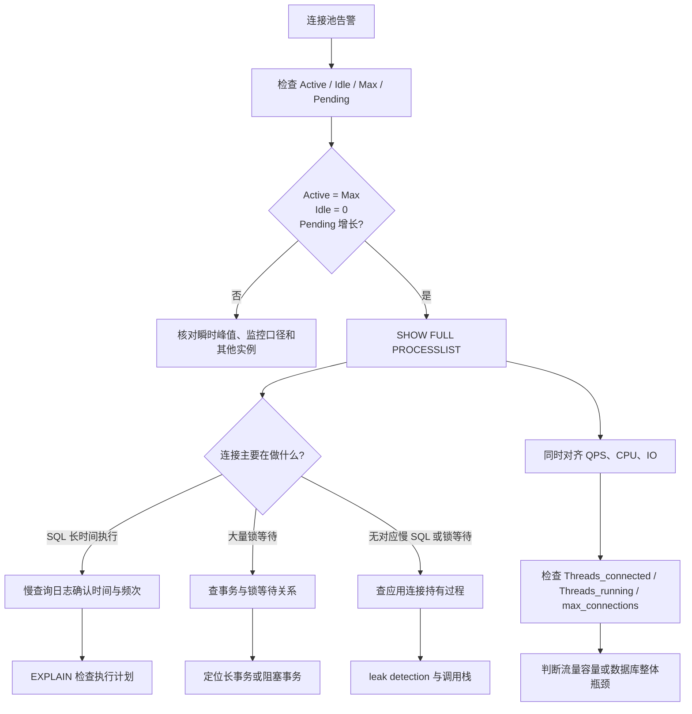

## 一、面试口述版

线上数据库连接池耗尽时，我会先看应用侧连接池的 `Active`、`Idle`、`Max` 和 `Pending`。如果 `Active = Max`、`Idle = 0`，同时 `Pending` 持续增加，就能确认连接确实已经全部借出，新请求正在等待连接。

确认以后，核心问题就变成：这些借出去的连接现在在做什么？如果是 MySQL，我会执行：

```sql
SHOW FULL PROCESSLIST;
```

它可以看到当前连接正在执行的 SQL、持续时间和状态。根据这里看到的现象继续分流：

- 如果大量连接都在执行耗时很长的 SQL，我会结合故障时间段的慢查询日志确认主要慢 SQL，再用 `EXPLAIN` 检查执行计划，判断是否存在索引未命中、扫描数据过多或执行计划异常。
- 如果大量连接处于锁等待状态，我会继续查看 `information_schema.innodb_trx` 以及锁等待关系，找到长时间未提交的事务和真正的阻塞源，判断是长事务、锁竞争，还是事务中夹杂了耗时的远程调用。
- 如果应用侧 `Active` 很高，但数据库侧没有对应的大量慢 SQL 或锁等待，我会转向应用侧，怀疑连接被业务代码长期持有或发生连接泄漏。此时会开启连接池的 leak detection，结合连接借出时的调用栈，定位连接在哪条代码路径上迟迟没有归还。

同时，我会把故障时间点的业务 QPS、数据库 CPU 和 IO，以及 MySQL 的 `Threads_connected`、`Threads_running`、`max_connections` 对齐起来。如果 QPS 明显上涨、单次 SQL 耗时基本正常，而所需并发连接数超过了池容量，更像是流量或容量问题；如果数据库 CPU、IO 已经饱和，或者总连接数逼近 `max_connections`，则说明连接归还慢可能是数据库整体瓶颈造成的。

因此，完整思路不是先猜某个原因，而是：**先确认连接是否真的全部借出，再观察这些连接正在做什么，最后根据现象把问题收敛到慢 SQL、锁等待或长事务、应用持有或泄漏、流量容量，或者数据库整体瓶颈。**

## 二、这套排查思路是怎么形成的？

### 1. 先回到最基本的运行模型

连接池不是一个抽象的“数据库指标”，它只是一组由应用复用的数据库连接。一次典型访问只有四步：

```text
请求到达 → 从池中拿连接 → 执行 SQL 或事务 → 归还连接
```

只要归还速度能跟上借出速度，连接就会不断被复用，池不会耗尽。反过来，连接池耗尽表达的是一个很具体的事实：

> 在某个时间窗口内，连接被借出的速度超过了归还的速度，空闲连接最终降到了 0。

这可能由两类变化造成：

1. **需求变多了**：QPS 或并发请求突然上涨，单位时间需要的连接更多。
2. **连接回来得更慢了**：SQL 变慢、等待锁、事务拉长，或者应用拿到连接后长期不归还。

所以，听到“连接池满”以后，第一个问题不该是“是不是慢 SQL”，而应当是：

> **连接是否真的全部借出了？如果是，它们现在在做什么？**

后面的所有动作，都是从这个问题自然推出来的。

### 2. 为什么先看应用连接池，而不是先进入 MySQL？

报警描述的是“应用连接池耗尽”，因此先要在问题发生的地方验证事实。

| 指标 | 直观含义 | 在排查中回答的问题 |
| --- | --- | --- |
| `Active` | 已经借给业务、尚未归还的连接数 | 当前有多少连接被占用？ |
| `Idle` | 池中可立即借出的空闲连接数 | 是否还有可用连接？ |
| `Max` | 这个连接池允许创建的连接上限 | `Active` 是否已经触顶？ |
| `Pending` | 正在等待获取连接的请求数 | 连接不足是否已经让请求排队？ |

典型证据组合是：

```text
Active = Max
Idle = 0
Pending 持续增加
获取连接超时增多
```

单看 `Active` 较高还不够，因为它可能只是短暂峰值；四个信号合在一起，才能说明“连接全部借出，而且业务已经在排队”。

完成这一步以后，我们只知道 **池为什么不能再借**，还不知道 **借出的连接为何没有回来**。因此下一步必须沿着连接去数据库侧观察。

### 3. 为什么下一步是 SHOW FULL PROCESSLIST？

应用连接池告诉我们“连接被占了多少”，但不告诉我们连接在数据库中做什么。`SHOW FULL PROCESSLIST` 正好补上这块信息：它给出 MySQL 当前会话的来源、状态、持续时间和正在执行的完整 SQL。

```sql
SHOW FULL PROCESSLIST;
```

排查时不需要逐行研究全部会话，先回答三个问题即可：

1. 是否有一批会话长时间执行同一类 SQL？
2. 是否有一批会话处于锁等待状态？
3. 应用声称大量连接处于 `Active`，数据库侧是否能看到相应的活动或等待？

这三个观察会自然形成三条分支，而不是靠背诵原因列表来选择方向。



注意，图中的分支并非互斥。例如，流量上涨可能放大原本不明显的慢 SQL，数据库 IO 饱和也会让大量普通 SQL 一起变慢。分流的作用是确定 **主要矛盾和验证顺序**，不是过早宣布唯一根因。

## 三、按照“动作 → 现象 → 判断”逐步收敛

### 分支一：大量 SQL 长时间执行

**动作 1：** 在 `SHOW FULL PROCESSLIST` 中查看 `Time`、`State` 和 `Info`，观察是否有大量会话执行时间明显超过业务基线，以及是否集中在相同 SQL 模式。

**观察：** 例如，大量本应几十毫秒完成的查询已经运行数秒，并且集中在同一类 `SELECT`。

**初步判断：** 连接没有及时归还，是因为 SQL 执行阶段变长。此时只能得出“慢 SQL 是主要嫌疑”，还需要继续验证慢在哪里。

**动作 2：** 查看故障时间段的 slow query log，确认哪些 SQL 的耗时、扫描行数或出现次数异常。

慢查询日志的价值不只是记录“慢”，还可以把瞬时现场扩展为一段时间内的历史证据，避免只凭某一次 `PROCESSLIST` 快照下结论。

**动作 3：** 对确认的 SQL 使用 `EXPLAIN` 查看执行计划。

```sql
EXPLAIN SELECT ...;
```

这里重点理解它回答的问题：MySQL 准备怎样访问表、是否使用合适索引、预计扫描多少行。若发现大范围扫描、未使用预期索引或访问行数异常，就形成了较完整的证据链：

```text
Active 达到 Max
→ PROCESSLIST 中大量 SQL 长时间执行
→ 慢查询日志确认故障时段耗时或频次异常
→ EXPLAIN 显示访问路径异常
→ SQL 持有连接时间变长
→ 连接池耗尽
```

如果执行计划正常，则继续看数据库 CPU、IO、存储延迟和数据量变化；“SQL 运行久”也可能是数据库整体变慢的结果，而不一定是 SQL 写法本身有问题。

### 分支二：大量连接等待锁

**动作 1：** 在 `PROCESSLIST` 中发现大量会话处于锁等待或元数据锁等待状态。

**观察：** 这些会话可能并不消耗很多 CPU，却长时间不能结束。它们虽然“没有真正干活”，仍然占着各自的连接。

**初步判断：** 问题的重点从“SQL 为什么计算得慢”变成“这些会话被谁挡住了”。

**动作 2：** 查看当前 InnoDB 事务：

```sql
SELECT *
FROM information_schema.innodb_trx;
```

`innodb_trx` 用于观察当前事务何时开始、处于什么状态、正在执行什么。若业务事务通常只需几十毫秒，却出现持续数分钟的事务，它就是重要嫌疑对象。

**动作 3：** 再结合 MySQL 版本对应的 Performance Schema 或 `sys` 库锁等待视图，找出“谁在等谁”。这一步不是只找等待者，而是沿等待关系找到最上游的阻塞事务。

由此得到证据链：

```text
大量会话等待锁
→ 锁等待关系集中指向同一个阻塞事务
→ 该事务长时间未提交
→ 后续事务和连接排队
→ 连接池被逐步占满
```

定位到事务对应的服务和代码后，再检查事务边界：是否一次处理过多数据，是否忘记提交或回滚，是否把 RPC、HTTP 调用或复杂计算放进了事务中。

### 分支三：应用 Active 很高，但数据库没有对应的慢 SQL 或锁等待

这个现象说明：连接可能已经被应用借出，但当前并没有在数据库中执行耗时 SQL。调查方向因此回到 **连接借出到归还之间的应用代码**。

**动作 1：** 查看连接池是否支持 leak detection，并在合适阈值下记录“连接借出过久”的调用栈。以 HikariCP 为例，其作用可以概括为：连接借出超过阈值仍未归还时，记录当初从哪里取得了连接。

**观察：** 多次告警指向相同的 Repository、Service 或异常路径，且连接持有时间明显超过正常请求耗时。

**动作 2：** 顺着调用栈检查连接或事务生命周期：是否所有正常、异常、提前返回和超时路径都会关闭连接或结束事务；是否在持有连接期间等待远程服务、锁、线程池或业务计算。

只有当“长时间借出”的调用栈和代码路径能够证明连接没有正常归还时，才应确认连接泄漏：

```text
应用 Active 长期不降
→ 数据库无对应慢 SQL 或锁等待
→ leak detection 持续指向相同调用路径
→ 代码路径未可靠 close / commit / rollback
→ 连接泄漏成立
```

这里要避免一个误区：**数据库当下没有正在执行的 SQL，不等于已经证明连接泄漏。** 应用也可能在事务中做远程调用或业务计算，导致连接只是暂时空闲但仍被持有。两者都需要修正连接持有范围，但只有没有被可靠归还的情况才叫泄漏。

### 分支四：验证流量、容量和数据库整体瓶颈

这条线应与前面三条并行观察，因为流量和资源变化常常是诱因或放大器。

#### 用 QPS 和连接持有时间理解容量

在系统相对稳定时，可以用一个粗略关系建立直觉：

```text
平均并发连接需求 ≈ QPS × 每次请求持有连接的平均时间
```

例如，`1000 QPS × 0.1 秒 ≈ 100` 个并发连接。如果连接池 `Max = 50`，即使 SQL 没有异常，也可能开始排队。

因此，若观察到 QPS 明显上涨，而 SQL 耗时、锁等待和数据库资源都基本正常，可以倾向于流量超过现有池容量。反过来，如果 QPS 没变，但 SQL 耗时从 `20 ms` 上涨到 `2 s`，并发连接需求也会放大约 `100` 倍，根因显然不是单纯的连接池太小。

#### 用数据库指标区分“应用池满”和“数据库也满”

```sql
SHOW STATUS LIKE 'Threads_connected';
SHOW STATUS LIKE 'Threads_running';
SHOW VARIABLES LIKE 'max_connections';
```

| 指标 | 直观含义 | 如何帮助判断 |
| --- | --- | --- |
| `Threads_connected` | 当前连接到 MySQL 的客户端连接总数，包括空闲连接 | 接近 `max_connections` 时，数据库总连接容量已经危险 |
| `Threads_running` | 当前正在执行、而不是休眠的线程数 | 持续很高通常说明数据库并发工作压力大，需要结合 CPU、IO 和慢 SQL 看 |
| `max_connections` | MySQL 允许的最大客户端连接数 | 用于判断限制来自单个应用池，还是数据库全局连接上限 |

判断时还要对齐数据库 CPU、IO 和 SQL 延迟：

- `Threads_connected` 接近 `max_connections`：可能是多个服务合计把数据库总连接数耗尽。
- `Threads_running`、CPU 或 IO 持续很高，SQL 普遍变慢：更像数据库整体吞吐达到瓶颈。
- 应用池已满，但数据库总连接和资源仍有余量，且 QPS 上涨、SQL 延迟正常：更像单个应用的容量配置或流量模型不匹配。

## 四、看到什么，下一步查什么

| 当前看到的现象 | 它说明了什么 | 下一步动作 | 期望确认的结论 |
| --- | --- | --- | --- |
| `Active = Max`、`Idle = 0`、`Pending` 增长 | 连接全部借出，请求正在排队 | 执行 `SHOW FULL PROCESSLIST` | 借出的连接在执行、等待还是被应用持有 |
| 大量相同 SQL 执行时间很长 | SQL 阶段拉长了连接持有时间 | 查慢查询日志，再用 `EXPLAIN` | SQL 本身、执行计划或数据库资源是否异常 |
| 大量会话处于锁等待 | 连接被阻塞而不能归还 | 查 `innodb_trx` 和锁等待关系 | 找到长事务及最上游阻塞事务 |
| 应用 `Active` 很高，数据库无对应忙会话 | 连接可能在应用侧被长期持有 | 查 leak detection、调用栈和事务边界 | 是泄漏，还是事务内的远程调用或计算 |
| QPS 暴涨，SQL 延迟和数据库资源正常 | 单位时间的连接需求变大 | 估算并发连接需求，核对池容量 | 流量或容量是否不匹配 |
| CPU、IO、`Threads_running` 同时升高 | 数据库整体处理能力可能到达瓶颈 | 找主要负载 SQL，检查数据库资源 | 数据库资源瓶颈是否让连接普遍归还变慢 |
| `Threads_connected` 接近 `max_connections` | 数据库全局连接容量接近上限 | 按来源核对各服务连接数 | 是否由多个连接池共同耗尽数据库连接 |

## 五、从排查结论回到处理动作

排查的终点不是给问题贴标签，而是让处理动作与证据对应：

- 慢 SQL：优化访问路径、索引或查询范围，并验证执行时间和扫描量确实下降。
- 长事务或锁阻塞：先评估影响后处理阻塞事务，再缩短事务边界，避免事务中包含远程调用或长时间计算。
- 连接泄漏：保证所有代码路径都可靠释放连接，优先使用语言或框架提供的自动关闭机制，并用 leak detection 验证不再出现超时持有。
- 流量超过容量：先限流、降级或扩容应用实例，再根据数据库承载能力调整连接池；不能只把每个实例的 `Max` 同时调大。
- 数据库整体瓶颈：降低高开销负载、优化数据库资源或架构，并控制各服务的连接总预算。

线上止血时也不要把“增大连接池”当作默认答案。连接池变大只会让更多请求同时进入数据库；如果根因是慢 SQL、锁等待或数据库已经饱和，它可能把数据库压得更重。正确顺序仍然是：先识别连接为什么不回来，再决定扩容、限流、终止阻塞事务或修复代码。

## 六、最后记住这条推导主线

这道题真正值得记住的不是一组 MySQL 命令，而是问题如何一步步改变：

```text
连接池耗尽
→ 连接是否真的全部借出？
→ 借出的连接现在在做什么？
→ 是 SQL 执行、锁等待，还是应用侧长期持有？
→ QPS 和数据库资源是否改变了需求或处理能力？
→ 用下一项证据验证，而不是凭常见原因猜测
```

每执行一个动作，都应该能说清它要回答哪个问题；每看到一个现象，都应该能解释为什么由此进入下一条分支。这就是“动作 → 现象 → 判断 → 再验证”的故障定位思维。
