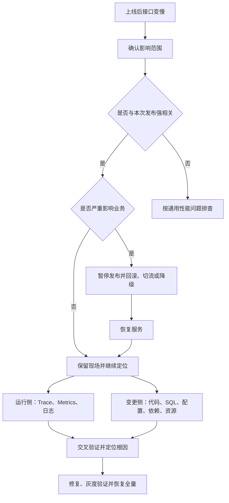

## 一、面试口述回答

如果服务上线后接口突然变慢，我会先确认影响范围：是个别接口还是整个服务，是所有请求还是部分请求，是所有 Pod 都慢还是只有部分 Pod 异常。

接下来要利用“刚刚上线”这个关键线索，把接口响应时间的变化与发布时间对齐。如果处于灰度或滚动发布阶段，还可以直接比较新旧版本：如果旧版本正常、新版本明显变慢，就可以优先判断问题与本次发布有关；如果新旧版本都慢，则需要考虑流量、数据库、网络或公共依赖等外部因素。

如果故障已经严重影响业务，并且满足安全回滚条件，我会先暂停发布，通过回滚、切回旧版本或关闭相关功能快速恢复服务，再继续分析根因。线上故障处理的优先级是先止损，再定位。

具体排查时，我会同时推进两条线：

- 通过 Trace、Metrics 和日志确认时间消耗在哪个环节，例如当前服务、数据库、Redis 或下游 RPC。
- 对照本次发布内容，检查代码逻辑、SQL、配置、依赖版本、连接池、超时重试策略以及 Pod 资源配置等变化。

最后将运行时现象与发布变更交叉验证。例如，Trace 显示数据库调用从 30 ms 上升到 800 ms，而本次发布正好修改了一条核心 SQL，那么就应优先检查这条 SQL 的执行计划、索引使用情况和返回数据量。

修复后还需要通过灰度放量观察响应时间、错误率和资源使用情况，确认指标恢复且没有引入新的问题，再逐步恢复全量流量。

整体思路可以概括为：**先定界，判断是否与发布相关；影响严重时先止损；再从运行现象和发布变更两侧收集证据，交叉验证根因，修复后通过灰度确认效果。**

---

## 二、抓住“上线后”这个关键线索

这道题与普通的“接口突然变慢”类似，但多了一个重要前提：问题发生在一次明确的发布之后。

因此，除了按照调用链逐层排查，还可以利用两组对比快速缩小范围：

- 上线前与上线后；
- 旧版本与新版本。

需要注意的是，时间上的先后关系只能说明两者可能相关，不能直接证明本次发布就是根因。

> “上线后发生”是强线索，但不是最终结论。

---

## 三、第一步：确认影响范围

不要一开始就埋头检查代码。首先需要回答以下问题：

- 哪些接口变慢：个别接口、某类接口，还是全部接口？
- 哪些请求变慢：所有请求、部分请求，还是只有长尾请求？
- 哪些实例异常：所有 Pod、部分 Pod，还是某个 Node 上的 Pod？
- 哪些用户受影响：全部用户，还是特定租户、地域或流量入口？
- 问题何时开始：是否与发布、流量上涨或依赖异常的时间重合？
- 伴随哪些现象：错误率是否升高，吞吐量是否下降，是否出现超时和重试？

观察响应时间时，不要只看平均值，还应关注 P95、P99 等分位值。平均响应时间正常，并不代表没有少量请求出现严重延迟。

这一步的目标是确定问题的边界，为后续排查选择正确方向。

---

## 四、第二步：验证问题是否与本次发布有关

判断发布与性能问题是否相关，主要依靠时间和版本两个维度。

### 1. 对齐时间线

将以下事件放到同一条时间线上：

- 发布开始和结束时间；
- 接口响应时间上涨时间；
- 流量、错误率和资源使用率的变化时间；
- 数据库、Redis、下游服务等依赖的告警时间。

如果接口耗时在新版本开始承接流量后立即上升，而其他条件没有明显变化，本次发布的嫌疑就比较大。

### 2. 比较新旧版本

如果新旧版本同时运行，可以在流量条件相近的情况下比较两者：

- 旧版本正常，新版本变慢：优先检查本次发布。
- 新旧版本都变慢：优先检查公共依赖、流量、网络和基础设施。
- 只有部分新版本 Pod 变慢：检查实例差异、Node 状态、配置下发和资源限制。
- 随着新版本流量占比增加，整体耗时同步上升：进一步支持发布相关的判断。

比较时需要尽量控制变量。不同版本承接的流量类型、请求参数或用户群体不同，也可能造成耗时差异。

---

## 五、第三步：影响严重时先止损

线上故障处理不仅要回答“为什么变慢”，还要判断“怎样最快恢复服务”。

如果能够确认新版本异常、旧版本正常，并且问题已经严重影响业务，可以优先采取以下措施：

1. 暂停继续发布，避免扩大影响范围。
2. 将流量切回旧版本，或者关闭引发问题的新功能。
3. 在满足安全条件时执行版本回滚。
4. 必要时结合扩容、限流或降级缓解系统压力。
5. 服务恢复后保留必要的日志、监控和 Trace 数据，继续分析根因。

回滚并不总是安全的。如果发布涉及数据库结构、数据格式、消息协议或不可逆的数据迁移，需要先确认旧版本仍然兼容。无法直接回滚时，可以选择切流、功能开关、降级或热修复等风险更低的方案。

核心原则是：**优先恢复业务，但止损动作本身也必须可控。**

---

## 六、第四步：从运行现象和发布变更两侧定位

确认问题可能与发布相关后，不建议直接浏览全部代码变更。更高效的方式是同时推进两条排查路径。

运行侧负责回答“时间花在哪里”，变更侧负责回答“上线改变了什么”。两侧证据能够对应时，才更接近真正的根因。

### 1. 从运行现象判断哪里慢

先使用 Trace 拆解完整调用链，判断延迟发生在哪个阶段，再结合监控和日志继续下钻。

| 慢点 | 重点检查内容 |
| --- | --- |
| 网关或负载均衡 | 排队时间、连接数、超时配置、路由是否异常 |
| 当前服务 | CPU、内存、GC、锁竞争、线程池、队列和同步阻塞 |
| 数据库 | 慢 SQL、执行计划、索引、锁等待、连接池和返回数据量 |
| Redis | 命令耗时、热 Key、大 Key、连接池和网络延迟 |
| 下游 RPC | 下游响应时间、超时、重试、熔断和连接复用 |
| Pod 或 Node | CPU throttling、资源限制、节点负载和网络异常 |

例如，Trace 显示下游调用耗时正常，但当前服务内部出现了长时间空白，就应重点检查线程池排队、锁竞争、GC、同步 I/O 或 CPU 饱和等问题。

这一阶段的目标不是立刻找出某一行代码，而是先将问题缩小到具体组件和环节。

### 2. 从发布内容判断哪里变了

发布变更不只是业务代码，还应检查以下内容：

- 业务逻辑是否增加了循环、排序、序列化或同步调用；
- 是否新增了数据库查询，或者出现 N+1 查询；
- SQL、索引、查询条件和返回字段是否发生变化；
- 缓存 Key、过期策略或缓存访问方式是否改变；
- 是否新增或调整了下游 RPC；
- 连接池、线程池、超时和重试参数是否改变；
- SDK、框架或运行时版本是否升级；
- 日志级别和日志量是否显著增加；
- CPU、内存、副本数等资源配置是否改变；
- 配置中心、环境变量和功能开关是否正确下发。

> 上线变更不等于代码变更。配置、依赖和运行环境同样可能引发性能问题。

---

## 七、第五步：交叉验证并定位根因

这是整个排查过程最关键的一步。

假设运行侧观察到：

- 数据库调用从 30 ms 上升到 800 ms；
- 数据库连接池等待时间明显增加；
- 其他下游调用没有异常。

同时，发布记录显示：

- 本次版本修改了一条核心 SQL；
- 单次请求的数据库查询次数也有所增加。

这时就可以优先检查：

- SQL 是否使用了正确索引；
- 执行计划是否发生变化；
- 是否出现全表扫描或大范围排序；
- 返回数据量是否意外增大；
- 是否出现 N+1 查询；
- 连接是否长期占用，导致连接池排队。

修复后还需要用相同流量模型进行验证。不能仅因为代码看起来合理，或者一次请求恢复正常，就认为问题已经解决。

一个有效的验证闭环应当包括：

1. 在测试环境或压测环境复现问题。
2. 应用修复并比较修复前后的关键指标。
3. 灰度发布少量实例。
4. 观察响应时间、错误率、吞吐量和资源使用情况。
5. 确认指标稳定后逐步扩大流量。
6. 补充监控、告警、测试或发布检查，避免问题再次发生。

---

## 八、如果问题与本次发布无关

如果出现以下情况，就不应继续将排查范围限制在本次发布：

- 新旧版本的响应时间没有明显差异；
- 问题在发布开始之前已经出现；
- 所有服务同时变慢；
- 数据库、Redis 或其他公共依赖出现异常；
- 流量突增与问题发生时间更吻合；
- 异常集中在特定 Node、可用区或网络链路。

此时应回到通用的性能问题排查路径：

1. 确认受影响的接口、请求、实例和用户范围。
2. 通过 Trace 定位耗时所在的调用环节。
3. 根据 Metrics 判断是否存在资源饱和、排队或依赖异常。
4. 结合日志寻找超时、重试、慢查询和异常事件。
5. 继续向 Pod、Node、数据库、Redis、网络或下游服务下钻。
6. 通过对比实验或压测验证根因。

也就是说，发布是排查的重要切入点，但不能成为限制判断的锚点。

---

## 九、总结

服务上线后接口变慢，可以按照以下顺序处理：

1. **先定界**：确认哪些接口、请求、实例和用户受到影响。
2. **再关联**：对齐发布时间与异常时间，比较新旧版本表现。
3. **先止损**：影响严重时暂停发布，并通过回滚、切流、降级等方式恢复服务。
4. **找慢点**：使用 Trace、Metrics 和日志确认时间消耗在哪个环节。
5. **查变更**：检查代码、SQL、配置、依赖和资源等发布内容。
6. **做验证**：将“哪里慢”与“哪里变了”交叉验证，避免仅凭时间关系下结论。
7. **闭环上线**：修复后通过灰度观察关键指标，再逐步恢复全量流量。

这类问题的关键不是机械地检查 CPU、数据库或网络，而是充分利用上线前后和新旧版本的差异，以证据为基础快速收敛排查范围。