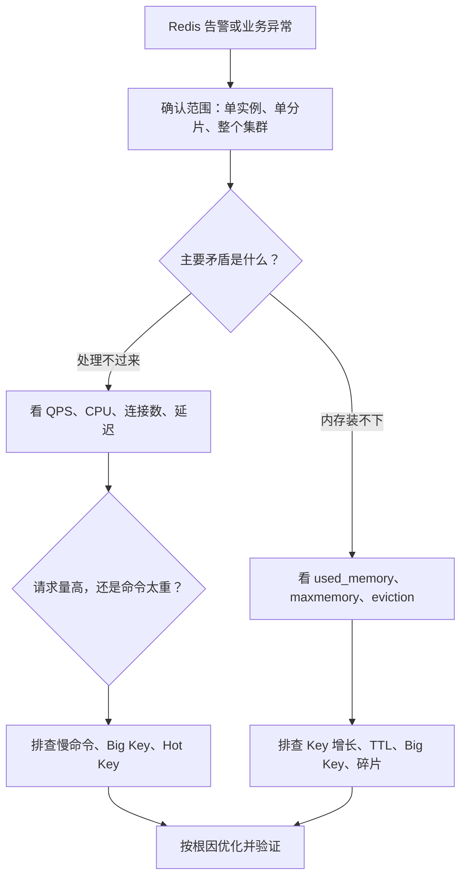

## 一、面试口述版

遇到 Redis 服务器负载或容量爆掉，我不会一上来就堆命令，而是先确认影响范围：是单实例、单分片，还是整个集群；同时结合告警时间、业务流量和变更记录，判断问题是局部倾斜还是整体容量不足。

接着把问题分成两条主线：**负载问题是 Redis 处理不过来，容量问题是内存装不下。**

如果是负载问题，我会看 QPS、CPU、连接数和延迟，先判断是请求量整体上涨，还是 QPS 没明显变化但单次命令变重。然后结合 `INFO`、Slow Log 和命令统计，定位高频或高耗时命令，并进一步排查慢命令、Big Key 和 Hot Key。比如，大范围查询或对超大集合执行复杂操作，可能长时间占用执行线程；某个 Key 被集中访问，则可能把单个实例或分片打满。

如果是容量问题，我会通过 `INFO memory` 查看 `used_memory`、`maxmemory` 和内存碎片，再结合 Key 数量、TTL、Key 大小以及 `evicted_keys` 判断：是业务数据持续增长、Key 没有过期时间、少量 Big Key 占用过多内存，还是已经触发淘汰；同时区分 Redis 统计的内存和进程实际占用，避免把内存碎片误判成纯数据增长。

最后根据根因优化：慢命令要降低时间复杂度、拆分或分页处理；Big Key 要拆分并避免一次性读取或删除；Hot Key 可以通过本地缓存、读副本或业务拆 Key 分散压力；无效数据补充 TTL，并避免大量 Key 同时过期；缓存场景选择合适的 `maxmemory-policy`，非缓存数据则要谨慎淘汰；如果单实例已经达到合理上限，就通过 Redis Cluster 增加分片并扩容。优化后还要回看 QPS、延迟、CPU、内存和淘汰速率，验证问题是否真正消失。

## 二、整体排查逻辑

这张图的重点不是记工具，而是每一步都用证据回答一个更小的问题：先定范围，再分主线，然后定位到具体命令、Key 或容量因素。

## 三、主线一：Redis 处理不过来

“负载高”应先还原成可观察的现象：CPU 是否升高、QPS 是否突增、连接是否堆积、请求延迟是否变大。核心判断只有两个。

### 1. 请求量整体超过处理能力

如果 QPS、网络流量和 CPU 同时上涨，通常说明流量放大或调用方式发生变化。继续确认流量来自哪些业务、是否存在重试风暴或连接使用异常，以及压力是否集中在某个分片。

### 2. 请求量没变，但单次命令变重

如果 QPS 变化不大，延迟和 CPU 却明显上升，应重点看命令执行情况：是否出现高时间复杂度命令、一次返回大量数据、对大集合进行全量操作，或者某个 Key 被集中访问。

- `INFO` 是 Redis 的运行状态总览，可以按模块查看客户端、CPU、内存、统计信息和命令统计。
- `SLOWLOG GET` 用于查看超过阈值的命令执行记录。它记录的是 Redis 执行命令本身的时间，不包含与客户端通信的网络耗时，所以“接口慢但 Slow Log 不慢”时，还要继续排查网络、连接池或客户端等待。
- 命令统计用于观察各类命令的调用次数和平均耗时，适合发现“调用特别多”或“单次特别重”的命令类型。

Big Key 和 Hot Key 容易被混淆：

| 概念 | 本质 | 典型风险 | 常见优化 |
| --- | --- | --- | --- |
| Big Key | 单个 Key 占用内存大，或集合元素特别多 | 操作耗时、网络返回大、删除或迁移成本高 | 拆分 Key、分批读写、异步删除 |
| Hot Key | 单个 Key 的访问频率远高于其他 Key | 单实例或单分片 CPU、网络成为热点 | 本地缓存、读副本、业务拆 Key |

## 四、主线二：Redis 内存装不下

先通过 `INFO memory` 判断 Redis 数据内存是否逼近限制，再确认内存为什么增长。

- `used_memory`：Redis 通过内存分配器分配的内存，是判断数据和内部结构占用的核心指标。
- `maxmemory`：为 Redis 配置的内存上限。达到上限后，Redis 会依据 `maxmemory-policy` 淘汰 Key，或者拒绝会增加内存的写入。
- `maxmemory-policy`：达到上限后的处理策略。缓存数据可以按业务访问模式选择 LRU、LFU 等淘汰策略；不能丢失的数据不应把淘汰当作容量方案。
- `evicted_keys`：实例启动以来因达到 `maxmemory` 而被淘汰的 Key 数量。它持续增加，说明 Redis 正在靠淘汰维持内存，而不是说明容量问题已经解决。

容量增长通常从四个方向判断：

1. **Key 数量增长**：业务写入量变大，或者产生了不受控的新 Key。
2. **TTL 缺失或不合理**：临时数据没有过期时间，或过期时间远长于业务需要。
3. **Big Key 增长**：Key 数量变化不大，但少量 Value 或集合持续膨胀。
4. **内存碎片和额外开销**：数据删除后，进程占用未必立刻归还给操作系统；判断碎片时应同时看绝对字节数，不能只看一个比例。

此外，要检查各分片是否均衡。整个集群尚有余量，并不代表某个分片不会因为 Key 分布不均或 Hot Key 而先达到上限。

## 五、按根因选择优化手段

| 根因 | 优化方向 |
| --- | --- |
| 慢命令或大范围操作 | 降低复杂度，改为分页、增量或异步处理，避免生产环境全量扫描 |
| Big Key | 按业务维度拆分，限制集合大小，分批读取和删除 |
| Hot Key | 增加本地缓存或多级缓存，使用读副本，必要时通过业务拆 Key 分散压力 |
| TTL 缺失 | 为临时数据补 TTL，并增加随机抖动，避免大批 Key 同时过期 |
| 淘汰策略不合适 | 按缓存命中模式选择策略；不可丢数据的场景优先扩容或治理数据 |
| 单实例或单分片到达上限 | 使用 Redis Cluster 增加分片，迁移 Slot，并验证数据和访问是否均衡 |

优化不能停在“改了配置”。完成后应对比优化前后的延迟、CPU、内存、错误率和 `evicted_keys` 增长速率，并观察一个完整业务周期，确认根因和连带影响都已消除。

## 六、复习时只记这组问题

1. 影响的是单实例、单分片，还是整个集群？
2. Redis 是处理不过来，还是内存装不下？
3. 如果处理不过来，是请求量高，还是命令太重？
4. 如果内存装不下，是 Key 变多、TTL 缺失、Big Key、碎片，还是分片不均？
5. 哪条指标、日志或统计能够证明当前判断？
6. 优化后用什么指标验证根因已经消失？

## 参考资料

- [Redis INFO 命令](https://redis.io/docs/latest/commands/info/)
- [Redis Slow Log](https://redis.io/docs/latest/commands/slowlog/)
- [Redis Key eviction](https://redis.io/docs/latest/develop/reference/eviction/)
- [Redis latency troubleshooting](https://redis.io/docs/latest/operate/oss_and_stack/management/optimization/latency/)
