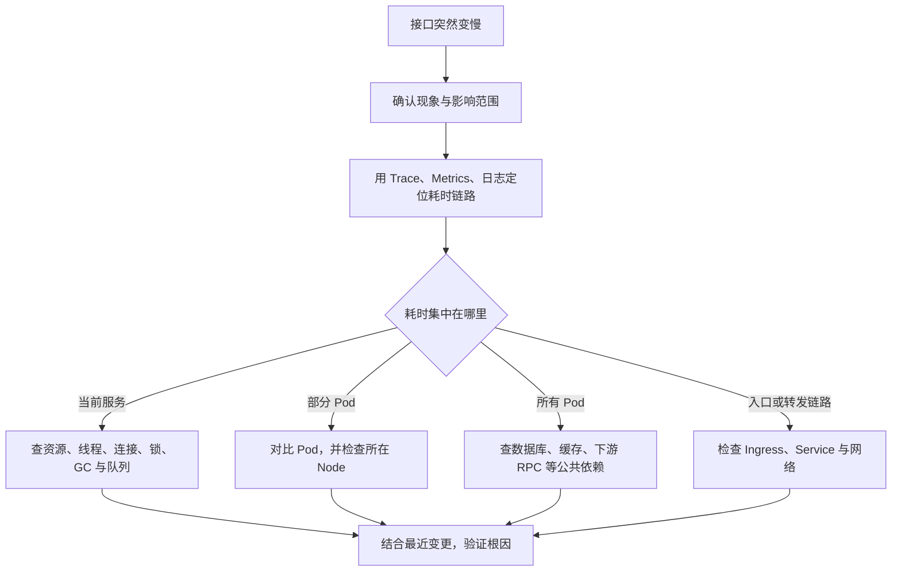

## 面试回答

如果线上一个接口突然变慢，我的排查思路主要是三个阶段：**先定界、再定位、最后下钻。**

首先我会先确认问题的影响范围，比如是单个接口慢还是整个服务都慢，是所有请求都慢还是偶发慢，以及是所有 Pod 都异常还是只有部分 Pod 异常。先判断这是一个整体性问题还是局部性问题。

接下来我会结合 **Trace、监控和日志** 看完整调用链，确认请求的时间到底耗在哪一层。因为接口慢不一定是当前服务本身的问题，也可能是数据库、Redis、下游 RPC，甚至网关或网络导致的，所以需要先把具体的慢点找出来。

如果定位到某个服务，我会继续判断是这个服务的所有 Pod 都慢，还是只有部分 Pod 慢。

如果所有 Pod 都慢，我会更关注服务本身的公共资源以及数据库、Redis、下游服务、连接池、流量变化等公共依赖；如果只有部分 Pod 慢，我会重点检查这些 Pod 自身以及所在 Node 的 CPU、内存、GC、网络等运行状态。

定位到具体组件之后，再做针对性的深入排查，而不是一开始就把 CPU、数据库、网络全部检查一遍。

另外我也会把异常时间点和最近的发布、配置修改、扩缩容、流量变化等操作做对比，因为线上很多故障都和最近的变更有关。

所以整体思路就是：**先确定影响范围，再通过调用链定位耗时位置，然后不断判断是整体问题还是局部问题，逐层缩小范围，最后定位到具体组件和根因。**

## 核心原则

先确认 **哪里慢**，再分析 **为什么慢**。不要一开始就登录 Pod 检查资源，而应先用数据缩小范围。

## 排查主线

这条路径的关键是：每一步都根据上一层证据继续缩小范围，而不是把所有组件逐个检查一遍。

## 1. 确认现象和范围

先回答以下问题：

- RT 从多少升到多少，是持续变慢还是偶发毛刺？
- P50、P95、P99 中哪些指标异常？
- QPS、错误率、超时率是否同时变化？
- 是单个接口还是整个服务变慢？
- 是所有 Pod 还是部分 Pod 变慢？
- 异常从什么时间开始，是否集中在特定请求或用户？

这一步先区分全局问题、单接口问题和单实例问题。

## 2. 定位耗时链路

优先查看 Trace / APM，判断时间消耗在网关、当前服务、数据库、缓存还是下游 RPC。没有 Trace 时，可结合 Metrics、访问日志、应用日志和分阶段耗时日志进行定位。

只有确认耗时集中在哪一段，才进入对应组件深挖。

## 3. 当前服务变慢

先看 CPU、内存、负载、网络和磁盘 I/O，再关注应用是否处于等待状态：

- 线程池或协程池耗尽；
- 数据库、Redis、HTTP 等连接池耗尽；
- 锁竞争、队列堆积；
- GC 停顿或频繁 GC；
- 请求超时、重试放大流量。

CPU 不高不代表应用正常，接口也可能慢在等待资源。

## 4. 部分 Pod 异常

对比正常与异常 Pod，重点检查：

- CPU、内存、GC、线程和连接池是否存在差异；
- 是否频繁重启、被限流，或处于异常生命周期状态；
- 配置、版本、流量分配是否一致；
- 异常 Pod 所在 Node 是否存在 CPU 争抢、内存压力、磁盘或网络异常。

如果迁移或重建 Pod 后恢复，应继续确认原 Pod 或 Node 的具体问题，不能只把重启当作根因。

## 5. 所有 Pod 异常

所有实例同时变慢时，优先检查共同依赖：

- 数据库慢查询、锁等待、连接数和负载；
- Redis 热点 Key、阻塞命令、网络延迟；
- 下游 RPC 延迟、错误率、限流和超时；
- DNS、消息队列、存储等公共基础设施；
- 流量突增或异常重试造成的整体过载。

## 6. Service 和 Ingress 何时检查

Service 通常只是转发抽象，Ingress 也不应默认成为首查对象。只有 Trace、网关指标或网络监控表明延迟发生在入口、负载均衡、服务发现或转发链路时，才重点检查：

- Ingress 延迟、连接数、超时和重试；
- Service Endpoint 是否完整、是否把流量转发到异常 Pod；
- kube-proxy、DNS、跨节点网络和丢包情况。

## 7. 结合最近变更

最后把异常开始时间与近期变化对齐：

- 应用发布、配置或依赖版本变更；
- 数据库索引、SQL、数据量变化；
- 扩缩容、调度或 Node 变更；
- 流量活动、上游调用方式变化；
- 超时、重试、限流参数调整。

通过回滚、流量切分、Pod 或 Node 对比、压测复现等方式验证假设，形成完整证据链。
