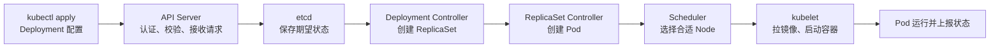

# 基础与架构

## Kubernetes 解决了什么问题？为什么服务部署到 K8s 后还需要它来管理？

Docker 主要解决的是应用的打包和运行问题。我们可以把 Go 服务、运行环境和依赖一起打成镜像，再运行成容器，这样在不同环境里的行为会更一致。  
当服务和机器数量变多后，只靠 Docker 不太方便管理：比如容器该部署到哪台机器、挂了怎么重启、要多少副本、怎么发布新版本、服务之间怎么访问。

Kubernetes 就是用来做容器编排和集群管理的系统。它能统一管理大量容器，帮我们做调度、扩缩容、健康检查、故障恢复、服务发现和滚动发布。

### 延伸问题

1. Docker 已经能运行容器了，为什么还需要 K8s？

> Docker 解决的是单个应用如何打包和运行的问题；但服务数量和机器数量变多后，单靠 Docker 不方便统一管理。  
> 比如容器该部署到哪台机器、挂了怎么恢复、要运行几个副本、怎么更新版本，这些都需要人工处理。K8s 就是在集群层面自动完成这些管理工作。

1. 你说的“编排”具体是指什么？

> 我理解的编排，就是根据我们声明的目标状态，自动安排和维护容器的运行状态。  
> 例如我们希望一个 Go 服务始终有 3 个实例在运行，K8s 会选择合适的机器部署它们；如果其中一个挂了，会自动创建新的实例补上；如果要升级镜像，也可以按策略逐步替换旧实例。

1. 什么叫“声明期望状态”？

> 就是我们不需要手动指定每一步操作，而是直接告诉 K8s 最终想要什么结果。  
> 例如我声明这个服务要运行 3 个副本、使用某个镜像、开放某个端口。之后即使实际只剩 2 个实例，K8s 也会持续尝试恢复到 3 个，这就是它的自愈能力。

1. K8s 能解决所有线上稳定性问题吗？

> 不能。K8s 能保证容器和实例尽量按预期运行，比如实例挂了自动拉起、节点故障后重新调度。  
> 但如果是应用本身有 Bug、数据库不可用、依赖服务超时，K8s 不能直接解决根因。我们仍然需要做好应用监控、日志、限流降级、超时和重试等能力。

## 你理解的 Kubernetes 集群由哪些核心组件组成？

K8s 集群大体分为两部分：控制面，也就是以前常说的 Master；还有工作节点，也就是 Node。

控制面相当于集群的大脑，负责管理和决策。核心组件包括 API Server、etcd、Scheduler 和 Controller Manager。

- API Server 是集群统一的入口；
- etcd 用于保存集群的配置和状态；
- Scheduler 负责把 Pod 调度到合适的节点；
- Controller Manager 则持续维护期望状态，比如某个 Pod 挂了以后创建新的实例补上。

> Controller Manager 管“要不要补”，Scheduler 管“补到哪里”，kubelet 管“怎么跑起来”。

Node 是实际运行服务的节点，主要包括 kubelet、kube-proxy 和容器运行时。

- kubelet 负责和控制面通信，并管理本机上的 Pod；
- kube-proxy 负责 Service 相关的网络转发；
- 容器运行时，例如 containerd，负责真正启动容器。

简单说，控制面负责决定服务应该如何运行，Node 负责实际运行服务。

### 延伸问题

1. API Server 在集群里起什么作用？

> API Server 是 K8s 的统一入口。无论是用户用 `kubectl` 操作集群，还是其他组件之间通信，通常都要通过它。它负责接收请求、做认证和校验，并把集群状态保存到 etcd。

1. etcd 里存的是什么？如果它出问题会怎样？

> etcd 是 K8s 的分布式键值存储，主要保存集群的状态和配置，比如有哪些节点、Deployment 配置、副本数、Pod 的信息等。  
> 如果 etcd 不可用，控制面无法正常读取和保存集群状态，创建、更新、调度 Pod 等管理操作会受到影响；但已经在 Node 上运行的容器通常不会立刻停止。

1. Controller Manager 是怎么实现“期望状态”的？

> 它会不断对比期望状态和实际状态。比如 Deployment 期望有 3 个副本，但发现实际只运行了 2 个，它就会创建一个新的 Pod，让实际状态逐步恢复到目标状态。这个持续修正的过程通常叫控制循环。

1. Scheduler 选择 Node 时，主要考虑什么？

> Scheduler 会先过滤掉不满足条件的节点，例如 CPU、内存不足，或者节点有污点但 Pod 没有对应容忍。之后会在可用节点中进行打分，综合资源利用率、节点标签、亲和性和反亲和性等规则，选出更合适的 Node。

1. kubelet 的职责是什么？它和容器运行时有什么关系？

> kubelet 运行在每个 Node 上，负责接收控制面的指令，并确保本机应该运行的 Pod 真正运行起来。  
> 它会调用容器运行时，例如 containerd，去拉取镜像和启动容器；同时持续上报 Pod 和节点的状态给控制面。

## 控制面与工作节点分别承担什么职责？

控制面相当于集群的大脑，负责接收请求、保存集群状态、维护期望状态，以及对新创建的 Pod 做调度决策。

Node 是具体的工作节点，负责实际运行 Pod 和容器，并把运行状态上报给控制面。

## kubectl apply 一份 Deployment 配置后，大致发生了什么？

1. 首先，用户执行 kubectl apply，由 kubectl 把 Deployment 配置提交给 API Server。
2. API Server 会做认证、鉴权和配置校验；通过后，将这份 Deployment 的期望状态保存到 etcd。
3. 然后 Deployment Controller 监听到 Deployment，创建对应的 ReplicaSet
4. ReplicaSet Controller 再根据副本数创建对应数量的 Pod
5. 新建的 Pod 还没有 Node，Scheduler 会为它选择合适的工作节点。
6. 最后，目标 Node 上的 kubelet 发现有 Pod 被分配到本机，就调用容器运行时拉取镜像、创建和启动容器，并持续上报状态。
7. 最终 Pod 运行起来；如果实际副本数和期望副本数不一致，相关 Controller 会继续尝试修正。

### 延伸问题

1. `kubectl apply` 和 `kubectl create` 有什么区别？

> `create` 更像是首次创建资源；如果同名资源已经存在，通常会报错。  
> `apply` 是声明式更新：它会根据配置文件，把已有资源调整到文件中声明的状态，所以更适合日常部署和持续迭代。

1. Deployment、ReplicaSet 和 Pod 的关系是什么？

> Pod 是实际运行应用的最小单位，但如果只手动创建 Pod，Pod 挂掉后没人自动补，也不方便维护多个副本。
>
> 所以 ReplicaSet 负责维护一组 Pod 副本。比如期望运行 3 个 Pod，少一个它就自动补一个；它更关注“当前这个版本要有多少实例”。
>
> Deployment 又管理 ReplicaSet，主要负责版本发布、滚动更新和回滚。比如镜像从 v1 升级到 v2，Deployment 会创建一个管理 v2 Pod 的新 ReplicaSet，再逐步缩容管理 v1 Pod 的旧 ReplicaSet，最后完成版本切换。
>
> 所以，Pod 负责运行应用，ReplicaSet 负责维持副本数，Deployment 负责管理版本和发布过程。

1. Pod 创建后为什么还需要 Scheduler？

> Pod 刚被创建时只是一个待调度对象，还不知道运行在哪台 Node。  
> Scheduler 会根据节点资源、标签、污点和亲和性等规则，为它选择一台合适的 Node。之后 Node 上的 kubelet 才能真正启动它。

1. 如果 Scheduler 找不到合适的 Node，会发生什么？

> Pod 会处于 `Pending` 状态，因为它还没有被分配到节点。  
> 排查时我会重点看节点的 CPU、内存是否充足，以及 Pod 是否设置了过高的资源请求、节点选择规则、污点和容忍、亲和性等限制。

1. kubelet 启动 Pod 时具体会做什么？

> kubelet 会从 API Server 获取被分配到本机的 Pod 配置，调用容器运行时拉取镜像、创建 Pod 网络和挂载需要的存储，然后启动容器。  
> 启动后，它还会执行健康检查，并持续把 Pod 的实际状态上报给控制面。

## 什么是声明式配置？它和直接执行命令式操作有什么区别？

命令式操作是我们直接告诉 K8s 做一个具体动作，比如“帮我创建一个 Pod”或者“把副本数扩容到 3 个”。它执行的是当前这一步操作。

声明式配置则是告诉 K8s 我最终想要什么状态，比如“我需要 3 个相同的 Pod”。K8s 会根据这份配置创建资源，并持续检查实际状态是否符合期望；如果少了一个 Pod，也会自动补齐。

所以命令式更像“现在帮我做这件事”，声明式更像“我要这个结果，并持续维持它”。

### 延伸问题

1. 为什么 K8s 更推荐声明式配置？

> 因为声明式配置描述的是最终状态，K8s 可以持续维护它；同时 YAML 可以放到 Git 中做版本管理、代码审查和回滚，也方便在不同环境重复部署。

2. 如果有人手动删除了 Deployment 管理的一个 Pod，会怎样？

> Deployment 期望的副本数没有变化。对应的 ReplicaSet 会发现实际 Pod 数量少了，然后自动创建一个新的 Pod 补齐，所以服务副本数会恢复到期望值。

3. 修改 Deployment YAML 里的镜像版本后，K8s 怎么完成升级？

> 执行 `kubectl apply` 后，Deployment 的期望状态发生变化。Deployment Controller 通常会创建一个新的 ReplicaSet，并按滚动更新策略逐步增加新版本 Pod、减少旧版本 Pod，直到新版本替换完成。

4. 命令式操作就不能用于生产环境吗？

> 不是不能。命令式操作可以用于临时排障或紧急处置，例如临时扩容、查看状态或删除异常 Pod。
> 但正式的部署和配置变更，通常应该回写到声明式配置中；否则手工操作可能在下一次发布时被覆盖，也不利于追踪和复现。

5. “期望状态”和“实际状态”分别是什么？

> 期望状态是用户写在资源配置里的目标，例如 Deployment 希望有 3 个副本、使用某个镜像版本。  
> 实际状态是集群当前真实运行的情况，例如现在只有 2 个 Pod 在运行。Controller 会持续比较两者，并尝试消除差异。
