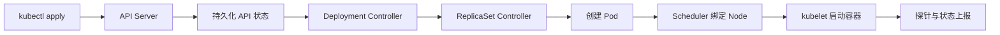

## Kubernetes 解决了什么问题？Docker 已经能运行容器，为什么还需要它？

Docker 主要解决应用如何打包和运行；Kubernetes 解决的是多节点、多实例环境下如何持续管理容器化应用。

当规模变大后，需要统一处理调度、副本维护、故障恢复、服务发现、配置管理、扩缩容和滚动发布。Kubernetes 允许用户声明目标状态，再由控制器不断把实际状态收敛到目标状态。例如声明一个服务始终有 3 个副本，少一个时控制器会创建替代 Pod。

Kubernetes 也有边界：它能重建失败实例，却不能修复应用 Bug、错误数据或下游故障。超时、重试、限流、降级、数据备份和可观测性仍要由应用与基础设施共同承担。

### 延伸问题

1. 什么是“编排”？

> 编排是对容器的部署位置、数量、网络、存储、发布和故障恢复进行自动化协调，不只是把容器启动起来。

2. 什么是“期望状态”和“实际状态”？

> 期望状态是资源清单声明的目标，例如镜像版本和副本数；实际状态是集群当前真实情况。Controller 通过控制循环持续比较并修正差异，这个过程叫调谐（reconcile）。

3. 什么时候不值得引入 Kubernetes？

> 单机或少量服务、发布频率低、弹性和自愈需求弱时，Docker Compose 或托管应用平台往往更简单。是否引入取决于复杂度收益和团队运维能力，而不是只看机器数量。

## Kubernetes 集群由哪些核心组件组成？

集群分为控制面和工作节点。

| 位置 | 组件 | 核心职责 |
|---|---|---|
| 控制面 | kube-apiserver | Kubernetes API 的统一入口，负责认证、鉴权、准入和资源读写 |
| 控制面 | etcd | 保存集群 API 数据的高可用键值存储 |
| 控制面 | kube-scheduler | 为尚未绑定 Node 的 Pod 过滤、打分并选择节点 |
| 控制面 | kube-controller-manager | 运行 Deployment、ReplicaSet、Node 等控制器，持续调谐状态 |
| 工作节点 | kubelet | 确保分配到本节点的 Pod 按声明运行，并上报状态 |
| 工作节点 | 容器运行时 | 通过 CRI 拉取镜像并创建、运行容器，如 containerd、CRI-O |
| 工作节点 | kube-proxy 或替代实现 | 根据 Service 和 EndpointSlice 编程节点数据面，实现 Service 转发 |

一句话记忆：**Controller 决定要不要补，Scheduler 决定补到哪里，kubelet 负责在目标节点把它跑起来。**

### 延伸问题

1. API Server 为什么是核心入口？

> `kubectl`、控制器、Scheduler 和 kubelet 都通过 Kubernetes API 观察或修改状态，而不是直接读写 etcd。API Server 因此可以统一执行认证、鉴权、准入和校验。

2. etcd 不可用会怎样？

> 控制面无法可靠读取或持久化新状态，创建、更新和调度等管理操作会受影响；节点上已运行的容器通常不会立刻停止，但集群的调谐和故障恢复能力会下降。etcd 必须做高可用、备份和恢复演练。

3. Scheduler 主要考虑什么？

> 先过滤不满足资源请求、污点容忍、节点选择、亲和性和存储拓扑等条件的节点，再对可行节点打分并完成绑定。它依据 requests 做容量判断，不以瞬时 CPU、内存使用量代替 requests。

4. kubelet 和容器运行时是什么关系？

> kubelet 管理 Pod 生命周期，但不直接实现容器；它通过 CRI 调用容器运行时。Pod 网络通常由 CNI 插件配置，持久卷通常由 CSI 插件接入。

## `kubectl apply` 一份 Deployment 后发生了什么？

1. `kubectl` 将对象提交给 API Server；
2. API Server 完成认证、鉴权、准入和校验，持久化 API 对象；
3. Deployment Controller 创建或更新 ReplicaSet；
4. ReplicaSet Controller 按期望副本数创建 Pod；
5. Scheduler 为未绑定节点的 Pod 选择 Node，并把绑定结果写回 API；
6. 目标 Node 上的 kubelet 观察到 Pod，准备网络和存储，再调用容器运行时拉镜像、启动容器；
7. kubelet 持续执行探针并上报状态，各控制器继续调谐，直到实际状态接近期望状态。

### 延伸问题

1. Deployment、ReplicaSet、Pod 的关系是什么？

> Pod 是运行实例；ReplicaSet 维护某个 Pod 模板的副本数；Deployment 管理 ReplicaSet，提供声明式更新、滚动发布和回滚。业务通常直接管理 Deployment，不手工管理它生成的 ReplicaSet。

2. Scheduler 找不到合适节点会怎样？

> Pod 保持未调度并处于 `Pending`，Events 中通常出现 `FailedScheduling`。应检查 requests、污点与容忍、亲和性、节点选择、PVC 和存储拓扑等条件。

3. API Server 是否直接命令某台机器创建容器？

> 不是这种一次性命令链。各组件通过监听 API 状态协作：Scheduler 写入绑定结果，目标节点 kubelet 观察到后再让实际状态收敛。

## 什么是声明式配置？它和命令式操作有什么区别？

命令式操作描述“现在执行什么动作”，如临时执行 `kubectl scale`；声明式配置描述“最终应该是什么状态”，如 YAML 中声明镜像和 3 个副本，再由控制器持续维护。

声明式清单适合放入 Git，便于评审、审计、复现和回滚。命令式操作仍适合查询、临时排障和紧急处置，但正式变更应回写到声明式配置，否则后续发布可能覆盖手工修改。

### 延伸问题

1. `kubectl create` 和 `kubectl apply` 有什么区别？

> `create` 侧重创建新对象，同名对象已存在时通常失败；`apply` 侧重把对象调整为清单声明的状态，适合持续迭代。实际字段合并行为还取决于客户端 Apply 或 Server-Side Apply 及字段所有权。

2. 手动删除 Deployment 管理的 Pod 会怎样？

> ReplicaSet 会发现副本数不足并创建替代 Pod。新的 Pod 是新对象，名称、UID 和 IP 都可能变化。

3. 声明式是否意味着每次修改都会成功？

> 不意味着。控制器会持续尝试，但资源不足、镜像错误、权限、网络或存储故障仍可能让实际状态长期无法收敛，需要通过状态、Events、日志和监控排查。
