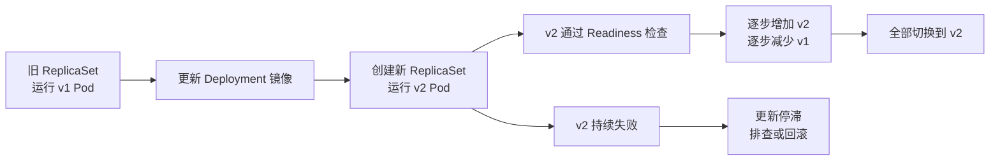

## 什么是 Pod？为什么 K8s 通常不直接管理单个容器？

Pod 是 Kubernetes 最小的部署和调度单位。

K8s 不直接以单个容器作为调度单位，是因为有些场景下，多个容器需要紧密协作，并且必须被放到同一台 Node 上运行。  
所以 K8s 在容器之上抽象出了 Pod。一个 Pod 中可以包含一个或多个容器；它们共享同一个网络命名空间和 Pod IP，可以通过 localhost 通信，也可以挂载并共享同一个存储卷。

这样主业务容器就可以和日志收集、代理、配置同步之类的辅助容器一起被调度和管理。虽然大部分业务 Pod 只有一个主容器，但 Pod 仍然提供了网络、存储和生命周期管理的统一边界。

### 延伸问题

3. 为什么不把两个独立微服务放进同一个 Pod？

> 因为同一个 Pod 中的容器会一起调度、一起迁移，生命周期也高度绑定。  
> 独立微服务通常需要独立扩缩容、独立发布和独立故障处理，所以一般应该部署在不同的 Pod 中，通过 Service 通信。

> 如果辅助容器能被多个服务独立共享、独立扩缩容，它更适合做成单独服务或节点级组件。 如果它必须贴着某一个业务实例，依赖同一网络、同一文件、启动顺序或共同生命周期，就更适合放进同一个 Pod。
> 比如 Go 服务写日志到一个共享目录，日志采集容器读取这个目录并上报；或者给 Go 服务配一个代理容器，专门处理它的网络流量。

4. Pod 重启和容器重启有什么区别？

> 所以本质区别是：容器重启是在同一个 Pod 内恢复某个进程；Pod 被替换是重新创建一个完整的应用实例。

5. Pod IP 会稳定不变吗？服务之间应该如何访问？

> Pod 被重建后，Pod IP 可能会变化，因此不应该把 Pod IP 作为稳定访问地址。  
> 服务之间通常通过 Service 访问，由 Service 提供稳定的访问入口，再把请求转发到后端的 Pod。

## Pod 中多个容器之间如何通信、共享什么资源？

同一个 Pod 中的多个容器共享网络命名空间和同一个 Pod IP，所以它们可以直接通过 localhost 加端口通信。  
比如 Go 主服务监听本地某个端口，旁边的代理或辅助容器可以通过 localhost:端口 调用它，不需要经过 Service。  

在存储方面，容器默认各自有独立的根文件系统；但可以把同一个 Volume 挂载到多个容器中，实现文件共享，例如主容器写日志，辅助容器读取日志。  
它们会被一起调度到同一台 Node 上，生命周期也相互关联。

但进程空间通常是隔离的，CPU 和内存也通常按容器分别配置 request 和 limit，并不是天然共享。

## Deployment、StatefulSet、DaemonSet 分别适合什么场景？

Deployment 管无状态服务，StatefulSet 管有状态服务，DaemonSet 管每台节点都要运行的组件。

| 对象 | 简单定义 | 适合场景 |
|---|---|---|
| Deployment | 管理一组可替换、无稳定身份的 Pod | 无状态业务服务 |
| StatefulSet | 管理一组有固定身份和存储绑定的 Pod | 有状态服务 |
| DaemonSet | 保证每个符合条件的 Node 都运行一个 Pod | 节点级基础设施 |

### 延伸问题

1. Deployment 和 StatefulSet 最核心的区别是什么？

> Deployment 管理的 Pod 通常没有固定身份，任意副本之间可以互相替代，适合无状态服务。  
> StatefulSet 中每个 Pod 都有稳定名称和编号，也通常绑定自己独立的持久化存储，适合有状态服务。

2. StatefulSet 为什么需要稳定的 Pod 名称？

> 很多有状态集群需要成员之间通过固定身份互相识别，例如主从复制、选主或分片。  
> StatefulSet 创建的 Pod 名称通常带有稳定编号，例如 `mysql-0`；Pod 重建后仍会保留这个编号，便于集群恢复和成员识别。

3. StatefulSet 的存储和 Deployment 有什么不同？

> Deployment 中的多个 Pod 通常可以共享同一种配置，业务服务本身不依赖本地状态。  
> StatefulSet 通常会通过卷声明模板，为每个 Pod 创建或绑定独立 PVC；例如 `mysql-0` 和 `mysql-1` 各自使用自己的数据卷，Pod 重建后仍可重新挂载原来的数据。

4. DaemonSet 和 Deployment 都能设置副本数吗？

> Deployment 可以通过 `replicas` 明确指定副本数量。  
> DaemonSet 通常不直接指定副本数，而是按符合调度条件的 Node 数量自动决定：每个符合条件的 Node 上运行一个 Pod。

5. 如果某个 Node 新加入集群，DaemonSet 会发生什么？

> DaemonSet Controller 会发现新增 Node，并自动在这个符合条件的 Node 上创建对应 Pod。  
> 如果该 Node 有污点或 DaemonSet 设置了节点选择规则，也需要满足对应的容忍或调度条件，Pod 才会运行上去。

## Deployment 如何实现滚动更新？更新失败如何处理？

Deployment 通过新旧 ReplicaSet 并存，按照 maxSurge 和 maxUnavailable 控制新版本逐步上线、旧版本逐步下线；新 Pod 必须就绪后才承接流量。更新失败时，先通过状态、事件和日志排查；确认版本问题后回滚到旧 ReplicaSet 对应的版本。

如果更新失败，我会先确认是哪些新版本 Pod 没有正常起来，或者一直没有通过就绪检查。  
然后我会看 Pod 的事件和容器日志：事件主要帮助判断是不是镜像拉取、调度、资源、挂载或健康检查的问题；日志主要看应用自身启动时有没有报错。  
如果容器发生过重启，我也会查看它上一次运行的日志，确认它上一次为什么退出。  
常见原因包括镜像拉取失败、配置或密钥缺失、应用启动异常、CPU 或内存不足、端口或依赖连接问题，以及 readiness probe 配置不正确。  
确认是新版本本身的问题后，我会先回滚到稳定的旧版本，保证服务恢复；之后再修复问题并重新发布。

### 延伸问题

1. `maxSurge` 和 `maxUnavailable` 分别有什么作用？

> `maxSurge` 控制更新期间最多能额外创建多少个 Pod，用空间换取更快的发布速度。  
> `maxUnavailable` 控制更新期间最多允许多少个副本不可用，用来保障服务可用性。  
> 例如服务有 10 个副本，设置 `maxSurge: 2`、`maxUnavailable: 1`，更新时最多可有 12 个 Pod，同时最多允许 1 个不可用。

2. Readiness Probe 为什么对滚动更新很重要？

> 新版本容器启动成功，不代表已经可以处理请求。Readiness Probe 用来判断它是否真正准备好接收流量。  
> 只有通过就绪检查的 Pod 才会加入 Service 后端，Deployment 也会据此决定是否继续缩容旧版本，从而避免把流量过早切到不可用的新版本。

3. 如果新版本 Pod 一直处于 Running，但始终没有 Ready，可能是什么原因？

> 说明容器进程已经启动，但 K8s 判断它还不能接收流量。  
> 常见原因有 readiness 接口或端口配置错误、应用初始化未完成、依赖的数据库或配置中心不可用，或者探针超时时间设置过短。

4. 滚动更新与蓝绿发布有什么区别？

> 滚动更新是在同一套服务中逐步增加新版本、减少旧版本，资源消耗相对低。
> 蓝绿发布则是同时保留完整的旧版本和新版本，通过切换 Service 或流量入口来切换版本；回滚更快，但需要更多资源。

5. 什么是金丝雀发布？它如何降低发布风险？

> 金丝雀发布是先让少量流量进入新版本，观察错误率、延迟和业务指标；确认稳定后，再逐步扩大新版本流量。  
> 它能把故障影响控制在小范围内，比直接全量更新更容易发现和止损。

## replicas 的作用是什么？Pod 数量少于期望值时会怎样？

replicas 表示服务期望运行的 Pod 副本数量。
比如一个 Deployment 设置 replicas: 3，意思是希望始终有 3 个相同的 Pod 实例在运行。  

Deployment 会管理 ReplicaSet，而 ReplicaSet 会持续检查当前实际的 Pod 数量是否达到期望值。  
如果实际数量少于期望，例如某个 Pod 异常退出、被删除或所在 Node 故障，ReplicaSet 会创建新的 Pod 补齐；如果实际数量多于期望，例如把副本数从 3 改成 2，它也会删除多出来的 Pod。  

所以，replicas 定义目标数量，ReplicaSet 负责让实际数量维持在这个目标附近。

### 延伸问题

1. Deployment、ReplicaSet 和 `replicas` 的关系是什么？

> `replicas` 是期望运行的 Pod 数量。ReplicaSet 负责持续维护这个数量。Deployment 管理 ReplicaSet，并负责版本发布、滚动更新和回滚。  
> 简单说：`replicas` 定数量，ReplicaSet 保数量，Deployment 管发布。

2. 为什么不能只手动创建多个 Pod？

> 手动创建的 Pod 挂掉后不会自动补齐，也不方便统一扩缩容和更新版本。  
> 使用 Deployment 和 ReplicaSet 后，我们只需要声明副本数，K8s 会持续维护实际数量，并支持滚动发布和故障恢复。

3. Pod 数量少于期望时，一定会马上补齐吗？

> ReplicaSet 会很快尝试创建新 Pod，但新 Pod 不一定能立刻运行成功。  
> 如果节点资源不足、镜像拉取失败、调度规则不满足等，Pod 可能处于 Pending 或启动失败；此时要继续排查为什么补出的 Pod 没有正常运行。

4. 把副本数从 3 改成 5 后，K8s 会怎样处理？

> Deployment 的期望状态变成 5，ReplicaSet 会发现当前少 2 个 Pod，然后创建两个新的 Pod。  
> Scheduler 为新 Pod 选择 Node，目标节点上的 kubelet 最终启动容器，这就是横向扩容。

5. 副本数越多，服务就一定越稳定吗？

> 不一定。多个副本能提高可用性和承载能力，但前提是副本分布合理、资源足够，并且应用本身支持多实例运行。  
> 如果所有副本都在同一台 Node 上，Node 故障时仍可能全部受影响；此外，数据库连接、缓存一致性和下游容量也可能成为瓶颈。

## 什么是探针：liveness、readiness、startup probe 各解决什么问题？

| 探针 | 核心问题 | 检查失败后的主要动作 |
|---|---|---|
| Liveness Probe | “这个容器还活着、有没有卡死？” | 重启容器 |
| Readiness Probe | “这个容器现在能不能接流量？” | 从 Service 后端移除，不再接新流量 |
| Startup Probe | “启动很慢的应用是否还在正常启动中？” | 启动期内暂不让其他探针误判；持续失败则重启容器 |

K8s 的 Probe 就是容器健康检查。  
Liveness Probe 是存活检查，主要解决应用进程虽然还在、但已经卡死或无法正常工作的情况。如果连续检查失败，kubelet 会重启这个容器。  
Readiness Probe 是就绪检查，主要判断应用当前是否已经准备好接收流量。比如 Go 服务虽然启动了，但数据库连接、配置加载还没完成，这时就不应该接业务请求。Readiness 失败不会重启容器，只会让它暂时不加入 Service 的可用后端。  
Startup Probe 是启动检查，主要给启动慢的应用使用。它成功之前，K8s 不会执行 liveness 和 readiness 的失败判定，避免应用还在正常初始化时就被错误重启；如果它持续失败，才说明应用没有正常启动，容器会被重启。  
简单说，liveness 看“活没活”，readiness 看“能不能接流量”，startup 看“是不是还在正常启动”。

### 延伸问题

1. Liveness Probe 和 Readiness Probe 都失败时，处理有什么不同？

> Liveness 失败说明 K8s 认为容器可能卡死或无法恢复，kubelet 会重启容器。  
> Readiness 失败说明容器暂时不适合接流量，K8s 会把它从 Service 的可用后端移除，但不会因此重启容器。

2. 为什么不能只配置 Liveness Probe，不配置 Readiness Probe？

> 因为“进程还活着”和“服务已经能处理请求”不是一回事。  
> 例如 Go 服务已经启动，但数据库还没连接成功；这时它不该接流量，但也未必需要重启。Readiness 可以避免请求被转发给尚未准备好的实例。

3. Liveness Probe 配置得太严格，可能有什么后果？

> 应用响应偶尔变慢、依赖短暂波动时，可能被误判为不健康并频繁重启，甚至形成 `CrashLoopBackOff`。  
> 因此存活检查应尽量检查应用自身是否卡死，不要把不稳定的外部依赖直接作为 Liveness 的判断条件。

4. Readiness Probe 应该检查数据库或 Redis 连接吗？

> 要看这个依赖是否是服务处理核心请求的必要条件。  
> 如果数据库不可用时服务无法正确处理请求，可以让 Readiness 失败，从 Service 后端移除；但一般不建议因此让 Liveness 失败，否则依赖故障会导致所有服务实例被反复重启。

5. 什么情况下需要 Startup Probe？

> 当应用启动时间较长，或者启动阶段有加载大配置、缓存预热、执行初始化任务等操作时，需要 Startup Probe。  
> 它可以在应用初始化期间避免 Liveness 过早判定失败；但如果在允许时间内始终启动不了，仍会触发容器重启。

## 一个 Go 服务启动较慢，怎样避免它还没准备好就被流量打进来？

如果 Go 服务启动较慢，我会配置 Readiness Probe。  
服务进程虽然启动了，但如果配置还没加载完、数据库或 Redis 等关键依赖还没准备好，健康检查接口就先返回失败。  
在 Readiness Probe 没有通过前，K8s 不会把这个 Pod 加入 Service 的可用后端，因此流量不会被转发到它。  
等服务初始化完成、能够正常处理请求后，健康检查接口返回成功，Pod 才会变成 Ready，并开始接收流量。  
如果服务启动时间特别长，我还会加 Startup Probe，避免它在启动过程中被 Liveness Probe 过早重启。