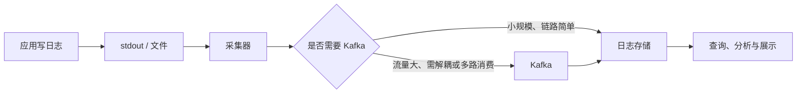

## 先建立一条主线

一个典型日志系统可以拆成五层：



各层职责可以概括为：

> **日志库负责写，采集器负责运，Kafka 负责接住流量，存储决定怎么查，展示工具让人更方便地使用数据。**

Kafka 并非必选。简单系统完全可以采用：

```text
应用 → Fluent Bit → Loki → Grafana
```

规模或复杂度上升后，才可能演变为：

```text
应用 → 采集器 → Kafka → Elasticsearch / ClickHouse / Loki → 查询与展示工具
```

## 1. 应用写日志：日志库只是起点

Go 的 `slog`、`zap`，以及 Java 的 `SLF4J + Logback`，本质上都是运行在应用内部的 **日志库**。它们负责：

- 提供 `Info`、`Error`、`Debug` 等 API；
- 控制日志级别；
- 添加时间、调用位置、堆栈等字段；
- 输出文本或结构化 JSON；
- 把结果写到 stdout、文件等位置。

它们不负责集中采集、长期存储和查询分析。

从后续链路看，应用用了哪个日志库通常并不重要。采集器主要关心两件事：

1. **日志在哪里**：stdout、文件、journald 等；
2. **日志是什么格式**：纯文本、JSON 或其他稳定格式。

因此，日志库的选型更多影响应用内的易用性、性能和结构化能力；真正影响后续采集的是 **输出位置和格式**。结构化 JSON 通常比随意拼接的字符串更容易解析、检索和统计。

## 2. OpenTelemetry：统一可观测性，而非一种日志格式

OpenTelemetry（OTel）不是普通日志库，也不只是规定一份 JSON 应该长什么样。它是一套：

- 可观测性标准与语义约定；
- 各语言的埋点 API 和 SDK；
- OTLP 等数据传输协议；
- 用于接收、处理和导出数据的 Collector。

它统一处理三类可观测数据：

```text
Log + Trace + Metric
```

核心价值是让不同语言和系统使用一致的数据模型、字段语义与上下文。例如日志携带 `trace_id` 和 `span_id` 后，就能与对应调用链关联；`service.name` 等资源属性也能在日志、链路和指标之间保持一致。

可以把 OTel 记成：

> **可观测领域的统一语言和接入体系。**

它通常不负责长期存储，数据最终仍需进入 Elasticsearch、Loki、ClickHouse、Prometheus、Tempo 等后端。

## 3. 为什么需要采集器

应用当然可以直接通过网络把日志写进 Elasticsearch、Loki 或 ClickHouse，但这样会把业务与日志基础设施绑在一起：应用必须处理连接、阻塞、失败重试、流量峰值以及后端迁移等问题。

采集器把“业务产生日志”和“可靠运送日志”拆开，主要提供：

- **解耦**：应用只写 stdout 或文件，不感知后端；
- **缓冲**：后端短暂变慢时先在本地承接；
- **批量**：合并发送，降低网络和写入开销；
- **重试**：处理网络抖动与后端暂时不可用；
- **预处理**：解析 JSON、过滤字段、补充 Pod 或服务信息、分流。

一句话理解：

> **存储决定日志最后去哪，采集器决定日志怎样可靠地过去。**

### 常见采集器对比

| 工具 | 核心定位 | 更适合的场景 |
|---|---|---|
| Fluent Bit | 轻量、通用的日志采集器 | Kubernetes 中以 DaemonSet 采集容器日志 |
| Filebeat | Elastic 生态的轻量采集器 | 后端主要是 Elasticsearch / Elastic Stack |
| Vector | 强调高性能的数据管道与转换 | 解析、过滤、路由和多目标输出较复杂 |
| OTel Collector | 统一接收、处理、导出可观测数据 | 希望用同一条管道承载 Log、Trace、Metric |

粗略记忆即可：

> **Fluent Bit / Filebeat 偏“采”，Vector 偏“采 + 处理”，OTel Collector 偏“统一可观测性管道”。**

它们的能力有重叠，实际选择还要看部署环境、目标后端、处理复杂度和团队已有生态。

## 4. Kafka：采集与存储之间的可选缓冲层

Kafka 通常放在采集器和最终存储之间：

```text
应用 → 采集器 → Kafka → 日志存储
```

采集器也有缓冲能力，但一般偏本地、短时；Kafka 更适合大规模、持久化的集中缓冲。它主要解决：

- **削峰填谷**：日志突然暴增，而存储暂时来不及写入；
- **上下游解耦**：采集速度不必与存储写入速度完全一致；
- **故障恢复**：存储短暂不可用后可继续消费积压；
- **多路消费**：同一份日志可分别进入搜索、分析和告警系统。

例如：

```text
                  ┌→ Elasticsearch：故障搜索
采集器 → Kafka ──┼→ ClickHouse：统计分析
                  └→ 实时计算：规则告警
```

### 何时需要 Kafka

当日志量大、峰值明显、存储容易形成瓶颈、需要多路消费，或对链路解耦和积压恢复要求较高时，可以考虑 Kafka。

如果规模不大、只有一个后端、采集器自身缓冲已经够用，直接写入存储通常更简单。不要因为 Kafka 常见就默认引入它。

### 为什么通常不让应用直接发 Kafka

技术上可行，但不适合作为普通应用日志的默认方案。否则业务代码需要感知 Kafka 的地址、Producer 配置、发送失败、重试和阻塞，Kafka 故障也可能影响业务请求。

更稳妥的默认方式是：

```text
应用只写 stdout / 文件 → 采集器发送 Kafka
```

如果产生的是需要可靠投递、参与业务流程的 **业务事件**，而不是用于诊断的普通日志，那么应用直接发送 Kafka 反而可能是合理设计。业务事件与日志不应混为一谈。

## 5. 存储选型：先问以后准备怎么查

存储不是简单比较“谁更强”，而是从查询方式倒推。最重要的分界是：

> **要定位具体问题，还是把海量日志当数据集分析？**

| 存储 | 核心定位 | 典型场景 | 主要边界 |
|---|---|---|---|
| Elasticsearch | 搜：全文检索与多字段过滤 | 按 `order_id`、`trace_id`、错误码或关键词定位日志 | 资源成本较高；超大规模重聚合未必最经济 |
| Loki | 看：按标签和时间范围查看日志 | Kubernetes 中按服务、Namespace、Pod 查看近期日志 | 不强调对所有正文和字段建立全文索引 |
| ClickHouse | 算：大规模聚合与统计分析 | 错误率趋势、Top N、地区分布、接口延迟分析 | 临时模糊搜索任意文本不如 Elasticsearch 自然 |
| 对象存储 | 存档：低成本长期保存 | 合规留存、冷数据、灾备和离线再处理 | 不适合直接进行低延迟交互式查询 |

可以用四个字记住：

> **ES 搜，Loki 看，ClickHouse 算，对象存储存档。**

更具体地说：

- 要快速找到一条错误日志，并灵活组合字段和关键词：优先考虑 Elasticsearch；
- 主要按服务、Pod 和时间范围查看近期日志：优先考虑 Loki；
- 要在数十亿条日志上计算趋势、Top N 和聚合指标：优先考虑 ClickHouse；
- 日志很少查询，但必须便宜地保存半年或数年：放入对象存储。

真实系统也可以分层：热数据进入 Elasticsearch、Loki 或 ClickHouse，冷数据归档到对象存储。

## 6. 分析与展示：区分三个动作

展示工具不是存储本身，它们决定人如何搜索、观察和分析底层数据。

| 工具 | 核心定位 | 最擅长的动作 |
|---|---|---|
| Kibana | Elasticsearch 的专业操作与分析界面 | **查日志**：检索、过滤字段、排查具体问题 |
| Grafana | 多种可观测数据的统一展示平台 | **看系统**：把 Log、Trace、Metric 放进同一视图 |
| Superset | 面向 SQL 数据源的 BI 与分析平台 | **分析数据**：复杂图表、聚合探索和分析报表 |
| Metabase | 更易上手的 BI 与自助查询工具 | **分析数据**：让非技术用户更方便地查询和做报表 |

最简单的区分是：

> **Kibana：我要查日志。**  
> **Grafana：我要看系统。**  
> **Superset / Metabase：我要分析数据。**

例如，搜索某个订单对应的报错更像 Kibana；值班时同时查看 CPU、错误率、近期日志和 Trace 更像 Grafana；分析过去 30 天各地区请求量和错误率趋势更像 Superset 或 Metabase。

需要注意：展示层的能力上限很大程度上由底层存储决定。界面可以让查询更方便，却不能凭空补足存储不擅长的查询方式。

## 7. 一套实用的选型顺序

不要先从工具名出发，可以按下面的顺序判断：

1. **日志如何产生**：应用选择合适的日志库，优先输出稳定的结构化数据；
2. **日志从哪里读取**：stdout、文件还是其他来源；
3. **如何可靠运送**：根据环境和处理需求选择采集器；
4. **是否需要 Kafka**：只有在规模、削峰、恢复或多路消费确有需要时引入；
5. **以后主要怎么使用**：定位问题选搜索型存储，统计分析选分析型存储，长期留存选对象存储；
6. **谁来使用数据**：排障用 Kibana，看整体可观测性用 Grafana，做 BI 分析用 Superset / Metabase。

最终的心智模型是：

> **先明确用途，再设计查询方式；先选择存储，再匹配采集和展示工具。**

工具会变化，但这条判断链基本不会变化。
