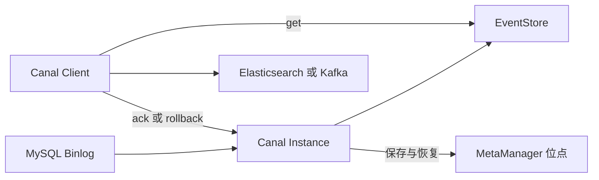
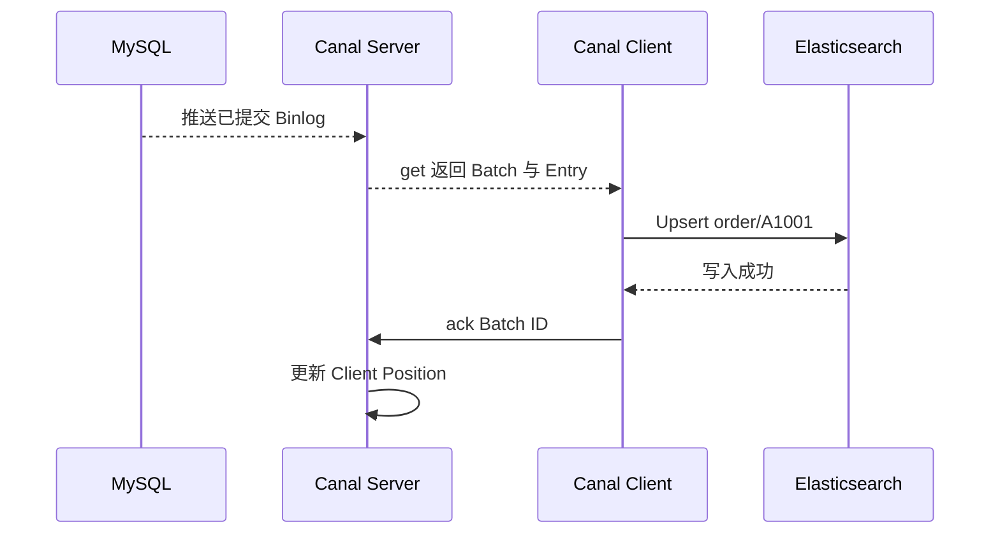

## 1. 它是什么

**Canal 是阿里巴巴开源的 MySQL Binlog 增量订阅组件：它模拟 MySQL Replica 读取 Binlog，解析为行变更，再让 Client 或 Adapter 投递到下游。**

第一阶段只需理解：Canal Server、Instance、Destination 和 Client 分别是什么，一批 Binlog 变更怎样通过 `get / ack / rollback` 被消费，位点保存在哪里，以及为什么 Canal 适合 MySQL 同步链路、却不是通用实时计算平台。

典型链路是 MySQL → Canal Server → Canal Client → Kafka、Elasticsearch、Redis 或其他数据库。MySQL 保存订单事实；Canal 只订阅提交后的 Binlog；Client 决定如何把变化转成下游写入。Canal Adapter 还能为一些目标提供预置同步能力，但并不改变“下游数据是可重建副本”的事实。

Canal 的核心范围集中在 MySQL Binlog。它不像 Debezium 那样以多数据库 Connector 和 Kafka Connect 为中心，也不像 Flink CDC 那样将复杂 ETL、状态计算和 Sink 放进 Flink Job；正因为范围更集中，在纯 MySQL 的增量订阅场景中链路也更容易直观理解。

## 2. 为什么选择 Canal，而不是 Debezium 或 Flink CDC

假设订单服务在 MySQL 提交付款更新，希望更新 Elasticsearch 中同一个订单的搜索文档，并在失败后能从上次成功位置重试。

| 主要约束 | 更自然的选择 | 原因与边界 |
|---|---|---|
| 主要是 MySQL，需要订阅 Binlog 后由本地业务代码或 Adapter 更新下游 | Canal | Server 与 Client 的订阅、批量确认模型直接；Client 仍需自己实现转换、幂等和下游重试 |
| 多种数据库变更要标准化进入 Kafka Connect 与 Kafka Topic | Debezium | Connector 与 Kafka 生态更自然；部署和内部状态管理更完整也更重 |
| 捕获后要持续做多表同步、过滤、Schema 演进或实时计算 | Flink CDC | 可把 Source、计算、Checkpoint、Sink 放进一条 Flink Pipeline；简单同步时成本较高 |

Canal 最适合“数据库变化已经足够表达同步意图”的场景，例如根据订单行更新 ES 索引、刷新缓存或投递到 Kafka。它不替代明确的业务事件：若“支付成功”需要发券、通知和风控编排，应该由业务服务或 Outbox 表达意图，而不是让下游只根据某个列的旧值和新值猜测业务流程。

Canal 也能把变更写入 Kafka、RocketMQ，再供多个 Consumer 使用；因此它并非只能一对一同步。区别在于它的原生思路是 MySQL Binlog 订阅与消费确认，复杂流式计算、跨库标准化和大规模状态处理要由 Kafka、Flink 等外围组件承担。

## 3. 最小工作模型

先看一个 Canal Server 和一个 Client：



Canal Instance 是一条订阅配置和运行队列，通常对应一个 `destination` 名称。内部的 EventParser 模拟 MySQL Replica 发送 `BINLOG_DUMP` 请求并解析 Binlog；EventSink 负责过滤和分发；EventStore 临时保存可供 Client 拉取的 Entry；MetaManager 保存订阅与消费进度。

为得到可靠的行级前后值，MySQL 通常应使用 Row Binlog；如果 Binlog 只记录部分列镜像，Client 能否拿到完整 `before`、`after` 取决于数据库的 Binlog 配置。Canal 不会回查业务表来补全每个字段，否则并发更新下反而可能读到错误版本。

Client 主动向 Server `get` 一批 Entry，先把业务副作用写入 ES、Kafka 等下游，再按 Batch ID `ack`。只有 `ack` 成功，Canal 才把该批对应位置推进为已消费；若处理失败，Client `rollback` 或断开后重连，从最后一次成功确认的位置再次获取。这是消费确认，不是 MySQL 已提交事务的确认。

## 4. Instance、Entry、Position 与确认协议

### Destination 与 Instance：订阅的逻辑边界

Destination 是 Client 订阅时使用的逻辑名称，例如 `orders-cdc`；Canal Server 为它启动一个 Instance。一个 Server 可以承载多个 Instance，每个 Instance 维护自己的 MySQL 源、过滤规则、EventStore 和位点。它不是 MySQL 数据库名，也不是 Kafka Topic；具体如何映射由部署配置决定。

### Entry：一条已解析的 Binlog 变化

Canal 把 Binlog 解析为 Entry。Entry Header 包含 Binlog 文件名、Offset、数据库名、表名、事件类型与事务边界；RowChange 中包含 DDL 或多行 `beforeColumns`、`afterColumns`。一次批量 SQL 可能产生一个包含多行变化的 Event，不能简单假设“一条 Entry 就是一条业务订单”。

订单状态变更的概念化 Entry 是：

```text
logfile: mysql-bin.000123
offset: 456
schema: shop   table: orders   type: UPDATE
before: id=A1001, status=CREATED
after:  id=A1001, status=PAID
```

Binlog 还包含事务的 `BEGIN`、`COMMIT` 边界。一个事务里若同时修改订单、库存和付款表，Client 会依次收到相关 RowData；要不要将它们作为一个下游原子动作，需要由 Client 和目标系统能力决定。Canal 能保留来源事务信息，却不能自动让 Elasticsearch、Redis 和 Kafka 一起提交。

### Position 与 MetaManager：下次从哪继续

MySQL Binlog 的位置通常由文件名与 Position 标识，也可以配合 GTID。Canal 需要记住两类进度：Server 解析到哪里，以及每个 Client 最后 `ack` 到哪里。高可用部署中，这些元信息可由 ZooKeeper 协调；无论保存在哪里，它们都不是可有可无的缓存，丢失后可能导致重放、漏读或需要人工重新定位。

### `get / ack / rollback`：把下游副作用放在确认之前

`getWithoutAck(batchSize)` 返回 Batch ID 和一批 Entry；Client 处理成功后调用 `ack(batchId)`，失败时调用 `rollback(batchId)`。`ack` 必须按 Batch 顺序推进，不能跳过中间批次。由于“下游已写成功但 ack 前崩溃”仍会重放，Client 写 ES 时应按订单主键 Upsert，写 Kafka 时也要考虑重复投递。

EventStore 是 Server 与 Client 之间的处理缓冲，不是像 Kafka 那样面向多个独立消费组的长期事件日志。不同下游都要消费同一变化时，可以让 Client 写入 Kafka/RocketMQ，再使用 MQ 的 Consumer Group 分发；或者分别设计订阅与位点，但要明确每一份副本由谁恢复。

## 5. 一次订单同步如何完成

下面是精简的 Java Client 主线，省略连接参数、反序列化与生产错误处理：

```java
connector.connect();
connector.subscribe("shop\\.orders");
Message batch = connector.getWithoutAck(100);
try {
    for (Entry entry : batch.getEntries()) {
        updateSearchIndex(entry); // 按订单 ID 幂等 Upsert
    }
    connector.ack(batch.getId());
} catch (Exception e) {
    connector.rollback(batch.getId());
}
```

订单服务提交 `UPDATE orders SET status='PAID' WHERE id='A1001'` 后，MySQL 将已提交变更写入 Binlog。Canal Parser 从上次 Position 持续读取，生成上节 Entry 并放入 EventStore；Client 拉到 Batch 后，根据 `after` 字段更新 ES 的 `order/A1001` Document，成功后才确认 Batch。



此时 ES 中可以查询到 `id=A1001, status=PAID`。如果 Client 在 ES 写入成功后崩溃，未完成 `ack` 的 Batch 会再次投递；因为写入按订单 ID Upsert，重复 Event 不会产生两份订单文档。若改为“每次追加一条审计记录”，就必须额外使用来源 Position 或唯一事件 ID 去重。

## 6. 高可用、顺序与积压

Canal Server 和 Client 都可使用 ZooKeeper 协调高可用。对于同一个 Instance，多个 Server 通常只有一个处于运行状态，其余待命；故障时新的 Server 从共享 Position 继续订阅。Client 也要避免多个实例同时对同一订阅无序 `get / ack`，否则既破坏顺序，也难以判断谁应推进 Position。

MySQL 发生主从切换时，新的节点必须仍然提供 Canal 所需的 Binlog 连续性。文件名加 Position 只在对应日志链可定位，GTID 能提供更稳定的事务身份，但也依赖源库正确开启与保留。高可用不能只看 Canal 进程是否拉起，还要验证它能否在新 MySQL 节点找到未消费的变更。

Canal 保留的是 MySQL Binlog 的顺序；当 Client 把 Event 分发到多个线程、多个 MQ Partition 或多个下游时，全局顺序不再自动成立。需要按订单 ID 保序时，应让同一 Key 落到同一处理序列，并以版本号或 Binlog Position 防止旧更新覆盖新状态。

EventStore 与 Client 处理速率不匹配会产生积压，最终增加内存、延迟或影响 MySQL Binlog 保留窗口。Canal 不是无限消息存储：若停机时间超过 Binlog 保留期，原始 Position 可能已经被清理，恢复往往需要重新全量同步或人工补数。因此 Canal 监控既要看消费延迟，也要看源库 Binlog 保留与磁盘。

Canal Adapter 能减少“表字段映射到 ES 或 MQ”的样板代码，适合规则稳定的同步；一旦需要按多张表合并、调用外部服务或维护复杂幂等状态，仍应回到自定义 Client、Kafka Consumer 或 Flink Job。Adapter 是便利的下游实现，不是替代数据建模和失败处理的机制。

## 7. 设计取舍与容易混淆的概念

Canal 复用 MySQL 复制协议，从已提交 Binlog 获取真实行变化，避免业务代码同时双写数据库和搜索索引；代价是下游与 MySQL 之间存在异步延迟，且确认窗口天然可能重放。它用 Client 显式 `ack` 换取可控恢复位置，因此 Client 的幂等设计是主流程的一部分，而不是事后优化。

| 概念 | 主要作用 | 最关键区别 |
|---|---|---|
| Canal 与 MySQL Replica | 前者模拟复制协议读取 Binlog | 它不承担 MySQL 副本库的查询职责 |
| Instance 与 Destination | 前者是 Server 内运行的订阅队列 | Destination 是 Client 访问它的逻辑名称 |
| Binlog Position 与 Batch ID | 前者定位源日志，后者标识一次 Client 拉取 | `ack` 通过 Batch 推进 Position |
| `ack` 与下游写入成功 | 前者确认 Canal 消费进度，后者是外部副作用 | 两者不能原子合并 |
| Canal 与 Debezium | 前者聚焦 MySQL 订阅，后者是多数据库 CDC Connector 平台 | 都需要处理快照、重复和下游幂等 |

## 8. 后续可以了解什么

- Canal Adapter 怎样将表变化映射到 Elasticsearch、Kafka 或 RocketMQ？
- GTID 与文件名加 Position 的恢复方式怎样选择？
- Canal HA 怎样通过 ZooKeeper 选择运行中的 Instance？
- 如何用 Binlog Position、版本号和 Upsert 处理乱序与重复？
- 初次全量同步与 Canal 增量订阅怎样无缝衔接？

## 资料来源

- [Canal GitHub Repository](https://github.com/alibaba/canal)
- [Canal Introduction](https://github.com/alibaba/canal/wiki/Introduction)
- [Canal Developer Guide](https://github.com/alibaba/canal/wiki/Developer-Guide-en)
- [Canal Admin Guide](https://github.com/alibaba/canal/wiki/adminguide)
- [Canal Client Example](https://github.com/alibaba/canal/wiki/ClientExample)
