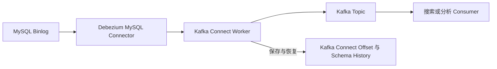
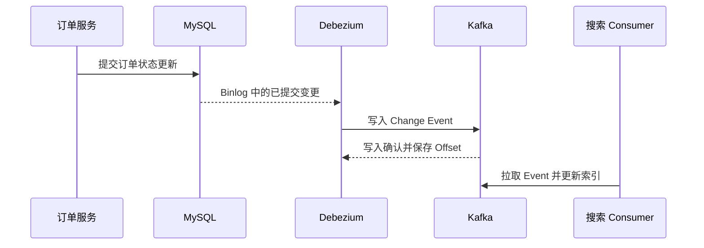

## 1. 它是什么

**Debezium 是基于数据库事务日志的变更数据捕获平台，把 MySQL Binlog、PostgreSQL WAL 等已提交变更转换成持续输出的 Change Event。**

第一阶段只需理解：Connector 怎样从快照切换到日志流，一条订单更新 Event 长什么样，Kafka Connect 保存什么状态，以及 Debezium 为什么适合把数据库变更送进 Kafka、却不等于业务事件系统。

最常见组合是 MySQL → Debezium → Kafka → Elasticsearch、ClickHouse 或其他业务 Consumer。MySQL 仍是订单的事实来源；Debezium 只读取已经提交的事实并生成派生事件。Kafka 负责持久化和分发这些事件，下游决定如何建立搜索索引、分析表或缓存，不能反过来让 Debezium 中的消息承担订单事务。

Debezium 通常运行在 Kafka Connect 中，也可以运行在 Debezium Server、嵌入式引擎等模式。本文采用最常见的 Kafka Connect 模型，因为它最容易解释 Connector 配置、Topic、Offset 和下游 Consumer 的关系。

## 2. 为什么选择 Debezium，而不是业务双写或 Canal

假设订单服务在 MySQL 中把 `orders.A1001.status` 从 `CREATED` 更新为 `PAID`。搜索服务需要更新订单索引，分析服务需要统计已支付订单，两个下游都不能漏掉实际落库的变更。

| 主要约束 | 更自然的选择 | 原因与边界 |
|---|---|---|
| 事件本身就是明确业务动作，且业务要在同一流程中控制发送时机 | Outbox 或业务事件 | 可以表达“支付完成”等业务语义；仍需处理数据库与消息的一致性 |
| 多种数据库的变更需要标准化地进入 Kafka，并复用 Connect 生态 | Debezium | 连接器、快照、事务日志读取和事件格式成熟；需要运维 Kafka Connect、Topic 与状态数据 |
| 主要只有 MySQL，消费端希望直接订阅 Binlog 并自行投递下游 | Canal | 链路更贴近 MySQL 订阅模型；跨数据库和 Kafka Connect 生态不如 Debezium 自然 |

Debezium 的 Event 表达的是“某行已发生了什么数据变化”，不一定等于“业务上发生了什么”。例如订单 `status` 改为 `PAID` 的 Binlog 事件未必包含支付渠道、风控结果等完整语义；因此关键业务流程仍常使用 Outbox 明确发布业务事件，再把 Debezium 用于搜索、数仓、审计或数据同步。

当团队已经以 Kafka 作为事件总线，并且 MySQL、PostgreSQL 等多个数据库都需要接入时，Debezium 特别合适。若变更之后马上要做多表关联、窗口聚合或复杂实时 ETL，Flink CDC 或 Flink 消费 Debezium Topic 会更自然；单纯同步一张 MySQL 表时，不必因为 Debezium 功能全面就引入过多组件。

## 3. 最小工作模型

先看一个 MySQL Connector 和一个 Kafka Connect Worker：



Connector 用 MySQL 复制协议读取 Binlog。每次事务提交后，Connector 把行级 `INSERT`、`UPDATE`、`DELETE` 转成 Change Event，交给所在的 Connect Worker；Worker 再把 Event 写入与源表对应的 Kafka Topic。下游 Consumer 以自己的 Consumer Group 读取 Topic，不会直接连接 MySQL。

Connect 的 Offset 记录 Connector 已成功处理到的 Binlog 位置；Schema History 保存 DDL 与对应位置，用于重启后恢复“当时这张表有哪些列”。这两类状态都不是业务数据，却决定 Connector 能否连续恢复。Kafka Topic 保存交付给下游的 Event；MySQL Binlog 则是 Connector 回放的原始来源。

## 4. Connector、Snapshot、Offset 与 Change Event

### Connector：谁读库、谁发 Event

Connector 是一份运行配置，包含数据库地址、账号、待捕获表、Topic 前缀和快照策略。Connect Worker 负责启动、停止和重启 Connector。对 MySQL 而言，数据库必须开启 Row Binlog；Connector 作为复制客户端读取已提交事务，不会通过轮询业务表来猜测哪些行变化了。

### Snapshot：先建立存量基线

首次启动时，默认的 `initial` 模式会创建一致性快照：Connector 记录一个 Binlog Position，在一致性视图中扫描表的当前行，并把每行作为 `op: "r"` 的读取事件发到 Kafka；随后从那个 Position 继续读 Binlog。这样快照期间新发生的更新不会被遗漏。

大表快照会占用数据库资源，锁策略、权限和启动时间都需要评估。若 Connector 中断，Offset 尚未完整保存或 Binlog 已被 MySQL 清理，就可能需要重新快照或采用增量快照策略；Binlog 保留时间不是无关紧要的数据库参数。

快照中的 `op: "r"` 表示“启动时读到这一行”，并不表示用户刚插入了它。下游通常把它当作一次 Upsert 来建立初始副本；若把 `r` 误当成业务创建事件，首次同步时可能错误触发通知、积分等副作用。CDC 的存量建立和业务历史回放必须分开设计。

### Offset 与 Schema History：重启从哪里继续

Offset 不是 Kafka Consumer 的消费 Offset，而是 Source Connector 读到的源端 Position。Worker 重启后，Connector 从已保存的 Position 继续读取；Schema History 则按 DDL 重建内存中的表结构，使较早的变更仍按当时 Schema 解析。丢失或误改这些内部 Topic，可能让 Connector 无法安全恢复。

### Change Event：一行变化的可观察表示

对于订单状态更新，概念化的 Debezium Event 如下：

```json
{
  "op": "u",
  "before": {"id": "A1001", "status": "CREATED"},
  "after": {"id": "A1001", "status": "PAID"},
  "source": {"file": "mysql-bin.000123", "pos": 456},
  "ts_ms": 1788650402000
}
```

`before`、`after` 表示变更前后值，`op` 表示操作类型，`source` 让下游能追溯来源位置。真实报文还包含 Schema、事务与时间等信息；下游可使用 SMT 或 Consumer 代码做扁平化，但不应在不知道删除、更新和 Schema 演进语义时盲目丢字段。

写入 Kafka 时，通常用表主键作为消息 Key，让同一订单的事件进入同一 Topic Partition，从而保持这个订单的局部顺序。它不提供跨订单、跨表的全局顺序；例如订单行和支付行的两个 Topic 被不同 Consumer 消费时，仍需要靠事务标识、版本和业务模型决定怎样组合。

## 5. 一次订单变更如何到达 Kafka

Connector 的最小配置重点如下，省略生产所需的 TLS、权限与监控：

```json
{
  "name": "orders-cdc",
  "config": {
    "connector.class": "io.debezium.connector.mysql.MySqlConnector",
    "database.hostname": "mysql",
    "database.server.id": "5401",
    "topic.prefix": "shop",
    "table.include.list": "shop.orders",
    "snapshot.mode": "initial"
  }
}
```

这份配置提交给 Kafka Connect 后，Connector 首次把 `shop.orders` 的存量行写为读取 Event，完成后持续跟随 Binlog。订单服务执行 `UPDATE orders SET status='PAID' WHERE id='A1001'` 并提交事务，MySQL 先写 Binlog；Debezium 读到该事务后才产生上节的 `op: "u"` Event，并写入类似 `shop.shop.orders` 的 Topic 名称，具体命名由版本与配置决定。



搜索 Consumer 例如可按 `after.id` 更新 Elasticsearch Document。观察 Kafka 中结果时，可以从 Topic 消费到 `op=u`、`before.status=CREATED`、`after.status=PAID` 的 Event；这说明“数据库已提交的行变更”到达了 Kafka，并不表示 Elasticsearch 已经写成功。下游 Consumer 仍要独立提交自己的 Offset 并实现幂等更新。

## 6. 可靠性、顺序与 Schema 演进

Debezium 会在重启后从已保存的源端 Offset 恢复；如果失败发生在 Event 已写入 Kafka、但 Offset 尚未持久化的窗口，重读可能产生重复 Event。因此下游通常按主键做 Upsert，或保存来源 Position 去重。CDC 链路通常以 At-Least-Once 方式设计，不应把“Kafka 可持久化”误解成跨 MySQL、Kafka、Elasticsearch 的 Exactly Once。

单个 MySQL Binlog 中提交顺序是事实顺序，但 Topic Partition、下游并行消费和跨表处理会改变可观察的全局顺序。若某个聚合必须严格按订单 ID 处理，应让相关 Event 保持稳定 Key 并在下游设计版本或幂等规则，而不是假设整个 CDC 系统提供全局顺序。

Connector 成功读取并写入 Topic，也不能让下游外部副作用与 Kafka Offset 原子提交。更新 ES、调用 HTTP、写缓存等动作都可能在重试窗口重复执行；可靠设计是让派生数据能按主键重建、按版本覆盖，或以来源 Position 去重，而不是试图让所有系统共享一个分布式事务。

Schema 改动也是 Event 流的一部分。新增列、改类型、删列会影响 Connector 的 Schema History 和 Consumer 的反序列化；数据库上线应把 DDL、Topic 兼容性和下游 Mapping 一起评审。Debezium 能捕获 DDL 不代表每一个下游都能自动、安全地执行它。

## 7. 设计取舍与容易混淆的概念

Debezium 读取提交后的事务日志，避免业务代码直接双写多个下游；代价是数据具有同步延迟，且下游要面对快照、重复、删除、Binlog 保留和 Schema 演进。Snapshot 用短暂的数据库读取与状态管理换取存量基线；跳过 Snapshot 虽然更轻，却只会捕获启动后的增量。

| 概念 | 主要作用 | 最关键区别 |
|---|---|---|
| Debezium 与 Kafka | 前者生成数据库变更，后者保存和分发事件 | Kafka 不会自动读取 MySQL |
| Change Event 与业务事件 | 前者描述行变化，后者表达领域动作 | 两者可来自同一事务，但语义不同 |
| Snapshot 与 Binlog Streaming | 前者读取启动时存量，后者持续读取增量 | 两者衔接才能不漏变更 |
| Source Offset 与 Consumer Offset | 前者定位 Binlog，后者定位 Topic 消费进度 | 位于 CDC 链路的两端 |
| Schema History 与业务 Topic | 前者是 Connector 内部恢复状态 | 业务 Consumer 不应直接依赖它 |

## 8. 后续可以了解什么

- Outbox Event Router 怎样把 Outbox 表转换成业务 Event？
- 增量快照怎样降低大表首次同步的影响？
- Debezium 的 Transaction Metadata 怎样帮助下游识别事务边界？
- Schema Registry、Avro 或 Protobuf 怎样处理 Event 兼容性？
- MySQL 主从切换与 Binlog 清理时怎样保证 Connector 可恢复？

## 资料来源

- [Debezium Architecture](https://debezium.io/documentation/reference/stable/architecture.html)
- [Debezium MySQL Connector](https://debezium.io/documentation/reference/stable/connectors/mysql.html)
- [Debezium Event Flattening SMT](https://debezium.io/documentation/reference/stable/transformations/event-flattening.html)
- [Debezium Outbox Event Router](https://debezium.io/documentation/reference/stable/transformations/outbox-event-router.html)
- [Debezium Monitoring](https://debezium.io/documentation/reference/stable/operations/monitoring.html)
