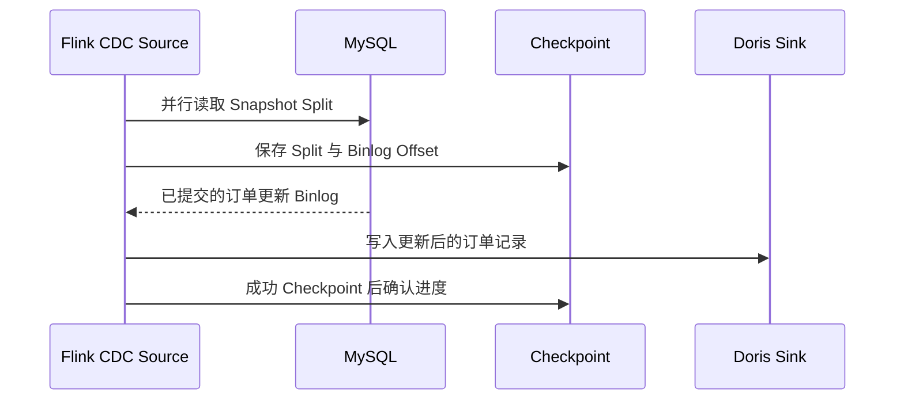

## 1. 它是什么

**Flink CDC 是构建在 Apache Flink 上的流式数据集成工具：它读取数据库快照和增量日志，并在同一个 Flink Job 中完成转换、路由与下游同步。**

第一阶段只需理解：Flink CDC 比单纯 CDC 多了什么，Source、Transform、Sink 与 Checkpoint 分别承担什么，一张 MySQL 订单表怎样同步到分析库，以及为什么它适合实时 ETL、但未必适合最简单的表同步。

它位于业务数据库与实时数仓之间。MySQL 提供订单事实和 Binlog；Flink CDC Source 先读取存量，再跟随增量；Flink Job 在内存中执行过滤、字段计算、路由或 Schema 演进；Sink 把结果写入 Doris、StarRocks、Kafka、Paimon 等下游。ClickHouse、ES 或 Kafka 不是 Flink CDC 的组成部分，而是可被接入的下游系统。

Flink CDC 不是 Debezium 的简单别名。两者都能使用数据库日志捕获变更，但 Debezium 更像专注产生 Change Event 的连接器平台；Flink CDC 把捕获放入有状态、可并行、可 Checkpoint 的流式计算 Job 中，适合在“抓到变更之后”还需要持续加工数据的场景。

## 2. 为什么选择 Flink CDC，而不是 Debezium 或 Canal

仍以 `orders` 表为例：除了把状态变化送往下游，还要过滤测试订单，计算 `paid_amount`，按表名把数据路由到数仓，并在新增列后尽量同步下游 Schema。

| 主要约束 | 更自然的选择 | 原因与边界 |
|---|---|---|
| 主要目标是把多种数据库变更标准化送入 Kafka，由多个 Consumer 自行处理 | Debezium | Kafka Connect 与事件生态更直接；复杂计算交给后续流处理 Job |
| 变更捕获后立刻需要过滤、映射、路由、全库同步或实时 ETL | Flink CDC | Source、Transform、Route、Sink 与 Checkpoint 属于同一 Job；要承担 Flink 集群和状态运维 |
| 只有 MySQL，消费端直接订阅 Binlog 并做少量业务同步 | Canal | MySQL 订阅模型更轻、更直接；多库、全库建表与复杂流式计算不是其主要路径 |

Flink CDC 的优势不是“比 Debezium 更能读取 Binlog”，而是把 CDC 结果带入 Flink 的计算与容错模型。若只是 MySQL 一张表到 Kafka、没有转换和计算需求，运行一个 Flink 集群通常比部署 Debezium 或 Canal 更重。反过来，如果最终仍要启动 Flink Job 做 Join、窗口聚合或实时数仓，把捕获和处理连成一条 Pipeline 能减少中间格式和运维边界。

它依然不取代业务事件。`status=PAID` 的行变更适合同步数仓和索引；“支付完成后发券”这种带业务意图、需要严格编排的动作，应由业务服务或 Outbox 明确建模，不能只依赖下游猜测 Binlog。

## 3. 最小工作模型

先只看一个 MySQL Source 和一个分析库 Sink：


首次启动时，Source 把表按主键范围切成 Snapshot Split，由多个 Source Subtask 并行读取；同时建立持续读取 Binlog 的能力。快照 Split 完成后，Source 切换到增量日志，Flink Job 把每一条变化交给 Transform 和 Sink。实际的数据库读写请求由 Source 与 Sink 发起，业务用户的订单 API 不会经过 Flink。

Checkpoint 是 Flink 定期持久化的 Job 状态：其中包括哪些 Snapshot Split 已完成、读到哪个 Binlog Offset，以及中间算子状态。失败恢复时，Job 从最后一次成功 Checkpoint 恢复，再继续读取；它不是数据库备份，也不是对下游写入自动无条件去重的魔法。

## 4. Pipeline、Source、Transform、Sink 与 Checkpoint

### Pipeline：一份数据移动与处理定义

Flink CDC 的 Pipeline 通常用 YAML 描述 Source、可选 Transform/Route、Sink 与并行度，提交后被编译为 Flink Job。它是一条持续运行的数据管道，不是执行一次就结束的迁移脚本。JobManager 负责协调，TaskManager 上的并行 Subtask 实际读取、计算和写出数据。

### Source：存量与增量怎样连续衔接

MySQL Source 先读取一致性快照，再读取 Binlog。增量快照把大表拆成多个主键范围，允许快照过程做 Checkpoint，并在完成后无缝进入日志流；这样避免“扫描旧表时漏掉新更新”。前提是表有可用于切分的合适主键或 Chunk Key，严重倾斜的 Key 仍会造成 Subtask 负载不均。

启动模式也决定数据边界：`initial` 先同步当前存量再读取后续 Binlog，`latest-offset` 只接收 Job 启动后的增量，`earliest-offset` 则尝试从仍可访问的最早 Binlog 开始。选择较轻的模式不等于更安全；如果下游需要完整订单副本，却跳过存量阶段，就必须通过其他全量导入建立基线。

### Transform 与 Route：在数据还未落下游时处理

Transform 可以投影列、计算字段、过滤行和调用函数；Route 决定一张源表或一类表要写入哪个下游表。它们处理的是不断到达的 Change Event，而非把整张表先加载进内存。复杂 Join、窗口聚合等更一般的流计算可以放在 Flink 生态中完成，但第一阶段先把它理解为“在同步途中做受控 ETL”。

这里的转换应尽量是可重放、确定性的：同一条订单变更在故障恢复后再次经过 Transform，应得到同样结果。把当前系统时间、随机数或无法幂等的外部 HTTP 调用塞进同步主链路，会让 Checkpoint 恢复后的结果难以解释，也会削弱 CDC 的可恢复性。

### Sink 与 Schema Evolution：谁真正保存结果

Sink 把处理后的记录写入 Kafka、Doris、StarRocks、Paimon 等目标。某些 Sink 可根据上游 Schema 创建目标表，或按策略处理新增列、改类型等 DDL；是否能无损同步仍取决于目标系统能力。Flink CDC 捕获到 DDL 不等于下游一定适合自动执行 `DROP TABLE` 或缩窄字段类型。

## 5. 一张订单表怎样同步到分析库

下面是精简的 Flink CDC YAML，表达把 `shop.orders` 持续同步到 Doris 的主线；认证、Checkpoint 目录和生产参数省略：

```yaml
source:
  type: mysql
  hostname: mysql
  port: 3306
  username: cdc
  password: secret
  tables: shop.orders
  server-id: 5400-5404

sink:
  type: doris
  fenodes: doris-fe:8030
  username: root
  password: ""

pipeline:
  name: Sync orders to Doris
  parallelism: 2
```

提交 YAML 后，Flink CDC 创建 Job。第一阶段的两个 Source Subtask 分别读取不同订单 ID 范围，记录各自进度到 Checkpoint；随后订单服务提交 `A1001` 的付款更新，MySQL Binlog 产生更新记录，Source 将其转成变更记录，经 Sink 写入 Doris。



分析方可以在 Doris 查询：

```sql
SELECT id, status, paid_at
FROM orders
WHERE id = 'A1001';
```

结果会看到 `A1001 | PAID | 2026-09-06 10:00:02`。这说明 Sink 已接收变更；如果 Job 在写入后、完成 Checkpoint 前失败，恢复时可能重新处理这段数据。要得到端到端 Exactly Once，Source、Flink Checkpoint 与 Sink 都必须支持相应语义，目标表也应按主键 Upsert 或幂等写入设计。

## 6. Schema 演进、状态与一致性

Flink CDC 可将上游建表、加列、改列等 Schema Change 传给 Schema Operator，再由 Sink 按 `evolve`、`try_evolve`、`lenient`、`ignore` 等策略处理。默认的宽容策略会尽量避免下游直接丢数据，但例如删表、删列或不兼容类型变更仍需人工决策；“自动同步 Schema”不是让生产 DDL 可以不经评审。

Flink 的 Exactly Once 首先表示：发生故障后，Job 的内部状态从同一个成功 Checkpoint 恢复，Source 不会任意跳过或重复推进已确认的 Offset。只有 Sink 支持事务或幂等提交，并且 Job 正确配置 Checkpoint 存储时，端到端结果才可能满足 Exactly Once。发送 HTTP、写普通数据库或调用第三方接口时，仍要自己处理重试和幂等键。

全库同步会同时面对大量表、Schema 与并行度。表数、主键分布、Binlog 产生速率和 Sink 写入能力共同决定吞吐；只把 `parallelism` 调大可能增加数据库连接与下游压力，并不必然更快。

Flink 的 Backpressure 是一个可观察信号：当 Sink 写得慢，完成 Checkpoint 的时间会拉长，上游 Source 也会减速，Binlog 延迟随之增长。它不是单纯的“Flink 性能不好”，而是在告诉你整条管道中最慢的下游已限制了数据进入速度；排查应同时看 Source Lag、Checkpoint 时长、Task 吞吐和目标库写入能力。

## 7. 设计取舍与容易混淆的概念

Flink CDC 用分布式 Snapshot、持续日志流和 Checkpoint 换取可恢复的实时同步与计算；代价是需要运行 Flink、管理状态存储、规划 Backpressure 和处理 Sink 语义。YAML 降低了编写 Job 的门槛，却没有取消数据库权限、Schema、Binlog 保留和数据质量治理。

| 概念 | 主要作用 | 最关键区别 |
|---|---|---|
| Flink CDC 与 Debezium | 前者把 CDC 放入 Flink Pipeline，后者专注产生 Change Event | 两者可组合，不是简单替代 |
| Snapshot Split 与 Binlog Offset | 前者定位存量扫描范围，后者定位增量日志位置 | Checkpoint 需要同时保存两类状态 |
| Checkpoint 与 Savepoint | 前者是故障恢复的周期性状态，后者用于受控升级或迁移 | 都保存状态，但使用时机不同 |
| Transform 与 Sink | 前者改变或筛选流中数据，后者写入外部系统 | Sink 才决定数据最终落点 |
| Exactly Once 与幂等写入 | 前者是端到端处理语义目标，后者是下游抵抗重复的手段 | 不能只靠其中一个 |

## 8. 后续可以了解什么

- 增量快照怎样在并发更新下保持无遗漏？
- Flink Checkpoint、Barrier 和两阶段提交怎样协作？
- 全库同步时怎样处理新增表、DDL 和下游建表？
- MySQL Source 怎样规划 `server-id`、Chunk Key 与并行度？
- Flink CDC 与 Debezium Topic、Kafka、Paimon 如何组合成实时数仓？

## 资料来源

- [Flink CDC Introduction](https://nightlies.apache.org/flink/flink-cdc-docs-stable/docs/get-started/introduction/)
- [Flink CDC MySQL Source](https://nightlies.apache.org/flink/flink-cdc-docs-release-3.6/docs/connectors/flink-sources/mysql-cdc/)
- [Flink CDC Core Concepts](https://nightlies.apache.org/flink/flink-cdc-docs-stable/docs/core-concept/)
- [Flink CDC Schema Evolution](https://nightlies.apache.org/flink/flink-cdc-docs-stable/docs/core-concept/schema-evolution/)
- [Apache Flink Checkpoints](https://nightlies.apache.org/flink/flink-docs-stable/docs/ops/state/checkpoints/)
