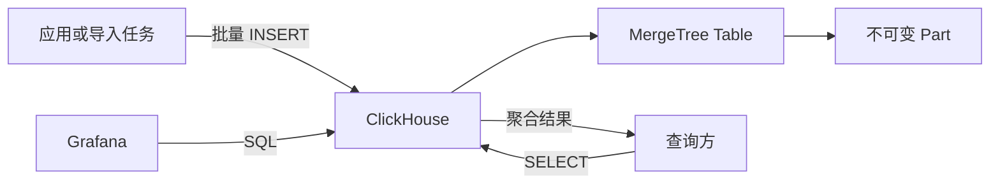

## 1. 它是什么

**ClickHouse 是一个面向 OLAP 的列式数据库，擅长对海量明细数据执行过滤、聚合、分组和时间范围分析。**

第一阶段只需理解：列式存储为什么适合分析查询，MergeTree、Part、Partition、`ORDER BY` 和稀疏主键索引分别是什么，一批数据怎样写入并变得可查询，以及 Replica、Shard 和 Distributed Table 分别解决什么问题。

ClickHouse 常位于业务数据库和报表之间。MySQL、PostgreSQL 或 MongoDB 保存订单等在线业务状态，Kafka、CDC 或批处理任务把事件和变更同步到 ClickHouse，Grafana 或 BI 工具查询聚合结果。它保存的是可长期分析的明细或聚合数据，不是只做展示的 Dashboard，也不应默认替代业务数据库。

## 2. 为什么选择 ClickHouse，而不是 MySQL 或 Elasticsearch

假设系统每天产生数亿条 API 请求记录，每条包含时间、服务名、接口、状态码和耗时。运营需要按小时统计请求量、错误率和 P95 延迟；排障人员偶尔还要搜索错误消息。三种数据库都能保存这些数据，也都能做一定程度的过滤和聚合，但各自最自然的主路径不同。

| 主要需求 | 更自然的选择 | 原因与边界 |
|---|---|---|
| 数据量不大，主要按 Request ID 点查完整记录，并与业务写入共用现有数据库 | MySQL | 行式存储适合取得完整的一行，也不必新增同步链路；报表扫描变重后应隔离资源 |
| 对海量追加事件按时间和维度扫描，计算聚合、分位数与趋势 | ClickHouse | 只读取查询涉及的列，并利用排序和稀疏索引跳过数据块；单行更新和跨行强事务不是它的主模型 |
| 根据自然语言、错误片段或模糊条件搜索日志，并按相关性返回文档 | Elasticsearch | 倒排索引适合全文检索；它也能聚合，但纯结构化大范围 SQL 分析通常不是选择它的主要理由 |

关键不是“谁功能更多”，而是最高频的问题是什么。MySQL 也可以按时间 `GROUP BY`，ClickHouse 也可以点查和删除，Elasticsearch 也可以计算指标；只是绕开各自主要数据模型后，往往要付出更多索引、重写、资源隔离或运维成本。若每天只有几十万行、现有 MySQL 报表已经足够快，引入 ClickHouse 的同步链路、监控和备份反而不划算。

ClickHouse 更适合日志与事件分析、用户行为分析、广告报表、时序明细和实时数仓：数据以追加或批量写入为主，查询通常读取少数列却覆盖大量行，允许分析副本与业务真相之间存在可控延迟。若核心需求是高频单行增删改、跨表事务、外键或唯一约束，应优先保留 MySQL；若核心是全文搜索和相关性，应优先考虑 Elasticsearch。

真实系统经常组合使用，而不是三选一：MySQL 是订单事实来源，CDC 把 Binlog 变化送入 Kafka，消费任务转换后批量写入 ClickHouse，Grafana 再查询分析副本。同步任务需要处理延迟、重复和重放，ClickHouse 中暂时落后的订单不能反过来作为扣款依据。若同一批日志既要关键词检索又要低成本聚合，也可以分别进入 Elasticsearch 和 ClickHouse，但团队要承担双写一致性和两套系统的运维成本。

## 3. 最小工作模型

先只看一个 ClickHouse Server 和一张 MergeTree 表：



写入方把多行数据组织成 Block 发送给 ClickHouse。MergeTree 对 Block 按排序键整理并写成新的不可变 Part；后台任务逐步把多个小 Part 合并成较大的 Part。查询读取相关 Part 中需要的列，完成过滤、聚合和排序后直接返回结果。

ClickHouse 保存的是分析数据本身，不只是缓存查询结果。Grafana 查询 ClickHouse 时，聚合由 ClickHouse Server 执行，Grafana 只接收较小的结果集并绘图。业务用户发起的 API 请求不会自动经过 ClickHouse，除非应用明确把它作为查询后端。

## 4. 列、MergeTree、Part 与排序键

### 列式存储：同一列连续保存

行式数据库倾向于把一行的多个字段放在一起，适合根据主键取出完整订单。列式存储把同一列的值连续组织。查询一亿条请求的平均延迟时，只需要读取时间、服务名和延迟列，不必把 URL、User Agent 等其他列也从磁盘读出。

同类型值连续出现也更容易压缩，例如状态码和服务名往往重复很多。ClickHouse 还按列成批执行表达式，减少逐行解释和函数调用成本。代价是读取单条完整宽记录、频繁修改少数行通常不如 OLTP 数据库自然。

### MergeTree：最常用的表引擎家族

Table Engine 决定数据怎样保存、复制和查询。MergeTree 是最常用的本地持久表引擎，名称里的 Merge 指后台合并数据 Part，不表示它会像关系数据库一样自动执行 Join。

`ReplacingMergeTree`、`SummingMergeTree`、`AggregatingMergeTree` 等变体会在合并期间执行特定处理，但结果通常不是写入后立刻全局生效。第一阶段应先掌握普通 MergeTree，再根据去重或预聚合需求选择变体。

### Part：每批写入形成的不可变数据片段

一次 Insert 通常生成一个新 Part。Part 内的行按照表的 `ORDER BY` Key 排序，各列分别写入压缩数据文件，并记录索引 Mark 和统计信息。Part 写成后基本不可变；Update、Delete 等 Mutation 往往通过重写受影响 Part 完成，而不是就地改一个磁盘位置。

后台 Merge 会选择同一 Partition 内的若干 Part，归并为更大的有序 Part，再替换旧 Part。大量细小 Insert 会制造 Too Many Parts、增加元数据和合并压力，因此 ClickHouse 更偏好批量写入，或使用异步写入在服务端聚合小请求。

### ORDER BY 与稀疏主键索引

MergeTree 的 `ORDER BY` 决定 Part 内数据的物理排序，也是最重要的查询设计。ClickHouse 不为每一行建立传统 B-Tree 入口，而是把若干行组成 Granule，并在主键索引中为 Granule 保存 Mark。查询条件与排序键前缀相关时，可以跳过大量不可能命中的 Granule。

因此，`ORDER BY (service, event_time)` 适合经常先按 Service、再按时间查询的数据；如果主要查询只有 `event_time`，却把高随机字段放在排序键最前面，数据跳过效果会很差。ClickHouse 的 Primary Key 默认通常与排序键一致，但它不意味着唯一约束，多行可以拥有相同 Key。

### PARTITION BY：管理数据生命周期

Partition 把一张表的 Part 按表达式分组，例如按月 `toYYYYMM(event_time)`。后台 Merge 只在同一 Partition 内进行，也可以快速 Drop 或移动整个 Partition。它主要用于生命周期和数据管理，不是越细查询越快。

按天甚至按用户创建大量 Partition 会产生过多目录和 Part，增加管理成本。多数查询性能首先依赖 `ORDER BY` 和数据跳过，Partition Pruning 只是额外减少需要访问的分区。

## 5. 一批请求数据如何写入和查询

下面创建一张 API 请求明细表：

```sql
CREATE TABLE api_requests
(
    event_time  DateTime,
    service     LowCardinality(String),
    endpoint    String,
    status      UInt16,
    duration_ms UInt32
)
ENGINE = MergeTree
PARTITION BY toYYYYMM(event_time)
ORDER BY (service, event_time);
```

应用、Kafka Consumer 或导入任务批量写入：

```sql
INSERT INTO api_requests VALUES
('2026-09-05 10:00:01', 'order', '/orders', 201, 82),
('2026-09-05 10:00:02', 'order', '/orders', 500, 320),
('2026-09-05 10:00:03', 'payment', '/pay', 200, 110);
```

Server 将输入转换成内部 Block，校验列类型，对数据按 `(service, event_time)` 排序，再创建一个 Part。数据已经可以查询；后台 Merge 只是逐步优化 Part 数量和布局，并不是普通查询可见性的必要前提。

查询最近一小时订单服务的请求量、错误率和 95 分位延迟：

```sql
SELECT
    count() AS requests,
    countIf(status >= 500) / count() AS error_rate,
    quantile(0.95)(duration_ms) AS p95_ms
FROM api_requests
WHERE service = 'order'
  AND event_time >= now() - INTERVAL 1 HOUR;
```

结果可能是：

```text
requests | error_rate | p95_ms
-------- | ---------- | ------
1200000  | 0.0082     | 186
```

查询利用排序键先定位 `service='order'` 的 Granule，再检查时间范围，只读取过滤和聚合需要的几列。Grafana 可以周期性执行同类 SQL 并画出时间序列；如果每个面板都扫描数月原始数据，可以使用 Materialized View 预聚合到分钟级表。

## 6. 查询、索引与预聚合

ClickHouse 的核心优化顺序通常是：让查询尽量读取少量列，通过 Partition 和排序键跳过数据，再对剩余列进行向量化计算。普通二级 Data Skipping Index 保存每个数据块的额外摘要，例如 MinMax、Set 或 Bloom Filter，用来排除不可能命中的块；它不是传统数据库中保证快速单行定位的普通 B-Tree。

Materialized View 在源表收到 Insert Block 时执行查询，并把结果写入目标表。它适合把每条请求预聚合为“每分钟、每服务”的次数和耗时状态，减少 Dashboard 重复扫描。它通常只处理新插入的数据，不会自动重新计算历史数据，修改 View 后需要单独回填。

ClickHouse 支持 Join、Window Function 和复杂聚合，但维度表过大、Join 顺序不当或高并发宽范围查询仍会消耗大量内存。能写出 SQL 不等于所有关系型查询都适合在 ClickHouse 执行。

## 7. 写入、更新与数据正确性

ClickHouse 偏好追加和批量写入。单条 Insert 也能执行，但每次都可能生成小 Part；批量能摊薄网络、排序、压缩和文件创建成本。异步 Insert 可以先在服务端缓冲多次小写入再成批落盘，但需要理解确认时点与服务异常时的数据风险。

MergeTree 中的行默认不会因为排序键相同而覆盖。`ReplacingMergeTree` 可在后台合并时保留某个版本，但合并时间不确定，查询在此之前可能看到多个版本；需要即时去重时可能使用 `FINAL` 或查询聚合，同时承担额外成本。

Update 和 Delete 通常通过 Mutation 重写 Part，适合低频修正，不适合 OLTP 式持续单行更新。轻量 Delete 等能力可以先用删除标记隐藏行，后台再清理物理数据，但仍应评估扫描与合并成本。

## 8. Replica、Shard 与 Distributed Table

Replica 保存同一 Shard 的数据副本，用于节点故障恢复和分担读取；Shard 保存不同数据子集，用于扩大容量和并行处理。两台 Replica 不是两个 Shard，增加副本不会自动扩展同一份数据的写入分片能力。

自建集群常用 ReplicatedMergeTree，并通过 ClickHouse Keeper 协调复制元数据。写入某个 Replica 后，其他 Replica 获取 Part 或重建对应数据；复制通常是异步的，节点故障切换、写入 Quorum 和去重行为需要结合具体配置判断。Replica 也不是 Backup，错误删除可能传播到所有副本。

Distributed Table 本身通常不保存业务数据，而是一个跨节点路由与查询入口。写入时根据 Sharding Key 把行发往某个 Shard，查询时把子查询下发到相关 Shard，再在发起查询的节点合并结果。没有选择性条件的查询可能访问所有 Shard。

Shard Key 分布不均会形成热点；跨 Shard `GROUP BY`、`ORDER BY` 和 Join 会产生网络传输与二次聚合。扩容不只是增加 Server，还涉及拓扑配置、数据重分布和查询路由。

## 9. 设计取舍与容易混淆的概念

列式存储、压缩和向量化执行用“读取少数列、扫描大量行”的前提换取高吞吐分析；MergeTree 用不可变 Part 和后台合并提高批量写入效率，代价是小批写入、频繁更新和合并压力需要额外治理；稀疏索引用较小内存开销换取数据块级跳过，但不能保证任意条件下快速点查。

| 概念 | 主要作用 | 最关键区别 |
|---|---|---|
| ClickHouse 与 MySQL | 前者面向大范围分析，后者面向在线事务 | ClickHouse 不适合替代订单事务库 |
| Partition 与 Shard | 前者是表内生命周期分组，后者把数据分到不同节点 | 一个是数据组织，一个是集群扩展 |
| ORDER BY 与唯一主键 | 前者决定物理排序和稀疏索引 | 默认不保证值唯一 |
| Part 与 Partition | Part 是一次写入或合并产生的物理片段 | 一个 Partition 可包含多个 Part |
| Replica 与 Backup | Replica 提供在线副本，Backup 保存可恢复历史 | 错误操作可能同步到 Replica |

## 10. 后续可以了解什么

- MergeTree Part、Granule、Mark 和压缩块在磁盘上如何组织？
- 怎样根据查询模式设计 `ORDER BY`、Partition 和 Shard Key？
- ReplacingMergeTree 为什么不能提供即时唯一 Upsert？
- Materialized View 怎样设计回填、去重和聚合状态？
- ReplicatedMergeTree、Distributed Table 与 ClickHouse Keeper 如何协作？

## 资料来源

- [When Should You Use a Columnar Database?](https://clickhouse.com/resources/engineering/when-to-use-columnar-database)
- [MergeTree Table Engine](https://clickhouse.com/docs/engines/table-engines/mergetree-family/mergetree)
- [Primary Indexes](https://clickhouse.com/docs/primary-indexes)
- [Sharding and Replication](https://clickhouse.com/docs/architecture/horizontal-scaling)
- [Why Columnar Databases Are Fast](https://clickhouse.com/resources/engineering/why-columnar-databases-are-fast)
