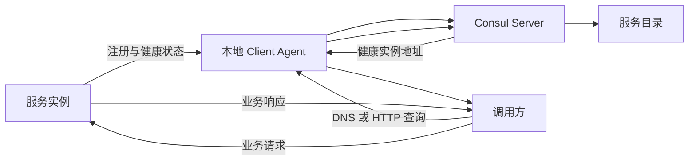
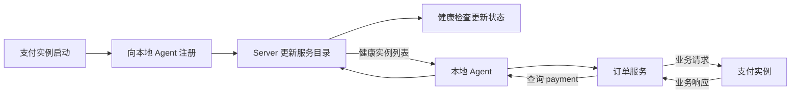
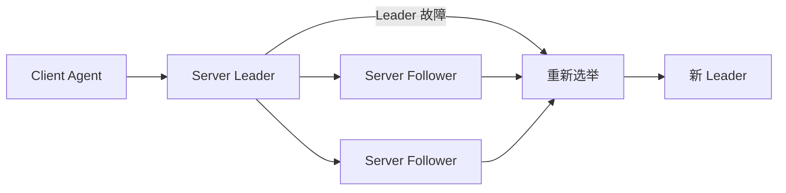
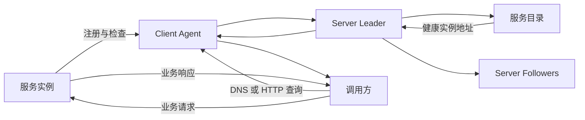

## 1. 它是什么

**Consul 是一个分布式服务网络平台，通过维护服务目录和健康状态，为系统提供服务发现；启用服务网格后，还能管理服务间通信的安全与流量。**

它通常部署在业务服务旁边以及独立的 Consul Server 节点上，位于业务服务和动态基础设施之间。它主要解决服务实例地址不断变化时，调用方如何找到健康实例，以及服务之间如何安全通信的问题。

最常见的使用场景包括：微服务注册与发现、健康检查、通过 DNS 或 HTTP API 查询服务，以及通过服务网格实现 mTLS 和流量治理。Consul 还提供 KV 存储等能力，但它不是通用数据库、消息队列，也不会执行业务逻辑。

Consul 经常被称为“注册中心”，但这只描述了它的核心能力之一。更准确地说，它是服务网络平台：服务目录负责发现，代理和策略负责服务网格。本文以当前 Consul 2.0.x 的通用架构为主；Consul Enterprise、HCP Consul 和不同运行环境会增加额外能力，但不改变下面的核心模型。

## 2. 最小工作模型

先只考虑一组 Consul Server、一个业务服务和一个调用方：

**Consul Agent（Consul 代理进程）** 是运行 Consul 功能的常驻进程，可以采用 Client 或 Server 模式。业务服务通常向同一节点上的 Client Agent 注册地址、端口和健康检查。Client Agent 把这些状态同步给 Server，Server 将其写入服务目录。

调用方查询某个服务时，本地 Agent 通过 Server 获取健康实例地址并返回。随后， **真正的业务请求由调用方直接发给服务实例，不经过 Consul**。因此，在普通服务发现模式中，Consul 负责“告诉你目标在哪里”，而不是充当业务流量的反向代理。

## 3. 核心概念与关系

**Client Agent（客户端代理）** 通常运行在每台计算节点上，接收本机服务注册、执行健康检查、提供本地 DNS 或 HTTP 接口，并与 Server 通信。这里的 Client 指 Consul 节点角色，不是业务调用方。

**Server Agent（服务端代理）** 负责保存集群状态、响应查询并参与一致性协议。生产环境通常部署 3 个或 5 个 Server，而不是让所有 Client 都参与一致性过程。

**Service Catalog（服务目录）** 记录节点、服务实例、地址、端口、标签及健康状态。它保存的是“服务在哪里、是否健康”等元数据，不保存订单、用户等业务数据。

**Service 与 Service Instance（服务与服务实例）** 是名称和运行实体的关系。例如，`payment` 是服务，3 个不同 IP 和端口的进程是 3 个服务实例。发现服务时，Consul 查询的是这个名称下符合条件的健康实例。

**Health Check（健康检查）** 判断节点或服务实例是否可以参与服务发现，状态通常包括 `passing`、`warning` 和 `critical`。检查结果进入服务目录，使调用方不必继续使用已经确认故障的实例。

**Datacenter（数据中心）** 是能够独立完成基本 Consul 操作的管理边界，内部包含一组 Server 和若干 Client。单个 Datacenter 内的 Server 使用 Raft 维护一致状态。

## 4. 一次典型操作如何完成

以订单服务调用支付服务为例：

支付实例首先注册服务名称、地址、端口和检查规则。本地 Agent 保存该节点的本地状态，再向 Server 同步。涉及服务目录变更时，由 Server Leader 通过 Raft 提交，使其他 Server 得到一致结果。

订单服务随后查询 `payment.service.consul`，或者调用健康服务 HTTP API。Consul 根据服务目录过滤故障实例，返回可用地址。DNS 响应可能包含多个经过随机排序的记录，订单服务、客户端库或外部负载均衡器再从中选择目标。

最后，订单服务直接连接支付实例。Consul 不处理支付逻辑，也不会代替支付服务返回业务结果。如果启用了服务网格，业务连接会经过两侧代理，但实际支付逻辑仍由支付服务完成。

## 5. 主要能力如何实现

### 服务注册与状态同步

推荐将服务注册到本地 Agent，而不是直接写入底层 Catalog API。本地 Agent 把本节点状态视为权威状态，通过 **Anti-entropy（反熵同步）** 周期性校准服务目录。短暂网络故障恢复后，Agent 可以重新补齐注册信息。

### 健康服务发现

Client Agent 可以按照固定间隔执行 HTTP、TCP、gRPC、脚本等主动检查；TTL 检查则要求外部程序定期上报存活状态。标准 DNS 查询会排除检查失败的实例。

Consul DNS 返回地址记录，本身不承载后续业务连接。它可以随机化返回实例的顺序，但最终如何选择目标、重试请求和保持连接，仍取决于调用方、客户端库或外部负载均衡器。

### 分布式锁

Consul 可以通过 **Session（会话）与 KV 存储** 构建分布式锁。参与者先创建 Session，再使用 Session ID 对指定 KV Key 执行 `acquire` 操作。只有在 Key 尚未被其他 Session 占用时，获取操作才会成功。

Session 可以与节点健康检查或 TTL 关联。当 Session 到期、健康检查进入 `critical` 状态、节点被注销或者 Session 被主动销毁时，Consul 会释放或删除它持有的锁。官方同时提供了更高层的 `consul lock` 命令。

这种锁属于 **Advisory Lock（协作式锁）**：所有参与者必须遵守同一套加锁规则。它适合 Leader 选举、单实例定时任务和低频控制操作，但不能自动阻止已经失去锁的旧持有者继续操作外部资源。严格一致场景还应使用 `LockIndex`、Session 等信息构造 Fencing Token，并让被保护资源验证调用者仍然拥有锁。

### 服务网格

启用 Consul Service Mesh 后，服务旁边通常部署 Envoy 等数据平面代理。Consul 控制平面向代理下发服务地址、证书和访问策略，代理负责实际转发、mTLS、负载均衡及部分故障处理。

这时业务流量经过代理，但仍然不经过 Consul Server。Server 管理规则，代理执行规则，业务服务处理业务。

## 6. 可靠性与扩展

### 后端节点故障

主动健康检查会直接探测实例；TTL 检查依赖应用主动续期。二者的结果都会更新服务目录。服务网格代理还可以根据真实请求中的连接错误进行被动健康判断，但这属于代理的数据平面能力，不等同于通用的 Catalog 健康检查。

检查存在时间窗口：实例刚刚故障但检查尚未更新时，仍可能被返回。因此，调用方依然需要超时、重试和幂等设计，不能把可靠性全部交给 Consul。

### Consul 自身节点故障

Client Agent 故障会影响本机注册、健康检查和服务查询。如果应用只配置一个本地 DNS 地址，它仍然可能形成局部单点。

Server Leader 故障后，只要多数 Server 存活，Raft 就可以选出新的 Leader。3 个 Server 能容忍 1 个故障，5 个 Server 能容忍 2 个故障。失去多数派后，集群不能安全提交服务目录变更。

增加 Server 并不会线性提高吞吐量，反而会增加共识成本，因此通常选择 3 个或 5 个 Server，并将它们部署在不同故障域。

### 性能与容量

Client Agent 可以随计算节点水平扩展，DNS 查询还可以使用 Agent Cache。Server 是有状态的控制平面，应根据注册数量、查询量和变更频率进行容量规划。

更大规模通常通过合理缓存、限制高频状态变化和划分 Datacenter 等方式扩展，而不是不断增加 Raft Server。

Raft 日志和 Snapshot 用于恢复 Consul 集群状态；Backup 用于应对误操作、灾难或整组数据丢失。Replica、Snapshot 和 Backup 解决的问题并不相同。

## 7. 为什么这样设计

**控制平面与业务流量分离。** Consul Server 维护服务信息，但普通服务发现模式不转发业务请求。这避免了所有流量集中经过注册中心，也使控制平面短暂波动不必立即中断已经建立的业务连接。

**Client 与 Server 分工。** Client 在服务附近执行健康检查并承接本地查询，Server 集中维护权威服务目录。大量业务节点因此不必加入 Raft，共识集群的规模可以保持较小。

**Raft 只用于需要一致的 Server 状态。** 服务目录变更经过 Leader 排序并复制，避免多个 Server 对服务注册产生冲突。代价是写入依赖多数派，Server 数量越多，提交成本通常越高。

**Gossip 与 Raft 分工。** Gossip 适合传播成员关系和故障信息；Raft 适合维护有顺序、可复制的权威状态。前者强调传播效率，后者强调一致性，二者不能互相替代。

## 8. 容易混淆的概念

| 概念 | 主要作用 | 最关键区别 |
|---|---|---|
| Client Agent 与 Server Agent | 前者处理本地注册和检查，后者保存集群状态 | 只有 Server 参与 Raft |
| Service Catalog 与 KV Store | 前者保存服务网络元数据，后者保存通用键值 | KV 数据不是服务注册信息，更不是业务数据库 |
| 服务发现与负载均衡 | 前者找到候选实例，后者从候选实例中选择目标 | DNS 返回实例列表不等于 Consul 代理了请求 |
| 健康检查与 Gossip | 前者判断服务或节点是否可用，后者传播成员状态 | 进程存活不代表业务接口健康 |
| 服务发现与服务网格 | 前者返回服务地址，后者代理和治理真实流量 | 只有启用数据平面代理后，业务流量才经过代理 |

## 9. 面试中需要掌握到什么程度

**30～60 秒回答：**

Consul 是 HashiCorp 提供的分布式服务网络平台，常用于服务注册发现和健康检查，也可以通过服务网格管理服务间通信。业务实例一般注册到本地 Client Agent，Agent 把服务地址和健康状态同步到 Server 维护的服务目录；调用方通过 DNS 或 HTTP API 查询健康实例，然后直接请求目标服务。生产环境通常部署 3 个或 5 个 Server，由 Raft 选举 Leader 并复制服务目录状态。它的关键设计是把控制平面与业务流量分开：Consul 决定服务在哪里，业务服务或数据平面代理负责真正处理流量。

**必须掌握：** Consul 的定位；Agent、Server、Catalog、Service、Check 的关系；服务注册和发现流程；业务请求是否经过 Consul；为什么通常部署 3 个或 5 个 Server。

**最好掌握：** DNS 与 HTTP API 的差异；Raft Leader 与 Quorum；主动检查与 TTL 检查；反熵同步；Session 与 KV 如何实现分布式锁；服务网格中控制平面与数据平面的分工。

**深入岗位才需要掌握：** Raft 日志和 Snapshot 恢复、Gossip 协议细节、多 Datacenter 通信、一致性查询模式、大规模 Catalog 性能、分布式锁的 Fencing Token，以及 Envoy xDS 配置下发。

## 10. 面试官可能如何继续追问

> Consul 为什么不能简单地称为数据库？

它只持久化服务网络控制状态和有限的 KV 数据，不负责保存具有复杂查询、事务模型和业务约束的应用数据。

> 服务注册到 Agent 和直接写 Catalog 有什么区别？

注册到 Agent 后，本地状态会通过反熵机制持续同步；直接写 Catalog 属于底层操作，缺少这种本地状态维护能力。

> DNS 查询之后，业务请求会经过 Consul 吗？

普通服务发现模式不会。Consul 返回实例地址，调用方随后直接连接该实例。

> Consul 如何避免调用故障实例？

健康检查会更新服务目录状态，标准发现查询会过滤不健康实例；但调用方仍需处理检查窗口、超时和重试。

> Consul 能实现分布式锁吗？

可以。它使用 Session 标识锁持有者，通过 KV 的 `acquire` 和 `release` 操作实现互斥，并在 Session 失效时自动释放锁。

> Consul 分布式锁是否能够保证业务绝对安全？

不能单独保证。旧持有者可能在网络分区或长时间停顿后继续运行，严格场景还需要 Fencing Token 以及被保护资源的二次校验。

> 为什么生产环境通常使用奇数个 Server？

Raft 依赖多数派。3 个和 4 个节点都只能容忍 1 个故障，但 4 个节点的复制成本更高，因此通常选择 3 个或 5 个。

> Leader 挂了会发生什么？

只要多数 Server 可以通信，Follower 就会重新选举 Leader；选举期间，写入操作可能短暂停顿。

> Consul Client 挂了是否没有影响？

并非如此。本机注册、健康检查和本地查询可能失效，因此 Server 高可用不等于所有访问路径都没有单点。

> Consul 和 Kubernetes Service 是否必须同时使用？

不必须。Kubernetes 已经提供原生服务发现；是否引入 Consul，通常取决于是否需要跨运行环境、跨集群或统一服务网格能力。

## 11. 整体认知图

服务实例经过本地 Agent 将状态写入由 Server 集群维护的服务目录；调用方通过 Agent 查询健康地址，再直接访问服务实例。Server 负责维护一致的控制状态，业务实例负责处理业务。启用服务网格后，最后一段业务连接改由数据平面代理转发。

## 12. 第一阶段记忆卡

- Consul 是服务网络平台，注册中心只是它的一部分。
- Client Agent 管理本地服务与检查，Server 保存全局服务目录。
- Catalog 保存服务元数据和健康状态，不保存业务数据。
- 普通服务发现只返回地址，业务请求不会经过 Consul。
- 健康检查能够减少故障实例被选中的概率，但不能代替超时和重试。
- Consul 可以通过 Session 和 KV 实现分布式锁，但严格场景仍需 Fencing Token。
- Server 使用 Raft 保持状态一致，生产环境通常部署 3 个或 5 个。
- 服务网格中 Consul 管理规则，数据平面代理执行规则并转发流量。

## 13. 后续深入方向

- Consul 的 Raft 日志、Snapshot 和灾难恢复具体如何工作？
- Gossip 如何进行成员发现和故障探测？
- DNS Cache、TTL 和过期结果如何影响故障切换？
- Blocking Query 和 Agent Cache 如何降低查询压力？
- Session 失效、Lock Delay 和 Fencing Token 如何共同影响锁的安全性？
- 多 Datacenter 联邦与 Cluster Peering 有什么差异？
- Consul Service Mesh 如何通过 xDS 配置 Envoy？
- ACL、mTLS 和 Service Intention 如何共同建立零信任通信？

## 资料来源

- [Consul 官方介绍](https://developer.hashicorp.com/consul/docs/intro)
- [Consul 架构](https://developer.hashicorp.com/consul/docs/architecture)
- [Consul 控制平面架构](https://developer.hashicorp.com/consul/docs/architecture/control-plane)
- [Consul 服务发现](https://developer.hashicorp.com/consul/docs/discover)
- [Consul Session 与分布式锁](https://developer.hashicorp.com/consul/docs/automate/session)