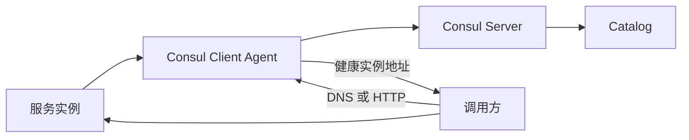

## 1. 它是什么

**Consul 是一个服务网络平台，核心能力是维护服务目录和健康状态，并通过 DNS 或 HTTP API 向调用方返回可用实例。**

第一阶段只需理解：服务怎样注册和接受健康检查，调用方怎样查到健康实例，Consul Agent 与 Server 分别做什么，以及服务发现、负载均衡和服务网格之间的边界。

Consul 常部署在虚拟机、容器或混合环境中。它可以继续扩展到 KV、mTLS 和服务网格，但不是业务数据库、消息队列，也不处理订单接口。与 etcd、ZooKeeper 相比，Consul 直接提供服务 Catalog、健康检查和 DNS；它们部分场景互为替代。

## 2. 最小工作模型



服务把名称、地址、端口和健康检查注册给本机 Agent，Agent 将状态同步给 Server。调用方查询 `order.service.consul` 或 HTTP API，得到健康实例地址后，自己或由代理选择其中一个并发起业务请求。Consul 不在这条业务响应路径上，除非同时使用服务网格代理。

## 3. Agent、Server、Catalog 与 Health Check

### Client Agent：业务节点的本地入口

Agent 是 Consul 进程的统称，Client 和 Server 是两种运行角色。Client Agent 通常部署在每台业务节点上，接受本机服务注册、执行健康检查、响应或转发 DNS 与 HTTP 查询，并通过 Gossip 参与成员状态传播。它不是普通业务 SDK，也不保存完整的权威 Catalog。

### Server Agent：维护权威状态

Server Agent 除了具备 Agent 能力，还参与 Raft，保存服务目录、配置等需要一致性的状态。Client Agent 把注册和查询转给 Server 集群，Server Leader 对需要一致顺序的更新进行提交。生产中只有少量 Server，不能把每台 Client 都配置成投票节点。

### Catalog：记录谁提供什么服务

Catalog 是 Consul 维护的服务目录，记录 Node、Service 和 Check 的关联。一个 Service Name 可以对应许多 Service Instance，每个实例有独立 ID、地址、端口和健康状态。调用方查询的是 Catalog 的视图，而不是扫描网络寻找进程。

一条注册信息大致如下：

```json
{
  "ID": "order-1",
  "Name": "order",
  "Address": "10.0.1.8",
  "Port": 8080,
  "Check": {"HTTP": "http://10.0.1.8:8080/health", "Interval": "10s"}
}
```

### Health Check：决定实例是否进入健康结果

Health Check 可以由 Agent 执行 HTTP、TCP、脚本或 TTL 检查。结果常见为 passing、warning、critical，并更新到 Catalog。服务存在于 Catalog 不代表一定健康；带 `passing=true` 的查询只返回当前检查通过的实例。

检查是周期性的，因此真实服务刚故障到被标记 critical 之间存在检测窗口，刚恢复也可能暂时未重新加入结果。健康检查只能减少调用已知故障实例，不能保证每一次业务请求成功。

## 4. 一次注册与发现如何完成

注册可通过配置文件或 Agent HTTP API 完成。下面是最小查询闭环：

```bash
curl --request PUT --data @order.json http://127.0.0.1:8500/v1/agent/service/register
curl 'http://127.0.0.1:8500/v1/health/service/order?passing=true'
dig @127.0.0.1 -p 8600 order.service.consul
```

HTTP API 可能返回 `10.0.1.8:8080` 及其 Check；DNS 查询返回一个或多个地址。调用方将地址放入本地负载均衡列表并直接请求订单服务。检查连续失败后，实例仍可能保留在 Catalog，但健康查询不再返回它；恢复 passing 后又可被发现。

这个过程把三件事分开：注册负责声明“我是谁”，健康检查负责判断“当前能否使用”，发现负责回答“有哪些可用地址”。真正的选择算法、重试和业务请求通常在客户端、Nginx、Envoy 或服务网格代理中执行。

## 5. 服务发现与服务网格

仅使用服务发现时，Consul 返回地址，调用方直接访问实例。启用 Consul Service Mesh 后，每个服务旁边的代理承接连接，Consul 控制面分发服务身份、证书和路由意图，数据面代理执行 mTLS 和流量转发。

因此服务网格不是“更高级的 DNS”：DNS 解决地址发现，代理数据面还参与每次服务调用。Nginx 可以消费 Consul 发现结果做入口负载均衡；OpenTelemetry 则记录这些调用的遥测数据，职责不同。

## 6. 可靠性与扩展

Server 通过 Raft 保存强一致 Catalog 状态，通常部署 3 或 5 个投票节点；失去多数派时不能提交需要一致性的更新。节点和服务状态还通过 Gossip 快速传播，两个机制分别处理一致元数据和成员变化，不能混为一种协议。

Client Agent 故障会影响本机注册、查询和检查；调用方应使用缓存、多个 DNS Server 或重试降低影响。扩大规模时增加 Client Agent 很自然，Server 数量仍受 Raft 写入成本约束。跨数据中心通常各自维护 Server 集群，再通过 Consul 的 WAN 与服务路由能力连接。

## 7. 设计取舍与容易混淆的概念

本地 Agent 降低业务服务与 Server 集群的连接和检查压力，却增加了一个本机组件；健康过滤减少调用已知故障实例，但检测周期决定摘除延迟；Raft 保证关键 Catalog 更新的一致顺序，代价是失去多数派时拒绝写入。

| 概念 | 主要作用 | 最关键区别 |
|---|---|---|
| 注册与健康 | 前者记录实例，后者持续判断状态 | 已注册不等于可用 |
| 服务发现与负载均衡 | 前者返回候选地址，后者选择请求目标 | Consul 不一定执行每次选择 |
| Client Agent 与 Server | 前者靠近业务，后者保存一致状态 | 只有 Server 参与 Raft |
| Consul 与 etcd | 前者直接面向服务网络，后者提供通用一致 KV | 能力有交集但抽象不同 |

## 8. 后续可以了解什么

- DNS 发现与 HTTP API 的一致性和缓存有什么差异？
- Raft 与 Gossip 在 Consul 中分别同步什么？
- Consul Service Mesh 的控制面和数据面如何配合？
- 多数据中心服务故障转移怎样配置？

## 资料来源

- [Consul Documentation](https://developer.hashicorp.com/consul/docs)
- [Service Discovery](https://developer.hashicorp.com/consul/docs/discover)
- [Services](https://developer.hashicorp.com/consul/docs/architecture/data-plane/service)
- [Health Checks](https://developer.hashicorp.com/consul/docs/reference/service/health-check)
