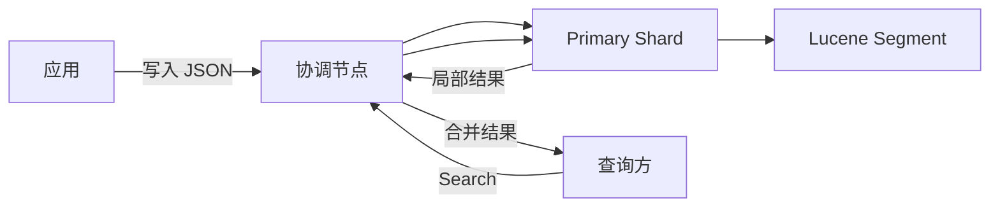

## 1. 它是什么

**Elasticsearch 是一个基于 Lucene 的分布式搜索与分析引擎，把 JSON Document 建立为适合全文检索、过滤、排序和聚合的索引。**

第一阶段只需理解：Document、Index、Mapping、Analyzer 和 Shard 的关系，一条文档怎样从写入变为可搜索，搜索怎样在多个 Shard 上执行，以及 ES 为什么不能简单替代 MySQL。

业务数据库通常保存订单事实，应用或 Debezium、Kafka 等链路把需要检索的数据同步到 ES，应用再查询 ES。Grafana 或 Kibana 可以展示查询结果。ES 擅长搜索和分析，但跨系统同步具有延迟与失败窗口，不能因为建立了索引就把数据库事务责任转给 ES。

## 2. 最小工作模型



客户端可以连接任意节点，该节点成为本次请求的 Coordinating Node。写入时它根据 Routing 找到 Primary Shard；搜索时把请求发送到相关 Shard，每个 Shard 执行本地查询，协调节点合并排序后返回全局结果。Document 最终保存在 Shard 对应的 Lucene 索引中。

## 3. Document、Mapping、Analyzer 与 Shard

### Document 与 Index

Document 是 ES 读写的基本业务对象，由 `_id` 和一组 JSON 字段组成。Index 是一类 Document 的逻辑命名空间，同时承载 Mapping、Settings 和 Shard 布局。请求 `/products/_doc/p1001` 时，`products` 选择 Index，`p1001` 标识 Document。

一条商品文档可以是：

```json
{
  "product_id": "p1001",
  "name": "无线机械键盘",
  "brand": "Acme",
  "price": 399,
  "created_at": "2026-09-05T10:00:00Z"
}
```

### Mapping：决定字段怎样被理解

Mapping 类似索引结构的 Schema，定义字段是 `text`、`keyword`、数值还是日期，以及是否索引和怎样分析。`name` 通常使用 `text` 做全文检索，`brand` 使用 `keyword` 做精确过滤和聚合，`price` 使用数值类型执行范围查询。动态 Mapping 能自动推断新字段，但错误推断可能导致后续数据拒绝写入；许多字段类型不能原地改变，只能新建 Index 并 Reindex。

### Analyzer 与倒排索引

Analyzer 由字符过滤、Tokenizer 和 Token Filter 等步骤组成，把“无线机械键盘”转换成用于检索的 Term。写入时 Term 进入倒排索引，形成“Term → Document”的映射；查询 `match` 时也使用 Analyzer 处理查询文本，才能与索引中的 Term 对齐。分析方式不同，即使原文看起来一样也可能匹配不到。

`_source` 保存原始 JSON，命中后用于返回完整文档；倒排索引用于从词找到文档；Doc Values 按字段组织值，主要支持排序和聚合。这三份结构可能来自同一字段，却承担不同读取路径。

### Shard 与 Replica

一个 Index 被拆成多个 Primary Shard，每个 Shard 本质上是独立 Lucene 索引。协调节点根据 `_routing`，默认通常是文档 ID，定位写入的 Primary；搜索则访问相关 Shard 并合并结果。Replica Shard 是 Primary 的副本，可以承担搜索并在故障时被提升，但它不会把一条 Document 再拆小。

## 4. 一次写入与搜索如何完成

先创建最小 Mapping 并写入文档：

```http
PUT /products/_doc/p1001
Content-Type: application/json

{"name":"无线机械键盘","brand":"Acme","price":399}
```

协调节点根据文档 ID 计算目标 Shard，把操作发送给 Primary。Primary 校验 Mapping、写入内存索引和 Translog，再复制给 Replica，满足确认条件后返回。文档此时已经写入成功，但通常要等下一次 Refresh 产生可搜索 Segment，体现 Near Real-Time，而不是每次写入立即强制刷新。

查询品牌为 Acme 且名称包含“机械键盘”的商品：

```json
GET /products/_search
{
  "query": {"bool": {
    "must": [{"match": {"name": "机械键盘"}}],
    "filter": [{"term": {"brand": "Acme"}}]
  }}
}
```

各 Shard 在倒排索引中找候选文档并返回局部 Top K，协调节点合并后再 Fetch `_source`。结果包含 `_id=p1001`、相关性 `_score` 和原始字段。`match` 会分析文本并计算相关性，`term` 精确匹配且常用于不参与评分的 Filter。

## 5. Refresh、Segment 与数据生命周期

Lucene Segment 写成后基本不可变。Refresh 创建新的可搜索 Segment，使最近写入对 Search 可见；Flush 形成更持久的 Lucene Commit 并推进 Translog 生命周期；后台 Merge 合并小 Segment 并真正清理已删除文档。三者不是同一个动作。

不可变 Segment 让并发读取和缓存更简单，但频繁 Refresh 会制造大量小 Segment，Merge 又消耗磁盘 I/O。日志和时序数据通常使用 Data Stream、Rollover 和 ILM 按时间管理新旧索引，而不是把无限数据写进一个 Index。

## 6. 可靠性与扩展

写入先由 Primary 排序，再复制到 Replica。节点故障后，集群可以提升满足条件的 Replica 并重新分配 Shard；Replica 提高读取能力和可用性，但不是离线 Backup，误删除和错误写入也会传播，历史恢复仍需 Snapshot。

Primary Shard 数量决定索引的数据拆分和写并行上限，增加 Node 后 Shard 才能重新分布。Shard 太少可能形成单分片瓶颈，太多会增加 Heap、Cluster State 和查询扇出成本。热点 Routing、深分页、高基数字段聚合和大范围搜索都可能让部分节点先过载。

## 7. 设计取舍与容易混淆的概念

倒排索引用额外写入和存储成本换取快速全文检索；Near Real-Time 用短暂可见性延迟换取批量构建 Segment 的效率；Scatter-Gather 利用多个 Shard 并行搜索，却让协调节点承担合并和 Top K 放大成本。

| 概念 | 主要作用 | 最关键区别 |
|---|---|---|
| ES 与 MySQL | 前者面向搜索分析，后者常作为事务事实库 | 不能只因支持 CRUD 就互相替代 |
| `_source` 与倒排索引 | 前者用于返回原文，后者用于检索 | 存储形态和用途不同 |
| Refresh 与 Flush | 前者让数据可搜索，后者推进持久提交 | 可见性不等于持久化 |
| Primary Shard 与 Replica | 前者拆分数据，后者复制分片 | Replica 不增加写分片数 |
| Query 与 Filter | 前者可计算相关性，后者判断是否匹配 | Filter 常用于精确条件 |

## 8. 后续可以了解什么

- Analyzer、Posting List 和 FST 怎样完成全文检索？
- Segment Merge 为什么会造成磁盘与延迟抖动？
- 如何规划 Shard 数量、大小和 JVM Heap？
- Alias 与 Reindex 怎样实现 Mapping 升级？

## 资料来源

- [Elasticsearch Reference](https://www.elastic.co/guide/en/elasticsearch/reference/current/)
- [Clusters, Nodes, and Shards](https://www.elastic.co/docs/deploy-manage/distributed-architecture/clusters-nodes-shards)
- [Reading and Writing Documents](https://www.elastic.co/docs/deploy-manage/distributed-architecture/reading-and-writing-documents)
- [Mapping Reference](https://www.elastic.co/docs/reference/elasticsearch/mapping-reference)
- [Near Real-Time Search](https://www.elastic.co/docs/manage-data/data-store/near-real-time-search)
