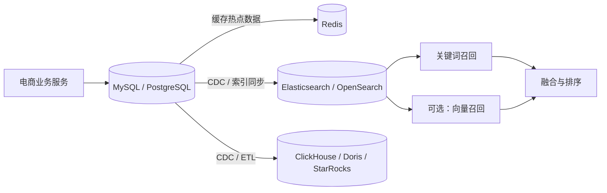
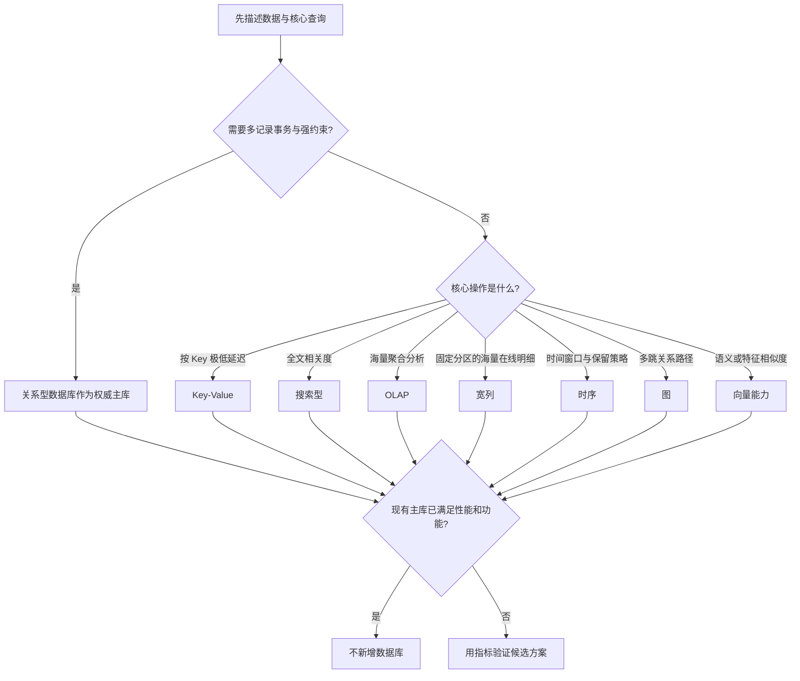

数据库选型不是比较“谁更强”，而是在确定：**当前工作负载最重要的能力是什么，以及愿意为它放弃什么。**

一种数据库之所以在某个方向更强，通常是因为它主动限制了另一些能力。例如，ClickHouse 用不擅长高频逐行更新换取海量扫描聚合效率；Cassandra 用查询自由度换取水平扩展和高写入吞吐；Redis 用内存成本换取极低延迟。理解这些交换，才是真正理解选型。

## 1. 先建立数据库地图

| 类型 | 主要解决的问题 | 常见代表 | 最典型的判断句 |
|---|---|---|---|
| 关系型数据库 | 可靠地处理一笔笔业务与实体关系 | MySQL、PostgreSQL、Oracle、SQL Server、SQLite、MariaDB | 数据结构清晰，需要事务、约束和关联查询 |
| Key-Value 数据库 | 根据 Key 极快读写 Value | Redis、Memcached、DynamoDB | 查询入口明确，重点是低延迟或高吞吐 |
| 文档数据库 | 存储结构灵活、可嵌套的文档 | MongoDB、Couchbase、Firestore | 数据天然是一份文档，字段随对象而变化 |
| 搜索型数据库 | 从大量文本或字段中找出相关记录 | Elasticsearch、OpenSearch、Solr | 重点是全文检索、相关度、分词和多条件筛选 |
| OLAP 分析数据库 | 扫描海量数据并快速聚合 | ClickHouse、Doris、StarRocks、Druid、Snowflake、BigQuery | 重点是“算出统计结果”，不是处理单笔交易 |
| 宽列数据库 | 海量持续写入后按固定 Key 路径在线读取 | Cassandra、HBase、ScyllaDB、Bigtable | 数据极大，查询模式固定，需要天然水平扩展 |
| 时序数据库 | 管理以时间为核心、持续追加的数据 | InfluxDB、TimescaleDB、VictoriaMetrics、Prometheus TSDB | 查询总围绕时间范围、标签、降采样和保留周期 |
| 图数据库 | 高效遍历多层关系网络 | Neo4j、JanusGraph、Amazon Neptune | 核心问题是“怎么连起来”，而不是“对象是什么” |
| 向量数据库或向量能力 | 按语义或特征相似度查找对象 | Milvus、Qdrant、Weaviate、Pinecone、pgvector | 目标是找“意思或特征最接近”的对象 |

这不是互斥分类。同一产品可能跨越多类能力，例如 PostgreSQL 可通过扩展支持时序和向量，Elasticsearch 也支持向量检索。产品“能做”不等于它在目标规模、成本和操作模式下“最适合做”。

## 2. 选型前先问的八个问题

1. **这是权威业务数据还是可重建的派生数据？** 订单、余额通常需要可靠事务；搜索索引和缓存丢失后可从主库重建。
2. **核心操作是什么？** 单行增删改、按 Key 读取、全文搜索、关系遍历，还是大范围聚合？
3. **需要多强的正确性？** 是否要求跨多条记录原子提交、唯一约束、外键或强一致读取？
4. **数据怎样增长？** 规模多大、写入多快、是否基本只追加、保留多久？不要只说“大数据”。
5. **查询模式是否固定？** 固定查询可以提前建模；未知的临时分析需要更强的查询自由度。
6. **延迟和吞吐目标是什么？** 毫秒级在线请求与秒级报表查询不能用同一标准衡量。
7. **部署约束是什么？** 团队经验、云平台、预算、许可证、备份恢复和可观测性往往比基准测试更能决定成败。
8. **现有系统能否先满足？** PostgreSQL 加 JSONB、pgvector，或 MySQL 加索引也许已经够用。新增一种数据库意味着新增同步、容灾、监控和排障成本。

## 3. 各类数据库的特点与选型

### 3.1 关系型数据库：核心业务的默认起点

关系型数据库把数据组织成结构明确的表，并提供事务、约束、索引和 Join。它特别适合订单、库存、账户、支付等需要持续修改且不能出现中间错误的业务。

例如“创建订单、扣减库存、记录付款”若要求要么全部成功，要么全部失败，事务就是核心需求。关系模型还能通过唯一约束、非空约束和外键防止非法状态进入数据库，而不只是依赖应用代码自觉。

它的主要边界在于：

- 几十亿行上反复做全表扫描和多维聚合，会与在线交易争抢 CPU、内存和 IO。
- 全文相关度、分词、拼写纠错不是普通 B-Tree 索引擅长的问题。
- 超高吞吐、天然分布式的固定 Key 访问，可能需要复杂的分库分表。
- 数据结构极度多变时，严格表结构可能导致频繁迁移；但字段只是少量可变时，不应因此直接放弃关系型数据库。

关系型数据库内部可以这样比较：

| 产品 | 为什么选 | 主要代价 | 不适合的信号 |
|---|---|---|---|
| MySQL | 常规互联网 OLTP 的成熟默认项；生态、人才、运维经验丰富 | 高级类型和部分复杂数据能力不如 PostgreSQL 一体化 | 需求明显依赖复杂 GIS、丰富类型或高度可扩展的数据库能力 |
| PostgreSQL | SQL 能力完整，JSONB、数组、GIS 扩展和自定义能力强，可覆盖更多混合需求 | 能力多意味着参数、扩展和运维选择也更多；团队若只熟悉 MySQL，有迁移成本 | 只是简单 CRUD，现有 MySQL 平台已经成熟，换库没有可量化收益 |
| Oracle | 大型企业关键系统、成熟工具链、商业支持和既有生态 | 许可与专业运维成本高，系统较重 | 普通新互联网项目、预算有限、团队没有 Oracle 体系 |
| SQL Server | .NET、Windows、Azure 和微软数据工具链中的整合自然 | 跨生态迁移和许可成本需要评估 | 团队和基础设施完全不在微软体系，且没有其专属能力需求 |
| SQLite | 无独立服务、单文件、部署极轻，适合移动端、桌面端和嵌入式 | 多客户端高并发写入和服务端横向扩展不是目标 | 多实例后端共同写核心数据 |
| MariaDB | 兼容 MySQL 思路，适合既有环境、开源治理偏好或特定存储引擎需求 | 与 MySQL 已经存在特性分化，不能假设永久无成本互换 | 新项目没有历史包袱，也没有明确特性或平台理由 |

实际中最常见的主动比较是 MySQL 与 PostgreSQL。普通用户、订单、商品 CRUD，两者都能胜任；应该根据团队现有平台和明确的差异化需求决定，而不是依据“PostgreSQL 更强”或“MySQL 更快”这种空泛标签。

### 3.2 Key-Value 数据库：用访问限制换速度和扩展

Key-Value 模型本质是 `key -> value`。它放弃复杂 Join 和任意字段查询，使系统能根据 Key 直接定位数据。

它主要适合：

- 缓存、Session、验证码、限流计数；
- 排行榜、集合运算、短期状态；
- 请求已经携带唯一 Key，读取模式简单稳定；
- 超大规模托管 Key-Value 访问，不希望自己管理分片。

但不应因此把 Redis 当成万能主库。Redis 快，主要因为以内存为中心、数据结构高效且访问路径简单。这也意味着内存单价高，复杂查询弱，并且持久化、故障切换和数据一致性需要按业务目标设计。对于不能丢、需要复杂约束的订单或余额，关系型数据库通常仍应是权威来源；Redis 更适合作为缓存或特定实时数据结构。

这一类型的主要产品可以这样比较：

| 产品 | 选择理由 | 不选择理由 |
|---|---|---|
| Redis | 除字符串外还有 Hash、List、Set、Sorted Set、Stream 等结构，适合缓存之外的计数、排行和轻量消息场景 | 只需最简单缓存时能力可能过剩；数据远大于内存或要求复杂持久查询时成本不合适 |
| Memcached | 简单纯粹的分布式缓存，协议和使用模型很轻 | 数据结构、持久化及高级能力较少；新系统往往因 Redis 更通用而不选它 |
| DynamoDB | 托管、自动扩缩、按主键高吞吐访问，适合 AWS 上的大规模在线系统 | 查询要围绕分区键设计，成本受容量与访问模式影响，存在平台绑定 |

### 3.3 文档数据库：让一个业务对象保持为一份文档

文档数据库通常存储类似 JSON 的嵌套对象。它的价值不是“无需设计结构”，而是允许不同文档拥有不同字段，并可整体读取一个聚合对象。

商品类目是典型例子：手机有容量、芯片，衣服有尺码、面料，家具有尺寸、材质。若这些属性变化快、嵌套深，文档模型比不断增加关系表和关联更自然。

它适合以下情况：

- 数据天然以整体文档读写，例如内容、配置、商品详情和用户画像；
- 不同对象字段差异明显，结构会随产品快速演进；
- 希望应用对象与存储格式接近，减少对象到多表的拆装。

出现以下信号时则不适合选择文档数据库：

- 核心是跨多个实体的强事务、复杂关系和大量 Join；
- 灵活字段实际上已经稳定，使用关系模型能得到更强约束；
- 团队把所有信息塞入巨大文档，导致局部更新、重复数据和一致性维护困难。

这一类型的主要产品可以这样比较：

| 产品 | 适合 | 不适合或代价 |
|---|---|---|
| MongoDB | 通用文档数据库，查询、索引、聚合和分片能力完整；适合自建或托管的业务文档 | 若业务高度关系化，最终会在应用层重建 Join 和一致性逻辑 |
| Couchbase | 文档与 Key-Value 访问结合，重视分布式、缓存式低延迟及边缘同步生态 | 架构和商业产品选择较多，团队经验不足时复杂度可能高于收益 |
| Firestore | 移动端和 Web 应用快速开发、实时同步、托管扩展 | 查询模型和计费方式有明确约束，复杂后端关系查询及跨云迁移不自然 |

PostgreSQL 的 JSONB 是重要替代项：当大部分字段稳定、只有少量扩展属性灵活，并且仍需要事务和 Join 时，“关系表 + JSONB”往往比新增 MongoDB 更简单。

### 3.4 搜索型数据库：重点是找出相关记录

搜索引擎通过分词和倒排索引，把“词出现在哪些文档中”提前组织好，再结合相关度、过滤、聚合和排序返回结果。

普通数据库索引不足以替代搜索引擎：B-Tree 擅长等值和范围查询，例如 `product_id = 10` 或 `price BETWEEN 100 AND 500`。全文检索还要处理分词、同义词、词频、字段权重、拼写和相关度排序，问题性质不同。

搜索引擎通常也不应充当权威主库。搜索索引通常来自 MySQL、PostgreSQL 或 MongoDB 的同步，是为了查询而重新组织的派生数据。同步可能有延迟，索引也可能需要重建。订单状态、库存扣减和余额不应只依赖搜索索引保存。

这一类型的主要产品可以这样比较：

| 产品 | 为什么选 | 为什么不选 |
|---|---|---|
| Elasticsearch | 全文搜索、日志生态、工具链和社区成熟，常作为通用搜索默认项 | 集群、分片、映射和 JVM 运维需要经验；商业发行和许可要求需结合实际使用方式确认 |
| OpenSearch | 与 Elasticsearch 同源，Apache 2.0 路线明确，适合 AWS 生态或重视开放许可、二开与再分发的团队 | 与 Elasticsearch 已逐步分化，插件、客户端和新特性不能默认完全互换 |
| Solr | 基于 Lucene，历史成熟、可定制，适合已有 Solr 专长和稳定搜索平台 | 对缺少既有积累的新团队，开发与运维生态通常不如 ES 路线普及 |

不要因为 Elasticsearch 能聚合就把它当主要 OLAP，也不要因为它能存 JSON 就把它当文档主库。判断标准是：**核心价值是否来自检索相关度与倒排索引。**

### 3.5 OLAP：重点是从海量记录中算出结果

OLTP 处理“这一笔订单如何正确完成”，OLAP 处理“几十亿笔订单呈现什么规律”。OLAP 查询常扫描大量行，只读取少数列，并执行 `SUM`、`COUNT`、`GROUP BY`、Join 和多维分析，因此通常采用列式存储和向量化执行。

当出现以下信号时，需要考虑从 MySQL 分离 OLAP：

- 报表开始频繁扫描几千万到几十亿行；
- 聚合查询拖慢线上下单、支付等请求；
- 维度组合经常改变，预先写死的汇总表越来越多；
- 日志、埋点或业务历史数据持续增长，保留和计算成本失控。

这一类型的主要产品可以这样比较：

| 产品 | 核心取舍 | 适合 | 不适合 |
|---|---|---|---|
| ClickHouse | 为追加写、压缩、扫描和聚合做激进优化；更新常通过新版本与后台合并处理 | 日志、埋点、广告曝光、事件流等写后少改的数据 | 高频逐行更新、强事务或以复杂业务主键变更为中心的系统 |
| Apache Doris | 在分析性能之外重视主键更新、CDC、Join 和 BI 易用性 | 把订单、用户、商品等变化中的业务表实时同步来分析 | 只追加且追求最专注的扫描效率时，额外模型能力未必有收益 |
| StarRocks | 与 Doris 路线接近，强调低延迟、多表 Join、优化器和实时数仓 | 星型或雪花模型、复杂 Join、实时 BI | 简单日志聚合可不必承担更全面系统的复杂度 |
| Apache Druid | 围绕时间事件、实时摄取、切片和交互聚合 | 广告、监控看板、用户行为的实时分组统计 | 大量关系型 Join 或频繁明细更新 |
| Snowflake | 云原生托管数仓、存算分离、生态完善 | 企业级多团队分析，希望减少基础设施运维 | 严格控制云成本、数据出域或需要自建环境时 |
| BigQuery | Serverless、按使用扩展，适合 GCP 数据分析 | 间歇性超大查询、不想管理集群 | 高频低延迟查询可能需谨慎评估成本和执行模式 |

ClickHouse 与 Doris/StarRocks 的关键并非“快与慢”，而是数据形态：**基本不改的海量事件更偏 ClickHouse；持续更新的业务表、CDC 和多表分析更偏 Doris/StarRocks。**

### 3.6 宽列数据库：填补 OLTP 与 OLAP 之间的空档

宽列不是简单的“列很多”，而是一个分区键下可以组织大量稀疏、可独立访问的列或有序数据。它常见的查询形态是：先确定主体，再读取该主体的一段记录。

```text
device_id + timestamp -> 设备事件
user_id + timestamp   -> 用户行为
```

要理解它的价值，可以看为什么 MySQL 和 ClickHouse 都不一定合适。假设每天写入数十亿条设备事件，同时要求按 `device_id` 查询最近 100 条：

- MySQL 能查询，但规模上升后需承担分库分表、路由、扩容和再平衡；
- ClickHouse 很适合统计全部设备的故障率，却不是为每次请求低延迟定位某个设备的一小段在线记录而设计；
- Cassandra 或 HBase 用受限、预先设计的查询路径换取高写入、分布式存储和按分区读取。

它不擅长“临时组合任意条件查全库”。如果查询路径不能预先确定，宽列建模会非常痛苦。

这一类型的主要产品可以这样比较：

| 产品 | 为什么选 | 代价与不适用 |
|---|---|---|
| Cassandra | 去中心化、高可用、水平扩展和多数据中心写入；适合高吞吐在线访问 | 必须围绕分区键建模，Join 和任意查询弱，一份数据可能为多个查询重复存储 |
| HBase | 与 HDFS/Hadoop 深度结合，适合超大稀疏表、RowKey 点查和范围扫描 | 依赖较重的大数据体系；新建纯在线系统时运维成本可能不值 |
| ScyllaDB | 兼容 Cassandra 数据模型并强调更低延迟和资源效率 | 仍继承固定查询模型的限制，还要评估兼容性、生态和迁移成本 |
| Bigtable | GCP 托管的海量低延迟宽列表 | 云平台绑定、查询方式受模型约束 |

### 3.7 时序数据库：时间不是普通字段，而是组织中心

时序数据以时间连续产生，常见结构是时间戳、指标值和标签。核心能力包括时间范围查询、窗口聚合、降采样、压缩和保留策略。

只有一列时间戳并不意味着必须上时序数据库。真正的信号是：高频追加、查询几乎总围绕时间、需要自动保留和多粒度聚合。

这一类型的主要产品可以这样比较：

| 产品 | 为什么选 | 为什么不选 |
|---|---|---|
| InfluxDB | 原生时序模型，时间查询、保留和降采样自然，适合 IoT 和通用指标 | 大量业务 Join、关系约束和普通事务不是舒适区 |
| TimescaleDB | 基于 PostgreSQL，保留 SQL、Join、事务和生态，同时按时间分块优化 | 纯监控指标达到极端规模时，通用关系能力可能带来不必要成本 |
| VictoriaMetrics | 针对大规模 Prometheus 指标、长时间保留和资源效率 | 不是通用业务时序数据库，数据模型主要围绕监控指标 |
| Prometheus TSDB | 与 Prometheus 采集和 PromQL 天然结合，普通监控开箱即用 | 本地存储不以无限水平扩展和长期集中保留为目标 |

选择顺序通常是：普通服务监控先用 Prometheus 自带存储；Prometheus 指标规模和保留期显著增长时考虑 VictoriaMetrics 等远程存储；通用 IoT 时序可看 InfluxDB；既要时序又要关系查询时优先评估 TimescaleDB。

### 3.8 图数据库：当关系路径本身成为答案

图数据库中的“图”是 Graph，而不是图片。节点表示人、设备、商品等对象，边表示好友、绑定、购买、依赖等关系。

关系型数据库能存边表，但查询 3 到 6 跳关系时会出现多次自连接，SQL、性能和动态路径表达都变复杂。图数据库将关系作为一等公民，适合好友的好友、风险账户关联路径、服务依赖影响面和知识图谱。

如果只是查用户及其直接订单，一个 Join 已经清晰高效，就没有必要引入图数据库。**关系很多不等于需要图数据库，频繁而深入地遍历关系才是信号。**

这一类型的主要产品可以这样比较：

| 产品 | 为什么选 | 为什么不选 |
|---|---|---|
| Neo4j | 产品完整、Cypher 直观、开发体验成熟，是通用属性图的常见起点 | 超大规模水平扩展、许可和版本能力需结合部署方案评估 |
| JanusGraph | 面向超大分布式图，可借助 Cassandra/HBase 等后端扩展 | 组件多、建模和运维复杂；规模未到门槛时得不偿失 |
| Amazon Neptune | AWS 托管，支持属性图和 RDF 路线，减少集群运维 | AWS 绑定、成本和查询生态需要结合已有架构评估 |

### 3.9 向量数据库：模型理解，数据库找近邻

文本、图片或音频先由 Embedding 模型转换成高维向量；数据库只负责高效寻找距离最近的向量。它本身并不理解“程序员久坐”和“人体工学椅”，语义关系主要来自 Embedding 模型。

它与全文搜索的核心区别是：

- 全文搜索擅长字面匹配、精确术语、品牌、型号、字段权重和可解释过滤；
- 向量搜索擅长字面不同但意义接近的内容；
- 生产搜索常将两路召回融合后再排序，而不是二选一。

向量搜索的代价包括 Embedding 生成与更新、近似检索误差、模型版本迁移、结果解释困难和新增基础设施。因此“数据里有文本”不是引入向量库的理由。

这一类型的主要产品可以这样比较：

| 产品 | 为什么选 | 为什么不选 |
|---|---|---|
| pgvector | 数据已在 PostgreSQL，能把事务字段过滤和向量搜索留在一个系统，降低同步与运维成本 | 向量规模、QPS、隔离和专业索引需求显著增长后，通用数据库可能成为瓶颈 |
| Qdrant | 向量检索与 metadata/payload 过滤结合自然，部署相对直接 | 已有 PostgreSQL 或 ES 足够时，独立系统会增加同步成本 |
| Milvus | 面向大规模专业向量检索和分布式扩展 | 架构和运维更重，小规模 RAG 往往不值得 |
| Weaviate | 强调语义、关键词混合搜索和 AI 应用集成 | 平台化能力较多，若只需简单近邻搜索可能过重 |
| Pinecone | 托管服务，减少索引、节点、扩缩容和故障运维 | 持续费用、数据治理和平台绑定需评估 |

选型应从最小方案开始：PostgreSQL 已是主库则先评估 pgvector；ES 已承载搜索则先评估其混合检索；只有规模、性能、隔离或功能指标证明不足时，再引入专用向量数据库。

## 4. 最容易混淆的类型边界

| 需求 | 优先类型 | 原因 | 常见误选 |
|---|---|---|---|
| 按 ID 查订单并可靠修改状态 | 关系型 | 单笔事务、约束、持续更新 | 用 ES 当订单权威库 |
| 按关键词找商品 | 搜索型 | 分词、倒排索引、相关度 | 用 MongoDB 的灵活结构代替搜索能力 |
| 找语义相近的商品或知识片段 | 向量能力 | 相似度近邻检索 | 认为向量库会先“找关键词” |
| 统计全部商品 30 天销售趋势 | OLAP | 大范围扫描聚合 | 因 ES 也能聚合就承担所有分析 |
| 查某设备最近 100 条事件 | 宽列或时序 | 按主体与时间范围在线读取 | 用 ClickHouse 处理所有在线点查 |
| 统计全部设备每小时故障率 | OLAP 或时序 | 时间窗口聚合 | 用 Cassandra 做跨分区全局分析 |
| 查账户到风险节点的 4 跳路径 | 图 | 多层动态关系遍历 | 在 MySQL 中不断堆自连接 |
| 热点数据毫秒读取 | Key-Value | 简单访问路径换低延迟 | 把所有持久业务数据迁入 Redis |

“宽列还是时序”取决于问题中心：如果核心是按主体 Key 在线取明细且需要超大分布式写入，偏宽列；如果核心是时间窗口、标签、降采样和保留策略，偏时序。两者在设备事件等场景可能重叠，最终要以查询比例和运维生态决定。

## 5. 电商系统示例：一种数据库通常不够，但也不是越多越好



- MySQL/PostgreSQL 保存商品、订单、库存等权威数据，因为这些信息需要事务和可靠更新。
- Redis 缓存热点商品、Session 和计数，因为它追求低延迟；缓存失效后可以回源主库。
- Elasticsearch/OpenSearch 保存可重建的商品搜索索引，负责分词、过滤、相关度和排序。
- 向量检索是语义召回的可选增强，可以直接由搜索引擎承担，也可以在达到规模门槛后拆为专用服务。
- ClickHouse/Doris/StarRocks 接收历史业务与行为数据，服务经营报表，不让大查询冲击交易主库。
- MongoDB 只有在商品或内容确实以高度灵活文档为核心时才需要；商品属性也可以采用关系表加 JSON 字段，不是电商必备组件。

这套架构中的难点不是把数据库装起来，而是数据同步和一致性：哪个是权威来源、允许多长延迟、同步失败如何补偿、索引如何重建，都应在引入第二种数据库时一并设计。

## 6. 一套可执行的选型流程



实施时建议按以下顺序决策：

1. 用 3 到 5 个最重要的真实查询描述工作负载，不先写产品名。
2. 明确正确性、延迟、吞吐、规模、保留期和恢复目标。
3. 判断是否需要权威主库与派生库分离。
4. 优先验证现有数据库通过索引、分区、读副本或扩展能否满足。
5. 选择两三个候选，用真实数据分布和查询做基准测试，而不是只看厂商数字。
6. 把运维、同步、迁移、人才、云成本和退出成本纳入总成本。
7. 预先定义“何时需要升级或拆分”的量化阈值，避免因未来想象过度设计。

## 7. 最终记忆框架

- **关系型**：可靠处理业务事实和事务。
- **Key-Value**：根据明确 Key 极快拿值。
- **文档**：一个对象结构灵活且适合整体读写。
- **搜索型**：从海量内容中找出相关记录。
- **OLAP**：从海量记录中算出统计结果。
- **宽列**：海量写入后，按固定 Key 在线取一段明细。
- **时序**：围绕时间存储、聚合、降采样和过期。
- **图**：沿关系寻找路径和关联网络。
- **向量**：寻找语义或特征最相似的对象。

真正成熟的选型结论通常不是“某数据库最好”，而是：

> 在给定的数据规模、读写模式、正确性要求、延迟目标和团队能力下，这个方案用可接受的复杂度满足了最重要的需求；其他方案虽然能做，但要支付当前业务不值得支付的代价。
