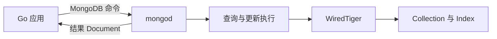

## 1. 它是什么

**MongoDB 是一个面向 Document 的分布式数据库，以 BSON 保存结构化数据，并提供查询、索引、聚合、复制、事务和分片能力。**

第一阶段只需理解：Database、Collection、Document 和 BSON 分别是什么，一条 Document 怎样写入和查询，`_id` 与普通 Index 怎样定位数据，内嵌和引用如何选择，以及 Replica Set、Read/Write Concern、Sharding 分别解决什么问题。

MongoDB 通常直接保存业务数据，可以作为某些业务的事实来源。它和 Redis、Elasticsearch 的位置不同：Redis 主要以低延迟内存访问加速数据，Elasticsearch 主要建立搜索索引，MongoDB 则负责持久保存和查询 Document。Kafka 可以传递 MongoDB 的数据变化，但不是 MongoDB 的查询替代品。

MongoDB 并不是“完全没有 Schema”。同一 Collection 的 Document 可以具有不同字段，但应用结构、字段类型、索引和可选的 Schema Validation 仍然构成数据约束。灵活结构降低了模型演进成本，也可能把字段混乱、类型不一致等问题推迟到运行时。

## 2. 为什么选择 MongoDB，而不是 MySQL

MongoDB 和 MySQL 都能持久化业务数据、建立索引并执行事务，不能简单概括成“MongoDB 没有 Schema、MySQL 有 Schema”或者“MongoDB 一定更快”。真正的区别是：MongoDB 倾向于把一次读写需要的相关数据组织成一个 Document，MySQL 倾向于把不同实体拆成关系表，再通过主外键和 Join 组合。

仍以订单为例。关系模型可能拆成 `orders`、`order_items`、`addresses` 三张表：订单状态只更新 `orders`，查询完整订单时执行 Join，数据库可以用外键、唯一约束和事务维护多个实体之间的关系。MongoDB 则可以把明细和收货地址嵌入订单 Document，一次查询直接得到页面需要的数据，并利用单 Document 原子性更新整个订单聚合。

```text
MySQL
orders 1 ── N order_items
   │
   └──── 1 shipping_addresses

MongoDB
order document
├── items: [...]           内嵌
└── shipping_address: {...} 内嵌
```

这种差异会产生真正的选择条件：

| 业务约束 | 更自然的选择 | 原因 |
|---|---|---|
| 商品类型很多，不同类型属性差异大 | MongoDB | Document 可以保留不同字段，读取时直接返回完整商品 |
| 内容、用户配置等数据经常整体读写 | MongoDB | 数据与应用对象边界接近，可减少 Join 和网络往返 |
| 订单明细创建后主要随订单一起读取 | MongoDB 或 MySQL | 内嵌读取简单；关系模型在关联和约束上更明确 |
| 账户、余额、库存之间存在严格约束 | MySQL | 跨实体事务、唯一约束和关系完整性通常是核心 |
| 高频复杂 Join 和临时报表不可预知 | MySQL | 规范化关系模型更适合从多个关系任意组合 |
| 数据量需按业务 Key 原生水平分片 | MongoDB | 内置 Sharding，但仍必须正确设计 Shard Key |

MongoDB 最有吸引力的场景，不是“任何数据都能随便存”，而是业务天然存在边界清楚的聚合对象：相关数据经常一起读取、一起更新，子数据规模有上限，结构又可能随类型演进。此时内嵌可以减少 Join，一次网络请求取回完整对象，单 Document 原子性也能覆盖主要一致性边界。

相反，如果业务以多实体关系和跨记录约束为中心，例如转账必须同时更新账户流水与余额、库存要受严格唯一和外键规则保护，那么 MySQL 往往更自然。MongoDB 支持 `$lookup` 和多 Document 事务，但“具备能力”不等于以它们作为主要访问模式仍然成本最低；频繁跨 Collection 事务通常说明 Document 边界需要重新评估，或者关系数据库更合适。

两者也可以组合，但应先明确事实来源。例如 MySQL 保存交易事实，通过 CDC 同步到 MongoDB 构建面向页面的 Document Read Model；这样读取方便，却引入复制延迟、重复事件和回放问题，数据同步与一致性由 CDC 链路和应用承担。不要让两个数据库都接受同一业务对象的任意写入，否则很难判断冲突时以谁为准。

## 3. 最小工作模型

先只看一个应用和一个 `mongod`，暂不引入复制与分片：



应用通过 MongoDB Driver 连接 `mongod`，选择 Database 和 Collection，再发送 Insert、Find、Update 或 Delete 命令。服务端解析查询条件、选择可用 Index、读取或修改 Document，并由存储引擎管理内存 Cache、Journal 和磁盘文件，最后把结果返回应用。

业务请求与数据库请求是两条不同链路。例如用户调用 `POST /orders`，Go 服务执行业务校验后才向 MongoDB 发起 `InsertOne`；MongoDB 只返回写入结果，最终 HTTP 状态码和响应 JSON 仍由 Go 服务决定。

## 4. Database、Collection、Document 与 BSON

### Database 与 Collection

Database 是 Collection 的逻辑容器，常用于隔离一组相关数据和权限。Collection 类似关系数据库中的表，但不要求每个 Document 具有完全相同的字段。应用通过 `client.Database("shop").Collection("orders")` 得到操作入口；它只是客户端句柄，真实数据仍由 MongoDB Server 保存。

Collection 承载 Document、Index、验证规则和部分存储配置。创建第一个 Document 时可以隐式创建 Collection，但生产系统通常显式配置验证规则和 Index，避免应用运行一段时间后才发现字段与查询设计不匹配。

### Document 与 BSON

Document 是 MongoDB 读写的基本数据单元，由有序字段组成，可以包含数组和嵌套 Document。下面是一份订单：

```javascript
{
  _id: ObjectId("68bc10a4e138f120c934a101"),
  user_id: "u1001",
  status: "pending",
  items: [
    {sku: "keyboard-01", quantity: 1, price: Decimal128("399.00")}
  ],
  shipping_address: {city: "Shanghai", street: "..."},
  created_at: ISODate("2026-09-05T10:00:00Z")
}
```

应用代码中可以使用 Struct、Map 或类表示它，Driver 会编码成 BSON 后通过网络发送。BSON 是二进制序列化格式，除了 String、Boolean 等 JSON 类型，还原生表达 ObjectId、Date、Decimal128 和二进制数据。MongoDB 在磁盘上保存的不是上面这段排版后的 JavaScript 文本；`mongosh` 只是把 BSON 转成方便阅读的形式。

### _id：每份 Document 的唯一标识

每个 Document 必须有 `_id`，同一 Collection 中唯一。应用未提供时，Driver 通常会生成 ObjectId；MongoDB 创建 Collection 时会自动建立 `_id` 唯一索引。`_id` 既用于精确查询，也常作为更新、删除和外部引用的稳定标识。

ObjectId 包含时间等组成部分，但不应把它当成严格连续的业务流水号。业务已有订单号时，可以直接把稳定且唯一的订单号作为 `_id`，也可以保留 ObjectId 并为 `order_no` 建立唯一索引。

### Index：为查询建立额外入口

没有合适 Index 时，MongoDB 可能扫描 Collection 中大量 Document，再逐一判断条件。Index 按指定字段维护有序结构，使查询可以快速缩小候选范围。例如订单列表经常按用户过滤、按时间倒序，可以建立：

```javascript
db.orders.createIndex({user_id: 1, created_at: -1})
```

复合 Index 的字段顺序会影响可支持的查询和排序。每增加一个 Index，写入和更新时都要同步维护更多结构，并占用内存与磁盘，所以不能为每个字段机械建索引。可以使用 `explain()` 查看是否走 `IXSCAN`、扫描了多少 Key 和 Document。

## 5. 一次订单写入与查询如何完成

下面使用 MongoDB Go Driver 展示最小闭环，假设 `client` 已连接成功：

```go
orders := client.Database("shop").Collection("orders")

doc := bson.M{
	"user_id": "u1001",
	"status":  "pending",
	"items": bson.A{
		bson.M{"sku": "keyboard-01", "quantity": 1, "price": 399},
	},
	"created_at": time.Now(),
}

result, err := orders.InsertOne(ctx, doc)
if err != nil {
	return err
}

var saved bson.M
err = orders.FindOne(ctx, bson.M{"_id": result.InsertedID}).Decode(&saved)
```

`InsertOne` 前，Driver 为缺少 `_id` 的 Document 生成 ObjectId 并编码成 BSON。服务端检查 `_id` 唯一性，更新 Collection 数据和相关 Index；在 Replica Set 中还会写入 Primary 的 Oplog，并根据 Write Concern 决定等待多少副本确认。`InsertedID` 返回给应用，不代表数据已经被所有 Secondary 复制。

随后 `FindOne` 以 `_id` 为条件查询。查询规划器可以直接使用 `_id` Index 定位 Document，存储引擎从 Cache 或磁盘取回 BSON，Driver 解码到 `saved`。Go 服务可以再把它转换成 API 响应：

```json
{"id":"68bc10a4e138f120c934a101","status":"pending","total":399}
```

这个响应不是 MongoDB 自动生成的完整 Document。是否隐藏内部字段、怎样计算 `total`、找不到时返回 404 还是其他状态，都由应用 API 决定。

## 6. 文档建模、原子更新与聚合

MongoDB 建模的核心选择是 **Embedding（内嵌）** 与 **Referencing（引用）**。订单明细通常与订单一起读取、数量受控且生命周期一致，适合内嵌在一个 Document 中；商品信息会被大量订单共享、独立更新，通常只在订单中保存 SKU 和成交快照，而不是嵌入一份会随商品变化的完整主数据。

单个 Document 的写操作具有原子性，因此把需要一起更新的小型状态放进同一 Document，可以减少多文档事务。例如下面只有 `pending` 状态才能成功取消，可避免无条件覆盖并发更新：

```javascript
db.orders.updateOne(
  {_id: id, status: "pending"},
  {$set: {status: "cancelled"}}
)
```

如果 `matchedCount` 为 `0`，应用要区分订单不存在和状态已变化。MongoDB 也支持 Replica Set 和 Sharded Cluster 上的多文档事务，但事务会增加协调、锁和重试成本，不能代替合理的 Document 边界设计。

Aggregation Pipeline 让 Document 依次经过 `$match`、`$group`、`$sort`、`$project` 等阶段。例如先筛选已支付订单，再按用户汇总金额。前置 `$match` 若能使用 Index，可以减少进入后续阶段的数据量；复杂聚合仍可能消耗大量内存、CPU 和临时磁盘。

## 7. Replica Set：高可用与读写语义

Replica Set 通常由一个 Primary 和多个 Secondary 组成。所有普通写入发送给 Primary；Primary 把操作记录到 Oplog，Secondary 异步复制并重放。Primary 不可用时，满足条件的成员通过选举产生新 Primary，Driver 根据拓扑变化重新选择 Server。

Write Concern 描述一次写入要等待什么确认。`w: 1` 主要等待 Primary，`w: "majority"` 等待多数投票成员确认，通常能降低故障切换回滚已确认写入的风险，但延迟和不可用概率也更高。它描述数据库确认范围，不保证后续 HTTP、消息发送等业务副作用成功。

Read Preference 决定从 Primary 还是 Secondary 读取；读 Secondary 可以分担部分流量和就近读取，但由于异步复制可能看到旧数据。Read Concern 决定读取可见性与一致性级别。三者不能混为一个“强一致开关”，应根据订单详情、报表查询等不同业务要求配置。

Replica 提高在线可用性，却不是 Backup。误删除、错误更新可能同步到所有成员；要恢复历史状态仍需 Snapshot 和恢复演练。

## 8. Sharding：数据怎样水平拆分

单个 Replica Set 的容量或写吞吐不足时，可以把 Collection 分片。Sharded Cluster 通常包含 `mongos`、Config Server Replica Set 和多个 Shard：应用连接 `mongos`，Config Server 保存分片元数据，每个 Shard 通常又是一个 Replica Set。

Shard Key 决定 Document 属于哪个数据范围。查询包含 Shard Key 时，`mongos` 可以只访问目标 Shard；缺少 Shard Key 时可能广播到多个 Shard，再合并结果。选择低基数、单调增长或分布倾斜的 Key，容易造成热点、数据不均或查询扇出。

数据按 Shard Key 范围组织成 Chunk，Balancer 在后台迁移范围以平衡数据。增加 Shard 后不会让所有查询立即均匀变快，数据迁移需要时间，且不合理的 Shard Key 可能仍把大部分新写入集中到少数节点。

## 9. 设计取舍与容易混淆的概念

Document 模型让一份业务对象可以连同嵌套数据一次读取，减少 Join 和网络往返；代价是重复字段、Document 增长和跨对象约束需要更谨慎设计。灵活 Schema 便于快速演进，却要求应用、验证规则和迁移流程共同控制数据质量。

Index 用额外存储和写放大换取查询速度；Replica Set 用更多节点和复制延迟换取高可用；Sharding 用路由、迁移和跨 Shard 查询复杂度换取水平容量。它们分别解决不同问题，不能因为“部署了集群”就认为查询一定快、数据一定不丢。

| 概念 | 主要作用 | 最关键区别 |
|---|---|---|
| MongoDB 与 MySQL | 分别偏 Document 聚合模型与关系模型 | MongoDB 支持事务，差异不只是“有没有事务” |
| MongoDB 与 Redis | 前者可作为持久业务数据库，后者常作内存缓存 | 使用位置和容量模型不同 |
| MongoDB 与 Elasticsearch | 前者保存并查询 Document，后者专注搜索分析索引 | ES 常由事实库同步产生 |
| Collection 与 Index | 前者保存 Document，后者提供查询入口 | 删除 Index 不会删除 Document |
| Replica 与 Shard | 前者复制同一份数据，后者拆分不同数据 | 分别解决可用性和容量 |

## 10. 后续可以了解什么

- Compound Index 的字段顺序怎样匹配过滤和排序？
- WiredTiger Cache、Journal 与 Checkpoint 如何配合？
- Read Concern、Write Concern 和 Read Preference 应怎样组合？
- Shard Key 应如何评估基数、频率与单调性？
- Change Stream 如何把 MongoDB 变化传给其他系统？

## 资料来源

- [MongoDB Documents](https://www.mongodb.com/docs/manual/core/document/)
- [Document Relationships](https://www.mongodb.com/docs/manual/applications/data-models-relationships/)
- [MongoDB Indexes](https://www.mongodb.com/docs/manual/indexes/)
- [MongoDB Replication](https://www.mongodb.com/docs/manual/replication/)
- [MongoDB Sharding](https://www.mongodb.com/docs/manual/sharding/)
