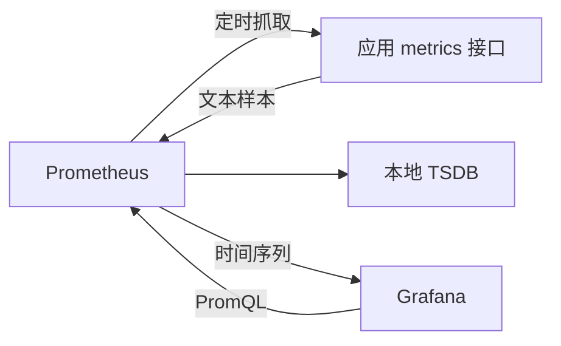

## 1. 它是什么

**Prometheus 是一个指标监控与告警系统，通过周期性采集带时间戳的数值样本，将其保存为多维时间序列，并使用 PromQL 查询、聚合和判断告警。**

第一阶段只需理解：Metric 和 Sample 长什么样，应用如何暴露指标，Prometheus 如何采集与保存，Grafana 如何查询，以及采集失败、单机容量不足时有什么边界。

它位于业务系统旁边：应用或 Exporter 暴露指标，Prometheus 主动抓取并存入本地 TSDB，Grafana 查询 Prometheus 并绘图，Alertmanager 接收告警通知。OpenTelemetry 也可以生成 Metric，再通过 Collector 接入 Prometheus 体系；它负责产生和输送，Prometheus 仍负责指标存储与 PromQL 查询。

Prometheus 擅长请求量、错误率、延迟和资源使用率等数值趋势，不保存完整日志或分布式调用，也不适合充当要求每条记录完整无缺的订单、账单数据库。

## 2. 最小工作模型



Prometheus 根据配置或服务发现获得 Target 地址，定时向 `/metrics` 发起 HTTP 请求。应用返回的是“当前累计值或当前状态”，不是主动把每次业务请求推给 Prometheus。Prometheus 为这次抓取补上时间戳并保存；Grafana 的查询不会直接访问应用。

## 3. Metric、Label、Sample 与时间序列

### Metric Name 与 Label

Metric Name 表示被测量的含义，例如 `http_requests_total` 表示累计 HTTP 请求数。Label 是附加维度，例如 Method、Route 和 Status，使同一个指标可以按不同角度筛选和聚合。应用在更新指标时就要提供 Label 值，Prometheus 不会从任意业务字段中自动猜出这些维度。

一组 Metric Name 和完整 Label 唯一确定一条时间序列：

```text
http_requests_total{method="POST",route="/orders",status="201"}
```

### Time Series 与 Sample

Time Series 是同一组标签随时间变化的一串数值，逻辑上不是一行静态记录。某个抓取时刻的具体数值才是一条 Sample：

```text
http_requests_total{method="POST",route="/orders",status="201"} 1287 @ 10:00:00
```

后续抓取到 `1295 @ 10:00:15`，就形成同一时间序列上的另一个 Sample。应用暴露值，Prometheus 在抓取时为它关联时间戳并写入 TSDB；PromQL 的 `rate`、`increase` 等函数正是利用多个 Sample 计算区间变化。

### Counter、Gauge 与 Histogram

Counter 表示只累计的总量，进程重启时可以归零，查询时通常计算增长率；Gauge 表示可升可降的当前值，例如连接数。Histogram 在应用侧把每次耗时累计进多个 Bucket，同时记录次数与总和；Prometheus 根据各 Bucket 时间序列计算分位数，而不是保存每一次请求耗时。

每增加一种 Label 值组合都会创建新的时间序列。把订单 ID、用户 ID 放入 Label，会让序列数量随着业务对象增长，直接占用 Prometheus 内存、磁盘和查询资源。

## 4. 一次指标采集如何完成

下面的 Go 示例记录订单请求数并暴露 `/metrics`。它省略了生产级错误处理：

```go
var orders = prometheus.NewCounterVec(
	prometheus.CounterOpts{Name: "orders_created_total"},
	[]string{"channel"},
)

func main() {
	prometheus.MustRegister(orders)
	http.Handle("/metrics", promhttp.Handler())
	http.HandleFunc("/orders", func(w http.ResponseWriter, r *http.Request) {
		orders.WithLabelValues("web").Inc()
		w.WriteHeader(http.StatusCreated)
	})
	log.Fatal(http.ListenAndServe(":8080", nil))
}
```

业务请求只修改进程内 Counter。Prometheus 到达抓取周期后请求 `/metrics`，可能收到：

```text
# TYPE orders_created_total counter
orders_created_total{channel="web"} 1287
```

Prometheus 将该值与抓取时间写入 TSDB。查询最近 5 分钟每秒创建订单数：

```promql
sum(rate(orders_created_total[5m])) by (channel)
```

结果可能是 `{channel="web"} 8.4`。Prometheus API 返回时间序列，Grafana 再把它画成折线；`8.4` 是区间内平均每秒增量，不是 Counter 当前总值。

## 5. 采集、查询与告警怎样配合

Pull 模式让 Prometheus 自己控制抓取频率，并用自动生成的 `up` 指标判断 Target 是否可达。动态环境中，Service Discovery 持续更新 Target 列表；Exporter 则把操作系统、数据库等无法直接暴露 Prometheus 格式的数据转换成指标。

Recording Rule 会预先计算常用 PromQL 并保存为新时间序列，减少复杂 Dashboard 的重复计算。Alerting Rule 产生告警状态后发送给 Alertmanager，由后者完成分组、抑制、静默和通知。短生命周期任务来不及被抓取时可以通过 Pushgateway 暂存指标，但它不是普通服务默认的推送入口。

## 6. 可靠性与扩展

应用或网络故障时，Prometheus 会记录抓取失败并令 `up` 变为 `0`，失败区间通常形成缺口，不会自动补齐。Prometheus 自身重启后可从本地 WAL 和数据块恢复，但副本通常各自独立抓取，查询端需要去重；复制也不能代替备份。

单机容量主要受活跃时间序列数量、抓取频率、保留时间和查询复杂度影响。更大规模通常按业务或集群拆分 Prometheus，再用 Federation 或 Thanos、Mimir 等系统形成全局查询和长期对象存储。Remote Write 是把样本发送给远端系统，不会自动让本地 Prometheus 变成分布式数据库。

## 7. 设计取舍与容易混淆的概念

Pull 让监控端掌握目标健康和采集节奏，但要求 Prometheus 能访问 Target；本地 TSDB 部署简单、查询快，却意味着原生单实例不是透明分布式存储。多维 Label 查询灵活，但高基数会直接增加内存、磁盘和查询成本。

| 概念 | 主要作用 | 最关键区别 |
|---|---|---|
| Metric 与 Sample | 前者定义测量对象，后者是某时刻的具体值 | 一条时间序列由多个 Sample 组成 |
| Prometheus 与 Grafana | 前者采集存储查询指标，后者展示 | Grafana 通常不保存指标样本 |
| Prometheus 与 OTel | 前者是指标后端，后者统一产生和输送遥测 | 可以组合使用 |
| Scrape 与业务请求 | 前者由 Prometheus 发起，后者由用户发起 | 两条请求彼此独立 |
| Replica 与 Backup | 前者提高可用性，后者用于历史恢复 | 副本错误可能同步发生 |

## 8. 后续可以了解什么

- Histogram Bucket 与 `histogram_quantile` 怎样计算分位数？
- 服务发现和 Relabeling 怎样生成最终 Target 与 Label？
- Recording Rule、Alerting Rule 和 Alertmanager 怎样串联？
- Thanos 或 Mimir 怎样补足长期存储与全局查询？

## 资料来源

- [Prometheus Overview](https://prometheus.io/docs/introduction/overview/)
- [Metric Types](https://prometheus.io/docs/concepts/metric_types/)
- [Jobs and Instances](https://prometheus.io/docs/concepts/jobs_instances/)
- [PromQL Basics](https://prometheus.io/docs/prometheus/latest/querying/basics/)
- [Alerting Overview](https://prometheus.io/docs/alerting/latest/overview/)
