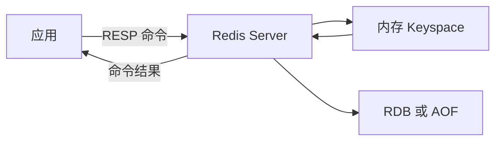

## 1. 它是什么

**Redis 是一个以内存为主要工作介质、提供多种数据结构和原子命令的键值数据服务器，常用于缓存、计数、会话和轻量实时状态。**

第一阶段只需理解：Key 和 Value 怎样保存，一条命令怎样执行，缓存命中与未命中时请求怎样走，TTL、淘汰和持久化分别解决什么问题，以及 Sentinel、Cluster 与数据库一致性的边界。

Redis 通常位于应用与数据库之间：应用先查 Redis，未命中再查 MySQL 并回填。Redis 缩短读取延迟、降低数据库压力，却不会自动成为业务事实来源，也不会自动维护缓存与数据库一致性。Prometheus 可以采集 Redis 运行指标，和 Redis 的业务读写不是一条链路。

## 2. 最小工作模型



客户端通过 TCP 连接发送 RESP 编码命令。Redis 解析命令，在当前数据库的 Keyspace 中定位 Key，执行对应数据结构操作并返回结果。主要读写发生在内存；RDB 和 AOF 用于故障后的数据恢复，不是每次读取的普通数据源。

## 3. Key、Value 与数据结构

### Key 与 Keyspace

Redis 的 Key 是定位数据的唯一名称，例如 `order:1001`。一个逻辑数据库中的全部 Key 构成 Keyspace，`GET`、`HGET` 等命令都先在这里查找 Key。Key 本身没有目录结构，冒号只是常用命名约定；`order:1001` 不会真的创建 `order` 目录。

Key 还可以关联过期时间和访问元数据。删除 Key 会连同整个 Value 删除，不能只凭 Key 名判断内部数据结构。因此，设计 Key 时既要考虑业务命名，也要考虑数量、长度、TTL 和 Cluster 分片。

### Value 与数据结构

Value 不是统一的字符串容器，而是带类型的 Redis 对象。类型决定服务器允许执行哪些命令：String 使用 `GET`、`SET`，Hash 使用 `HGET`、`HSET`，对错误类型执行命令会收到 `WRONGTYPE`。命令由 Redis Server 执行，应用不需要先把整个集合取回本地再修改。

一个订单缓存可以是：

```text
Key: order:1001
Type: Hash
Value: {status: "paid", amount: "99.00"}
TTL: 300 seconds
```

### 常见类型怎样选择

String 适合简单值、计数和序列化对象，`INCR` 可以在服务器内原子递增。Hash 适合按字段读取和修改对象；Set 表达不重复成员和集合运算；Sorted Set 给每个成员关联 Score，适合排行榜和延迟队列。

List 按两端压入和弹出元素，适合简单队列；Stream 中的记录带递增 ID，还维护消费组、消费者和待确认列表，更接近可追踪的消息流。选择类型应由需要执行的操作决定，而不是只看数据能否序列化成 JSON。

## 4. 一次缓存读取如何完成

下面是精简的 Cache Aside 代码，省略连接初始化和生产级错误处理：

```go
func GetOrder(ctx context.Context, id string) (Order, error) {
	key := "order:" + id
	if raw, err := rdb.Get(ctx, key).Result(); err == nil {
		return decode(raw), nil
	}

	order, err := db.FindOrder(ctx, id)
	if err != nil {
		return Order{}, err
	}
	rdb.Set(ctx, key, encode(order), 5*time.Minute)
	return order, nil
}
```

命中时，Redis 直接返回缓存内容，数据库没有收到请求。未命中时，应用查询数据库、把结果以 `order:1001` 写入 Redis 并设置 TTL，再返回用户。随后可以观察：

```text
GET order:1001
"{\"status\":\"paid\",\"amount\":\"99.00\"}"
TTL order:1001
287
```

数据库更新时，常见做法是应用先更新数据库，再删除缓存；下一次读取重新回填。这个策略只能降低不一致窗口，应用仍需处理并发更新、删除失败和旧值回填。

## 5. 过期、淘汰与持久化

Expiration 表示某个 Key 的 TTL 到期。Redis 通过访问时惰性删除和后台主动检查清理过期 Key。Eviction 则在内存达到 `maxmemory` 后，根据 LRU、LFU、TTL 或随机等策略删除候选 Key；没有设置 TTL 的 Key 也可能被 `allkeys-*` 策略淘汰。

RDB 周期性生成数据快照，文件紧凑、恢复快，但故障时可能丢失两次快照之间的写入。AOF 追加记录写命令，通常能缩小数据丢失窗口，但文件和写入成本更高，并需要 Rewrite。二者解决重启恢复，不等于异地备份或高可用。

## 6. 复制、Sentinel 与 Cluster

Primary 将写入效果异步复制给 Replica，Replica 可以承担只读流量并作为故障切换候选。Sentinel 监控主从实例，在多数 Sentinel 判断 Primary 不可用后选择 Replica 提升，并通知客户端新地址。复制是异步的，因此故障窗口内仍可能丢失已返回成功但尚未复制的写入。

Redis Cluster 把 Key 映射到 16384 个 Hash Slot，再把 Slot 分配给多个 Primary。Cluster 客户端根据 Slot 找到节点，收到 `MOVED` 或 `ASK` 后更新路由。它解决单机容量和写吞吐扩展，但多 Key 命令通常要求 Key 位于同一 Slot，热点 Key 也不会因为分片自动消失。

## 7. 设计取舍与容易混淆的概念

以内存作为主要工作集换来低延迟，也带来容量成本和数据易失风险；丰富的服务端原子命令减少客户端往返和并发竞态，但 Lua 脚本或大命令执行过久仍会阻塞其他请求。Pipeline 可以批量发送命令以减少网络往返，却不保证整批命令原子执行。

| 概念 | 主要作用 | 最关键区别 |
|---|---|---|
| Expiration 与 Eviction | 前者按 TTL 删除，后者在内存压力下腾空间 | 触发原因不同 |
| Persistence 与 Replication | 前者用于重启恢复，后者复制在线数据 | 都不能单独替代备份 |
| Sentinel 与 Cluster | 前者为主从故障转移，后者还负责分片 | Sentinel 不拆分数据 |
| Redis 锁与业务正确性 | Redis 提供互斥原语，业务处理资源状态 | 锁过期后仍需 fencing 等保护 |
| 缓存与数据库 | 前者是加速副本，后者通常是事实来源 | 一致性由应用方案保证 |

## 8. 后续可以了解什么

- Redis 的事件循环与 I/O 线程怎样协作？
- RDB Fork 和 AOF Rewrite 为什么可能引起延迟抖动？
- Big Key、Hot Key 和慢命令怎样识别与治理？
- Cache Aside 在并发更新下有哪些不一致窗口？

## 资料来源

- [Redis Data Types](https://redis.io/docs/latest/develop/data-types/)
- [Redis Keyspace](https://redis.io/docs/latest/develop/using-commands/keyspace/)
- [Redis Persistence](https://redis.io/docs/latest/operate/oss_and_stack/management/persistence/)
- [Redis Replication](https://redis.io/docs/latest/operate/oss_and_stack/management/replication/)
- [Redis Cluster Specification](https://redis.io/docs/latest/operate/oss_and_stack/reference/cluster-spec/)
