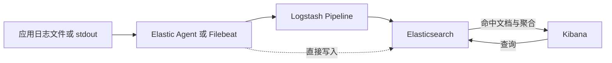
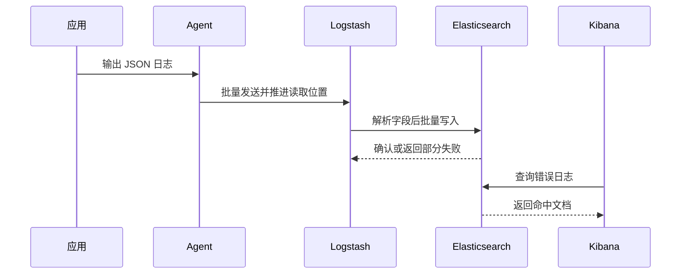

## 1. 它是什么

**ELK 是由 Elasticsearch、Logstash 和 Kibana 组成的数据采集、处理、检索与可视化方案，最常用于集中管理和分析日志。**

第一阶段只需理解：三者各自负责什么，一行应用日志怎样经过采集、转换和索引后出现在查询页面中，日志最终保存在哪里，以及为什么有时会选择 ELK、有时会选择 Loki 或 ClickHouse。

ELK 不是一个独立产品。Elasticsearch 负责持久化、建立索引和执行搜索；Logstash 负责接收、解析、转换并转发 Event；Kibana 负责查询 Elasticsearch 和展示结果。实际系统还需要把各机器上的日志送出来，经典搭配是 Filebeat，当前 Elastic 更推荐用 Elastic Agent 统一采集日志、指标等数据。

因此，今天看到的完整体系常被称为 Elastic Stack。Logstash 也不是必需依赖：结构已经统一的 JSON 日志可以由 Elastic Agent 直接发送给 Elasticsearch，再使用 Ingest Pipeline 做简单转换；只有来源复杂、转换较重、需要多种输入输出或集中缓冲时，Logstash 的价值才更明显。

## 2. 为什么选择 ELK，而不是 Loki 或 ClickHouse

假设订单服务每天产生数千万条日志。排障时既要按 `service`、`level`、`trace.id` 精确过滤，也要临时搜索错误描述、堆栈片段和未知字段；运营还希望统计每小时错误量。ELK、Loki 和 ClickHouse 都能接收并查询这批日志，但它们为不同的主查询路径付出了不同成本。

| 主要约束 | 更自然的选择 | 原因与边界 |
|---|---|---|
| 经常对日志正文和许多字段做临时检索，希望直接查看相关文档 | ELK | Elasticsearch 为字段和文本建立索引，检索灵活；代价是索引占用、分片规划和集群运维 |
| 主要先按服务、集群等低基数标签缩小范围，再查看日志，且重视对象存储成本 | Loki | 主要索引标签而非正文；正文仍可过滤，但通常要读取候选日志块，高基数标签也会制造大量 Stream |
| 日志已经高度结构化，主要执行大范围 SQL 聚合和报表分析 | ClickHouse | 列式扫描和聚合更贴合该负载；全文相关性搜索与任意文本探索不是它的核心模型 |

这不是“谁能不能查日志”的比较。Loki 可以搜索正文，Elasticsearch 可以聚合，ClickHouse 也能过滤字符串；真正的区别是常用条件是否预先建索引、查询需要扫描多少数据，以及团队愿意承担多少存储和运维成本。日志量不大、只需按时间查看最近错误时，云平台自带日志或单机工具已经够用，部署整套 ELK 可能得不偿失。

选择 ELK 的典型条件是：数据来源和字段较多，未知排障问题要求灵活检索，需要安全分析或丰富的 Discover、Dashboard 体验，并且团队能够治理 Mapping、Shard、生命周期和容量。它通常是日志副本而不是订单事实来源；日志丢失不应改变扣款结果，Elasticsearch 中的订单字段也不应被业务服务当作强一致状态读取。

## 3. 最小工作模型

一条常见链路如下，虚线表示可以省略 Logstash：



应用只负责生成日志，不会主动调用 Kibana。Agent 在应用所在主机或 Kubernetes 节点读取新增内容，记录读取位置，并批量发送；Logstash 把输入转换成内存中的 Event，经 Filter 处理后通过 Output 向 Elasticsearch 发起新的写入请求。

Elasticsearch 把 Event 作为 Document 写入 Index 或 Data Stream，并建立可搜索结构。用户打开 Kibana 后，Kibana Server 根据 Data View 向 Elasticsearch 发出查询，再把命中文档或聚合结果返回浏览器。**真正长期保存日志的是 Elasticsearch，不是 Logstash 或 Kibana。**

## 4. Log Event、Pipeline、Index 与 Data View

### Log Event：链路中流动的一条记录

应用最初产生的可能只是一行文本，也可能是 JSON。进入 Logstash 后，它成为带字段的 Event；写入 Elasticsearch 后，它成为拥有时间、字段和 `_id` 的 Document。结构化日志能避免用正则从文本中猜字段，也更容易统一 `service.name`、`trace.id` 等名称。

### Logstash Pipeline：Input、Filter、Output

Input 插件从 Beats、Kafka、HTTP 或文件接收数据并创建 Event；Filter 按顺序解析、改名、转换类型或补充字段；Output 把处理结果发送给 Elasticsearch、对象存储等目标。Codec 负责 JSON 等传输表示的编码和解码。Pipeline 只处理经过自己的 Event，并不会自动扫描所有应用。

### Elasticsearch Index 与 Data Stream

Elasticsearch 根据 Mapping 决定字段是全文 `text`、精确 `keyword`、数值还是日期，再把 Document 分配到 Primary Shard。日志等只追加的时序数据更适合使用 Data Stream：它对外提供一个稳定名称，内部由多个只写一个当前索引的 Backing Index 组成，并可通过生命周期策略滚动和删除旧数据。

### Kibana Data View、Discover 与 Dashboard

Data View 告诉 Kibana 要查询哪些 Index、Data Stream 或 Alias。Discover 用于临时过滤、搜索和查看单条 Document；Dashboard 保存查询、图表与布局。Kibana 保存这些页面配置，但不会把 Elasticsearch 中的日志复制进自身数据库。

## 5. 一条错误日志怎样变得可查询

下面的 Go 代码向标准输出生成一条 JSON 日志：

```go
logger := slog.New(slog.NewJSONHandler(os.Stdout, nil))
logger.Error("payment failed",
	"service", "order-service",
	"order_id", "A1001",
	"duration_ms", 320,
)
```

容器运行时或 Agent 读到的原始内容大致是：

```json
{"time":"2026-09-05T10:00:02Z","level":"ERROR","msg":"payment failed","service":"order-service","order_id":"A1001","duration_ms":320}
```

假设 Filebeat 把原始行放在 `message` 字段并发送到 `5044` 端口，下面是精简的 Logstash 配置；生产环境还需要 TLS、认证和错误分流：

```conf
input { beats { port => 5044 } }
filter {
  json { source => "message" }
  mutate {
    rename => { "service" => "[service][name]" "level" => "[log][level]" "msg" => "message" }
    convert => { "duration_ms" => "integer" }
  }
}
output {
  elasticsearch { hosts => ["https://es:9200"] data_stream => true }
}
```

完整时序是：



Elasticsearch 中最终保存的是结构化 Document，而不是 Logstash 配置。用户在 Kibana Discover 选择对应 Data View 和时间范围，再输入 KQL：

```text
service.name : "order-service" and log.level : "ERROR" and message : "payment failed"
```

结果表会显示时间、服务、订单号、耗时和原始消息；点击某一行还能展开全部字段。随后可以在 Lens 或 Dashboard 中按时间对 `log.level` 聚合，看到每分钟错误数量。到这里才完成“应用产生 → Agent 采集 → Logstash 转换 → Elasticsearch 保存和检索 → Kibana 展示”的闭环。

## 6. 查询、生命周期与缓冲

Elasticsearch 对 `text` 字段使用 Analyzer 建立倒排索引，对 `keyword`、数值和日期字段执行精确过滤、排序和聚合。Document 写入成功后通常要等待 Refresh 才能被搜索，因此日志查询是 Near Real-Time，而不是写入响应一返回就必然可见。

日志会持续增长，不能只靠一个永久 Index。Data Stream 配合生命周期策略，可以按大小或时间 Rollover 到新 Backing Index，再把旧数据迁移、降成本或删除。保留周期、Mapping 和 Shard 数量应在写入前规划，否则字段爆炸和过多小 Shard 会消耗大量 Heap 与磁盘。

Logstash 可以使用内存队列或 Persistent Queue 吸收短时波动；Kafka 也可以放在 Agent 与 Logstash 之间承担更长时间的积压和重放。它们只是降低丢失概率，不自动提供端到端 Exactly Once：重试可能产生重复日志，无法解析的 Event 也需要单独的失败去向。

## 7. 可靠性与扩展

Agent 会记录文件读取位置，重启后尽量从上次位置继续，但日志轮转、文件删除和状态损坏仍需正确配置。Logstash 实例可以水平扩展；若多个实例消费 Kafka，应使用消费组分担 Partition。Filter 过重、队列写满或 Elasticsearch 拒绝写入时，背压最终可能回到采集端。

Elasticsearch 通过 Shard 分摊容量，通过 Replica 提高读取能力和节点故障下的可用性。Replica 不是 Backup，误删除会同步传播，仍需 Snapshot。Shard 太多会放大元数据和查询扇出，太少又可能形成容量与吞吐瓶颈。

Kibana 故障主要影响查询、展示和由它执行的管理功能，不会删除 Elasticsearch 中的数据。多实例 Kibana 需要共享一致的后端配置与安全设置；增加 Kibana 实例也不能解决 Elasticsearch 查询本身过慢的问题。

## 8. 设计取舍与容易混淆的概念

ELK 用写入时解析和建立索引换取排障时的灵活搜索，因此日志字段越多、索引越全面，写入、磁盘和 Merge 成本也越高。Logstash 的插件化 Pipeline 能兼容复杂来源，却多出一个需要扩容、监控和处理背压的有状态环节；格式统一时绕过它反而更简单。

| 概念 | 主要作用 | 最关键区别 |
|---|---|---|
| ELK 与 Elastic Stack | 前者特指 ES、Logstash、Kibana 组合 | 后者还包含 Agent、APM 等组件 |
| Agent 与 Logstash | 前者靠近日志源做轻量采集，后者集中转换和路由 | 二者可串联，也可不使用 Logstash |
| Elasticsearch 与 Kibana | 前者存储并执行查询，后者提供查询与展示界面 | Kibana 不是日志数据库 |
| Index 与 Data Stream | 前者是实际索引空间，后者管理一系列时序 Backing Index | 日志通常更适合 Data Stream |
| Replica 与 Backup | 前者保证在线副本可用，后者用于历史恢复 | 错误数据也会复制到 Replica |

## 9. 后续可以了解什么

- Elastic Agent、Filebeat 与 OpenTelemetry Collector 应该怎样选择？
- ECS 怎样统一不同服务的日志字段？
- Data Stream、Rollover 和生命周期策略怎样配合？
- Logstash Persistent Queue 和 Kafka 分别适合吸收哪种积压？
- 怎样控制 Mapping 字段数量、Shard 大小与日志保留成本？

## 资料来源

- [The Elastic Stack](https://www.elastic.co/docs/get-started/the-stack)
- [Send Application Log Data](https://www.elastic.co/docs/solutions/observability/logs/stream-application-logs)
- [How Logstash Works](https://www.elastic.co/guide/en/logstash/current/pipeline.html)
- [Filebeat](https://www.elastic.co/docs/reference/beats/filebeat)
- [Discover](https://www.elastic.co/docs/explore-analyze/discover)
