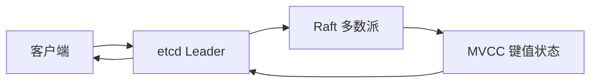

## 1. 它是什么

**etcd 是一个基于 Raft、提供强一致读写的分布式键值存储，主要保存分布式系统中少量但关键的控制状态。**

第一阶段只需理解：它为什么不是普通业务数据库，一次 Put 怎样经过 Raft 提交，Revision、Watch、Lease 如何配合，以及多数派不可用时为什么宁可拒绝写入。Kubernetes 使用 etcd 保存集群对象，是它最典型的上层系统之一。

etcd 只保存实例地址、配置、选主状态等信息；真正选择服务实例、转发业务请求或执行任务的仍是客户端、控制器或负载均衡器。它和 ZooKeeper 属于相近方案，但 etcd 暴露扁平 KV、MVCC Revision、Lease 和流式 Watch。

## 2. 最小工作模型



写请求可以先到任意成员，再被转给 Leader。Leader 把操作写入 Raft 日志并复制到多数成员，提交后应用到 MVCC 状态机，再返回客户端。读请求可以选择线性一致读；这时 etcd 要确认当前 Leader 和已提交位置，而不是随便读取某个落后副本。

## 3. Key、Revision、Watch 与 Lease

### Key、Value 与 MVCC

etcd 的 Key 和 Value 都是字节序列，通常用带前缀的路径式名称组织，例如 `/services/order/instance-1`。Range API 既可以读取单个 Key，也可以读取一个 Key 范围。路径中的斜杠只是命名习惯，不会像 ZooKeeper 那样形成有父子关系的数据树。

MVCC 为修改后的 Key 保留版本信息，使读取者可以查看某个 Revision 下的状态。etcd 不只是覆盖一个内存 Map：已提交状态会应用到 MVCC 存储并持久化，旧历史保留到 Compaction 清理为止。

一条记录可能是：

```text
key: /services/order/instance-1
value: 10.0.1.8:8080
create_revision: 120
mod_revision: 126
version: 3
lease: 7587...
```

### Revision 与 Version

集群每次提交修改都会推进全局 Revision，同一事务产生的多个事件可以共享 Revision。`create_revision` 表示 Key 首次创建的位置，`mod_revision` 表示最近修改位置，`version` 只统计该 Key 自创建以来被修改的次数。客户端可比较 `mod_revision` 实现 CAS，避免覆盖别人刚写入的新值。

### Watch、Lease 与 Transaction

Watch 是长期 gRPC Stream。客户端指定 Key 范围和起始 Revision，etcd 按已提交顺序推送 Put、Delete Event；Watch 只传递状态变化，不替客户端调用服务。接收方必须保存自己的已处理 Revision，并在断线后从正确位置续接。

Lease 是由集群授予的带 TTL 租约，可以绑定多个 Key。客户端持续 KeepAlive 表示自己仍然存活；租约到期或撤销后，etcd 删除绑定 Key，并为删除产生新 Revision 和 Watch Event。Transaction 提供原子的 Compare / Then / Else，把 Revision 比较和写入组合为一个不可插入其他写操作的步骤。

## 4. 一次服务注册与发现如何完成

订单实例先申请 Lease，再注册地址：

```bash
etcdctl lease grant 30
etcdctl put /services/order/instance-1 10.0.1.8:8080 --lease=7587842628506520346
etcdctl get /services/order/ --prefix
```

查询方可能看到：

```text
/services/order/instance-1
10.0.1.8:8080
```

注册方继续 KeepAlive。服务发现客户端先做一次前缀 Range 获取完整实例列表，再从返回 Revision 开始 Watch；这样既有当前快照，也能连续接收后续变化。实例退出且 Lease 到期后，Key 被删除，客户端收到 Delete 事件并更新本地列表，随后由客户端自己选择地址并发起 HTTP 或 gRPC 请求。

## 5. 强一致、Watch 和事务怎样配合

Raft 负责让多数成员按同一顺序提交写入，MVCC 负责给状态标记 Revision，Watch 再把已提交变化推送给订阅者。三者连接起来后，控制器才能做到“先读当前状态，再从该版本继续观察”，避免只监听未来事件而漏掉已有数据。

Compaction 会删除过旧 MVCC 历史，落后太久的 Watch 可能收到已压缩错误，此时客户端必须重新 Range 并从新 Revision 建立 Watch。Snapshot 是集群恢复和备份手段，不等同于 Replica。

## 6. 可靠性与扩展

典型集群使用 3 或 5 个投票成员。只要多数派和 Leader 可用，集群可以继续提交；失去多数派时拒绝强一致写入，避免两个分区同时确认冲突状态。增加成员会增加容错数量，但每次写都要复制，成员并非越多越快。

etcd 适合小而关键、读多写少的控制状态，不适合大 Value、高频业务流水或海量扫描。容量问题应先治理 Value、历史 Revision、Watch 数量和碎片，再考虑拆分独立集群；把普通业务数据搬入 etcd 通常不是扩展方案。

## 7. 设计取舍与容易混淆的概念

多数派提交以写延迟和可用性换取明确的一致顺序；Lease 由服务端到期删除 Key，避免只依赖客户端主动注销；MVCC 让 Watch 可以从 Revision 续接，代价是历史版本占用空间并需要 Compaction。

| 概念 | 主要作用 | 最关键区别 |
|---|---|---|
| etcd 与业务数据库 | 前者保存控制状态，后者保存业务记录 | 数据量、查询模型和吞吐目标不同 |
| Revision 与 Version | 前者是集群修改序号，后者是单 Key 修改次数 | Revision 可跨 Key 排序 |
| Lease 与普通 TTL | Lease 可绑定多个 Key 并 KeepAlive | 常用于表达客户端存活 |
| Replica 与 Snapshot | 前者维持可用性，后者用于恢复 | 副本不能代替离线备份 |

## 8. 后续可以了解什么

- Linearizable Read 与 Serializable Read 有什么差异？
- Watch 如何在 Compaction 后安全恢复？
- Lease、Transaction 怎样实现分布式锁和选主？
- Kubernetes API Server 怎样读写 etcd？

## 资料来源

- [etcd API](https://etcd.io/docs/v3.6/learning/api/)
- [etcd Guarantees](https://etcd.io/docs/v3.6/learning/api_guarantees/)
- [etcd Raft](https://etcd.io/docs/v3.6/learning/why/)
- [etcd Operations Guide](https://etcd.io/docs/v3.6/op-guide/)
