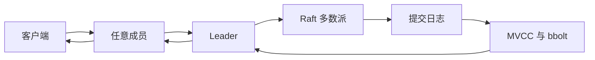
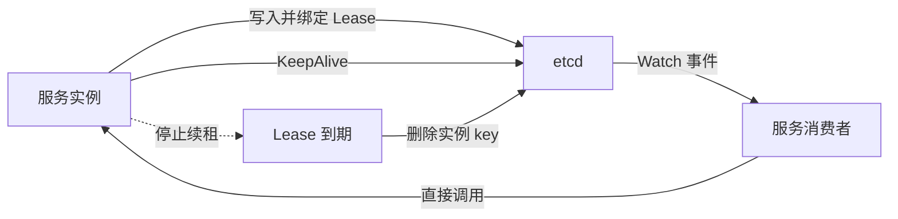
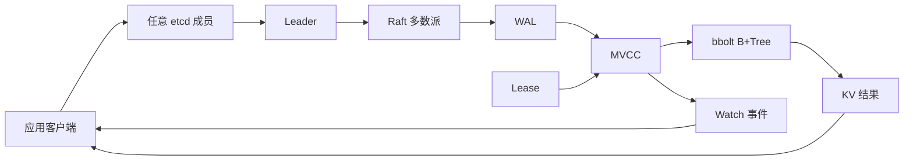

## 1. 它是什么

**etcd 是一个基于 Raft 共识算法、提供强一致性和持久化能力的分布式键值存储，主要用于保存分布式系统中少量但关键的共享状态。**

它通常位于系统的控制面：应用、控制器或基础设施组件通过 gRPC API 读写它。典型场景包括服务注册与发现、动态配置、Leader 选举、分布式锁和集群元数据。Kubernetes 就使用 etcd 保存集群对象和状态。

etcd 不负责存储海量业务数据、执行复杂 SQL、处理消息流或转发业务请求。以服务发现为例，etcd 只保存实例地址并通知变化；真正选择实例和发起请求的仍是业务客户端或负载均衡器。

它和 ZooKeeper 解决的是同一类问题，使用场景高度重叠，但提供的基础抽象不同：ZooKeeper 更像带 Session 语义的分布式目录树；etcd 更像带 MVCC、Lease 和持续 Watch 的强一致 KV 存储。本文以当前稳定版 etcd v3.7 为基础。

## 2. 最小工作模型

先只考虑一个 etcd 节点：


客户端通过 `Put`、`Range` 和 `Delete` 操作键值数据。KV 服务执行请求，MVCC 管理数据版本，最终状态持久化到 bbolt 数据库的 B+Tree 中，响应再沿原链路返回客户端。

这里要区分两个层次：

- **逻辑数据模型**：客户端看到的是扁平键空间。
- **物理存储实现**：etcd 使用 B+Tree 组织和查找磁盘数据。

底层使用树，不代表对外的数据也是树形结构。这类似 MySQL 的表在逻辑上是行集合，即使底层使用 B+Tree 索引。

## 3. 核心概念与关系

**键空间（key space）** 是 etcd 中全部键值数据组成的、按照 key 字节顺序排列的扁平空间。例如：

```text
/services/order/instance-1 = 10.0.0.8:8080
/services/order/instance-2 = 10.0.0.9:8080
/config/order/timeout      = 3000
```

斜杠只是命名约定，不代表真实目录。即使 `/services` 和 `/services/order` 不存在，也可以直接创建 `/services/order/instance-1`。所谓“按前缀查询”，本质上是在有序键空间中查询一段连续范围。

磁盘上的主要数据保存在 `member/snap/db`，它是一个 bbolt B+Tree 数据库。etcd 还维护内存索引，用用户 key 找到对应 revision，再从磁盘 B+Tree 读取具体值。Raft 的 WAL 则是另一套文件，负责持久化尚需复制和提交的共识日志，不能和最终键值状态混为一谈。

**revision** 是整个键空间的全局逻辑时钟。每次原子修改使 revision 增加一次；一个事务同时修改多个 key，这些 key 共享同一个 revision。每个 key 的 `create_revision` 表示本轮生命周期的创建位置，`mod_revision` 表示最近一次修改位置。

**version** 只属于单个 key，表示它在当前生命周期内被写过多少次：创建时为 `1`，每次修改加 `1`，删除后重新创建又从 `1` 开始。因此可以记成：

> revision 回答“整个集群第几次发生变化”；version 回答“这个 key 被修改了几次”。

## 4. 一次典型写入如何完成

生产环境通常使用三个或五个 etcd 成员。一次 `Put` 的主流程是：



客户端不必自己寻找 Leader。请求到达 Follower 后，需要共识的操作会被转交给 Leader。Leader 把写入转换为 Raft 日志提案，并复制给其他成员；各成员先将日志持久化到 WAL。

多数成员确认后，日志才能提交。各成员随后按同一顺序将操作应用到 MVCC 状态机，产生新的 revision，并更新 bbolt 后端。接入成员完成应用后，再把结果返回客户端。

Raft 和 MVCC 负责不同问题：

- Raft 保证多个成员对写入顺序达成一致。
- revision 给每次键空间修改编号。
- MVCC 保存这些 revision 对应的数据版本。

## 5. MVCC、Watch、Lease 与事务

### MVCC 为什么存在

etcd 的 **多版本并发控制（MVCC）** 虽然支持历史读取，但主要目的不是让人查询历史，而是为客户端保留一段有限的状态变化记录，从而实现轻量的增量同步和断线恢复。

例如控制器第一次查询十万个对象，得到完整状态和 `revision = 100`，之后从 revision `101` 开始 Watch。若连接在 revision `120` 处断开，它可以从 `121` 继续，而不必重新读取十万个对象。

```text
第一次启动：全量查询
正常运行：Watch 增量变化
短暂断线：从上次 revision 继续 Watch
历史已压缩：重新全量查询
```

因此，MVCC 最重要的价值是把“某个 revision 的完整状态”和“此后的增量变化”可靠地衔接起来。旧版本不能无限保留，compaction 会清理过早的 revision；客户端如果落后到压缩点之前，就必须重新全量同步。

### Watch

Watch 是基于 gRPC 流的变化订阅。客户端可以监听一个 key 或前缀，接收按 revision 排序的 `Put` 和 `Delete` 事件。它适合让控制器、配置客户端和服务消费者维护本地缓存，但不是 Kafka，也不是永久业务事件日志。

### Lease

Lease 是带 TTL 的租约，可以绑定一个或多个 key。客户端持续发送 KeepAlive；停止续租并到期后，相关 key 会被删除，并产生 Watch 事件。



etcd 只保存和通知实例状态，不负责把业务请求转发给实例。

### 事务

etcd 事务是一次原子执行的 `If / Then / Else`：

```text
如果 mod_revision 仍等于我上次读取的值：
    执行一组 Put / Delete
否则：
    返回当前状态
```

它与数据库事务共享原子性，但不是 MySQL 那种可以长时间保持的 `BEGIN / COMMIT / ROLLBACK` 事务。etcd 事务通常是一次 RPC，主要用于 Compare-And-Swap、防止并发覆盖、创建分布式锁和执行选主。

## 6. 可靠性与扩展

etcd 的多个成员保存完整数据副本，不做数据分片。一个 N 成员集群需要 `floor(N/2)+1` 个成员形成多数派：三个成员可容忍一个故障，五个成员可容忍两个故障。

Leader 故障后，只要多数派仍可通信，Raft 会选出新 Leader，期间共识请求会短暂中断。网络分区时，只有多数派一侧可以继续提交写入，少数派不能形成另一份有效状态，因此避免脑裂。失去多数派后，集群不能继续提交更新。

客户端也要配置多个 endpoint 并支持重试；服务端有多个成员，不代表只连接一个故障地址的客户端自动高可用。

成员副本解决运行时节点故障，Snapshot 备份解决误删除、数据损坏和永久失去多数派后的恢复。副本会同步错误操作，因此不能代替备份。

增加成员主要提高容错能力，不会实现写入分片或线性扩展写吞吐量。成员越多，需要参与复制的节点越多，共识成本也越高，所以生产环境通常使用三个或五个成员。

## 7. 为什么这样设计

**Raft 加多数派提交** 让多个物理节点对外表现为一个逻辑存储，代价是写延迟受到节点间网络和磁盘同步延迟影响。

**全局 revision 加 MVCC** 为全部 key 建立统一时间线，使历史读、事务判断和 Watch 恢复使用同一套版本坐标。代价是历史版本持续占用空间，需要 compaction 和碎片整理。

**Lease 加 Watch** 把“存活状态”和“变化通知”组合起来，适合服务注册、选主和锁等协调场景。代价是 Lease 只表示是否持续收到续租，不能代替业务层健康检查。

**bbolt B+Tree 加内存索引** 提供有序范围查询和持久化能力；WAL 则保证 Raft 日志可恢复。etcd 对磁盘尾延迟非常敏感，磁盘阻塞不仅会拖慢请求，还可能延迟心跳并触发重新选举。

## 8. 容易混淆的概念

| 概念 | 主要作用 | 最关键区别 |
|---|---|---|
| 扁平键空间与 B+Tree | 描述逻辑模型与物理实现 | key 之间没有父子关系；B+Tree 只是底层索引 |
| revision 与 version | 描述全局顺序与单 key 次数 | revision 属于整个键空间；version 只属于一个 key |
| Raft 与 MVCC | 复制共识与版本管理 | Raft 决定提交顺序；MVCC 保存各 revision 的状态 |
| etcd 事务与 MySQL 事务 | 原子条件更新与完整数据库事务 | etcd 是单次 `If / Then / Else` RPC，不是长事务 |
| etcd 与 ZooKeeper | 分布式协调存储 | 场景重叠，但前者以扁平 KV、revision、Lease 为核心，后者以树形 znode、Session 为核心 |

## 9. 面试中需要掌握到什么程度

**30～60 秒回答：**

etcd 是一个基于 Raft 的强一致分布式键值存储，主要保存配置、服务注册信息和选主、锁等协调状态。客户端可连接任意成员，写入最终由 Leader 通过 Raft 复制，多数派确认后提交并应用到 MVCC 存储。etcd 的逻辑模型是扁平键空间，底层使用 bbolt B+Tree；revision 是集群级变化序号，version 是单 key 的修改次数。MVCC 主要为 Watch 提供增量同步和断线恢复，Lease 管理临时 key，事务则提供原子的条件更新。

**必须掌握：** 定位与边界、写入链路、Raft 多数派、键空间、revision、version、MVCC、Watch、Lease 和事务。

**最好掌握：** 线性一致读与本地读、compaction、客户端重连、副本与备份的区别、磁盘延迟影响。

**深入岗位才需要掌握：** ReadIndex、WAL 和 bbolt 文件结构、成员变更协议、Watch 大规模调优及灾难恢复中的 revision bump。

## 10. 面试官可能如何继续追问

> etcd 的键空间为什么叫扁平结构？

因为 key 之间没有真正父子关系，斜杠只是命名约定；底层使用 B+Tree 不会改变对外的数据模型。

> revision 和 version 有什么区别？

revision 是集群级逻辑时钟；version 是单个 key 在当前生命周期内的写入次数。

> MVCC 主要是为了查询历史吗？

不是。历史读取只是能力，主要价值是支持一致的全量视图、增量 Watch 和断线恢复。

> 为什么断线后不直接重新查询最新状态？

可以，但全量查询成本可能很高。若只缺少少量事件，从上次 revision 增量恢复更高效。

> etcd 事务和数据库事务一样吗？

都具有原子性，但 etcd 事务是单次条件操作，没有数据库长事务、复杂 SQL 和隔离级别体系。

> 客户端必须访问 Leader 吗？

不必。客户端可以连接任意成员，需要共识的请求会被交给 Leader。

> 三个副本后还需要备份吗？

需要。副本会同步误删除和逻辑错误，Snapshot 才能用于历史状态和灾难恢复。

## 11. 整体认知图



客户端通过任意成员进入集群；共识写入由 Leader 组织 Raft 复制并持久化到 WAL，随后应用到 MVCC 和 bbolt。客户端既可以读取当前 KV，也可以通过 Watch 按 revision 接收变化；Lease 控制临时 key 的生命周期。

## 12. 第一阶段记忆卡

- etcd 是保存少量关键协调状态的强一致分布式 KV，不是通用业务数据库。
- 逻辑上是扁平键空间，物理上使用 bbolt B+Tree，两者并不矛盾。
- Raft 保证多个成员以相同顺序提交写入。
- revision 是全局变化序号，version 是单 key 修改次数。
- MVCC 主要服务于增量 Watch、断线恢复和一致视图，不是为了永久查看历史。
- Lease 管理临时 key，事务提供原子 `If / Then / Else`。
- 三节点容忍一个故障，失去多数派后不能继续提交更新。
- 副本解决节点故障，Snapshot 解决灾难恢复，二者不能替代。

## 13. 后续深入方向

- etcd 如何通过 ReadIndex 实现线性一致读？
- Watch 如何正确衔接第一次全量查询？
- compaction 与碎片整理分别解决什么问题？
- Lease、锁和 fencing token 应如何配合？
- WAL、Raft Snapshot 与备份 Snapshot 有什么区别？
- 成员新增、移除和 Learner 如何避免破坏多数派？
- Kubernetes 对 etcd revision 和 Watch 的具体使用方式是什么？

## 资料来源

- [etcd v3.7 数据模型](https://etcd.io/docs/v3.7/learning/data_model/)
- [etcd v3.7 API](https://etcd.io/docs/v3.7/learning/api/)
- [etcd API 一致性保证](https://etcd.io/docs/v3.7/learning/api_guarantees/)
- [etcd FAQ：集群、容错与性能](https://etcd.io/docs/v3.7/faq/)
- [etcd 灾难恢复与 Snapshot](https://etcd.io/docs/v3.7/op-guide/recovery/)