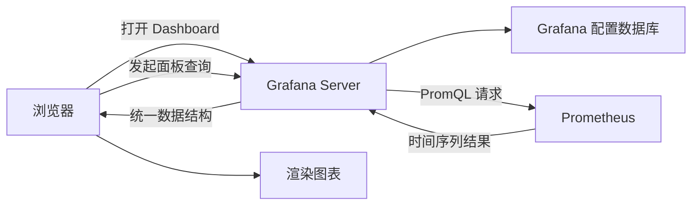
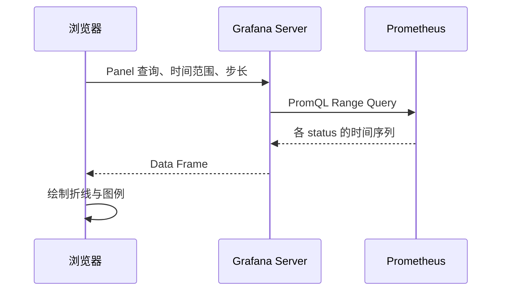
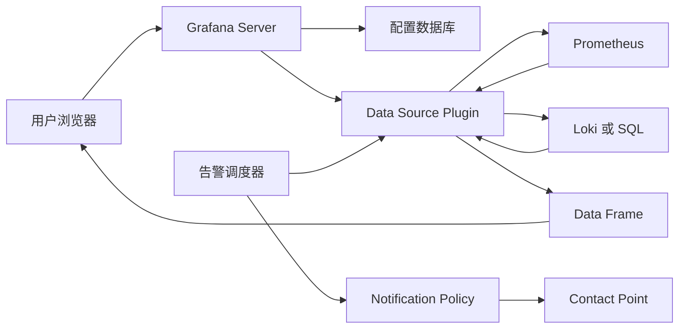

## 1. 它是什么

**Grafana 是一个开源的可观测性查询、可视化与告警平台，通过 Data Source Plugin 连接外部数据源，将指标、日志、Trace 和其他数据组织成可交互的 Dashboard。**

它通常位于用户和 Prometheus、Loki、Elasticsearch、SQL 数据库、云监控等系统之间。用户在浏览器中配置查询与图表，Grafana Server 管理 Dashboard、权限和数据源连接，并代表用户查询后端。它适合构建运行看板、故障排查视图、业务指标大盘和跨数据源告警。

Grafana **通常不是被观测数据的存储系统**。Grafana 自己的数据库保存用户、组织、Dashboard、数据源配置和告警规则等控制数据；真正的指标、日志和 Trace 仍保存在 Prometheus、Loki、Tempo 等数据源中。删除一个 Dashboard 不会删除 Prometheus 的时间序列，Grafana 节点短暂故障也不会让 Prometheus 停止采集。

本文以 Grafana OSS 13.x 为主，截至 2026 年 9 月官方最新文档版本为 13.2。Grafana Enterprise 是增加商业插件、增强权限和支持的自托管版本；Grafana Cloud 是托管服务，并可组合托管的指标、日志和 Trace 后端。三者共享 Grafana 核心，但部署责任和可用功能不同。

## 2. 最小工作模型

先只保留浏览器、一个 Grafana Server 和一个 Prometheus 数据源：



浏览器先从 Grafana Server 获取 Dashboard 定义，其中包含 Panel、数据源引用、查询和显示选项。Grafana 配置数据库保存这些定义，但不保存 Panel 所展示的 Prometheus 历史指标。

刷新 Panel 时，浏览器向 Grafana Server 发起查询。Grafana 根据 Data Source 配置找到 Prometheus，由内置插件生成新的网络请求；Prometheus 真正选择并计算时间序列，Grafana 把返回值转换成统一 Data Frame 后交给浏览器渲染。用户通常只访问 Grafana，不需要直接知道 Prometheus 的凭据和内部地址。

## 3. 核心概念与关系

**Data Source（数据源）** 是一个已配置的外部数据连接，例如地址为 `http://prometheus:9090` 的 Prometheus。**Data Source Plugin（数据源插件）** 则是实现查询编辑器、请求和结果转换逻辑的代码。Prometheus 插件内置在 Grafana 中，但仍要创建具体 Data Source 才能使用。

**Dashboard（仪表盘）** 是一组相关 Panel 的布局和配置；**Panel（面板）** 是其中一个可视化容器。Panel 引用 Data Source，保存一条或多条 Query，并选择 Time series、Table、Stat 等 Visualization。Dashboard 保存的是“去哪里查、查什么、怎样显示”，不是查询返回的全部历史数据。

**Query（查询）** 使用数据源自己的语言，例如 PromQL、LogQL 或 SQL。查询结果进入 Grafana 的 **Data Frame（数据帧）**：由命名字段组成，字段可以承载时间、数值或字符串。Visualization 只消费 Data Frame，因此不同数据源的返回结果能够进入统一的 Panel 模型。

**Transformation（转换）** 在数据返回 Grafana 后执行，可连接、过滤、重命名或计算字段；它不会把新数据写回原数据源。**Variable（变量）** 为 Dashboard 提供服务、集群等动态选项，并把选中值代入查询，使一个 Dashboard 可以复用到多个对象。

## 4. 一次典型展示如何完成

继续使用 Prometheus 文档中的订单请求指标。先把下面的文件放入 Grafana 的 `provisioning/datasources` 目录，在启动时声明 Prometheus Data Source：

```yaml
apiVersion: 1

datasources:
  - name: Prometheus
    uid: prometheus-main
    type: prometheus
    access: proxy
    url: http://prometheus:9090
    isDefault: true
    editable: false
```

Grafana 读取文件后，把数据源名称、UID、类型和连接信息写入自己的配置数据库；敏感连接字段应放在 `secureJsonData` 中加密保存。`access: proxy` 表示由 Grafana Server 访问 Prometheus，而不是让用户浏览器直连。容器内的 `localhost` 只指 Grafana 容器本身，因此示例使用可被 Grafana 解析的服务名 `prometheus`。

新建 Time series Panel，选择该数据源并输入：

```promql
sum by (status) (rate(orders_http_requests_total{route="/orders"}[5m]))
```

一次刷新过程如下：



Prometheus 假设返回两个状态码的序列，Grafana 转换后的关键字段可理解为：

| Time | status | Value |
|---|---|---:|
| 10:00:00 | 200 | 12.40 |
| 10:00:00 | 500 | 0.08 |

浏览器最终绘制两条折线，图例为 200 和 500，纵轴表示每秒请求数。Grafana 保存的是 Panel 的 PromQL、数据源 UID、时间范围和显示选项；表中的值每次刷新都由 Prometheus 查询产生，默认不会作为 Dashboard 数据再次持久化。

## 5. 主要能力如何实现

### 多数据源统一展示

数据源插件把不同查询语言和返回协议转换成 Grafana Data Frame。同一个 Dashboard 可以让一个 Panel 查 Prometheus、另一个查 Loki，再通过时间范围和关联链接辅助排查；但 Grafana 不会因此自动把不同后端合并成一个数据库。

### Panel 与 Transformation

Panel 把 Query、Transformation 和 Visualization 串成处理链。Query 尽量在数据源侧完成筛选和聚合；Transformation 适合对已返回的小结果集重命名、连接或计算字段。若把大量原始数据拉回 Grafana 再转换，会增加网络、内存和浏览器渲染开销。

### Dashboard 复用

Variable 可以从固定列表或数据源查询生成选项，再代入多个 Panel 的 Query 和标题。团队因此可以用一个 Dashboard 切换环境或服务。Dashboard 还可通过 JSON、文件 Provisioning、Git Sync 等方式管理；本文示例使用稳定且通用的文件 Provisioning。

### 统一告警

Grafana Alerting 周期性执行数据源查询和表达式，再根据条件更新 Alert Instance 状态。触发后，Notification Policy 按标签匹配路由到 Contact Point，并可分组、静默或设置重复通知。它与 Prometheus 原生规则是两套可选告警执行路径，不能假设创建 Panel 就自动产生告警。

## 6. 可靠性与扩展

### 数据源故障

Prometheus 超时或返回错误时，对应 Panel 会显示查询错误或无数据，依赖该数据源的 Grafana 告警也可能进入 Error 或 No Data 状态。Grafana 不会用配置数据库补出缺失指标；应分别监控数据源可用性，并为查询和告警设置合理的超时与状态处理策略。

### Grafana 自身故障

单节点故障会使 Dashboard、Explore 和 Grafana 管理的告警暂时不可用，但不会删除外部数据源中的数据。默认 SQLite 适合本地体验和小型环境，不适合多实例共享。

生产高可用通常在负载均衡器后部署两个或更多 Grafana Server，并让它们连接同一个高可用 MySQL 或 PostgreSQL。Grafana 实例是活动—活动的，任何实例都能读取 Dashboard 和用户状态；共享数据库故障仍会影响整组 Grafana，因此应用副本和数据库高可用必须分别建设。Grafana Alerting 的高可用还需额外配置，其语义是各节点都执行规则并对通知去重，不是把规则平均分片到节点。

### 查询容量

Grafana 的负载来自在线用户、Panel 数量、刷新频率、告警评估和图片渲染；数据源还要承担实际查询。扩容 Grafana Server 能增加 Web 与代理处理能力，却不能自动降低 Prometheus 的查询量。应先减少无意义的高频刷新和重复 Panel，在数据源侧预聚合昂贵查询，再按需要水平扩展 Grafana 和各数据源。

多实例还要保持插件、配置和 Provisioning 文件版本一致。Dashboard 和 Data Source 适合用代码管理，避免节点靠人工修改形成差异。

## 7. 为什么这样设计

**数据保留在来源系统。** Grafana 不复制所有指标、日志和 Trace，避免再维护一套通用遥测存储，也能直接利用 PromQL、LogQL、SQL 等后端能力；代价是展示可用性和查询性能依赖每个数据源。

**插件隔离数据源差异。** 插件负责专用查询编辑器、认证和 Data Frame 转换，Grafana 核心与 Panel 不必理解每种协议；代价是插件质量、版本兼容和安全性也成为运行风险。

**配置与查询结果分离。** Dashboard、用户和连接信息进入 Grafana 数据库，动态查询结果仍从数据源读取。这样配置体量小、便于协作和版本化，但恢复 Grafana 时既要恢复配置数据库，也要保证数据源独立可用。

**服务端代理数据源请求。** 浏览器只连接 Grafana，凭据可以保留在服务端，并能访问内部网络；代价是 Grafana Server 进入查询链路，需要控制权限、连接数和超时。

## 8. 容易混淆的概念

| 概念 | 主要作用 | 最关键区别 |
|---|---|---|
| Grafana 与 Prometheus | 前者组织查询和展示，后者采集并保存指标 | Grafana 通常不保存 Prometheus 时间序列 |
| Data Source 与配置数据库 | 前者保存或提供被观测数据，后者保存 Grafana 自身状态 | MySQL 作为 Grafana 配置库时不是业务 Panel 的默认数据源 |
| Dashboard 与 Panel | 前者组织完整视图，后者执行查询并显示一种局部视图 | 一个 Dashboard 通常包含多个 Panel |
| Query 与 Transformation | 前者从数据源取数据，后者处理已经返回的数据 | Transformation 不会改写原数据源 |
| Dashboard 与 Alert Rule | 前者按用户刷新展示，后者由调度器周期执行 | 有图表不代表已经配置告警 |

## 9. 面试中需要掌握到什么程度

**30～60 秒回答：**

Grafana 是开源的可观测性查询、可视化和告警平台。用户打开 Dashboard 后，Panel 根据 Data Source 和 Query 向 Grafana Server 发请求，Grafana 通过插件访问 Prometheus、Loki 或数据库，把结果转成统一 Data Frame，再由浏览器渲染。Grafana 自己的数据库只保存用户、Dashboard、数据源和告警等配置，通常不保存被观测数据。生产高可用使用负载均衡、多 Grafana 实例和共享的 MySQL 或 PostgreSQL，但还要单独保障数据源与 Grafana Alerting。

**必须掌握：** Grafana 的定位；Data Source、Plugin、Dashboard、Panel、Query、Data Frame 的关系；一次 Panel 查询链路；Grafana 和 Prometheus 的边界；配置数据与被观测数据分别存在哪里。

**最好掌握：** Variable 与 Transformation；Provisioning；Grafana Alerting 主链路；SQLite 与外部数据库的适用范围；多实例高可用；如何避免 Dashboard 给数据源制造过高查询压力。

**深入岗位才需要掌握：** Plugin 开发与签名、Data Frame Schema、统一告警高可用协议、大规模 Dashboard Provisioning、细粒度权限、查询缓存与负载测试，以及 Grafana OSS、Enterprise、Cloud 的具体能力差异。

## 10. 面试官可能如何继续追问

> Grafana 会保存 Prometheus 查询出来的指标吗？

Dashboard 保存查询与显示配置，指标仍由 Prometheus 保存并在刷新时返回；Grafana 配置数据库不是指标仓库。

> 浏览器会直接请求 Prometheus 吗？

常用的 Server/Proxy 模式下不会。浏览器请求 Grafana Server，再由数据源插件访问 Prometheus，因此内部地址和凭据不必暴露给浏览器。

> Data Source 和 Data Source Plugin 有什么区别？

Plugin 是支持某类系统的实现；Data Source 是基于该 Plugin 创建的一份具体连接配置，一个 Plugin 可以对应多个连接实例。

> Transformation 和在 PromQL 中聚合有什么区别？

PromQL 在 Prometheus 端减少和计算数据；Transformation 在结果返回 Grafana 后处理。大量数据应优先在数据源侧完成聚合。

> 两个 Grafana 实例使用各自的 SQLite 能否实现高可用？

不能。两份 SQLite 中的 Dashboard、用户和会话状态会分叉；多实例应共享高可用 MySQL 或 PostgreSQL。

> Grafana Server 扩容后，Prometheus 压力一定会下降吗？

不会。每个 Panel 刷新仍可能产生数据源查询，Prometheus 压力取决于查询数量和复杂度，而不是只有 Grafana 实例数。

## 11. 整体认知图



Grafana Server 从配置数据库读取 Dashboard、用户和连接配置，通过 Data Source Plugin 查询外部数据，再把 Data Frame 返回浏览器。告警调度器复用数据源查询，但将触发结果交给通知策略和联系点，而不是交给 Panel 渲染。

## 12. 第一阶段记忆卡

- Grafana 是查询、可视化和告警平台，通常不是指标、日志或 Trace 存储。
- Data Source 是具体连接，Data Source Plugin 是支持该类后端的实现。
- Dashboard 组织多个 Panel，Panel 保存 Query、Transformation 和 Visualization 配置。
- Grafana Server 代表浏览器查询数据源，真正的数据选择与聚合通常由数据源完成。
- Data Frame 是插件与 Visualization 之间的统一数据结构。
- 配置数据库保存 Grafana 状态；默认 SQLite 不适合生产多实例高可用。
- Grafana 高可用需要负载均衡、多实例和共享的高可用 MySQL 或 PostgreSQL。
- 扩容 Grafana 不会自动降低数据源压力，Panel 数量和刷新频率同样需要治理。

## 13. 后续深入方向

- Grafana Dashboard JSON 和新一代资源 API 如何组织与版本化？
- Data Source Plugin 如何把不同响应转换为 Data Frame？
- Variable 的查询、插值和多选语义如何影响数据源查询？
- Grafana Alerting 如何处理 No Data、Error、Pending 和 Firing 状态？
- 多实例 Grafana Alerting 如何同步状态并避免重复通知？
- 如何监控慢 Panel 并定位 Grafana、网络或数据源瓶颈？
- Provisioning、Terraform 和 Git Sync 分别适合怎样的配置管理流程？
- Grafana OSS、Enterprise 与 Cloud 在权限和托管能力上有哪些差异？

## 资料来源

- [About Grafana](https://grafana.com/docs/grafana/latest/introduction/)
- [Grafana Dashboards](https://grafana.com/docs/grafana/latest/visualizations/dashboards/)
- [Configure the Prometheus data source](https://grafana.com/docs/grafana/latest/datasources/prometheus/configure/)
- [Provision Grafana](https://grafana.com/docs/grafana/latest/administration/provisioning/)
- [Set up Grafana for high availability](https://grafana.com/docs/grafana/latest/setup-grafana/set-up-for-high-availability/)
