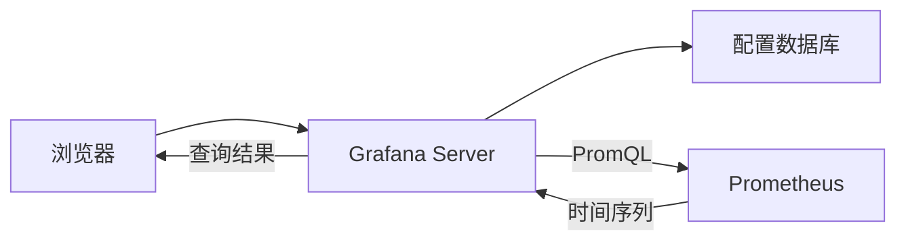
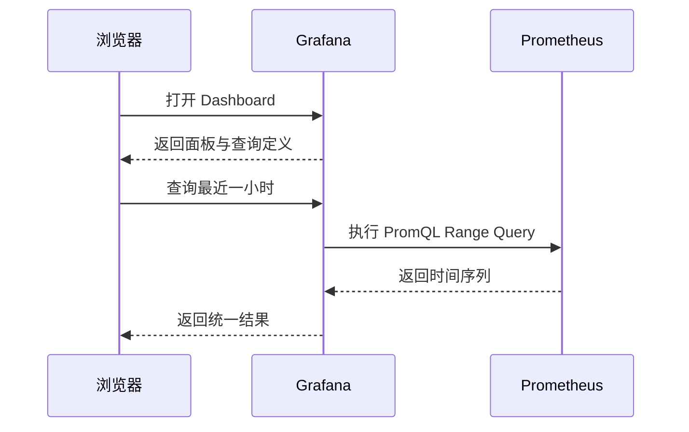

## 1. 它是什么

**Grafana 是一个可观测性查询、可视化与告警平台，通过 Data Source 连接外部系统，把 Metric、Log、Trace 等数据组织成 Dashboard。**

第一阶段只需理解：Grafana 保存什么、不保存什么，浏览器打开一个 Panel 时查询如何流转，Data Source、Dashboard、Panel 的关系，以及它如何连接 Prometheus、Tempo 和 Loki。

Grafana 位于用户与可观测性后端之间。Prometheus 保存 Metric，Tempo 或 Jaeger 保存 Trace，Loki 或 Elasticsearch 保存 Log；Grafana 代表用户查询这些后端并展示。OpenTelemetry 位于更前面，负责让应用产生并输送遥测数据。

Grafana 自己的数据库保存用户、权限、Dashboard、Data Source 配置和告警规则等控制数据，通常不保存被观测的指标、日志和 Trace。删除 Dashboard 不会删除 Prometheus 中的样本，Grafana 故障也不会让 Prometheus 停止采集。

## 2. 最小工作模型



浏览器打开 Dashboard 时先从 Grafana Server 获取定义。需要刷新 Panel 时，Grafana 根据 Data Source 配置向 Prometheus 发起查询，把结果转换成统一数据结构后返回浏览器渲染。数据源地址和凭据通常由 Grafana Server 使用，而不是直接暴露给浏览器。

## 3. Data Source、Dashboard 与 Panel

### Data Source：定义向谁查询

Data Source 是 Grafana 中的一份后端连接配置，包含数据源类型、地址、认证方式和访问参数。Prometheus Data Source 知道怎样发送 PromQL，Tempo Data Source 知道怎样搜索 Trace。它不是数据副本，也不会把 Prometheus 数据导入 Grafana；Panel 执行时仍然实时访问对应后端。

### Dashboard 与 Panel：保存页面和查询定义

Dashboard 是一份页面定义，保存时间范围、变量、布局和多个 Panel。Panel 是其中一个可视化单元，包含一个或多个 Query、结果处理方式和图表配置。同一个 Data Source 可以被许多 Panel 使用，一个 Dashboard 也可以同时查询 Prometheus、Tempo 和 Loki。

以“订单请求速率”Panel 为例，它保存的核心是下面这种定义，而不是 Prometheus 的原始样本：

```text
Data Source: prometheus-prod
Query: sum(rate(orders_created_total[5m])) by (channel)
Visualization: Time series
Refresh: 30s
```

### Query、Transformation 与 Visualization

Query 被发送到 Data Source 对应后端，主要筛选和聚合工作通常在那里执行。后端返回 Data Frame 后，Transformation 才在 Grafana 侧重命名字段、连接结果或做简单计算；Visualization 最后决定把相同结果画成折线、表格还是仪表盘。Transformation 不会把结果写回 Prometheus。

### Variable：让一套页面复用

Variable 是 Dashboard 级参数，例如 `$cluster`、`$service`。Grafana 可以先查询数据源得到候选值，再把用户选择代入每个 Panel Query。它减少重复 Dashboard，但一个变量展开成大量值时，也可能把单次刷新放大成高成本查询。

## 4. 一次 Dashboard 查询如何完成

用户打开订单 Dashboard，并把时间范围选为最近 1 小时：



Panel 中的查询可能是：

```promql
sum(rate(orders_created_total[5m])) by (channel)
```

Prometheus 返回每个时间点的标签和值，Grafana 根据 Panel 配置画出折线。用户看到的是 Grafana 渲染结果；数值计算主要由 Prometheus 执行，Grafana 只可能再做轻量 Transformation。

同一故障排查页面还可以连接 Tempo 和 Loki：先从 Prometheus 图表发现错误率升高，再跳到 Tempo 查看某条 Trace，最后根据 Trace ID 定位 Loki 日志。Grafana 统一的是查看入口，不会把这些后端合并成一个存储系统。

## 5. Dashboard、变量与告警

Dashboard 可以通过 JSON 或 Provisioning 文件纳入版本管理，避免只在界面中手工修改。模板变量让一套 Dashboard 复用于不同集群和服务，但变量组合过多会产生大量查询。

Grafana Alerting 周期性执行规则查询，根据表达式改变 Alert Instance 状态，再通过 Contact Point 和 Notification Policy 发送通知。规则存储在 Grafana，不代表原始指标也在 Grafana；数据源不可用时应区分“没有数据”和“查询失败”。

## 6. 可靠性与扩展

数据源故障时，Panel 会报错或显示无数据，Grafana 不能凭空补回结果。Grafana 自身故障通常只影响查看和由它执行的告警，不影响 Prometheus 继续抓取。高可用部署需要多个 Grafana 实例共享外部数据库，并共享插件、Provisioning 和告警状态所需配置。

Dashboard 刷新过快、时间范围过长或变量展开过多，会把压力传递给 Prometheus、Loki 或 Tempo。优化顺序通常是收敛查询范围与刷新频率，再使用 Recording Rule、缓存或后端扩展，而不是只增加 Grafana 实例。

## 7. 设计取舍与容易混淆的概念

Grafana 把 Data Source 与可视化分开，使同一界面可以连接不同后端；代价是查询能力仍受各数据源限制，PromQL、LogQL、TraceQL 不能互相替代。Dashboard 保存查询定义而非查询结果，使数据保持单一来源，但后端不可用时页面也无法显示真实数据。

| 概念 | 主要作用 | 最关键区别 |
|---|---|---|
| Grafana 与 Prometheus | 前者查询展示，后者采集存储 Metric | 常配合，不是同类替代 |
| Dashboard 与 Panel | 前者组织完整页面，后者呈现一个或一组查询 | Panel 属于 Dashboard |
| Query 与 Transformation | 前者在数据源执行，后者处理返回结果 | Transformation 不改变源数据 |
| Grafana 与 OTel | 前者位于查询端，后者位于数据产生和传输端 | 中间还需要存储后端 |

## 8. 后续可以了解什么

- Provisioning 怎样把 Data Source 和 Dashboard 纳入版本管理？
- Grafana Alerting 怎样处理 No Data 与 Error？
- Prometheus、Tempo 和 Loki 之间怎样建立关联跳转？
- 大型 Dashboard 怎样定位慢查询和查询放大？

## 资料来源

- [Grafana Documentation](https://grafana.com/docs/grafana/latest/)
- [Data Sources](https://grafana.com/docs/grafana/latest/datasources/)
- [Dashboards](https://grafana.com/docs/grafana/latest/dashboards/)
- [Panels and Visualizations](https://grafana.com/docs/grafana/latest/panels-visualizations/)
- [Grafana Alerting](https://grafana.com/docs/grafana/latest/alerting/)
