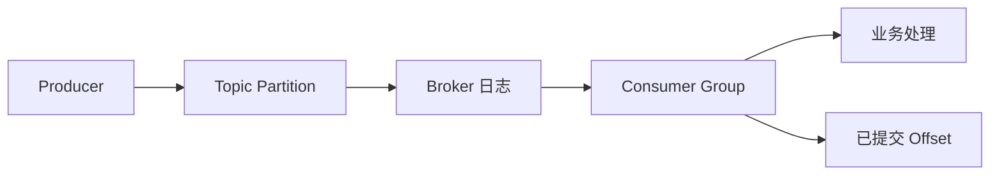

## 1. 它是什么

**Kafka 是一个分布式事件流平台，以分区追加日志持久化事件，让生产者与消费者在时间和处理速度上解耦。**

第一阶段只需理解：一条 Event 怎样写入 Topic Partition，Offset 表示什么，Consumer Group 如何分工，消息确认与 Offset 提交分别保证什么，以及分区、副本、保留策略和重复消费的边界。

业务服务是 Producer 和 Consumer，Kafka Broker 负责接收、保存和返回事件。Debezium 可以把数据库变更写入 Kafka，Flink 或 Kafka Streams 可以处理事件，Elasticsearch 可以保存处理后的搜索数据；这些是上下游组件，不是 Kafka 自身功能。现代 Kafka 使用 KRaft 管理集群元数据，不再要求 ZooKeeper。

## 2. 最小工作模型



Producer 选择 Partition 并向其 Leader 写入 Event。Broker 把记录顺序追加到日志，为其分配 Offset。Consumer 按 Offset 拉取记录并处理，再提交消费进度。Kafka 保存消息不等于业务已经处理成功，提交 Offset 也不等于业务副作用一定完成。

## 3. Event、Topic、Partition 与 Offset

### Event 与 Topic

Event 是 Producer 写入 Kafka 的一条不可变记录，通常包含 Key、Value、Timestamp 和 Headers。Kafka 不理解 `OrderCreated` 的业务语义，只把 Value 当作字节；JSON、Protobuf 以及 Schema 兼容由应用和 Schema Registry 等工具约定。

Topic 是事件的逻辑类别，例如 `order-events`。Producer 写 Topic，Consumer 订阅 Topic；真正的数据不会以一个巨大文件保存在“Topic 对象”里，而是分散到它下面的多个 Partition 日志。

一条订单事件可以是：

```text
topic: order-events
partition: 2
offset: 1842
key: order-1001
value: {"type":"OrderCreated","order_id":"1001","amount":99}
timestamp: 10:00:00
```

### Partition、Key 与 Offset

Partition 是同一 Topic 的一条追加日志，也是存储、复制和并行消费的基本单位。Producer 可以显式指定 Partition；更常见的是根据 Key 计算，或者在无 Key 时由分区器分配。同一 Key 稳定进入同一 Partition，才能利用分区内顺序；增加 Partition 后映射可能变化，不能把它当成永久业务路由。

Broker 给每条记录分配递增 Offset。Offset 只表示该记录在某个 Partition 中的位置，不是全局消息 ID，也不表示业务已经处理到哪个阶段。Consumer 发起 Fetch 时会携带“从哪个 Offset 开始”，Broker 据此返回后续记录。

### Consumer Group 与已提交 Offset

Consumer Group 表示一组共同处理 Topic 的消费者。Group Coordinator 维护成员和分区分配；成员加入、退出或订阅变化时可能触发 Rebalance。同一 Group 内，一个 Partition 在同一时刻通常只分配给一个 Consumer，因此消费者数量超过 Partition 数量后，会有消费者空闲。

Group 为每个 Partition 保存已提交 Offset，它表示故障恢复时从哪里继续，不是 Broker 删除消息的位置。不同 Group 各自保存进度，因此库存服务和通知服务可以独立读取同一条订单事件。

## 4. 一次生产与消费如何完成

Producer 写入下面的事件：

```json
{"key":"order-1001","value":{"type":"OrderCreated","amount":99}}
```

客户端先根据 Key 选择 Partition，再找到 Leader，把多条记录组织成 Batch 发送。Leader 追加日志并复制给 ISR 中的 Replica；当 `acks=all` 的确认条件满足后，Producer 收到成功以及 Partition、Offset，例如 `partition=2, offset=1842`。

Consumer Group 中负责 Partition 2 的 Consumer 从当前 Offset 拉取记录：

```text
receive partition=2 offset=1842 key=order-1001
create shipment for order-1001
commit offset=1843
```

通常应先完成业务处理，再提交下一条 Offset。如果处理成功但提交前崩溃，重启后会再次收到该 Event，因此消费端要幂等；如果先提交再处理，崩溃可能造成业务漏处理。Kafka 的 At-Least-Once 描述交付窗口，不会自动让数据库写入天然幂等。

## 5. 确认、副本与消费进度

每个 Partition 有一个 Leader 和若干 Replica。Producer、Consumer 的普通读写面向 Leader，Follower 复制日志。ISR 是当前与 Leader 保持足够同步的副本集合。`acks=all` 配合合适的 `min.insync.replicas`，可以要求多个同步副本接收记录后才确认，但网络分区和错误配置下仍需理解可用性与数据安全取舍。

Producer 幂等可以避免重试造成的分区内重复写入；Transaction 可以把多个 Partition 的写入和消费 Offset 纳入一次 Kafka 事务。它仍不能自动覆盖 Kafka 外部数据库、HTTP 服务的副作用，跨系统业务需要幂等键、Outbox 等方案。

## 6. 保留、扩展与积压

Kafka 按时间或日志大小保留记录，消费后不会立即删除，因此新 Consumer Group 可以从更早 Offset 重放。Log Compaction 则按 Key 保留较新的值，并用 Tombstone 表达删除；它与普通时间保留解决的问题不同。

Partition 是存储与并行单位。增加 Broker 只有在重新分配 Partition 后才能承载更多数据；增加 Consumer 只有存在未被占用的 Partition 才能提高同一 Group 并发。Key 分布不均会产生热点 Partition。Consumer Lag 表示最新 Offset 与消费进度的差距，是判断积压的重要信号，但还要结合处理速率和保留时间。

## 7. 设计取舍与容易混淆的概念

顺序追加、批处理和 Page Cache 让 Kafka 适合高吞吐事件流；代价是低流量时 Batch 等待会增加延迟。Partition 提供并行与局部顺序，却把顺序、热点和扩容边界绑定在分区设计上。拉取模式让 Consumer 控制处理速度，但必须自己管理进度与积压。

| 概念 | 主要作用 | 最关键区别 |
|---|---|---|
| Event 与业务处理结果 | Event 是日志记录，结果是消费者副作用 | 写入 Kafka 不等于业务完成 |
| Offset 与消息 ID | Offset 定位分区内位置 | 跨 Partition 不唯一 |
| Producer Ack 与 Offset Commit | 前者确认 Kafka 写入，后者记录消费进度 | 位于链路两端 |
| Partition 与 Replica | 前者拆分数据和并行，后者容灾 | Replica 不增加该分区写并行 |
| Retention 与 Compaction | 前者按时间或大小删除，后者按 Key 保留状态 | 可以组合配置 |

## 8. 后续可以了解什么

- Consumer Group Rebalance 为什么会暂停消费？
- Idempotent Producer 和 Transaction 如何避免 Kafka 内部重复？
- ISR、High Watermark 和故障选主如何配合？
- 如何根据吞吐、保留时间和副本数规划 Partition？

## 资料来源

- [Apache Kafka Documentation](https://kafka.apache.org/documentation/)
- [Kafka Design](https://kafka.apache.org/43/design/design/)
- [Kafka APIs](https://kafka.apache.org/43/apis/)
- [KRaft](https://kafka.apache.org/43/operations/kraft/)
- [Kafka Consumer Configuration](https://kafka.apache.org/43/configuration/consumer-configs/)
