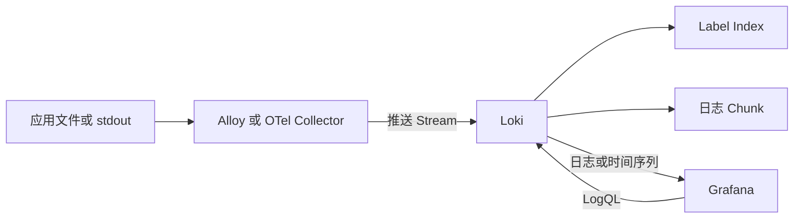

## 1. 它是什么

**Loki 是一个分布式日志聚合与查询系统，主要索引日志的 Label，把日志正文压缩成 Chunk 保存，并使用 LogQL 查询。**

第一阶段只需理解：一条 Log Entry 和一个 Log Stream 分别是什么，Label 为什么必须控制基数，日志正文与索引各自保存在哪里，Grafana 怎样发起查询，以及 Loki 为什么常被称为“像 Prometheus 一样处理日志”。

Loki 位于采集器和 Grafana 之间。应用把日志写到文件或 `stdout`，Grafana Alloy、OpenTelemetry Collector 等采集器读取并附加 Label，再推送给 Loki；Loki 长期保存并执行查询；Grafana 通过 Loki Data Source 展示结果。OpenTelemetry 可以统一日志的产生与传输格式，但不替代 Loki 的存储和 LogQL 查询职责。

很多旧资料使用 Promtail 采集日志，但独立 Promtail 已于 2026 年 3 月 2 日结束维护，相关能力已转入 Grafana Alloy。新系统应优先考虑 Alloy、OpenTelemetry Collector 或其他仍受支持的客户端，而不是照搬旧的 Promtail 配置。

## 2. 为什么选择 Loki，而不是 ELK 或 ClickHouse

仍以订单服务日志为例：每天产生数千万行，最常见的操作是先选择生产环境和订单服务，再查看一段时间内的错误日志，并从日志计算错误速率。偶尔需要按订单号或 Trace ID 排查单次请求，但不要求对所有正文建立相关性搜索索引。

| 主要约束 | 更自然的选择 | 原因与边界 |
|---|---|---|
| 查询通常先按服务、集群、环境等稳定维度缩小范围，希望使用对象存储控制成本 | Loki | 只为 Label 建立较小的索引，正文保存在压缩 Chunk；查询正文时需要读取候选 Chunk |
| 经常对任意字段、错误描述和堆栈做全文检索，要求丰富的文档探索能力 | ELK | Elasticsearch 在写入时为字段与文本建立索引；检索更灵活，但索引、分片和磁盘成本更高 |
| 日志高度结构化，核心工作是跨海量明细执行 SQL 聚合和报表分析 | ClickHouse | 列式扫描和聚合更贴合该负载；按文本相关性探索日志不是其主要模型 |

区别不在于“能不能搜索”。Loki 也能用字符串或正则过滤正文，只是通常先用 Label Index 找到候选 Stream 和 Chunk，再读取正文过滤；Elasticsearch 会预先索引更多内容，用较高写入与存储成本换取更灵活的检索。ClickHouse 也能存日志，但使用列和排序键组织结构化事件，而不是 Loki 的 Stream 与 Chunk 模型。

Loki 适合已经使用 Prometheus 和 Grafana、日志以时间和来源维度查询为主、数据量大且重视存储成本的团队。若日志量很小，本地或云平台日志已经够用，引入 Loki 集群没有必要；若必须频繁按任意高基数字段快速点查、进行全文相关性搜索或复杂安全分析，ELK 往往更自然。

## 3. 最小工作模型

先只看一个 Loki 进程和一个对象存储：



采集器先收到日志，为它选择 Label，并把相同 Label Set 的多条日志组织成 Stream 后批量推送。Loki 接收请求，校验时间戳和 Label，把日志追加到对应 Stream 的 Chunk；Chunk 达到条件后被压缩并写入对象存储，同时索引记录某组 Label 在某段时间对应哪些 Chunk。

用户在 Grafana Explore 输入 LogQL，Grafana Server 向 Loki 发起新的查询请求。Loki 先根据时间范围和 Label Selector 查索引，再读取候选 Chunk，对日志正文执行解析或过滤，最后把日志行或聚合后的时间序列返回 Grafana。**Grafana 保存查询和页面配置，真正保存日志的是 Loki 使用的对象存储。**

## 4. Log Entry、Stream、Label 与 Chunk

### Log Entry：时间戳加一行正文

Log Entry 是 Loki 返回和展示的基本记录，至少包含时间戳与日志正文。正文可以是普通文本，也可以是 JSON。Loki 不要求应用直接调用 Loki API；通常由采集器跟踪文件或容器输出的位置，把原始行转换成可推送的 Entry。

### Stream：具有相同 Label Set 的日志序列

Label 是附在日志来源上的键值，例如 `{service_name="order-service", env="prod"}`。所有 Label 完全相同的 Entry 属于同一个 Log Stream，并按时间写入该 Stream 的 Chunk。改变任意 Label 值都会产生另一个 Stream，因此 Stream 不是应用进程，也不是单独一行日志，而是一组具有同一身份标签的日志序列。

### Label：索引中的查询入口

Label 应描述稳定、低基数的来源，例如环境、集群、命名空间和服务。订单号、用户 ID、Trace ID、Pod ID 等取值很多或变化很快的字段若成为 Label，会组合出大量 Stream，产生庞大索引和许多细小 Chunk。它们更适合保留在日志正文或 Structured Metadata 中，查询时再解析或过滤。

### Chunk、Index 与 Structured Metadata

Chunk 是某个 Tenant、某个 Label Set 在一段时间内积累的压缩日志块，保存真正的日志正文；TSDB Index 更像目录，记录 Label、时间范围和 Chunk 位置，而不是保存每个正文单词的倒排表。Structured Metadata 可以把 Trace ID 等字段与 Entry 一起保存但不作为索引 Label，从而保留结构化过滤能力而不制造新 Stream。

## 5. 一条错误日志怎样写入和查询

订单服务通过 Go 标准库向 `stdout` 输出 JSON：

```go
logger := slog.New(slog.NewJSONHandler(os.Stdout, nil))
logger.Error("payment failed",
	"order_id", "A1001",
	"trace_id", "4bf92f",
	"duration_ms", 320,
)
```

一条原始日志可能是：

```json
{"time":"2026-09-05T10:00:02Z","level":"ERROR","msg":"payment failed","order_id":"A1001","trace_id":"4bf92f","duration_ms":320}
```

Alloy 或 Collector 读取它，并由部署配置添加两个 Label：`service_name="order-service"`、`env="prod"`。通过 Loki Push API 传输时，核心形态可以简化为：

```json
{"streams":[{"stream":{"service_name":"order-service","env":"prod"},"values":[["1788573602000000000","{...原始 JSON 日志...}"]]}]}
```

时间戳和正文进入 Stream，`order_id` 与 `trace_id` 留在 JSON 正文中，而不是被提升为 Label。Loki 的 Ingester 先在内存中把该 Entry 追加到当前 Chunk，达到大小或时间条件后压缩并上传；写入响应不会等待 Grafana，也不会影响订单接口怎样向用户返回结果。

排查订单错误时，可以在 Grafana Explore 执行：

```logql
{service_name="order-service", env="prod"}
| json
| level="ERROR"
| order_id="A1001"
```

Loki 先用前两个 Label 找 Stream，再读取相关 Chunk；`json` 在查询时从正文提取 `level`、`order_id` 等字段，后两个条件随后过滤。结果可能显示：

```text
10:00:02  ERROR  payment failed  order_id=A1001  trace_id=4bf92f  duration_ms=320
```

LogQL 也能从日志生成 Metric Query。例如统计每个服务最近 5 分钟的错误行数：

```logql
sum by (service_name) (
  count_over_time({env="prod"} | json | level="ERROR" [5m])
)
```

Grafana 会把返回的时间序列画成曲线或用于告警。这个结果来自查询时对日志计数，不等于 Prometheus 已经保存了一条同名 Metric；如果该数值是长期、高频告警依据，直接在应用或 OTel Metric 中产生指标通常更稳定、成本也更可控。

## 6. 写入、查询与保留机制

在分布式写入路径中，Distributor 接收 Push 请求并按 Label Set 的哈希选择 Ingester；Ingester 保存近期日志、形成 Chunk，并按 Replication Factor 写入多个副本。Distributor 通常等待满足 Quorum 后才返回成功。复制保护的是尚在 Ingester 中的数据，对象存储仍是长期数据的核心位置。

查询时，Query Frontend 可以拆分时间范围并缓存结果，Querier 从 Ingester 获取尚未 Flush 的近期数据，同时根据 Index 从对象存储读取历史 Chunk，最后合并返回。查询范围过长、Label Selector 过宽或先使用正则扫描正文，都会读取大量 Chunk；优化通常从缩小时间和选择有效 Label 开始，而不是把所有字段变成 Label。

日志默认不会因为磁盘紧张自动按预期清理。使用当前推荐的 TSDB 存储时，Compactor 负责合并索引并按 Retention Policy 删除过期 Chunk；若没有启用 Retention，数据可能持续保留。对象存储自身的生命周期规则不了解 Loki Index，不能随意用一个更短的过期策略代替 Compactor。

## 7. 可靠性与扩展

采集器会批量发送并记录读取进度，Loki 暂时不可用时可以重试和缓冲，但队列耗尽、进程异常或文件提前轮转仍可能丢失日志。客户端重试也可能产生重复 Entry，因此不要把整条链路理解成 Exactly Once，更不能让日志承担业务事务记录的唯一职责。

小规模环境可用 Single Binary，把读写组件放在一个进程中；容量增长后可拆为 Read、Write 和 Backend 三类目标，分别扩展查询与写入。Ingester 故障由 Ring、复制和 Quorum 降低影响，但 Replication Factor 配错、多个副本同时故障或对象存储不可用仍会造成写入失败或查询缺失。

对象存储的持久性不等于完整 Backup。误配 Retention、租户删除或错误覆盖索引都可能影响所有查询，需要保护 Bucket、配置和恢复流程。Grafana 故障只影响查看和通过它执行的告警，不会停止 Alloy 继续采集，也不会自动删除 Loki 数据。

## 8. 设计取舍与容易混淆的概念

Loki 用“只索引身份 Label”换取较小索引和适合对象存储的成本模型，代价是正文查询可能读取更多 Chunk。查询时解析 JSON 让接入更灵活，但重复解析也消耗 CPU；常用字段应在低基数 Label、Structured Metadata、日志正文或独立 Metric 之间按查询模式选择。

| 概念 | 主要作用 | 最关键区别 |
|---|---|---|
| Loki 与 Grafana | 前者保存并查询日志，后者提供查询与展示界面 | Grafana 不是日志存储 |
| Label 与正文参数 | 前者参与索引并定义 Stream，后者在读取 Chunk 后过滤 | 高基数字段不宜成为 Label |
| Log Stream 与 Log Entry | 前者是一组相同 Label 的日志序列，后者是一条带时间戳的日志 | 一个 Stream 包含许多 Entry |
| Chunk 与 Index | 前者保存压缩正文，后者定位相关 Chunk | Index 不保存全文倒排内容 |
| Loki 与 Prometheus | 前者保存日志，后者保存 Metric Sample | Label 模型相近，但数据对象与查询结果不同 |

## 9. 后续可以了解什么

- Alloy 怎样发现 Kubernetes Pod 并为日志选择 Label？
- 为什么高基数 Label 会产生大量 Stream 和小 Chunk？
- Distributor、Ingester、Querier 与 Ring 怎样协作？
- TSDB Index、Compactor 和对象存储怎样完成 Retention？
- 如何通过 Trace ID 关联 Loki 日志与 Tempo Trace？

## 资料来源

- [Loki Architecture](https://grafana.com/docs/loki/latest/get-started/architecture/)
- [Understand Labels](https://grafana.com/docs/loki/latest/get-started/labels/)
- [Ingesting Logs Using OpenTelemetry Collector](https://grafana.com/docs/loki/latest/send-data/otel/)
- [Log Retention](https://grafana.com/docs/loki/latest/operations/storage/retention/)
- [Promtail Agent](https://grafana.com/docs/loki/latest/send-data/promtail/)
