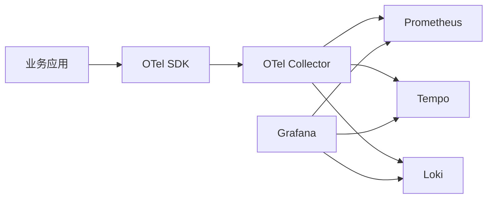

## 1. 它是什么

**OpenTelemetry（OTel）是一套厂商中立的可观测性标准与工具，用统一的 API、SDK、语义约定和协议，在应用侧生成 Trace、Metric、Log，并把它们送往可观测性后端。**

第一阶段不需要掌握全部规范和配置。读完本文，只要能说明 OTel 位于系统哪里、自动和手动埋点怎样产生数据、SDK 在何时采样和批量导出、数据最终由谁保存和查询，以及它与 Prometheus、Grafana 的关系，就已经达到快速认知的目标。

最容易理解错的是它在系统中的位置。Prometheus 主要采集、保存和查询 Metric；Tempo、Jaeger 保存和查询 Trace；Loki 保存和查询 Log；Grafana 从这些后端查询数据并展示。OpenTelemetry 位于它们之前，主要负责“数据怎样产生、怎样关联、怎样运送”，通常不负责长期存储和最终展示。

因此，OpenTelemetry 不是突然加入的另一套 Prometheus 或 Grafana，而是把应用与这些后端连接起来的一层。没有 OTel 时，应用可以直接使用 Prometheus Client、Jaeger Client 等不同 SDK；使用 OTel 后，应用可以先按统一方式埋点，再决定把数据送到哪个后端。

它最常用于分布式追踪，也能统一 Metric 和 Log 的产生与传输。本文用一条订单 Trace 贯穿自动埋点、手动埋点、采样、批量导出、存储和查询，因为这条链路最能说明 OTel 到底怎样运作。

## 2. 先把它放回 Prometheus 和 Grafana 体系

| 组件 | 在链路中的职责 | 是否长期保存遥测数据 |
|---|---|---|
| 业务应用与 OTel SDK | 创建、采样并短暂缓冲数据 | 否 |
| OTel Collector | 接收、处理、转发数据 | 通常否 |
| Prometheus、Tempo、Loki | 分别保存并查询 Metric、Trace、Log | 是 |
| Grafana | 查询上述后端并展示 | 不保存业务遥测数据 |

一套常见组合如下：



应用中的 SDK 会主动向 Collector 发起新的导出请求；这和用户正在调用的业务接口不是同一个请求。Collector 再把数据发给后端。用户请求的响应仍由业务服务直接返回，不会等待 Grafana 查询，也不会从 Tempo 绕回来。

Collector 是常见搭配而非绝对必需：SDK 也可以直接导出到兼容后端。但经过 Collector 后，可以集中配置批处理、过滤、重试、采样和多后端路由，应用不必保存每个后端的地址与凭据。

## 3. 一条 Trace 里有什么

**Trace** 表示一次请求跨越多个组件的完整执行路径，**Span** 表示其中一个有开始和结束时间的操作。例如，一次 `POST /orders` 可以包含 HTTP 接收、库存预占和 SQL 更新三个 Span。

下面是一条 Span 的概念化表示，不是完整 OTLP 报文：

```text
trace_id: 4bf92f...
span_id: 00f067...
parent_span_id: a2fb4a...
name: inventory.reserve
start_time: 10:00:00.020
duration: 35ms
status: OK
attributes:
  service.name: order-service
  order.id: A1001
```

同一条 Trace 中的 Span 共享 Trace ID，`parent_span_id` 把它们组成调用树。Span 刚创建时是应用内存中的 SDK 对象；导出时会被编码进 OTLP 网络消息；进入 Tempo 后才成为可以长期查询的记录。

**Context Propagation（上下文传播）** 负责跨服务传递 Trace ID、父 Span ID 和采样标记。HTTP 中通常使用 `traceparent` Header。下游正确提取它，才能创建属于同一条 Trace 的子 Span；否则两个服务虽然都有数据，却无法自动拼成一条链路。

## 4. 一次订单请求如何完成

假设订单服务收到 `POST /orders`。下面这段精简 Go 代码同时展示了自动与手动埋点；SDK 和 OTLP Exporter 的完整初始化暂时省略：

```go
var tracer = otel.Tracer("order-service")

func main() {
	mux := http.NewServeMux()
	mux.HandleFunc("/orders", createOrder)

	// 包装 Handler：每次 HTTP 请求自动创建和结束 Server Span。
	handler := otelhttp.NewHandler(mux, "http.server")
	log.Fatal(http.ListenAndServe(":8080", handler))
}

func createOrder(w http.ResponseWriter, r *http.Request) {
	// 手动补充自动埋点无法理解的业务步骤。
	ctx, span := tracer.Start(r.Context(), "inventory.reserve")
	defer span.End()
	span.SetAttributes(attribute.String("order.id", "A1001"))

	if err := reserveInventory(ctx); err != nil {
		span.RecordError(err)
		span.SetStatus(codes.Error, "reserve failed")
		http.Error(w, "reserve failed", 500)
		return
	}
	w.WriteHeader(http.StatusCreated)
}
```

`otelhttp` 自动完成这些事情：提取上游 `traceparent`、创建 HTTP Server Span、记录请求方法和状态码、在请求结束时结束 Span。应用没有为每次请求显式调用 `Start`，所以它属于自动埋点。在 Go 中，使用框架包装库是常见方式；基于 eBPF 或编译期注入的零代码方案是另外的实现，不能把所有自动埋点都理解成“完全不用配置”。

`inventory.reserve` 是手动 Span。自动埋点知道发生了一次 HTTP 请求，却不知道哪段代码代表库存预占，也不知道 `order.id` 的业务意义，因此这些内容必须由业务代码补充。实践中通常是自动埋点覆盖 HTTP、gRPC、数据库等通用边界，手动埋点补充关键业务步骤。

### 采样具体发生在哪里

下面是应用启动时的一段关键配置，假设 `exporter` 已经是一个 OTLP Trace Exporter：

```go
tp := sdktrace.NewTracerProvider(
	sdktrace.WithSampler(
		sdktrace.ParentBased(sdktrace.TraceIDRatioBased(0.1)),
	),
	sdktrace.WithBatcher(exporter,
		sdktrace.WithBatchTimeout(5*time.Second),
		sdktrace.WithMaxExportBatchSize(512),
	),
)
otel.SetTracerProvider(tp)
defer tp.Shutdown(context.Background())
```

当自动埋点准备创建根 Span 时，SDK 的 Head Sampler 就会决定这条 Trace 是否记录。`TraceIDRatioBased(0.1)` 表示大约保留 10%，`ParentBased` 表示下游通常继承上游的决定，尽量避免同一条 Trace 只剩零散 Span。

未采样的 Trace 不会形成可导出的完整 Span，也不会进入后面的批量队列；被采样的 Span 才会记录属性和事件。最直观的结果是：发生了 100 次请求，Tempo 中可能只能查询到约 10 条 Trace。Tail Sampling 则是在收集到整条或大部分 Trace 后，根据错误、耗时等信息决定是否保留，通常由 Collector 中的处理器完成。

### 批量导出具体发生在哪里

被采样的 Span 执行 `End` 后，不是立刻单独发送。`BatchSpanProcessor` 先把它放进应用进程内的有界内存队列：

```text
Span A 结束 -> 队列 [A]
Span B 结束 -> 队列 [A, B]
Span C 结束 -> 队列 [A, B, C]
达到数量上限或等待时间 -> 一次 OTLP 请求发送一批 Span
```

这就是 SDK 的批量导出：用少量较大的网络请求代替大量单 Span 请求。`Shutdown` 会尽量刷新队列；如果应用崩溃、队列已满或后端长期不可达，尚未导出的数据仍可能丢失。Collector 收到后还可以再次批处理，这两层不冲突：SDK 批处理主要减少应用的发送开销，Collector 批处理主要优化通往后端的流量。

### 最后在哪里看到结果

Collector 的 OTLP Receiver 收到 Span，Processor 处理后，由 Exporter 发送给 Tempo。Grafana 配置 Tempo Data Source 后，可以用 Trace ID 搜索，也可以使用类似下面的 TraceQL 条件：

```traceql
{ resource.service.name = "order-service" && span:name = "inventory.reserve" }
```

查询结果可能展示为：

```text
http.server                 120 ms  自动 Span
└── inventory.reserve        35 ms  手动 Span
    └── UPDATE inventory     18 ms  数据库自动 Span
```

到这里才形成完整闭环：代码创建 Span，SDK 采样并缓冲，OTLP 传输，Collector 处理，Tempo 长期保存，Grafana 查询并展示。

## 5. Trace、Metric 和 Log 怎样走到一起

OTel 统一了三类信号的 API、数据模型、资源属性和传输方式，但三者的处理机制并不完全相同。

- Trace 通常按请求创建 Span，可以进行 Head Sampling 或 Tail Sampling，再批量导出。
- Metric 通常由 Counter、Histogram 等 Instrument 记录测量值，SDK 先聚合，再周期性导出；它不是简单照搬 Trace 的“随机保留 10%”。
- Log 是离散事件，可以通过 OTel API 或日志桥接方案补充 Trace ID，再批量发送到日志后端。

在传统 Prometheus 模式中，Prometheus 直接抓取应用暴露的 `/metrics`。接入 OTel 后，可以让 OTel SDK 暴露 Prometheus 格式供其抓取，也可以通过 OTLP 把 Metric 送到 Collector，再转换或转发到 Prometheus 兼容后端。因此，OTel 改变的是指标产生和输送方式，不会让 PromQL 和 Prometheus 的存储职责消失。

Grafana 可以同时连接 Prometheus、Tempo 和 Loki。当指标面板显示订单错误率升高时，可以通过关联的 Trace ID 跳到 Tempo 查看某次失败请求，再根据 Span 上的 Trace ID 跳到 Loki 日志。这才是“三种信号统一关联”的实际价值，不是把三类数据强行存进同一个数据库。

## 6. Collector Pipeline 怎样处理数据

Collector Pipeline 由三类组件组成：Receiver 接收数据，Processor 按顺序处理，Exporter 发送到目标后端。Trace、Metric 和 Log 通常分别配置 Pipeline，只有被 Pipeline 引用的组件才真正启用。

Processor 可以批处理、过滤、删除敏感属性、补充环境信息或执行 Tail Sampling。Exporter 决定最终发送到 Tempo、Prometheus 兼容后端、Loki 或商业平台。因为后端地址、认证和路由集中在 Collector，替换后端时通常不需要修改所有业务埋点；但各后端的查询语言和存储能力仍然不同。

OTLP 是 OTel 的主要传输协议，支持基于 Protobuf 的 gRPC 和 HTTP。统一协议解决的是遥测数据交换问题，不是业务服务之间的 RPC，也不会取代 gRPC、HTTP 或消息队列。

## 7. 可靠性与扩展

应用 SDK 和 Collector 都应限制遥测数据占用的 CPU、内存和网络资源，避免监控系统故障反过来拖垮业务。应用侧的批量队列容量有限；Collector 可以配置重试、发送队列和持久队列，但持续故障、磁盘耗尽或错误配置仍可能造成丢失，不能把它理解为端到端 Exactly Once。

Collector 可以靠近应用以 Agent 模式部署，也可以集中以 Gateway 模式部署。普通接收和转发较容易水平扩展；Tail Sampling 需要先汇集同一 Trace 的多个 Span，因此通常要按 Trace ID 把相关数据路由到同一处理实例，会带来更多内存和状态管理成本。

高吞吐系统通常通过采样、批处理、压缩、过滤和限制高基数属性控制成本。Head Sampling 较早丢弃数据，成本低但无法预知最终是否报错；Tail Sampling 能优先保留错误和慢请求，但要先承担收集这些 Span 的成本。

## 8. 设计取舍与容易混淆的概念

OTel 将 API 与 SDK 分开，让公共库可以只依赖稳定的埋点接口，由应用决定采样和导出方式；代价是只调用 API 而没有初始化 SDK 时，程序可以正常运行，却不会导出数据。自动与手动埋点配合，则是在接入成本与业务语义之间取平衡：前者覆盖通用技术边界，后者解释真正重要的业务步骤。

应用 SDK 和 Collector 分层批处理，可以分别减少应用发送开销和后端写入压力，但遥测链路因此具有异步、可能丢失的特点。OTel 选择统一语义与传输，而不强行统一存储，使 Prometheus、Tempo、Loki 仍能使用各自擅长的数据模型。

| 概念 | 主要作用 | 最关键区别 |
|---|---|---|
| OTel 与 Prometheus | 前者生成和输送遥测，后者主要存储查询 Metric | 两者常配合，不是简单替代 |
| OTel 与 Grafana | 前者位于数据产生和传输侧，后者位于查询展示侧 | Grafana 不负责应用埋点 |
| 自动与手动埋点 | 前者覆盖框架边界，后者补业务语义 | 自动埋点通常不理解业务动作 |
| API 与 SDK | API 供代码埋点，SDK 实现采样、处理和导出 | 只有 API 时通常不会导出数据 |
| Head 与 Tail Sampling | 前者在请求开始时决策，后者在收集后决策 | 前者成本低，后者能依据结果筛选 |

## 9. 后续可以了解什么

- OTel Metric 与 Prometheus 数据模型怎样映射？
- HTTP、gRPC 和消息队列的 Trace Context 如何自动传播？
- Head Sampling 与 Tail Sampling 在生产环境中怎样组合？
- Grafana 如何在 Prometheus Metric、Tempo Trace 和 Loki Log 之间建立跳转？

## 资料来源

- [OpenTelemetry 官方概览](https://opentelemetry.io/docs/what-is-opentelemetry/)
- [OpenTelemetry Go](https://opentelemetry.io/docs/languages/go/)
- [Go Instrumentation Libraries](https://opentelemetry.io/docs/languages/go/libraries/)
- [OpenTelemetry Collector Architecture](https://opentelemetry.io/docs/collector/architecture/)
- [Grafana Tempo Data Source](https://grafana.com/docs/grafana/latest/datasources/tempo/)
