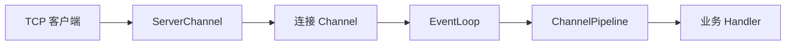

## 1. 它是什么

**Netty 是一个异步、事件驱动的 Java 网络应用框架，用来开发高并发协议服务器和客户端。**

第一阶段只需理解：它位于 Socket 与业务代码之间，一段 TCP 字节怎样经过 ChannelPipeline 变成业务消息，EventLoop 为什么不能执行长时间阻塞任务，以及 Netty 与 Nginx、Web 容器、RPC 框架的区别。

Netty 以库的形式嵌入 Java 进程，负责连接、缓冲区、I/O 事件、编解码和异步写出。HTTP、WebSocket、RPC 或自定义二进制协议是它可以承载的协议；鉴权、路由、数据库和业务状态仍由上层实现。许多网关和中间件使用 Netty 作为网络层，但 Netty 本身不是完整网关或微服务框架。

## 2. 最小工作模型



ServerChannel 监听并接收连接，每个连接对应一个 Channel。Channel 注册到一个 EventLoop，后者持续处理就绪的读写事件和任务。每个 Channel 拥有自己的 Pipeline，字节按顺序经过解码、业务处理和编码 Handler，最终异步写回 Socket。

## 3. Channel、EventLoop、Pipeline 与 ByteBuf

### Channel：表示连接及其 I/O 能力

Channel 是 Netty 对连接和 I/O 操作的抽象。服务端监听端口使用 ServerChannel，它主要接收新连接；每个已接受的 TCP 连接会产生一个子 Channel。应用通过 Channel 发起 `write`、`flush`、`close` 等操作，并从 Channel 获取远端地址、状态和自己的 Pipeline。

Channel 不保存订单等业务数据，但可以通过 Attribute 关联少量连接上下文。连接关闭后 Channel 生命周期结束，因此不能把它当成跨连接的持久状态容器。

### EventLoop：驱动多个 Channel

Channel 注册到某个 EventLoop 后，读写就绪事件和提交给该 Channel 的任务通常由这个 EventLoop 的线程执行。一个 EventLoop 可以管理多个 Channel，而一个 Channel 的生命周期通常绑定同一个 EventLoop，以保持事件执行顺序并减少锁竞争。

这也意味着 EventLoop 线程不能长时间等待数据库、远程接口或复杂计算。一个 Handler 阻塞 2 秒，可能让同一 EventLoop 管理的其他连接也无法及时处理；阻塞工作需要移交业务线程池，完成后再把结果写回 Channel。

### ChannelPipeline 与 ChannelHandler

每个 Channel 都有一条 ChannelPipeline，它是按顺序组织的 Handler 链。Inbound Event 从前向后传播，例如字节读入后依次经过成帧、解码和业务处理；Outbound Operation 通常从后向前传播，例如业务响应依次经过编码、TLS 和 Socket 写出。Handler 可以消费事件、转换消息或继续交给下一个节点。

Pipeline 是连接级处理链，不是多个后端实例的负载均衡列表。相同协议的 Channel 通常安装相似 Pipeline，但每个 Channel 仍有自己的 Handler 上下文和事件流。

### ByteBuf：承载网络字节

操作系统读到的数据先进入 ByteBuf。它维护独立的 readerIndex 和 writerIndex，使读取已到达字节时不必反复复制数组；切片、组合缓冲区和直接内存还能进一步减少复制。解码器读取 ByteBuf 后产出业务消息，编码器则把业务对象重新写成 ByteBuf。

部分 ByteBuf 使用引用计数管理池化或直接内存。最后一个使用者必须释放引用，否则即使 Java Heap 看起来正常，也可能耗尽 Direct Memory；提前释放又会导致后续 Handler 访问无效内存。

## 4. 一条消息如何处理

假设协议使用 4 字节长度字段加 JSON Body：

```text
00 00 00 18 | {"type":"ping","id":7}
```

Pipeline 可以这样组织：

```java
pipeline.addLast(new LengthFieldBasedFrameDecoder(...));
pipeline.addLast(new JsonDecoder());
pipeline.addLast(new BusinessHandler());
pipeline.addLast(new JsonEncoder());
```

操作系统通知 Socket 可读后，EventLoop 把字节读入 ByteBuf。帧解码器依据长度字段解决半包、粘包问题，JSON 解码器产生业务对象，BusinessHandler 处理后调用 `writeAndFlush`。该调用返回 ChannelFuture，编码和真实写出可能稍后由 EventLoop 完成；它不是“当前线程已经把全部字节送到对端”的证明。

如果 BusinessHandler 直接执行慢 SQL 或长时间计算，负责多个连接的 EventLoop 会一起停顿。常见做法是把阻塞任务提交给独立线程池，完成后再异步写回，同时显式处理顺序、超时和背压。

## 5. 编解码、异步结果与背压

TCP 只提供字节流，没有业务消息边界。固定长度、分隔符或长度字段解码器负责成帧；协议还必须限制最大帧长度，避免异常输入无限占用内存。编码器把业务响应重新转为 ByteBuf。

ChannelFuture 表示 I/O 操作未来完成的结果，监听器在成功或失败时执行。出站速度低于生产速度时，Channel 可能变为不可写；应用应暂停读取、限制队列或拒绝请求，不能只把数据无限堆在内存中。

## 6. 可靠性与扩展

连接断开、读写超时、协议错误和对端慢消费都需要应用配置 Handler 处理。Netty 提供 IdleStateHandler、连接事件和异步结果，但不会自动决定是否重试；重试可能造成业务重复，仍需上层幂等语义。

单进程通过多个 EventLoop 使用多核并管理大量连接。节点级高可用需要部署多个 Netty 服务实例，再由 Nginx、四层负载均衡或服务发现分配连接。长连接迁移、优雅停机和连接排空也必须由整体系统设计。

## 7. 设计取舍与容易混淆的概念

少量线程处理大量就绪连接，降低了一连接一线程的调度成本；通道内有序执行减少并发复杂度，但一次阻塞会拖慢同 EventLoop 上的多个连接。ByteBuf 复用和直接内存减少复制与分配，代价是引用计数和内存治理更复杂。

| 概念 | 主要作用 | 最关键区别 |
|---|---|---|
| Netty 与 Nginx | 前者是 Java 网络开发库，后者是可直接部署的代理服务器 | Netty 需要应用编程 |
| Channel 与 Socket | Channel 是 Netty 的 I/O 抽象 | 底层通常仍依赖系统 Socket |
| EventLoop 与业务线程池 | 前者处理 I/O 事件，后者可承载阻塞任务 | 不应阻塞 EventLoop |
| Byte stream 与 Message | TCP 传字节流，协议定义消息边界 | 必须先正确成帧 |

## 8. 后续可以了解什么

- EventLoop 如何调度 I/O、普通任务和定时任务？
- ByteBuf 引用计数与泄漏检测怎样工作？
- 出站水位、`autoRead` 和端到端背压如何配合？
- 阻塞任务卸载后怎样保持同一连接的消息顺序？

## 资料来源

- [Netty 官方网站](https://netty.io/)
- [Netty User Guide](https://netty.io/wiki/user-guide-for-4.x.html)
- [Netty 4.2 API](https://netty.io/4.2/api/index.html)
- [Netty 4.2 Migration Guide](https://netty.io/wiki/netty-4.2-migration-guide.html)
