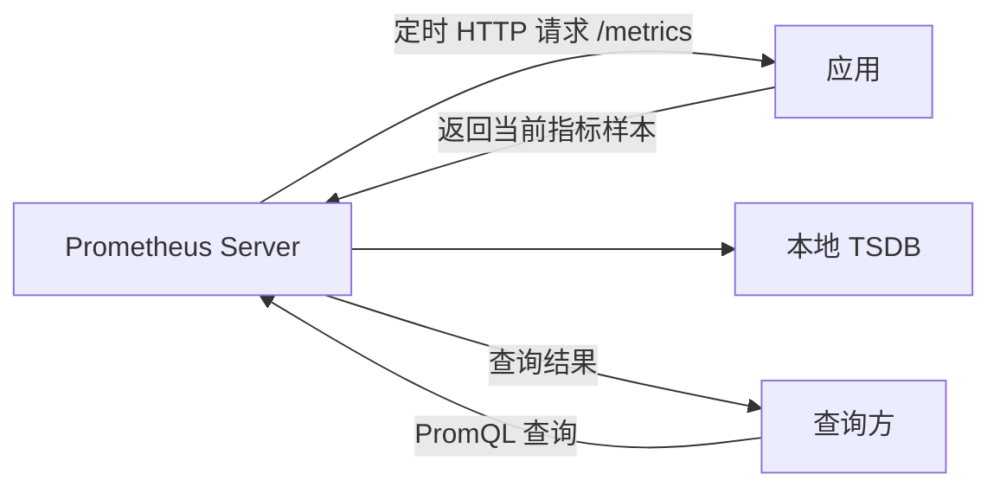
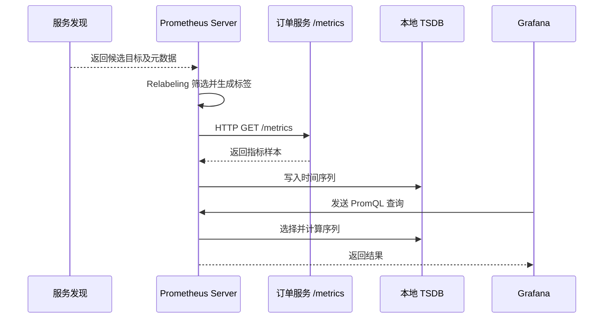
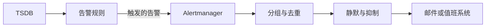
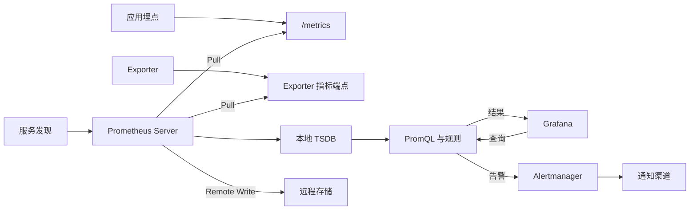

## 1. 它是什么

**Prometheus 是一个开源的指标监控与告警系统，通过周期性采集带时间戳的数值样本，将其保存为多维时间序列，并使用 PromQL 完成查询、聚合和告警判断。**

它通常位于业务系统旁边的可观测性层：应用或 Exporter 暴露指标，Prometheus Server 主动采集并保存指标，Grafana 等工具查询并展示结果，Alertmanager 接收告警并发送通知。常见场景包括监控服务请求量、错误率和延迟，观察主机与容器资源，配置容量或可用性告警，以及支持故障排查。

Prometheus 关注的是 **Metrics（指标）**，擅长保存随时间变化的数值及其维度，不负责收集完整日志、还原单次分布式调用，也不应作为账单、订单等要求完整准确的业务数据库。一次采集失败会留下数据空缺，因此它适合监控趋势与状态，不适合按样本精确计费。

本文以 Prometheus 3.x 为主。截至 2026 年 9 月，最新版本是 3.14.0，并有 3.13、3.5 LTS 系列。3.0 启用了新 UI 和更宽松的 UTF-8 名称支持；为兼容周边工具，生产中仍宜沿用传统推荐字符集。

## 2. 最小工作模型

先只保留一个被监控应用和一个 Prometheus Server：



应用通过客户端库维护计数器、当前值和耗时等指标，并在 `/metrics` 接口暴露当前样本。到达采集周期时，**Prometheus Server 主动向应用发起新的 HTTP 请求**；应用只生成并返回指标文本，不主动把普通指标发送给 Prometheus。

Prometheus 解析响应，为样本补充目标标签和采集时间，再写入自身的本地时序数据库（Time Series Database，TSDB）。Grafana、Prometheus Web UI 或其他客户端向 Prometheus 发起 PromQL 查询，由 Prometheus 选择并计算时间序列后返回结果。查询方通常不直接访问被监控应用，应用也不处理 PromQL。

## 3. 核心概念与关系

**Metric（指标）** 表示一种可测量的数值，例如请求总数 `orders_http_requests_total`。**Label（标签）** 描述该数值的维度。指标名与完整标签集合共同唯一标识一条 **Time Series（时间序列）**；**Sample（样本）** 则是这条序列在某个时刻的值，由时间戳和值组成。

例如，订单接口暴露下面一行时，指标名是 `orders_http_requests_total`，标签集合表示 GET 请求、`/orders` 路由和 200 状态，当前值为 1287：

```text
orders_http_requests_total{method="GET",route="/orders",status="200"} 1287
```

暴露格式通常不携带时间戳。假设 Prometheus 在 `10:00:00` 采到它，TSDB 保存的样本可理解为“该序列，`10:00:00`，1287”；15 秒后采到 1293，就追加新样本，而不是覆盖前一个。若 `status` 变成 `500`，标签组合改变，会产生另一条时间序列。用户 ID、请求 ID 等无界标签会创建海量序列，因此不能拿标签保存任意业务字段。

客户端库提供四种核心指标类型：Counter 只累加并可能在进程重启时归零，适合请求总数；Gauge 可增可减，适合队列长度；Histogram 把观测值计入桶，适合在服务端聚合延迟分位数；Summary 在客户端计算滑动时间窗口内的分位数，但不同实例的分位数通常不能直接聚合。除 Native Histogram 外，Prometheus Server 当前主要把这些类型保存为普通浮点时间序列，类型语义主要由埋点和 PromQL 用法维持。

**Target（采集目标）** 是 Prometheus 实际请求的网络端点，**Instance** 通常对应一个可采集的服务进程，**Job** 则代表一组同类实例。`scrape_config` 定义采集周期、路径和目标来源；目标可静态配置，也可从 Kubernetes、Consul、云平台等服务发现机制获得，再由 Relabeling 筛选或改写目标标签。

不能直接埋点的系统可通过 **Exporter（指标导出器）** 转换既有状态，例如 Node Exporter 读取主机信息后暴露为 Prometheus 格式。Exporter 负责读取和转换，被监控系统保存原始运行状态，Prometheus 保存采集后的时间序列，三者不要混为一体。

## 4. 一次典型采集如何完成

以 Prometheus 采集订单服务指标为例。下面是最小 Go 埋点，省略了生产级错误处理和按真实响应记录状态码等细节：

```go
package main

import (
	"log"
	"net/http"

	"github.com/prometheus/client_golang/prometheus"
	"github.com/prometheus/client_golang/prometheus/promhttp"
)

var requests = prometheus.NewCounterVec(
	prometheus.CounterOpts{Name: "orders_http_requests_total"},
	[]string{"method", "route", "status"},
)

func main() {
	prometheus.MustRegister(requests)
	http.HandleFunc("/orders", func(w http.ResponseWriter, r *http.Request) {
		requests.WithLabelValues(r.Method, "/orders", "200").Inc()
		w.WriteHeader(http.StatusOK)
	})
	http.Handle("/metrics", promhttp.Handler())
	log.Fatal(http.ListenAndServe(":8080", nil))
}
```

`CounterVec` 在应用进程内存中保存各标签组合的当前累计值；每次请求只做加一。应用不保存历史样本，也不主动连接 Prometheus。访问 `/metrics` 时，`promhttp.Handler()` 才把当前内存状态编码为指标响应，其中就可能出现前文的 1287。



Prometheus 先从静态配置或服务发现获取候选地址。Relabeling 根据发现元数据保留、删除或修改目标，并形成最终的 `job`、`instance` 等标签；它选择的是“采集谁”，不是替应用选择业务请求目标。

到达 `scrape_interval` 后，Prometheus 并发请求各目标的指标端点。目标在响应中返回指标名、标签和值；Prometheus 校验并写入样本，同时自动生成 `up` 和 `scrape_duration_seconds` 等采集状态指标。成功采集时 `up` 为 1，请求超时、连接失败或响应无效时为 0。

Grafana 随后把面板中的 PromQL 作为 HTTP API 请求发给 Prometheus。Prometheus 从 TSDB 选择原始序列，执行 `rate()`、`sum by (...)` 等运算，再把结果返回 Grafana 绘图。图表展示的是离散采样后的指标变化，而不是应用的每一条业务事件。

例如，查询订单接口最近 5 分钟按状态码汇总的每秒请求数：

```promql
sum by (status) (rate(orders_http_requests_total{route="/orders"}[5m]))
```

某个求值时刻可能得到：

```text
{status="200"} 12.4
{status="500"} 0.08
```

这不是应用返回的原始 Counter，而是 Prometheus 从多个样本计算并按 `status` 聚合出的瞬时结果，分别表示最近窗口内平均每秒约 12.4 个成功请求和 0.08 个失败请求。Grafana 对一段时间反复执行该表达式，就能画出两条变化曲线。

## 5. 主要能力如何实现

### 多维查询与聚合

PromQL 先用指标名和标签匹配器选择序列，再对瞬时向量或区间向量执行函数和聚合。前面的查询先用 `rate()` 把累计值转换为增长率，再按状态码合并序列；同一批底层数据还可以按实例、服务或集群重新聚合。

### 动态目标发现

服务发现持续返回目标及其元数据，Relabeling 再把 Pod 标签、命名空间等元数据变成筛选条件或稳定标签。新实例出现后可自动进入采集集合，实例消失后也会被移除。这解决的是动态环境中“去哪里采集”，应用仍需暴露可访问的指标端点。

### 规则计算与告警

Recording Rule 按固定周期预先计算昂贵或高频的 PromQL，并把结果写成新的时间序列，减少看板重复计算。Alerting Rule 同样周期性执行 PromQL；条件持续满足设定时间后，Prometheus 把告警发送给 Alertmanager。



Prometheus 负责判断“是否满足告警条件”，Alertmanager 负责对告警分组、去重、路由、静默和抑制，再调用邮件或值班系统。Grafana 不是这条官方告警链路的必需组件。

### 短任务指标

生命周期短到来不及被采集的服务级批任务，可以先把最终结果推送到 Pushgateway，再由 Prometheus 拉取。Pushgateway 不是通用推送采集器：它不会随着原任务消失而自动删除序列，还会弱化 Prometheus 通过 `up` 判断实例存活的能力，因此官方仅建议在有限的服务级批任务场景使用。

## 6. 可靠性与扩展

### 采集目标故障

目标不可达时，本次采集失败，`up` 变为 0，故障期间的样本不会被补回。告警应容忍短暂抖动；Prometheus 也不能代替业务系统恢复故障或切换流量。

### Prometheus 自身故障

Prometheus Server 是自治的单机服务，本地 TSDB **不提供内置集群复制**。预写日志（Write-Ahead Log，WAL）可在重启时恢复近期数据，但磁盘或整机损坏仍可能造成丢失；Snapshot 与远程存储解决的是不同风险。

常见高可用方式是运行两个配置相同的 Prometheus，让它们独立采集、存储和执行规则，查询入口可在二者间切换。它们应向全部 Alertmanager 发送告警并由后者去重。该方案会产生两份数据，并非 TSDB 复制。

### 容量与横向扩展

单机压力主要由活跃序列数、采集频率、保留期和查询复杂度决定。应先控制无界标签、减少不必要的采集和重复计算，再规划磁盘与内存。增加副本只提高可用性，不分摊采集负载。

规模继续增长时，可按集群、区域或服务分片；上层 Prometheus 可通过 Federation 拉取聚合序列，也可用 Remote Write 发送到长期存储系统。跨节点去重、分布式查询和远程存储可靠性由外部方案负责。

## 7. 为什么这样设计

**以 Pull 为默认采集模型。** Prometheus 统一控制目标、周期和超时，并用 `up` 观察可达性；代价是它必须能访问目标，极短任务和复杂网络边界需要额外方案。

**使用标签表达维度。** 同一指标可按标签组合过滤和聚合，适合动态微服务；代价是每个唯一标签集合都会创建序列，无界维度会放大资源成本。

**让 Server 自治并使用本地存储。** 采集、规则和查询不依赖外部存储，故障时仍可保留本地诊断能力；代价是长期保存、全局视图和大规模部署需要额外架构。

**分开告警判断与通知。** Prometheus 执行 PromQL，Alertmanager 负责去重、静默和路由，使多个 Prometheus 无需共享规则状态；代价是需要保障额外组件的可用性。

## 8. 容易混淆的概念

| 概念 | 主要作用 | 最关键区别 |
|---|---|---|
| Metric 与 Time Series | 前者描述测量项，后者保存一个确定标签集合随时间产生的样本 | 同一 Metric 可因标签组合不同产生多条 Time Series |
| Target 与 Exporter | 前者是 Prometheus 采集的端点，后者把外部系统状态转换为指标 | Target 可以是应用自身，也可以是独立 Exporter |
| Pull 与 Pushgateway | Pull 是 Prometheus 主动采集，Pushgateway 暂存短任务推送结果 | 即使使用 Pushgateway，Prometheus 最终仍从网关拉取 |
| Prometheus 与 Grafana | 前者采集、存储、查询并执行规则，后者主要负责查询和展示 | Grafana 不是 Prometheus 的存储引擎 |
| Alerting Rule 与 Alertmanager | 前者判断告警条件，后者管理并发送通知 | Alertmanager 不执行 PromQL，也不负责采集指标 |

## 9. 面试中需要掌握到什么程度

**30～60 秒回答：**

Prometheus 是一个开源的指标监控与告警系统，以多维时间序列保存数据，并使用 PromQL 查询。应用通过客户端库或 Exporter 暴露指标，Prometheus 根据静态配置或服务发现找到目标，定时主动请求 `/metrics`，给样本附加标签后写入本地 TSDB。Grafana 等客户端查询 Prometheus 展示数据；告警规则由 Prometheus 计算，再交给 Alertmanager 去重、分组和通知。它的关键特点是 Pull 模型和自治的单机 Server，本地存储不自带集群复制，规模与长期存储通常通过分片、Federation 或 Remote Write 扩展。

**必须掌握：** Prometheus 的定位；Metric、Label、Sample、Time Series 的关系；Counter、Gauge、Histogram、Summary；一次 Pull 采集和 PromQL 查询链路；Prometheus、Exporter、Grafana、Alertmanager 的分工。

**最好掌握：** 服务发现与 Relabeling；`rate()` 的用途；高基数风险；Recording Rule 与 Alerting Rule；两个独立 Prometheus 实例如何提高可用性；本地 TSDB、WAL、Remote Write 和 Federation 的边界。

**深入岗位才需要掌握：** TSDB Block 与索引格式、Staleness 处理、PromQL 执行与性能诊断、采集分片策略、Native Histogram、Remote Write 队列调优，以及大规模长期存储方案的去重和一致性语义。

## 10. 面试官可能如何继续追问

> Prometheus 为什么默认使用 Pull，而不是让应用直接 Push？

Pull 让 Prometheus 统一控制目标、周期和超时，并通过 `up` 判断每次采集是否成功；代价是它必须能够访问指标端点。

> Counter 为什么通常要配合 rate() 使用？

Counter 原始值表示进程启动以来的累计量，`rate()` 会处理正常增长和重启归零，计算指定时间窗口内的平均每秒增长率。

> Histogram 和 Summary 最重要的区别是什么？

Histogram 把观测值放入桶，可在 Prometheus 端跨实例聚合后估算分位数；Summary 通常在客户端计算分位数，不适合直接跨实例聚合。

> Prometheus 拉取失败后会自动补采历史数据吗？

不会。失败期间会形成样本空缺，`up` 变为 0；Prometheus 不能从普通指标端点还原从未采集到的历史样本。

> 部署两个 Prometheus 是否等于建立了两副本数据库？

不等于。两个实例独立拉取和保存各自的数据，不会像数据库副本那样同步本地 TSDB，只是用冗余实例提高监控可用性。

> Remote Write 之后，Prometheus 是否就不保存本地数据？

通常仍会写入本地 TSDB，并异步发送到远程端；远程系统的持久性、去重和查询能力取决于具体实现。仅需转发的场景可另行评估 Agent Mode。

## 11. 整体认知图



服务发现帮助 Prometheus 确定采集目标，Prometheus 主动从应用或 Exporter 拉取样本并保存到本地 TSDB。PromQL 和规则读取这些序列，查询结果返回 Grafana，触发的告警交给 Alertmanager，Remote Write 则把样本复制到外部系统以扩展保存和查询能力。

## 12. 第一阶段记忆卡

- Prometheus 采集的是带标签的数值时间序列，不是完整日志、Trace 或业务事实记录。
- 指标名与完整标签集合唯一标识一条时间序列，标签基数决定主要资源成本。
- Prometheus 默认主动 Pull 指标；目标负责暴露样本，Server 负责选择目标、采集和保存。
- Counter、Gauge、Histogram、Summary 表达的语义不同，不能只看它们最终都是数值。
- Grafana 主要查询和展示，Alertmanager 管理通知，二者都不代替 Prometheus 采集和存储。
- 采集失败会通过 `up` 暴露，但不会自动补回缺失的历史样本。
- 双 Prometheus 是独立采集的高可用方案，不是本地 TSDB 的同步复制集群。
- 扩展前先治理高基数；更大规模再考虑分片、Federation 和 Remote Write。

## 13. 后续深入方向

- Prometheus TSDB 如何通过 Head、WAL、Block 和 Compaction 组织数据？
- PromQL 如何选择样本、处理 Staleness 并完成向量匹配？
- Histogram、Native Histogram 与 Summary 应该如何选型？
- Kubernetes 服务发现和 Relabeling 如何共同生成最终采集目标？
- 如何根据活跃序列数、采集周期和保留期进行容量规划？
- Prometheus 高可用、功能分片与水平分片分别解决什么问题？
- Remote Write 如何排队、分片、重试并应对远程端变慢？
- 如何用 Recording Rule 和告警持续时间降低查询成本与告警噪声？

## 资料来源

- [Prometheus Overview](https://prometheus.io/docs/introduction/overview/)
- [Prometheus Download](https://prometheus.io/download/)
- [Prometheus Data Model](https://prometheus.io/docs/concepts/data_model/)
- [Prometheus Storage](https://prometheus.io/docs/prometheus/latest/storage/)
- [Prometheus Alertmanager](https://prometheus.io/docs/alerting/latest/alertmanager/)
