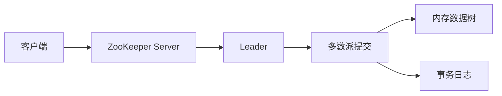

## 1. 它是什么

**ZooKeeper 是一个面向分布式协调的强一致服务，通过目录树、Session 和 Watch 帮助多个进程共享少量关键状态。**

第一阶段只需理解：znode 怎样保存协调数据，临时节点为什么能表达成员存活，Watch 如何通知变化，一次写入怎样由 Leader 与多数派确认，以及它与 etcd、业务数据库的边界。

ZooKeeper 常用于成员管理、服务发现、配置、Leader 选举和分布式锁。业务请求不会经过 ZooKeeper；客户端从中得到地址或资格后，再自行调用真实服务。Kafka 的旧架构曾依赖 ZooKeeper，现代 Kafka 已转向 KRaft，因此不能再把它视为 Kafka 的必需组件。

## 2. 最小工作模型



读请求通常由所连接的 Server 返回；写请求由 Leader 排序并通过 ZAB 提交给多数成员，然后各成员按同一顺序应用到数据树。响应返回的是协调操作结果，不会替业务服务完成负载均衡或任务执行。

## 3. znode、Session 与 Watch

### 数据树与 znode

ZooKeeper 的命名空间是一棵有父子关系的树，znode 是树中的数据节点。与普通文件系统不同，一个 znode 可以同时保存少量字节数据和拥有子节点。客户端通过绝对路径定位它，创建 `/services/order/i1` 前通常需要父节点 `/services/order` 已经存在。

```text
/services/order/instance-0000000042
data = 10.0.1.8:8080
type = ephemeral-sequential
owner = session-7f2a
version = 0
```

### 持久、临时与顺序节点

持久节点在创建者断开后仍保留，需要显式删除，适合保存配置目录。临时节点归属于 Session，Session 过期后由服务端删除，适合表达“这个实例当前在线”；临时节点不能拥有子节点。顺序标志会让服务端在名称后追加同父目录内递增编号，常与临时属性组合用于选主和锁排队。

### Session：决定临时状态的生命期

Session 是客户端与 ZooKeeper 集群之间的逻辑会话，具有 Session ID 和超时时间，不等同于某一条 TCP 连接。客户端短暂断线后可以连接另一个 Server 继续原 Session；只有在超时时间内无法恢复，集群才判定 Session Expired 并删除临时节点。应用在断线未过期期间也收不到可靠的新状态，通常应进入保守模式。

### Watch：通知状态可能已经变化

标准 Watch 是在 `exists`、`getData`、`getChildren` 等读取时附带注册的一次性通知。对应 znode 发生变化后，Server 向客户端发送事件并移除 Watch。事件主要告诉客户端“状态变了”，通常不包含足以替代重新读取的完整新状态；客户端应重新读取并再次注册。

断线期间同一 znode 可能变化多次，标准 Watch 不是每次变化都可靠交付的业务消息队列。较新版本支持持久 Watch，但它仍用于协调状态通知，应用仍要处理重连和全量校准。

## 4. 一次服务注册与发现如何完成

订单实例建立 Session，并创建临时顺序节点；调用方读取子节点并设置 Watch：

```text
create -e -s /services/order/instance- 10.0.1.8:8080
ls -w /services/order
get /services/order/instance-0000000042
```

调用方拿到地址后保存在本地列表，并直接向订单实例发请求。实例崩溃后，连接可能先中断；只有 Session 超时，ZooKeeper 才删除临时节点并触发子节点 Watch。调用方收到通知后重新 `ls -w`，看到新的完整列表并更新本地状态。

这种“读当前状态，再监听变化”的闭环很重要：Watch 只告诉客户端“可能变了”，真正的新状态仍要重新读取。版本号可用于条件更新，防止两个客户端基于同一个旧值同时覆盖。

## 5. 选主和分布式锁怎样建立

多个参与者创建临时顺序节点，编号最小者成为 Leader；其他参与者通常只 Watch 自己前一个节点。前驱消失后，下一个参与者被唤醒重新判断。这样比所有客户端同时 Watch 最小节点更能避免惊群。

锁同样可以基于临时顺序节点构建：拿到最小编号表示获得锁，Session 过期会自动释放。但 ZooKeeper 只提供协调原语，业务仍需处理超时、重复执行和 fencing token 等问题，不能把“获得锁”理解为业务结果天然正确。

## 6. 可靠性与扩展

Ensemble 通常部署奇数个投票成员。多数派存活时可以继续提交写入；失去多数派时停止写入。Follower 故障后可以从快照和事务日志追赶，Leader 故障会重新选举。Observer 可以分担读流量，但不参与投票。

ZooKeeper 适合读多写少的小数据协调，不适合大对象、高频业务数据和海量历史事件。增加投票成员会增加复制成本；扩大读能力可以增加 Observer 或客户端缓存，但缓存必须通过 Watch 与重新读取保持更新。

## 7. 设计取舍与容易混淆的概念

内存数据树带来快速读取，事务日志和快照负责恢复；临时节点把成员状态与 Session 生命周期绑定；一次性 Watch 保持机制轻量，却要求客户端正确处理断线、重读和重复注册。

| 概念 | 主要作用 | 最关键区别 |
|---|---|---|
| znode 与服务器节点 | 前者是逻辑数据对象，后者是集群进程 | 不要把两种 node 混为一谈 |
| Session 与连接 | Session 表示客户端会话，连接只是传输通道 | 重连不一定导致临时节点删除 |
| Watch 与消息队列 | Watch 通知状态变化，消息队列传递业务事件 | 标准 Watch 不是完整事件日志 |
| ZooKeeper 与 etcd | 都提供协调基础，抽象分别偏目录树与 KV | 常是替代关系，不必同时部署 |

## 8. 后续可以了解什么

- ZAB 怎样保证写入顺序和 Leader 恢复？
- Watch 在断线重连期间可能遗漏什么？
- 临时顺序节点怎样避免锁竞争惊群？
- ACL 和 Digest、SASL 认证怎样配合？

## 资料来源

- [ZooKeeper Programmer's Guide](https://zookeeper.apache.org/doc/current/zookeeperProgrammers.html)
- [ZooKeeper Overview](https://zookeeper.apache.org/doc/current/zookeeperOver.html)
- [ZooKeeper Recipes](https://zookeeper.apache.org/doc/current/recipes.html)
- [ZooKeeper Administrator's Guide](https://zookeeper.apache.org/doc/current/zookeeperAdmin.html)
