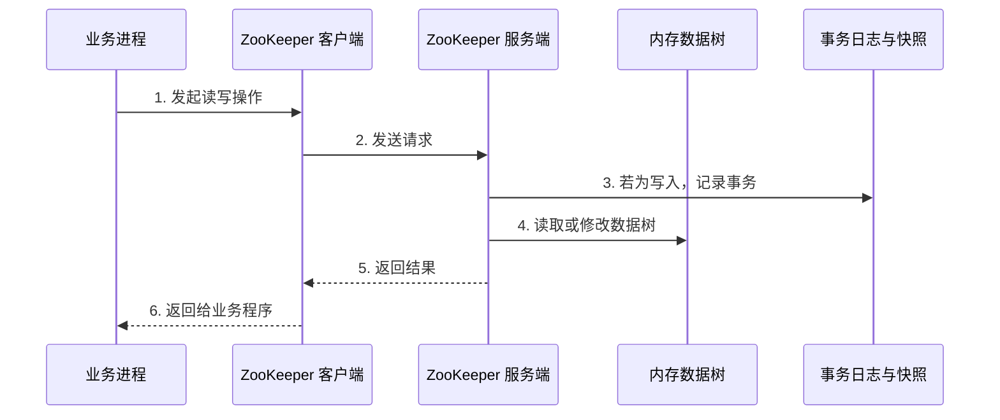
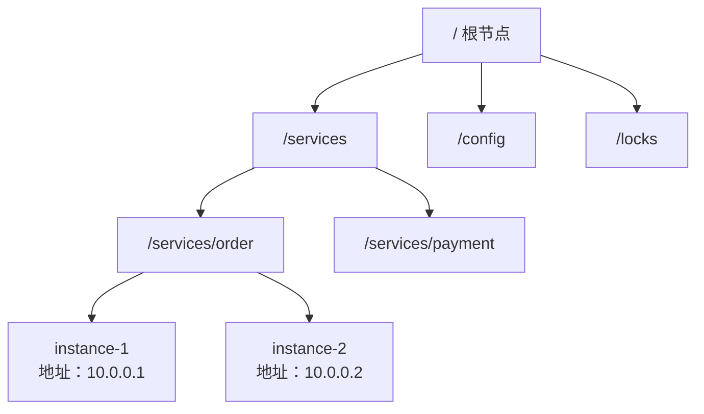
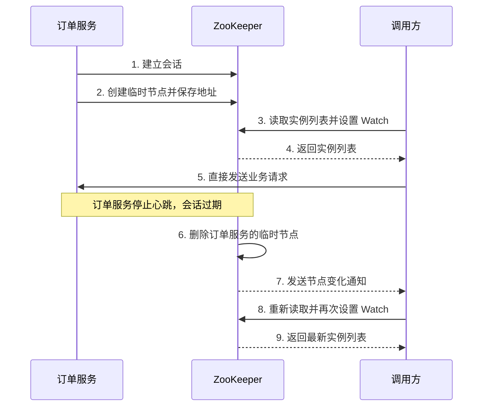
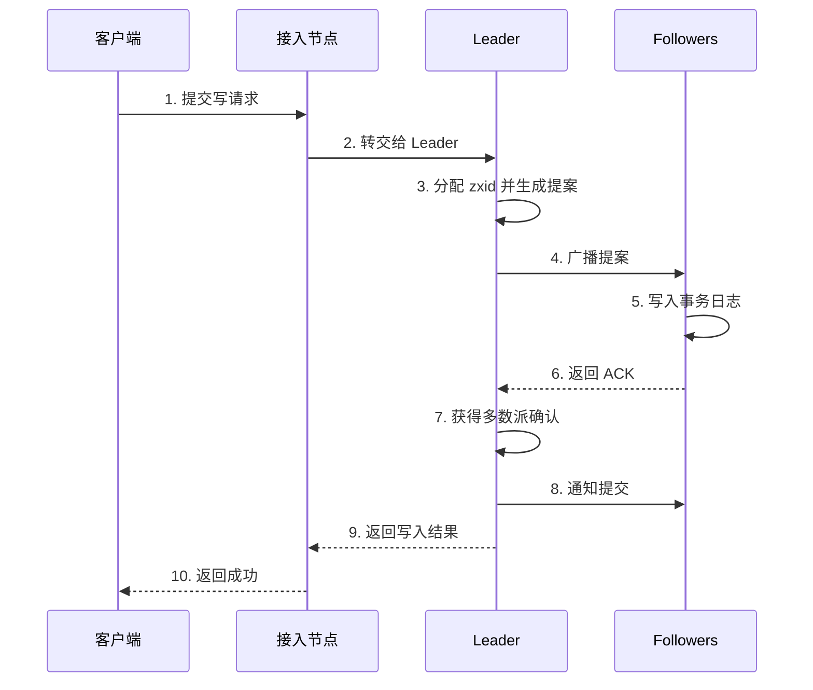
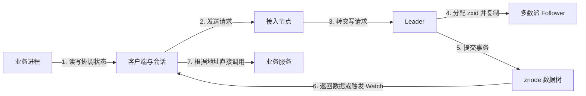

## 1. 它是什么

**ZooKeeper 是一个为分布式应用提供一致性协调能力的分布式服务。** 它帮助多个进程共享少量关键状态，并围绕这些状态实现服务发现、配置管理、成员管理、Leader 选举和分布式锁。

ZooKeeper 通常独立部署在业务服务旁边。应用通过客户端库连接 ZooKeeper，读取或修改协调状态；真正的订单、支付等业务请求仍然由业务服务处理，不会经过 ZooKeeper。

它最擅长回答：“谁在线”“当前配置是什么”“谁获得了资格”“资源应该由谁处理”等问题。它不是通用数据库、缓存或消息队列，也不适合保存大对象和高频业务数据。

截至 2026 年 9 月，ZooKeeper 当前版本为 3.9.5，最新稳定版本为 3.8.6。[Apache ZooKeeper Releases](https://zookeeper.apache.org/releases/)

## 2. 最小工作模型

先不考虑集群，只看一个 ZooKeeper 服务端：



ZooKeeper 客户端负责连接、会话、重连和事件回调；服务端才真正保存并处理协调数据。

协调数据主要保存在内存数据树中，所以读取较快。事务日志用于恢复已提交的写入，快照用于缩短重启恢复时间。

如果客户端从 ZooKeeper 读到了某个服务地址，它会自己向目标服务发起新的业务请求。ZooKeeper 只提供地址和状态，不代理业务流量。

## 3. 核心概念与关系

### 数据树与 znode

ZooKeeper 使用一棵类似文件系统目录的层级数据树：



树中的每个数据节点叫 **znode**。一个 znode 既可以保存少量字节数据，也可以拥有子节点。例如 `/services/order/instance-1` 可以代表一个订单服务实例。

官方限制单个 znode 数据不超过 1 MB，实际协调数据应该远小于这个值。大文件应存入数据库、对象存储或配置中心，ZooKeeper 只保存小配置、版本号或存储位置。

### 节点类型如何选择

节点类型不是由内容自动决定，而是由创建者根据生命周期和命名需求主动选择。

| 类型 | 适用场景 | 例子 |
|---|---|---|
| 持久节点 | 数据需要长期存在 | 服务目录、系统配置 |
| 临时节点 | 数据代表某个客户端当前在线 | 服务实例、集群成员 |
| 持久顺序节点 | 数据要保留，同时需要唯一顺序编号 | 持久任务排队 |
| 临时顺序节点 | 需要竞争顺序，并且客户端退出后自动清理 | 分布式锁、Leader 选举 |

顺序属性会让 ZooKeeper 自动在名称后追加编号，例如：

```text
/locks/order/lock-00000001
/locks/order/lock-00000002
```

简单判断是：需要长期保留就用持久节点；需要反映客户端存活状态就用临时节点；需要唯一编号或竞争顺序就加上顺序属性。

### 会话

**会话（Session）是 ZooKeeper 为客户端维护的逻辑身份和存活状态。** 它不是 znode，也不等于某一条固定的 TCP 连接。

客户端中存在一个 ZooKeeper 连接对象，集群中则维护对应的会话记录，包括 `sessionId`、会话超时时间和相关临时节点等状态。客户端定期发送心跳。

连接短暂中断后，客户端可以携带会话身份连接其他 ZooKeeper 服务器。只要在超时前恢复，会话和临时节点仍然有效；会话一旦过期，ZooKeeper 就会删除这个会话创建的全部临时节点。

因此，会话主要回答：**“这个客户端是谁，以及它是否还活着？”**

### Watch

**Watch（监视）是客户端对 znode 变化注册的通知机制。** 经典 Watch 是一次性的：

1. 客户端读取节点，同时注册 Watch。
2. 节点发生对应变化。
3. ZooKeeper 向客户端发送一次通知。
4. Watch 自动失效。
5. 客户端重新读取最新状态，并再次注册 Watch。

重新注册是为了继续监视变化，不是为了维持连接。通知通常只表示“发生了变化”，不会携带完整新数据；多个快速变化也可能只形成一次感知，所以 Watch 不能当作消息队列使用。

ZooKeeper 3.6.0 起还支持持久和递归 Watch，但理解经典一次性 Watch 仍然非常重要。

### 版本号与 ACL

客户端读取 znode 时，会同时得到数据版本号。更新时可以携带上次读取到的版本，例如：“只有当前版本仍为 3，才允许更新。”

如果版本没有变化，更新成功，ZooKeeper 自动将版本加 1；如果其他客户端已经修改过，当前版本不再是 3，本次更新失败。客户端需要重新读取最新数据和版本，重新计算后再决定是否重试。

这就是乐观并发控制。客户端也可以传 `-1` 忽略版本，但可能出现后写覆盖前写。

**访问控制列表（ACL）** 则负责限制哪些身份可以读、写、创建、删除或管理节点。版本号解决并发冲突，ACL 解决访问权限，两者不是同一个机制。

## 4. 一次典型操作如何完成

以订单服务注册与发现为例：



订单服务通过临时节点表达“我当前在线”。调用方从 ZooKeeper 获取地址以后，直接调用订单服务，业务流量不经过 ZooKeeper。

订单服务会话过期后，ZooKeeper 删除临时节点并触发 Watch。调用方重新读取完整列表，而不是仅依赖通知内容。

需要注意：会话心跳正常只能说明服务进程还能连接 ZooKeeper，不代表业务接口一定健康。因此，实际系统通常还要配合业务健康检查和请求重试。

## 5. 主要能力如何实现

**服务发现** 使用“临时节点＋会话＋Watch”。临时节点表示实例在线，会话过期负责清理，Watch 通知消费者刷新列表。

**配置管理** 通常使用持久节点保存小配置或配置版本。客户端读取配置并设置 Watch，收到变化通知后重新加载。

**Leader 选举和分布式锁** 常使用临时顺序节点。所有参与者按序号排序，序号最小者获得资格，其他参与者只监视自己的前一个节点。前一个节点删除时，下一个参与者被唤醒。

这些能力不是 ZooKeeper 内置的完整业务系统。ZooKeeper 提供节点、顺序编号、会话和通知等原语；完整的锁重试、超时、业务幂等和异常处理仍由客户端库或应用实现。

## 6. 多节点、ZAB 与可靠性

生产环境通常部署 3 个或 5 个投票节点，组成 ZooKeeper 集合，其中一个是 Leader，其余是 Follower。

读取通常由客户端当前连接的服务器直接处理。写入则由 Leader 排序，并通过 **ZAB（ZooKeeper Atomic Broadcast）原子广播协议** 复制。



ZAB 保证的是 **所有节点以相同顺序提交和执行事务**。Leader 可以同时向多个 Follower 发送提案，各个 Follower 收到的时间可以不同，但如果事务顺序是 `100 → 101 → 102`，每个节点都必须按照这个顺序执行。

### zxid 事务编号

每个写事务都有一个 64 位的 **zxid（ZooKeeper Transaction ID）**：

```text
zxid = epoch + counter
```

- 高 32 位 `epoch`：表示 Leader 任期，类似 Raft 的 `term`。
- 低 32 位 `counter`：当前 Leader 在这个任期内生成的事务序号。

例如：

```text
Leader A：epoch = 5
事务：(5, 1)、(5, 2)、(5, 3)

Leader B：epoch = 6
事务：(6, 1)、(6, 2)
```

比较 zxid 时先比较 `epoch`，再比较 `counter`，所以 `(6, 1)` 大于 `(5, 100)`。zxid 既用于确定全局事务顺序，也用于 Leader 切换时判断节点缺少哪些事务。

ZAB 与 Raft 都采用 Leader、日志复制和多数派确认。区别是 Raft 定位为通用复制日志一致性算法，通常用 `term + log index` 标识日志；ZAB 面向 ZooKeeper 的事务流原子广播，使用 `epoch + counter`，并明确分为 Leader 激活和正常广播阶段。

### 故障与扩展

一个 Follower 故障时，只要集群仍有多数派，就可以继续服务。Leader 故障后会暂停写入并重新选举；新 Leader 与多数派统一事务历史后，才重新接受写请求。

如果 3 节点集群只剩 1 个节点，就无法形成多数派，因此不能继续提交写入。网络分区时，ZooKeeper 的写入路径优先保证一致性，而不是持续可用。

每个 ZooKeeper 服务器都保存完整数据树，并不存在自动数据分片。增加 Follower 可以分担读取，但不能线性提高写入能力，反而会增加复制开销。

事务日志保证已提交写入可以恢复，快照用于缩短恢复时间；快照不等于备份。生产环境仍需独立进行文件保留、备份、监控和磁盘规划。

## 7. 为什么这样设计

数据树主要驻留内存，可以减少普通读取的磁盘访问；代价是数据规模受内存限制，不适合大对象。

读取由当前节点直接响应，可以分散读流量；写入集中交给 Leader 排序，可以获得统一事务顺序。代价是读取可能稍旧，写吞吐受 Leader、网络和事务日志落盘限制。

临时节点与会话绑定，使客户端即使无法主动注销，超时后也能自动清理状态；代价是长时间暂停或网络故障可能造成会话过期，应用必须正确处理资格丢失。

经典 Watch 只发送一次变化通知，服务端维护成本较低；代价是客户端必须重新读取和注册，不能把 Watch 当作可靠事件流。

## 8. 容易混淆的概念

| 概念 | 主要作用 | 最关键区别 |
|---|---|---|
| znode 与服务器节点 | 保存数据；运行 ZooKeeper 进程 | 一个是数据节点，一个是集群成员 |
| 会话与 TCP 连接 | 维护客户端身份；传输数据 | 连接可以更换，会话可以跨服务器恢复 |
| Watch 与消息队列 | 通知状态变化；保存并投递消息 | Watch 不是可靠事件日志 |
| 临时节点与持久节点 | 表达在线状态；保存长期数据 | 临时节点随会话过期删除 |
| ZAB 与 Raft | ZooKeeper 事务广播；通用复制日志 | 目标接近，但编号、选举和恢复细节不同 |

## 9. 面试中需要掌握到什么程度

**30～60 秒回答：**

ZooKeeper 是一个分布式协调服务，使用层级化的 znode 保存少量配置、成员和选举状态。客户端通过会话连接集群，可以创建持久、临时和顺序节点，并使用 Watch 感知变化。生产集群由 Leader 和 Follower 组成，读通常由连接节点直接处理，写由 Leader 排序，并通过 ZAB 获得多数派确认后提交。服务发现、Leader 选举和分布式锁都是客户端基于这些原语构建的。

**必须掌握：** 数据树、znode 类型、会话、经典 Watch、服务注册发现流程、Leader 与多数派。

**最好掌握：** 版本号乐观控制、临时顺序节点实现锁、ZAB 写入流程、zxid、会话过期和 Leader 切换。

**深入岗位才需要掌握：** FastLeaderElection、ZAB 恢复阶段、Follower 同步策略、Observer、动态重配置及源码实现。

## 10. 面试官可能如何继续追问

> ZooKeeper 为什么不适合存业务数据？

所有服务器都保存完整数据树，数据主要驻留内存，而且写入需要多数派复制。

> 临时节点什么时候删除？

客户端主动关闭会话或集群判定会话过期时删除，短暂断开连接不会立即删除。

> Watch 能保证每次变化都被消费吗？

不能。经典 Watch 是一次性状态变化通知，不是可靠消息日志。

> 为什么更新时要携带版本号？

为了确保数据从读取到写入期间没有被别人修改，防止并发覆盖。

> ZAB 为什么要求事务顺序一致？

相同操作以不同顺序执行可能产生不同结果，统一顺序才能保证所有副本状态一致。

> zxid 由什么组成？

由 Leader 任期 `epoch` 和任期内事务序号 `counter` 组成。

> ZooKeeper 和 Raft 有什么关系？

两者都使用 Leader 和多数派复制，但 ZAB 是面向 ZooKeeper 事务广播设计的独立协议。

> Leader 挂了以后临时节点会立即删除吗？

不会。临时节点与客户端会话绑定，而不是与 Leader 绑定。

## 11. 整体认知图



业务进程通过客户端会话访问 ZooKeeper。写操作由 Leader 排序并复制到多数派，数据最终体现在 znode 数据树中；客户端收到结果或 Watch 通知后更新本地状态。真正的业务请求仍由客户端直接发给业务服务。

## 12. 第一阶段记忆卡

- ZooKeeper 是分布式协调服务，不是业务数据库或流量代理。
- znode 组成层级数据树，每个节点可以保存少量数据并拥有子节点。
- 持久节点保存长期状态，临时节点表达会话存活，顺序属性提供唯一编号。
- 会话是客户端的逻辑身份，不等于一条固定 TCP 连接。
- 经典 Watch 一次触发后失效，客户端必须重新读取并注册。
- 版本号用于条件更新，服务端在成功写入后自动递增版本。
- ZAB 保证所有副本按照相同顺序提交事务，zxid 表示事务顺序。
- 多数派丢失时不能继续提交写入，增加节点也不等于数据分片。

## 13. 后续深入方向

- ZAB 的 Leader 激活阶段具体如何恢复事务历史？
- zxid、事务日志和快照之间如何配合？
- ZooKeeper 分布式锁如何避免惊群效应？
- 普通 Watch、持久 Watch 和递归 Watch 有什么差异？
- ZooKeeper 的普通读取为什么可能读到稍旧的数据？
- FastLeaderElection 如何选择新 Leader？
- Observer 适合哪些大规模读取场景？
- Curator 如何封装重试、锁和选举？

## 资料来源

- [Apache ZooKeeper Programmer’s Guide](https://zookeeper.apache.org/doc/current/zookeeperProgrammers.html)
- [Apache ZooKeeper Internals](https://zookeeper.apache.org/doc/current/zookeeperInternals.html)
- [Apache ZooKeeper Administrator’s Guide](https://zookeeper.apache.org/doc/current/zookeeperAdmin.html)
- [Apache ZooKeeper Recipes and Solutions](https://zookeeper.apache.org/doc/current/recipes.html)
- [Apache ZooKeeper Releases](https://zookeeper.apache.org/releases/)